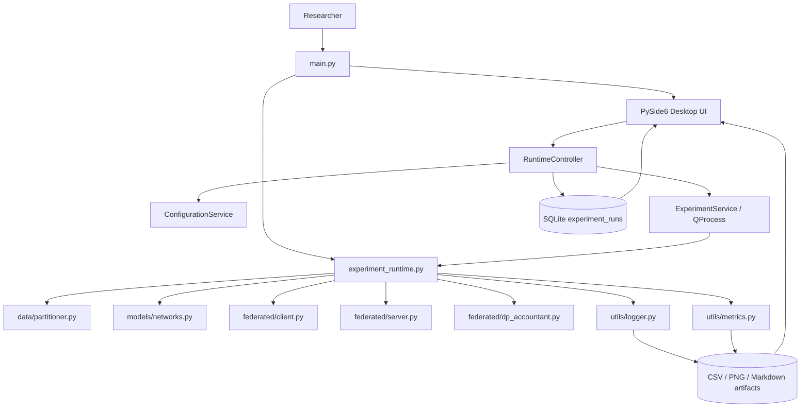
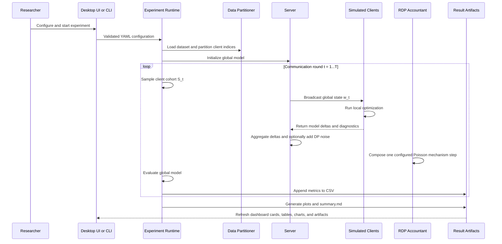
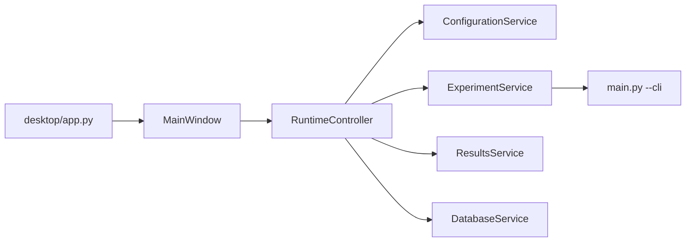
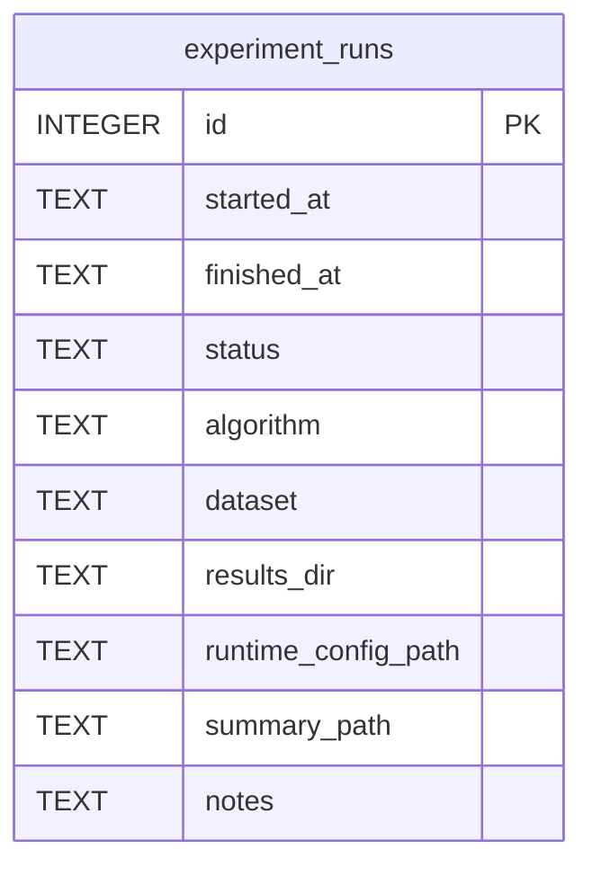

# Federated Learning on Non-IID Data with Differential Privacy

A desktop-first federated learning research platform for studying heterogeneous client data, optimization drift, personalization, server aggregation, and differential privacy.


[](https://github.com/smshagor-dev/Federated-Learning-on-Non-IID-Data-Differential-Privacy/actions/workflows/ci.yml)
[](LICENSE)


> **Open-source license notice**
> Copyright (c) 2026 Md Shahanur Islam Shagor. This repository is released
> under the Apache License 2.0. Use, modification, reproduction, and
> redistribution are permitted only when the license conditions and required
> notices are preserved. See [LICENSE](LICENSE).

> **Research and validation notice**  
> This repository is an advanced research and engineering platform for federated learning on heterogeneous and Non-IID data with differential privacy. It is intended for controlled experiments, algorithm evaluation, privacy analysis, reproducibility studies, and software architecture research. It is **not formally security audited**, **not production certified**, and **not evidence of legal or regulatory privacy compliance**.

> **Active runtime scope notice**  
> The default application launched through `python main.py` is a single-machine federated learning simulation with a PySide6 desktop interface and a root CLI runtime. The active root workflow runs **FedAvg, FedProx, and SCAFFOLD** on **MNIST or CIFAR-10**. Additional personalization algorithms, secure aggregation components, C++ services, and Go control-plane modules are auxiliary subsystems with separate execution paths.

> **Differential privacy notice**  
> Reported privacy guarantees depend on the configured threat model, client-sampling assumptions, clipping threshold, noise multiplier, number of rounds, privacy accountant, and correctness of the experiment configuration. Privacy values must not be interpreted independently of these assumptions.

> **CI scope notice**
> The GitHub Actions badge above represents repository validation for Python tests, Ruff linting and formatting, mypy type checking, C++ builds and tests, Go validation, Protocol Buffer generation, sanitizer checks, PKI verification, infrastructure validation, terminology checks, and tracked-secret scanning. It does **not** represent formal privacy certification, production security approval, regulatory compliance, or validated real-world multi-device deployment.

This repository was developed through a structured **research engineering lifecycle** spanning federated learning foundations, heterogeneous data simulation, distributed optimization, client sampling, differential privacy, privacy accounting, personalization, secure aggregation, cross-language runtime engineering, experiment tracking, reproducibility, testing, documentation, and continuous integration hardening.

> **Primary scope:** The default application launched through `python main.py` is a single-machine simulation with a PySide6 desktop interface and a root CLI runtime. It actively runs **FedAvg, FedProx, and SCAFFOLD** on **MNIST or CIFAR-10**. Other algorithms and security components in `python/src/fl_platform/`, `cpp/`, and `go/` are auxiliary subsystems and must not be interpreted as automatically active in the root desktop workflow.

## Documentation Status

The document distinguishes four different kinds of claims:

- **Active root runtime:** executed by `python main.py` or `python main.py --cli`.
- **Desktop orchestration:** PySide6 process management, result loading, and SQLite run history.
- **Auxiliary implementation:** additional Python, C++, and Go components that use separate execution paths.
- **Research interpretation:** mathematical or conceptual explanation of behavior observed in the code.

No production certification, formal security audit, or real multi-device deployment is claimed.

---

## Contents

1. [Executive Overview](#executive-overview)
2. [Active Runtime vs Auxiliary Subsystems](#active-runtime-vs-auxiliary-subsystems)
3. [Research Motivation and Questions](#research-motivation-and-questions)
4. [System Architecture](#system-architecture)
5. [Datasets, Model, and Non-IID Partitioning](#datasets-model-and-non-iid-partitioning)
6. [Federated Learning Formulation](#federated-learning-formulation)
7. [Active Root Algorithms](#active-root-algorithms)
8. [Client Sampling and Aggregation](#client-sampling-and-aggregation)
9. [Differential Privacy](#differential-privacy)
10. [Evaluation Metrics](#evaluation-metrics)
11. [Auxiliary Algorithms](#auxiliary-algorithms)
12. [Desktop Application](#desktop-application)
13. [Project Directory Structure](#project-directory-structure)
14. [Configuration Reference](#configuration-reference)
15. [Installation and Execution](#installation-and-execution)
16. [Generated Artifacts](#generated-artifacts)
17. [Reproducibility](#reproducibility)
18. [Exact Implementation Semantics and Caveats](#exact-implementation-semantics-and-caveats)
19. [Validation](#validation)
20. [Known Limitations](#known-limitations)
21. [Extension Guide](#extension-guide)
22. [Function and Equation Traceability](#function-and-equation-traceability)
23. [References, Citation, and License](#references-citation-and-license)

---

## Executive Overview

Federated learning trains a shared model without moving every participant's raw data into one central dataset. Each client performs local optimization and returns a model update to a server. The server aggregates the received updates and produces the next global model.

The central research difficulty is that real client data are usually **non-independent and identically distributed (non-IID)**. Different clients may contain different labels, class ratios, sample counts, collection conditions, or device characteristics. Under this heterogeneity, local models move in different directions, which can slow convergence and increase client drift.

This repository studies that problem together with client-level differential privacy:

```text
Non-IID partition
    -> selected clients
    -> local training
    -> client model deltas
    -> optional update clipping
    -> server aggregation
    -> optional Gaussian noise
    -> global model update
    -> global evaluation and artifact generation
```

The active root simulator provides:

- MNIST and CIFAR-10 image classification.
- Dirichlet label-skew and pathological shard-based partitions.
- FedAvg, FedProx, and SCAFFOLD.
- Uniform or sample-count aggregation under validated constraints.
- Poisson or fixed-size client sampling.
- Trusted-server central client-level differential privacy.
- Rényi Differential Privacy accounting.
- Per-round CSV metrics and publication-friendly plots.
- A PySide6 dashboard that launches experiments through `QProcess`.
- SQLite persistence for experiment-run history.

### What this project is

- A research simulator.
- A codebase for algorithm, privacy, and heterogeneity experiments.
- A desktop interface over a reproducible CLI experiment workflow.
- A multi-language repository containing additional platform-oriented components.

### What this project is not

- A production federated learning service.
- A real cross-device deployment in the root runtime.
- A local differential privacy system.
- A secure-aggregation-enabled root workflow.
- A guarantee of protection against poisoning, Byzantine clients, membership inference, or reconstruction attacks.

---

## Active Runtime vs Auxiliary Subsystems

The repository contains more functionality than the default application executes. This boundary is essential for correctly interpreting results.

| Capability | Active root desktop/CLI runtime | Auxiliary subsystem |
|---|---:|---:|
| FedAvg | Yes | Yes |
| FedProx | Yes | Yes |
| SCAFFOLD | Yes | Yes |
| FedSAM | No | Yes, Python worker algorithm |
| Ditto | No | Yes, Python worker algorithm |
| Per-FedAvg | No | Yes, Python worker algorithm |
| FedAdagrad | No | Yes, C++ aggregation core |
| FedAdam | No | Yes, C++ aggregation core |
| FedYogi | No | Yes, C++ aggregation core |
| Client-level central DP | Yes | Additional privacy components also exist |
| Opacus sample-level DP-SGD | No | Yes |
| Pairwise secure aggregation | No | Experimental primitives exist |
| PySide6 desktop dashboard | Yes | Not applicable |
| SQLite run history | Yes | Other services may use separate storage paths |
| Real distributed worker transport | No | Go, gRPC, and coordinator components exist |

The active root path is centered on:

- [`main.py`](main.py)
- [`experiment_runtime.py`](experiment_runtime.py)
- [`federated/client.py`](federated/client.py)
- [`federated/server.py`](federated/server.py)
- [`federated/dp_accountant.py`](federated/dp_accountant.py)
- [`data/partitioner.py`](data/partitioner.py)
- [`models/networks.py`](models/networks.py)
- [`utils/metrics.py`](utils/metrics.py)
- [`utils/logger.py`](utils/logger.py)
- [`desktop/`](desktop)

Auxiliary research and platform components are primarily located under:

```text
python/src/fl_platform/
cpp/
go/
```

---

## Research Motivation and Questions

### Motivation

Centralized training may be inappropriate when data cannot leave hospitals, financial institutions, mobile devices, factories, vehicles, or other administrative boundaries. Federated learning preserves data locality, but it does not automatically solve the following problems:

- Clients may have strongly different label distributions.
- Some clients may have far more data than others.
- Multiple local steps may move models away from the global optimization direction.
- Partial participation introduces sampling variance.
- Privacy clipping suppresses large updates.
- Gaussian noise reduces information leakage but also perturbs optimization.
- A globally accurate model may still perform poorly for individual clients.

### Research objectives

- Measure convergence under different levels of non-IID heterogeneity.
- Compare FedAvg, FedProx, and SCAFFOLD under a common root runtime.
- Quantify raw and post-clipping client disagreement.
- Analyze the privacy-utility trade-off created by clipping and Gaussian noise.
- Preserve experiment configuration and artifacts for reproducibility.
- Provide implementation-to-equation traceability.
- Keep auxiliary personalization and secure-aggregation research visible without misrepresenting it as active root functionality.

### Research questions

1. How does a smaller Dirichlet concentration parameter affect convergence and client drift?
2. When does FedProx stabilize local training relative to FedAvg?
3. How does SCAFFOLD's control-variate correction affect update disagreement?
4. How frequently are client updates clipped under a chosen bound?
5. How much utility is lost as the noise multiplier increases?
6. Does uniform aggregation behave differently from sample-count weighting under unequal client sizes?
7. How different are global test metrics from client-level personalization metrics?
8. Which guarantees belong to the active root runtime and which belong only to auxiliary components?

---

## System Architecture

### Root architecture



### End-to-end experiment sequence



### Root execution characteristics

- Clients are simulated sequentially in one Python process.
- A scratch model object is reused, but each client begins by loading the same broadcast global state.
- The global test set is evaluated after every communication round.
- Files are written during and after the experiment.
- The desktop application does not implement the training loop itself; it launches the CLI runtime as a child process.

---

## Datasets, Model, and Non-IID Partitioning

### Supported datasets

#### CIFAR-10

- Input channels: 3.
- Input size: 32 × 32.
- Classes: 10.
- Normalization mean: `(0.4914, 0.4822, 0.4465)`.
- Normalization standard deviation: `(0.2470, 0.2435, 0.2616)`.

#### MNIST

- Input channels: 1.
- Original images are resized to 32 × 32.
- Classes: 10.
- Normalization mean: `(0.1307,)`.
- Normalization standard deviation: `(0.3081,)`.

Dataset loading is implemented in [`data/partitioner.py`](data/partitioner.py).

### GroupNorm CNN

The active root model is `GroupNormCNN` from [`models/networks.py`](models/networks.py).

```text
Input 32x32
  -> Conv 3x3, 32 channels
  -> GroupNorm
  -> ReLU
  -> Conv 3x3, 64 channels
  -> GroupNorm
  -> ReLU
  -> MaxPool 2x2
  -> Conv 3x3, 128 channels
  -> GroupNorm
  -> ReLU
  -> MaxPool 2x2
  -> Flatten
  -> Linear 8192 -> 256
  -> ReLU
  -> Dropout 0.2
  -> Linear 256 -> number of classes
```

GroupNorm is used instead of BatchNorm because BatchNorm running statistics can diverge across heterogeneous clients and do not combine cleanly through parameter averaging. GroupNorm works per sample and is independent of local batch size.

The configuration validator requires `model.group_norm_groups` to:

- be positive,
- divide channel counts 32, 64, and 128,
- not exceed 32.

### Dirichlet label-skew partition

For every class $c$, the partitioner draws client proportions from

$$ \pi_c \sim \mathrm{Dirichlet}(\alpha\mathbf{1}_K). $$

The shuffled samples of class $c$ are split according to $\pi_c$ and assigned to the $K$ clients.

Interpretation of $\alpha$:

- Small $\alpha$, such as $0.1$: stronger label skew and more heterogeneous clients.
- Moderate $\alpha$, such as $1.0$: less extreme heterogeneity.
- Large $\alpha$: proportions approach a more uniform allocation.

The implementation redraws the complete partition until every client owns at least `data.min_partition_size` samples, or until the retry limit is reached.

### Pathological shard partition

The pathological partition follows a shard-based construction:

1. Sort all training indices by label.
2. Divide the sorted sequence into

$$ K \times C_{\mathrm{client}} $$

shards, where $C_{\mathrm{client}}$ is `classes_per_client`.
3. Randomly permute the shard identifiers.
4. Give each client `classes_per_client` shards.

This produces clients whose local data are restricted to a small subset of labels, subject to shard boundaries.

---

## Federated Learning Formulation

### Mathematical notation

| Symbol | Meaning |
|---|---|
| $K$ | Total client population |
| $S_t$ | Selected clients in communication round $t$ |
| $m_t = \lvert S_t\rvert$ | Realized cohort size in round $t$ |
| $n_k$ | Number of samples owned by client $k$ |
| $N = \sum_{k=1}^{K}n_k$ | Total training samples |
| $w_t$ | Global model parameters at the start of round $t$ |
| $w_{t,s}^{k}$ | Client $k$ parameters after local step $s$ in round $t$ |
| $F_k(w)$ | Client $k$ empirical objective |
| $F(w)$ | Federated global objective |
| $\eta$ | Client learning rate |
| $\eta_s$ | Server update scale |
| $E$ | Number of local epochs |
| $\tau_k$ | Actual local optimizer-step count for client $k$ |
| $\Delta_k$ | Client model delta relative to $w_t$ |
| $\mu$ | FedProx proximal coefficient |
| $c$ | SCAFFOLD global control variate |
| $c_k$ | SCAFFOLD client control variate |
| $C$ | Client-update clipping bound |
| $\sigma$ | Gaussian noise multiplier |
| $q$ | Configured client sampling probability |
| $\epsilon,\delta$ | Differential privacy parameters |
| $P$ | Number of flattened floating-point model coordinates |

### Client-local empirical risk

Client $k$ owns

$$ \mathcal{D}_k = \{(x_i,y_i)\}_{i=1}^{n_k}. $$

Its empirical objective is

$$ F_k(w) = \frac{1}{n_k} \sum_{(x_i,y_i)\in\mathcal{D}_k} \ell(w;x_i,y_i), $$

where $\ell$ is cross-entropy loss in the active root runtime.

### Global objective

The conventional sample-weighted global objective is

$$ F(w) = \sum_{k=1}^{K}p_kF_k(w), \qquad p_k=\frac{n_k}{N}. $$

The root implementation may use either sample-count or uniform aggregation, so the actual round update can differ from this population objective when uniform weighting is selected.

### One communication round

At the beginning of round $t$, the server broadcasts $w_t$. Every selected client initializes

$$ w_{t,0}^{k}=w_t. $$

For a local mini-batch $B_s$, plain local SGD follows

$$ w_{t,s+1}^{k} = w_{t,s}^{k} - \eta\nabla_w\ell(w_{t,s}^{k};B_s). $$

After local training, the raw client update is

$$ \Delta_k^{\mathrm{raw}} = w_{t,\tau_k}^{k}-w_t. $$

When differential privacy is disabled, this raw update is transmitted directly. When root differential privacy is enabled, the final transmitted update is the clipped version defined later in this document.

---

## Active Root Algorithms

Only the algorithms in this section can be selected directly by the active root runtime.

### FedAvg

FedAvg performs ordinary local SGD and aggregates the resulting client deltas.

For sample-count weighting:

$$ \bar{\Delta}_t = \sum_{k\in S_t} \frac{n_k}{\sum_{j\in S_t}n_j} \Delta_k. $$

For uniform weighting:

$$ \bar{\Delta}_t = \frac{1}{m_t} \sum_{k\in S_t}\Delta_k. $$

The server applies

$$ w_{t+1} = w_t+\eta_s\bar{\Delta}_t. $$

### FedProx

FedProx adds a proximal term that discourages each local model from moving too far from the broadcast global model:

$$ F_k^{\mathrm{prox}}(w;w_t) = F_k(w) + \frac{\mu}{2} \lVert w-w_t\rVert_2^2. $$

For a mini-batch, the implemented loss is

$$ \ell_{\mathrm{FedProx}} = \ell_{\mathrm{CE}} + \frac{\mu}{2} \sum_j(w_j-w_{t,j})^2. $$

The proximal term affects local training only. Server aggregation remains FedAvg-shaped.

Expected behavior:

- $\mu=0$ reduces the local objective to FedAvg-style training.
- A larger $\mu$ constrains local movement more strongly.
- Excessive $\mu$ can suppress useful client adaptation.

### SCAFFOLD

SCAFFOLD maintains a global control variate $c$ and one local control variate $c_k$ per client. The local gradient is corrected as

$$ g_{k,s}^{\mathrm{corr}} = g_{k,s}+c-c_k. $$

The client optimizer step is therefore

$$ w_{t,s+1}^{k} = w_{t,s}^{k} - \eta\left(g_{k,s}+c-c_k\right). $$

After local training, the implementation computes

$$ c_k^{+} = c_k-c- \frac{\Delta_k}{\tau_k\eta}, $$

and

$$ \Delta c_k=c_k^{+}-c_k. $$

The model delta is aggregated uniformly:

$$ \bar{\Delta}_t = \frac{1}{m_t} \sum_{k\in S_t}\Delta_k. $$

The global control variate update implemented by the server is

$$ c^{+} = c+ \frac{m_t}{K} \left( \frac{1}{m_t} \sum_{k\in S_t}\Delta c_k \right) = c+ \frac{1}{K} \sum_{k\in S_t}\Delta c_k. $$

Important root semantics:

- SCAFFOLD forces client momentum to `0.0`.
- SCAFFOLD accepts only uniform aggregation in the root runtime.
- Under DP, $c_k^{+}$ is computed from the transmitted clipped delta, not the raw delta.
- Optional optimization gradient clipping is executed before adding the SCAFFOLD correction. Therefore `optimizer.grad_clip_norm` is not a strict bound on the final corrected gradient.

### Algorithm comparison mode

Setting

```yaml
algorithm:
  name: "all"
```

runs FedAvg, FedProx, and SCAFFOLD sequentially over the same generated partition.

Each algorithm resets the configured Python, NumPy, and PyTorch seed before its run. The client sampler therefore follows the same configured pseudo-random sequence. Privacy noise is intentionally seeded from system randomness unless deterministic test mode is enabled, so DP noise is not normally identical across algorithms.

---

## Client Sampling and Aggregation

### Poisson client sampling

For `federated.sampling_strategy: poisson`, every client is included independently with probability $q$:

$$ \Pr(k\in S_t)=q. $$

The realized cohort size is random:

$$ m_t\sim\mathrm{Binomial}(K,q). $$

An empty cohort is possible. In that case the server performs no model update, but the round is still evaluated, logged, and counted by the current privacy accountant.

### Fixed sampling without replacement

For `fixed_without_replacement`, the runtime computes

$$ m=\mathrm{round}(qK) $$

and samples $m$ unique clients.

Boundary behavior:

- $q\le 0$: no clients are selected.
- $q\ge 1$: every client is selected.

This strategy is not accepted when root DP is enabled because the implemented accountant models Poisson subsampling.

### Aggregation weighting

#### Uniform

$$ a_k=\frac{1}{m_t}. $$

Used when:

- DP is enabled.
- SCAFFOLD is selected.
- The configuration explicitly requests uniform weighting.

#### Sample count

$$ a_k = \frac{n_k}{\sum_{j\in S_t}n_j}. $$

Supported only for FedAvg and FedProx when DP is disabled.

### Validated constraints

| Condition | Required behavior |
|---|---|
| DP enabled | `sampling_strategy: poisson` |
| DP enabled | `aggregation_weighting: uniform` |
| SCAFFOLD selected | `aggregation_weighting: uniform` |
| `algorithm: all` | `aggregation_weighting: uniform` because SCAFFOLD is included |
| Deterministic DP noise | `dp.test_noise_seed` must be provided |

---

## Differential Privacy

### Privacy level and trust model

The active root runtime implements **central client-level differential privacy under a trusted-server assumption**.

Client-level adjacency means two neighboring federated datasets differ by the participation or absence of one complete client contribution. The mechanism does not provide sample-level privacy for individual records inside a selected client's local dataset.

Trusted-server assumptions:

- The server sees individual client updates before adding aggregate noise.
- Secure aggregation is not active in the root runtime.
- The server is trusted to clip, aggregate, add noise, and report privacy parameters correctly.

### Client-update clipping

For raw client delta $\Delta_k^{\mathrm{raw}}$, define

$$ r_k = \left\lVert\Delta_k^{\mathrm{raw}}\right\rVert_2. $$

The clipping factor is

$$ a_k = \min\left( 1, \frac{C}{r_k+10^{-12}} \right). $$

The transmitted client update is

$$ \Delta_k^{\mathrm{clip}} = a_k\Delta_k^{\mathrm{raw}}. $$

Therefore

$$ \left\lVert\Delta_k^{\mathrm{clip}}\right\rVert_2 \le C $$

up to floating-point precision.

The clipping norm includes all floating-point entries used in the client delta.

### Server-side Gaussian mechanism

The server first sums clipped client updates:

$$ U_t = \sum_{k\in S_t} \Delta_k^{\mathrm{clip}}. $$

It samples one independent Gaussian noise tensor collection

$$ Z_t \sim \mathcal{N} \left( 0, \sigma^2C^2I \right). $$

The released average update is

$$ \widetilde{\Delta}_t = \frac{U_t+Z_t}{m_t}. $$

The next global model is

$$ w_{t+1} = w_t+\eta_s\widetilde{\Delta}_t. $$

Noise is added once to the aggregate sum, not independently on each client.

### Optimization clipping vs privacy clipping

The configuration exposes two different clipping concepts:

| Configuration | Target | Privacy-accounted? |
|---|---|---:|
| `optimizer.grad_clip_norm` | Per-batch optimization gradients before the optimizer step | No |
| `dp.update_clip_norm` | Final client model delta before server aggregation | Yes, part of the root DP mechanism |

These controls are not interchangeable.

### Rényi Differential Privacy accounting

The accountant treats each communication round as a Poisson-subsampled Gaussian mechanism with:

- client sampling probability $q$,
- noise multiplier $\sigma$,
- client-level add/remove adjacency,
- one bounded client update per selected client.

For integer Rényi order $\alpha\ge2$, the implementation computes the one-step RDP value

$$ \varepsilon_{\mathrm{RDP}}^{(1)}(\alpha) = \frac{1}{\alpha-1} \log \left[ \sum_{j=0}^{\alpha} \binom{\alpha}{j} (1-q)^{\alpha-j} q^j \exp\left( \frac{j(j-1)}{2\sigma^2} \right) \right]. $$

After $T$ accounted rounds:

$$ \varepsilon_{\mathrm{RDP}}^{(T)}(\alpha) = T\varepsilon_{\mathrm{RDP}}^{(1)}(\alpha). $$

Conversion to an $(\epsilon,\delta)$ estimate is

$$ \epsilon(\delta) = \min_{\alpha \gt 1} \left[ \varepsilon_{\mathrm{RDP}}^{(T)}(\alpha) + \frac{\log(1/\delta)}{\alpha-1} \right]. $$

The implementation searches integer orders:

```text
2...64, 80, 96, 128, 256, 512
```

Special cases:

- $q=0$: privacy cost is reported as zero.
- $\sigma=0$ with positive sampling: epsilon becomes infinite.
- $q=1$: the non-subsampled Gaussian RDP expression is used.

### Multiple released algorithm runs

When `algorithm: all` is used with DP, each algorithm run releases a separate sequence of models and metrics. The generated summary adds the final RDP curves and reports a composed epsilon for all released outputs:

$$ \varepsilon_{\mathrm{RDP}}^{\mathrm{all}}(\alpha) = \sum_{a\in\{\mathrm{FedAvg,FedProx,SCAFFOLD}\}} \varepsilon_{\mathrm{RDP}}^{(a)}(\alpha). $$

### Privacy status labels

- `estimated`: nondeterministic Gaussian noise is generated from a system-random seed.
- `simulation_only`: deterministic test noise is enabled.
- `not_applicable`: DP is disabled.

### What the root privacy mechanism does not provide

- Local differential privacy.
- Sample-level DP-SGD.
- Protection from a malicious trusted server.
- Secure aggregation.
- Formal defense against poisoning or Byzantine behavior.
- Automatic membership-inference or reconstruction evaluation.
- A production legal or regulatory compliance guarantee.

---

## Evaluation Metrics

The root runtime evaluates the current global model after every communication round and records optimization, heterogeneity, clipping, and privacy diagnostics.

### Global test accuracy

Let the held-out test set be

$$ \mathcal{D}_{\mathrm{test}} = \{(x_i,y_i)\}_{i=1}^{N_{\mathrm{test}}}. $$

The predicted class is

$$ \hat{y}_i = \arg\max_c f_w(x_i)_c. $$

Global test accuracy is

$$ \mathrm{Acc}(w) = \frac{1}{N_{\mathrm{test}}} \sum_{i=1}^{N_{\mathrm{test}}} \mathbf{1}\!\left[\hat{y}_i=y_i\right]. $$

The CSV field `test_acc` stores this value in the interval $[0,1]$. Plots and summaries convert it to a percentage.

### Global test loss

The implementation calculates cross-entropy with `reduction="sum"` for each test batch, accumulates the total, and divides by the number of test examples:

$$ \mathrm{TestLoss}(w) = \frac{1}{N_{\mathrm{test}}} \sum_{i=1}^{N_{\mathrm{test}}} \ell_{\mathrm{CE}}(w;x_i,y_i). $$

This is a per-example mean loss, not a mean of batch means.

If the test loader contains zero samples, both loss and accuracy are returned as `0.0`.

### Weight variance

For $m_t$ participating client model states, flatten all floating-point coordinates into vectors

$$ w_t^k\in\mathbb{R}^{P}. $$

The unweighted cohort mean state is

$$ \bar{w}_{t,j} = \frac{1}{m_t} \sum_{k\in S_t}w_{t,j}^{k}. $$

The implementation computes the population variance for each coordinate and then averages over all coordinates:

$$ \mathrm{WeightVariance}_t = \frac{1}{P} \sum_{j=1}^{P} \left[ \frac{1}{m_t} \sum_{k\in S_t} \left(w_{t,j}^{k}-\bar{w}_{t,j}\right)^2 \right]. $$

This metric uses `ddof=0` and is unweighted by client sample count.

If fewer than two client states are available, it returns `0.0`.

### Raw client drift

Let

$$ \bar{\Delta}_t^{\mathrm{raw}} = \frac{1}{m_t} \sum_{k\in S_t} \Delta_k^{\mathrm{raw}}. $$

Raw client drift is

$$ \mathrm{RawDrift}_t = \frac{1}{m_t} \sum_{k\in S_t} \left\lVert \Delta_k^{\mathrm{raw}} - \bar{\Delta}_t^{\mathrm{raw}} \right\rVert_2. $$

It measures disagreement before privacy clipping.

### Clipped client drift

Let

$$ \bar{\Delta}_t^{\mathrm{clip}} = \frac{1}{m_t} \sum_{k\in S_t} \Delta_k^{\mathrm{clip}}. $$

Clipped client drift is

$$ \mathrm{ClippedDrift}_t = \frac{1}{m_t} \sum_{k\in S_t} \left\lVert \Delta_k^{\mathrm{clip}} - \bar{\Delta}_t^{\mathrm{clip}} \right\rVert_2. $$

Comparing raw and clipped drift shows how much the privacy clipping operation compresses client disagreement.

### Mean unclipped update norm

$$ \mathrm{MeanUpdateNorm}_t = \frac{1}{m_t} \sum_{k\in S_t} \left\lVert \Delta_k^{\mathrm{raw}} \right\rVert_2. $$

This indicates the typical client movement before privacy clipping.

### Mean clipping factor

For clipping factors $a_k$:

$$ \mathrm{MeanClippingFactor}_t = \frac{1}{m_t} \sum_{k\in S_t}a_k. $$

Interpretation:

- Near `1.0`: most updates are below the clipping threshold.
- Significantly below `1.0`: updates are strongly compressed.

When DP is disabled, every stored clipping factor is `1.0`.

### Fraction of clients clipped

$$ \mathrm{FractionClipped}_t = \frac{1}{m_t} \sum_{k\in S_t} \mathbf{1}[a_k \lt 1]. $$

When DP is disabled, this metric is `0.0`.

### Aggregate noise norm

For the single server-side Gaussian noise draw $Z_t$:

$$ \mathrm{AggregateNoiseNorm}_t = \lVert Z_t\rVert_2. $$

This is the norm of the noise added to the aggregate sum before division by cohort size. It is not the norm of the final averaged noise contribution, which would be $\lVert Z_t/m_t\rVert_2$.

### Average client training loss

Each selected client reports its mean local mini-batch loss. The root runtime then takes an unweighted mean across selected clients:

$$ \mathrm{AvgClientLoss}_t = \frac{1}{m_t} \sum_{k\in S_t} \overline{\ell}_k. $$

Important interpretation:

- It is not weighted by client sample count.
- Under FedProx, the reported local loss includes the proximal penalty.
- Under FedAvg and SCAFFOLD, it is based on cross-entropy.
- It is a training diagnostic, not a held-out generalization metric.

### Cohort size and participation rate

$$ \mathrm{CohortSize}_t=m_t, \qquad \mathrm{ParticipationRate}_t=\frac{m_t}{K}. $$

For Poisson sampling, participation varies around $q$ rather than being exactly equal to it every round.

### Epsilon

The `epsilon` field is the cumulative client-level privacy estimate after the accountant has composed the current round.

- DP disabled: the CSV cell is empty and is read as `NaN` by result utilities.
- Zero noise with positive sampling: `inf`.
- Positive noise: finite or potentially very large depending on $q$, $\sigma$, $T$, and $\delta$.

### Per-round CSV schema

| Field | Meaning |
|---|---|
| `round` | One-based communication round |
| `algorithm` | `fedavg`, `fedprox`, or `scaffold` |
| `cohort_size` | Realized participating client count |
| `participation_rate` | `cohort_size / num_clients` |
| `test_acc` | Global held-out accuracy in $[0,1]$ |
| `test_loss` | Per-example global held-out cross-entropy |
| `epsilon` | Cumulative client-level privacy estimate |
| `weight_variance` | Mean coordinate-wise variance across local states |
| `raw_client_drift` | Mean raw-delta distance from raw cohort mean |
| `clipped_client_drift` | Mean clipped-delta distance from clipped cohort mean |
| `mean_unclipped_update_norm` | Mean raw client update norm |
| `mean_clipping_factor` | Mean multiplicative clipping factor |
| `fraction_clients_clipped` | Fraction of selected clients whose updates were clipped |
| `aggregate_noise_norm` | Norm of server noise added to the aggregate sum |
| `avg_client_loss` | Unweighted mean of selected clients' mean local losses |

---

## Auxiliary Algorithms

The algorithms in this section are implemented in auxiliary execution paths. They are not selectable through the active root `algorithm.name` configuration.

### FedSAM

Source: [`python/src/fl_platform/algorithms/fedsam.py`](python/src/fl_platform/algorithms/fedsam.py)

FedSAM performs two forward/backward passes for each local batch.

First-pass gradient:

$$ g = \nabla_w\ell(w;B). $$

Standard SAM perturbation:

$$ e(w) = \rho \frac{g}{\lVert g\rVert_2+10^{-12}}. $$

For adaptive mode, the direction is additionally scaled elementwise by $\lvert w\rvert$.

The perturbed point is

$$ w^{\mathrm{adv}}=w+e(w). $$

The second loss is evaluated at $w^{\mathrm{adv}}$:

$$ \ell_{\mathrm{adv}} = \ell(w^{\mathrm{adv}};B). $$

The implementation restores the original parameters in a `finally` block and applies the base optimizer using the second-pass gradients. The returned global update is a FedAvg-shaped model delta.

### Ditto

Source: [`python/src/fl_platform/algorithms/ditto.py`](python/src/fl_platform/algorithms/ditto.py)

Ditto trains two models per participating client:

1. A global-training model whose delta is aggregated.
2. A client-personalized model that remains local.

The personalized objective is

$$ \min_{v_k} F_k(v_k) + \frac{\lambda}{2} \lVert v_k-w_t\rVert_2^2. $$

The global-training branch uses plain local SGD. The personalized branch can warm-start from a previous client checkpoint or cold-start from the global model. Only scalar personalization metrics and the managed personalized checkpoint leave the algorithm boundary; the personalized parameters are not aggregated into the global model.

### Per-FedAvg

Source: [`python/src/fl_platform/algorithms/per_fedavg.py`](python/src/fl_platform/algorithms/per_fedavg.py)

Documentation: [`docs/per-fedavg.md`](docs/per-fedavg.md)

The implementation is a first-order meta-learning personalization algorithm. It learns a global initialization that can be adapted quickly to a client's local data.

#### Deterministic support/query split

Each client's local indices are deterministically shuffled using the task seed and divided into:

- support set $\mathcal{D}_k^{S}$,
- query set $\mathcal{D}_k^{Q}$.

The split point is

$$ \max\left( 1, \left\lfloor r\lvert\mathcal{D}_k\rvert \right\rfloor \right), $$

where $r$ is `support_query_split_ratio`.

#### Inner adaptation

At outer meta-step $r$, let the current client meta-model be $\theta_{k,r}$. The algorithm creates an adapted copy:

$$ \phi_{k,r}^{(0)}=\theta_{k,r}. $$

For `inner_steps` support updates:

$$ \phi_{k,r}^{(s+1)} = \phi_{k,r}^{(s)} - \alpha \nabla_{\phi} F_k^{S}\!\left(\phi_{k,r}^{(s)}\right), $$

where $\alpha$ is `inner_learning_rate`.

#### Query meta-gradient

The query objective is evaluated at the adapted parameters:

$$ F_k^{Q}\!\left(\phi_{k,r}^{(S)}\right). $$

The implementation computes

$$ g_{k,r}^{Q} = \nabla_{\phi} F_k^{Q}\!\left(\phi_{k,r}^{(S)}\right). $$

It then copies this gradient onto the original meta-model parameters and applies

$$ \theta_{k,r+1} = \theta_{k,r} - \beta g_{k,r}^{Q}, $$

where $\beta$ is `outer_learning_rate`.

#### Why it is first-order

The exact meta-gradient would include differentiation through the support adaptation trajectory:

$$ \nabla_{\theta} F_k^{Q} \left( \phi_k^{(S)}(\theta) \right) = \left( \frac{\partial\phi_k^{(S)}}{\partial\theta} \right)^{\!\top} \nabla_{\phi} F_k^{Q} \left( \phi_k^{(S)} \right). $$

The implementation omits the Jacobian/Hessian path through the inner loop and uses only the query gradient at the adapted copy:

$$ \nabla_{\theta} F_k^{Q} \left( \phi_k^{(S)}(\theta) \right) \approx \nabla_{\phi} F_k^{Q} \left( \phi_k^{(S)} \right). $$

No second-order derivative is computed.

#### Multiple meta-steps

The support adaptation and query update are repeated `meta_steps` times. After the last meta-step, the submitted update is

$$ \Delta_k^{\mathrm{PerFedAvg}} = \theta_{k,R}-w_t. $$

This update is aggregated through a FedAvg-shaped weighted aggregator in the auxiliary C++ aggregation mapping.

#### Query-batch behavior

For every query batch, `torch.autograd.grad` computes a gradient at the adapted model. These gradients are accumulated on the original model before one outer optimizer step. The query loss is averaged for reporting, but the accumulated gradient is not explicitly divided by the number of query batches.

Therefore the magnitude of the outer update can depend on the number of query batches as well as `outer_learning_rate`.

#### Small-client behavior

`minimum_samples_required` prevents invalid support/query splits.

- `fallback_behavior: "skip"`: returns an empty global update, `sample_count=0`, and `skipped_client=1.0`.
- `fallback_behavior: "support_only"`: uses the same local indices as both support and query data.

If a normal split produces an empty query set, the implementation reuses the support set as the query set.

#### Per-FedAvg evaluation

Pre-adaptation evaluation uses the global model directly:

$$ \mathrm{Acc}_{k}^{\mathrm{pre}} = \mathrm{Acc}(w_t;\mathcal{D}_k). $$

Post-adaptation evaluation creates a fresh copy of the global model, applies `adaptation_steps_eval` local SGD steps on the client's evaluation partition, and then computes:

$$ \mathrm{Acc}_{k}^{\mathrm{post}} = \mathrm{Acc}(w_{t,k}^{\mathrm{adapted}};\mathcal{D}_k). $$

Per-FedAvg does not persist a separate personalized checkpoint; adaptation is repeated from the current global model during evaluation.

#### Per-FedAvg configuration

| Field | Default | Meaning |
|---|---:|---|
| `inner_learning_rate` | `0.01` | Support adaptation learning rate $\alpha$ |
| `outer_learning_rate` | `0.01` | Query meta-update learning rate $\beta$ |
| `inner_steps` | `1` | Support updates per meta-step |
| `meta_steps` | `1` | Number of outer meta-steps |
| `first_order_mode` | `true` | Only supported mode |
| `adaptation_steps_eval` | `1` | Evaluation-time adaptation steps |
| `support_query_split_ratio` | `0.5` | Fraction of local indices assigned to support |
| `minimum_samples_required` | `4` | Small-client threshold |
| `fallback_behavior` | `skip` | `skip` or `support_only` |
| `batch_size` | `32` | Support and query batch size cap |

### Auxiliary C++ FedOpt optimizers

Source: [`cpp/core/src/aggregation.cpp`](cpp/core/src/aggregation.cpp)

Let $\bar{\Delta}_t$ be the weighted average client delta.

#### FedAdagrad

$$ m_t = \beta_1m_{t-1} + (1-\beta_1)\bar{\Delta}_t, $$

$$ v_t = v_{t-1} + \bar{\Delta}_t^2, $$

$$ u_t = \eta_s \frac{m_t}{\sqrt{v_t}+\tau}. $$

#### FedAdam

$$ m_t = \beta_1m_{t-1} + (1-\beta_1)\bar{\Delta}_t, $$

$$ v_t = \beta_2v_{t-1} + (1-\beta_2)\bar{\Delta}_t^2. $$

The implementation applies bias correction:

$$ \widehat{m}_t = \frac{m_t}{1-\beta_1^t}, \qquad \widehat{v}_t = \frac{v_t}{1-\beta_2^t}, $$

and returns

$$ u_t = \eta_s \frac{\widehat{m}_t}{\sqrt{\widehat{v}_t}+\tau}. $$

#### FedYogi

The first moment follows the same update as FedAdam. The second moment uses a signed adjustment:

$$ v_t = v_{t-1} - (1-\beta_2) \mathrm{sign} \left( v_{t-1}-\bar{\Delta}_t^2 \right) \bar{\Delta}_t^2. $$

The implementation then applies the same style of bias correction and normalized server update.

These C++ optimizers are not used by the active root Python server.

### Experimental secure aggregation primitives

Source: [`python/src/fl_platform/secure_aggregation/pairwise_mask.py`](python/src/fl_platform/secure_aggregation/pairwise_mask.py)

The pairwise mask sign is determined by a canonical participant ordering. For participant $k$:

$$ \widetilde{x}_k = x_k + \sum_{j \gt k}r_{k,j} - \sum_{j \lt k}r_{j,k} \pmod{2^{64}}. $$

For a complete cohort:

$$ \sum_k\widetilde{x}_k = \sum_kx_k \pmod{2^{64}}, $$

because every pairwise mask appears once with a positive sign and once with a negative sign.

The inspected primitive uses explicit $2^{64}$ ring masking. It should be treated as an experimental building block, not as proof of a complete dropout-resilient production secure-aggregation protocol.

---

## Desktop Application

### Desktop responsibility

The PySide6 desktop layer is intentionally thin. It does not replace the CLI experiment engine.

It performs the following tasks:

- Loads and edits YAML configuration.
- Writes a validated runtime snapshot.
- Starts `main.py --cli --config <runtime-file>` through `QProcess`.
- Captures merged child-process output.
- Polls generated files and updates dashboard views.
- Stores experiment history in SQLite.

### Desktop component flow



### Runtime controller

[`desktop/controllers/runtime_controller.py`](desktop/controllers/runtime_controller.py) coordinates:

- configuration,
- results,
- database access,
- child-process lifecycle,
- log propagation,
- dashboard snapshots.

A run-history record is inserted with status `Running`, then updated to `Completed` or `Failed` when the process exits.

### Experiment process service

[`desktop/services/experiment_service.py`](desktop/services/experiment_service.py) builds the command:

```text
<current-python> main.py --cli --config <runtime-config-path>
```

The process uses merged stdout/stderr channels through `QProcess.MergedChannels`.

### Result loading

[`desktop/services/results_service.py`](desktop/services/results_service.py) discovers files, loads `summary.md`, reads run CSVs, calculates dashboard snapshots, and reads `client_distribution.csv` through pandas.

The latest dashboard epsilon is the maximum finite epsilon observed among discovered algorithm CSVs.

### Experiment states

The desktop state model uses:

- `Idle`
- `Running`
- `Stopping`
- `Completed`
- `Failed`

It does not implement a richer distributed lifecycle such as worker registration, round admission, checkpointing, or quorum recovery in the active desktop state machine.

### SQLite history

The root desktop database stores run-level metadata in an `experiment_runs` table.



The database is run history, not a per-round metric store. Per-round values remain in CSV files.

---

## Project Directory Structure

```text
.
├── main.py
├── experiment_runtime.py
├── config.yaml
├── requirements.txt
├── data/
│   └── partitioner.py
├── federated/
│   ├── client.py
│   ├── server.py
│   └── dp_accountant.py
├── models/
│   └── networks.py
├── utils/
│   ├── logger.py
│   └── metrics.py
├── desktop/
│   ├── app.py
│   ├── main_window.py
│   ├── controllers/
│   ├── database/
│   ├── models/
│   ├── pages/
│   ├── services/
│   └── widgets/
├── python/
│   ├── src/fl_platform/
│   └── tests/
├── cpp/
├── go/
├── tests/
├── docs/
├── scripts/
└── results/
```

---

## Configuration Reference

Default configuration: [`config.yaml`](config.yaml)

### System

| Field | Default | Meaning |
|---|---:|---|
| `system.seed` | `42` | Seed for Python, NumPy, PyTorch, and CUDA pseudo-random generators |
| `system.device` | `auto` | `auto`, `cpu`, or `cuda` |
| `system.results_dir` | `results` | Output directory for CSV, plots, config snapshots, and summaries |

### Data

| Field | Default | Meaning |
|---|---:|---|
| `data.dataset` | `CIFAR10` | `CIFAR10` or `MNIST` |
| `data.data_root` | `./data_raw` | Torchvision download/cache path |
| `data.partition` | `dirichlet` | `dirichlet` or `pathological` |
| `data.alpha` | `0.1` | Dirichlet concentration parameter |
| `data.classes_per_client` | `2` | Shards per client in pathological partitioning |
| `data.min_partition_size` | `10` | Minimum accepted samples per client for a Dirichlet draw |

### Federated runtime

| Field | Default | Validation or role |
|---|---:|---|
| `federated.num_clients` | `20` | Must be positive |
| `federated.sample_rate` | `0.2` | Must lie in $[0,1]$ |
| `federated.sampling_strategy` | `poisson` | `poisson` or `fixed_without_replacement` |
| `federated.aggregation_weighting` | `uniform` | `uniform` or `sample_count` |
| `federated.rounds` | `50` | Must be positive |
| `federated.local_epochs` | `2` | Must be positive |
| `federated.batch_size` | `64` | Must be positive |
| `federated.server_lr` | `1.0` | Server update scale $\eta_s$; must be positive |

### Client optimizer

| Field | Default | Meaning |
|---|---:|---|
| `optimizer.lr` | `0.01` | Local SGD learning rate $\eta$ |
| `optimizer.momentum` | `0.9` | Forced to `0.0` for SCAFFOLD |
| `optimizer.weight_decay` | `0.0005` | SGD weight decay |
| `optimizer.grad_clip_norm` | `null` | Optional optimization-gradient clipping; not part of privacy accounting |

### Algorithm

| Field | Default | Meaning |
|---|---:|---|
| `algorithm.name` | `fedprox` | `fedavg`, `fedprox`, `scaffold`, or `all` |
| `algorithm.mu` | `0.01` | FedProx coefficient $\mu$ |

### Differential privacy

| Field | Default | Meaning |
|---|---:|---|
| `dp.enabled` | `true` | Enables root client-level central DP |
| `dp.update_clip_norm` | `1.5` | Client-update clipping bound $C$ |
| `dp.noise_multiplier` | `0.8` | Gaussian multiplier $\sigma$ |
| `dp.target_delta` | `1.0e-5` | Target $\delta$ for RDP conversion |
| `dp.deterministic_noise_for_testing` | `false` | Enables deterministic simulation-only noise |
| `dp.test_noise_seed` | `null` | Required when deterministic test noise is enabled |

### Model and evaluation

| Field | Default | Meaning |
|---|---:|---|
| `model.name` | `cnn` | Active root model family |
| `model.group_norm_groups` | `2` | GroupNorm group count |
| `evaluation.eval_batch_size` | `256` | Global test evaluation batch size |

### Legacy clipping migration

If an older configuration contains `dp.max_grad_norm` but not `dp.update_clip_norm`, normalization copies the legacy value into:

- `dp.update_clip_norm`, and
- `optimizer.grad_clip_norm` when optimization clipping is otherwise unspecified.

A deprecation warning is emitted. New configurations should define the two controls explicitly because they have different meanings.

---

## Installation and Execution

### Requirements

The root and auxiliary components declare dependencies including:

- PyTorch and torchvision
- NumPy and SciPy
- matplotlib and seaborn
- pandas
- PySide6 and pyqtgraph
- PyYAML
- Opacus
- gRPC and protobuf
- PyNaCl and cryptography

Install all declared dependencies:

```bash
python -m pip install -r requirements.txt
```

A virtual environment is recommended:

```bash
python -m venv .venv

# Linux/macOS
source .venv/bin/activate

# Windows PowerShell
.venv\Scripts\Activate.ps1

python -m pip install --upgrade pip
python -m pip install -r requirements.txt
```

### Launch the desktop application

```bash
python main.py
```

Explicit GUI mode:

```bash
python main.py --gui
```

### Run the root CLI simulator

```bash
python main.py --cli --config config.yaml
```

Examples:

```bash
python main.py --cli --algo fedavg --rounds 10
python main.py --cli --algo scaffold --dataset MNIST
python main.py --cli --algo all --dp on --noise 1.2
python main.py --cli --dataset MNIST --dp off
python main.py --cli --alpha 0.5 --seed 123
```

### CLI overrides

```text
--config PATH
--algo {fedavg,fedprox,scaffold,all}
--alpha FLOAT
--dp {on,off}
--noise FLOAT
--rounds INTEGER
--dataset {CIFAR10,MNIST}
--seed INTEGER
--gui
--cli
```

CLI overrides are applied to the loaded YAML configuration before validation.

---

## Generated Artifacts

The root runtime writes artifacts under `system.results_dir`.

| Artifact | Purpose |
|---|---|
| `run_fedavg.csv` | FedAvg per-round metrics |
| `run_fedprox.csv` | FedProx per-round metrics |
| `run_scaffold.csv` | SCAFFOLD per-round metrics |
| `distribution.png` | Stacked per-client class distribution |
| `client_distribution.csv` | Client sample counts and class counts |
| `accuracy_vs_rounds.png` | Global test accuracy by round |
| `privacy_loss_tradeoff.png` | Accuracy against finite epsilon values |
| `weight_variance.png` | Weight variance, raw drift, and clipped drift |
| `summary.md` | Final algorithm comparison and privacy composition |
| `_desktop_runtime_config.yaml` | Desktop-generated runtime configuration snapshot |
| `artifacts/desktop_history.sqlite3` | Desktop experiment-run history, depending on configured app paths |

### Accuracy plot

`accuracy_vs_rounds.png` reports test accuracy as a percentage. The title distinguishes DP-enabled and no-DP experiments.

### Privacy-utility plot

`privacy_loss_tradeoff.png` plots global accuracy against finite positive epsilon values. If DP is disabled, the plot displays an explanatory message rather than a privacy curve.

### Heterogeneity plot

`weight_variance.png` contains three panels:

1. Mean coordinate-wise local-state variance.
2. Raw client drift.
3. Clipped client drift.

The y-axes use logarithmic scaling.

---

## Reproducibility

### Deterministic sources

`system.seed` initializes:

- Python `random`,
- NumPy,
- PyTorch CPU,
- PyTorch CUDA,
- deterministic cuDNN behavior.

It also drives:

- Dirichlet or shard partitioning,
- client sampling,
- model initialization,
- normal local-training randomness.

### Privacy-noise randomness

When DP is enabled and deterministic testing is disabled, the server noise generator is seeded using `secrets.randbits(63)`. This means:

- the configured experiment seed does not reproduce the exact DP noise,
- repeated runs can produce different noisy trajectories,
- this behavior avoids presenting fixed test noise as a real privacy guarantee.

For unit tests or deterministic simulation only:

```yaml
dp:
  deterministic_noise_for_testing: true
  test_noise_seed: 12345
```

The generated summary labels this mode `simulation_only`.

### Recommended experiment protocol

For meaningful research comparisons:

1. Save the complete runtime YAML.
2. Record the repository commit hash.
3. Repeat experiments across multiple `system.seed` values.
4. Keep partition, client cohort policy, model, and training budget fixed when comparing algorithms.
5. Report mean and dispersion across repeated runs.
6. Distinguish configured sampling probability from realized participation.
7. Report both final and best accuracy.
8. Report privacy parameters $q$, $\sigma$, $T$, $\delta$, and the final $\epsilon$.
9. Report clipping statistics rather than epsilon alone.
10. Do not compare root and auxiliary algorithms as if they share one identical runtime unless their orchestration and evaluation paths have been unified.

---

## Exact Implementation Semantics and Caveats

This section records behavior that is easy to misunderstand when reading only high-level algorithm descriptions.

### 1. Root DP is client-level, not sample-level

The clipping unit is one complete client model update. Opacus sample-level DP exists elsewhere in the repository but is not used by the active root runtime.

### 2. The trusted server sees individual updates

The root server receives client deltas directly. It does not invoke the experimental secure-aggregation path.

### 3. Privacy accounting advances once per scheduled round

`accountant.step()` executes every communication round when DP is enabled, including a Poisson round whose realized cohort is empty. The reported privacy curve therefore follows the configured mechanism schedule rather than the realized non-empty cohort count.

### 4. DP requires uniform aggregation

Sample-count weighting changes client contribution sensitivity. The current root implementation avoids claiming privacy accounting for that case and rejects it when DP is enabled.

### 5. SCAFFOLD control updates use the transmitted delta

When DP is enabled, the SCAFFOLD local control update uses the clipped client delta. This couples privacy clipping to the control-variate trajectory.

### 6. SCAFFOLD gradient clipping order matters

The client applies optional `optimizer.grad_clip_norm` after backpropagation but before adding $c-c_k$. The final corrected gradient may exceed the configured clipping norm.

### 7. Weight variance and drift are uniformly weighted diagnostics

Even when server aggregation uses sample-count weights, the diagnostic functions compute ordinary unweighted cohort statistics.

### 8. Average client loss is not a global empirical loss

It is an unweighted average of client-level mean batch losses. Client sizes do not change their contribution to this diagnostic.

### 9. Root `algorithm: all` does not share identical privacy noise

The pseudo-random client sequence is reset from the configured seed, but nondeterministic privacy noise is independently seeded for each algorithm run.

### 10. Per-FedAvg query gradients are accumulated

The auxiliary Per-FedAvg implementation accumulates query-batch gradients and performs one outer optimizer step without explicitly averaging the accumulated gradient by the number of query batches.

### 11. Per-FedAvg `step_count` has narrow semantics

The returned `step_count` equals `meta_steps * inner_steps`. It does not include query forward/backward batches.

### 12. Per-FedAvg `support_only` reuses examples

For a small client with `fallback_behavior: support_only`, the same index set is used for support and query. The returned `sample_count` is computed as `len(support) + len(query)`, which counts that reused set twice.

### 13. Per-FedAvg post-adaptation evaluation is not held out internally

The evaluation method adapts and evaluates using the provided client evaluation partition. The caller must supply an appropriately separated evaluation partition if strict adaptation/evaluation separation is required.

### 14. Desktop metrics are file-backed

The desktop UI loads CSV and Markdown artifacts and polls the result directory. It does not consume a structured per-round event stream or persist every metric row in SQLite.

### 15. The repository contains multiple execution contracts

The root simulator, Python platform stack, C++ aggregation core, and Go services are related but distinct systems. An implementation present in one layer is not automatically active in the others.

---

## Validation

### Code-inspection basis

This regenerated README was grounded in the active source files and auxiliary algorithm implementations on the reviewed `main` branch. In particular, the mathematical descriptions were checked against:

- client local training and clipping,
- server aggregation and noise,
- RDP accounting,
- data partitioning,
- metric definitions,
- plotting schema,
- Per-FedAvg support/query implementation,
- Ditto and FedSAM auxiliary algorithms,
- C++ FedOpt aggregation,
- pairwise-mask ring arithmetic,
- desktop process and result services.

### Recommended validation commands

```bash
python -m compileall .
python main.py --help
python main.py --cli --help
python main.py --cli --config config.yaml
python -m pytest tests python/tests -q
python scripts/validate_repository_docs.py
```

### Minimal smoke configuration

A small smoke test should use fewer clients, rounds, and local epochs, for example:

```yaml
system:
  seed: 42
  device: "cpu"
  results_dir: "results/smoke"

data:
  dataset: "MNIST"
  data_root: "./data_raw"
  partition: "dirichlet"
  alpha: 0.5
  classes_per_client: 2
  min_partition_size: 10

federated:
  num_clients: 5
  sample_rate: 0.4
  sampling_strategy: "poisson"
  aggregation_weighting: "uniform"
  rounds: 2
  local_epochs: 1
  batch_size: 32
  server_lr: 1.0

optimizer:
  lr: 0.01
  momentum: 0.9
  weight_decay: 0.0005
  grad_clip_norm: null

algorithm:
  name: "fedavg"
  mu: 0.01

dp:
  enabled: false
  update_clip_norm: 1.5
  noise_multiplier: 0.8
  target_delta: 1.0e-5
  deterministic_noise_for_testing: false
  test_noise_seed: null

model:
  name: "cnn"
  group_norm_groups: 2

evaluation:
  eval_batch_size: 256
```

### CI status note

No GitHub Actions workflow runs or commit-status checks were attached to the reviewed latest README commit through the connected GitHub data. This README therefore does not claim that a fresh full repository test suite passed during regeneration. Run the validation commands in the target environment before publishing experimental results.

---

## Known Limitations

### Active root runtime

- Single-machine simulation only.
- Clients train sequentially.
- Only FedAvg, FedProx, and SCAFFOLD are selectable.
- Only one GroupNorm CNN family is available.
- Only MNIST and CIFAR-10 are supported.
- No asynchronous aggregation.
- No communication compression or quantization.
- No persistent model checkpoint/resume workflow in the documented root path.
- No per-client fairness dashboard in the root UI.
- No real network transport between root clients and server.
- No root secure aggregation.
- No root sample-level DP-SGD.
- No Byzantine-robust aggregation.
- No poisoning detection.
- No membership-inference or reconstruction benchmark.

### Desktop application

- SQLite stores run history, not complete round-level experiment state.
- Result refresh is file polling rather than event streaming.
- There is no PostgreSQL mode in the active desktop path.
- There is no automatic storage failover.
- There is no distributed worker lifecycle in the desktop state machine.

### Auxiliary components

- Their presence does not guarantee integration with the root workflow.
- Secure-aggregation primitives should not be treated as a complete production protocol.
- Personalization algorithms require their own orchestration, partition, and evaluation contracts.
- Cross-language behavior must be validated through integration tests before claims are made.

---

## Extension Guide

### Add a new root algorithm

1. Add the name to `SUPPORTED_ALGORITHMS` in [`federated/server.py`](federated/server.py).
2. Implement local behavior in [`federated/client.py`](federated/client.py) or a dedicated algorithm class.
3. Implement server aggregation semantics.
4. Add configuration validation in [`experiment_runtime.py`](experiment_runtime.py).
5. Add CSV metrics where the new algorithm requires them.
6. Add unit tests for local and server equations.
7. Add a smoke test and update the traceability table.
8. State whether the algorithm is compatible with DP and each weighting strategy.

### Add a dataset

1. Add loading and transforms to [`data/partitioner.py`](data/partitioner.py).
2. Return the correct class count and input channels.
3. Verify the model accepts the image dimensions.
4. Add partition and distribution tests.
5. Document normalization statistics.

### Add a model

1. Implement the model in [`models/networks.py`](models/networks.py).
2. Extend `build_model`.
3. Add configuration validation.
4. Decide how normalization layers behave across clients.
5. Test state-dict aggregation and non-floating buffers.

### Add a metric

1. Implement the definition in [`utils/metrics.py`](utils/metrics.py).
2. Add the field to `FIELDNAMES` in [`utils/logger.py`](utils/logger.py).
3. Calculate and log it in [`experiment_runtime.py`](experiment_runtime.py).
4. Update result-loading and desktop views.
5. Document the exact formula, weighting, units, and edge cases.

### Integrate an auxiliary algorithm into the root runtime

Do not only add its name to the root configuration. Also reconcile:

- local training context,
- client-state persistence,
- aggregation mapping,
- privacy clipping,
- accounting assumptions,
- evaluation semantics,
- artifact schema,
- desktop controls,
- tests and reproducibility.

---

## Function and Equation Traceability

| Concept | Equation or behavior | Source | Function or class |
|---|---|---|---|
| Root entry selection | GUI vs CLI | [`main.py`](main.py) | `main` |
| Configuration normalization | Legacy clipping migration and defaults | [`experiment_runtime.py`](experiment_runtime.py) | `_normalize_config` |
| Configuration constraints | DP, sampling, weighting, model validation | [`experiment_runtime.py`](experiment_runtime.py) | `validate_config` |
| Poisson client sampling | $\Pr(k\in S_t)=q$ | [`experiment_runtime.py`](experiment_runtime.py) | `_sample_client_ids` |
| Fixed client sampling | $m=\mathrm{round}(qK)$ | [`experiment_runtime.py`](experiment_runtime.py) | `_sample_client_ids` |
| Global experiment loop | Sample, train, aggregate, evaluate, log | [`experiment_runtime.py`](experiment_runtime.py) | `run_experiment` |
| Local SGD | $w\leftarrow w-\eta\nabla\ell$ | [`federated/client.py`](federated/client.py) | `Client.train` |
| FedProx | $F_k(w)+\frac{\mu}{2}\lVert w-w_t\rVert^2$ | [`federated/client.py`](federated/client.py) | `Client.train` |
| SCAFFOLD correction | $g\leftarrow g+c-c_k$ | [`federated/client.py`](federated/client.py) | `Client.train` |
| SCAFFOLD local control | $c_k^+=c_k-c-\Delta_k/(\tau_k\eta)$ | [`federated/client.py`](federated/client.py) | `Client.train` |
| Client clipping | $\Delta^{\mathrm{clip}}=\Delta\min(1,C/(\lVert\Delta\rVert+10^{-12}))$ | [`federated/client.py`](federated/client.py) | `clip_state_update` |
| Uniform aggregation | $m_t^{-1}\sum_k\Delta_k$ | [`federated/server.py`](federated/server.py) | `_aggregate_fedavg_family` |
| Sample-weighted aggregation | $\sum_kn_k\Delta_k/\sum_jn_j$ | [`federated/server.py`](federated/server.py) | `_weighted_average_delta` |
| Server Gaussian noise | $Z\sim\mathcal{N}(0,\sigma^2C^2I)$ | [`federated/server.py`](federated/server.py) | `_sample_noise_like` |
| Server model update | $w_{t+1}=w_t+\eta_s\bar{\Delta}_t$ | [`federated/server.py`](federated/server.py) | `_apply_delta` |
| RDP per step | Poisson-subsampled Gaussian finite sum | [`federated/dp_accountant.py`](federated/dp_accountant.py) | `_compute_rdp_single_step` |
| RDP composition | Per-step RDP multiplied by steps | [`federated/dp_accountant.py`](federated/dp_accountant.py) | `compute_rdp`, `MomentsAccountant` |
| RDP to DP | $\epsilon=\min_\alpha[\epsilon_{RDP}+\log(1/\delta)/(\alpha-1)]$ | [`federated/dp_accountant.py`](federated/dp_accountant.py) | `rdp_to_epsilon` |
| Dirichlet partition | $\pi_c\sim\mathrm{Dirichlet}(\alpha\mathbf{1})$ | [`data/partitioner.py`](data/partitioner.py) | `partition_dirichlet` |
| Pathological partition | Sorted-label random shard assignment | [`data/partitioner.py`](data/partitioner.py) | `partition_pathological` |
| GroupNorm CNN | Conv/GN/ReLU architecture | [`models/networks.py`](models/networks.py) | `GroupNormCNN` |
| Global accuracy/loss | Per-example accuracy and summed CE divided by samples | [`utils/metrics.py`](utils/metrics.py) | `evaluate_global` |
| Weight variance | Mean coordinate-wise population variance | [`utils/metrics.py`](utils/metrics.py) | `compute_weight_variance` |
| Client drift | Mean distance from unweighted cohort mean delta | [`utils/metrics.py`](utils/metrics.py) | `compute_client_drift` |
| CSV schema | Per-round field definitions | [`utils/logger.py`](utils/logger.py) | `FIELDNAMES`, `CSVLogger` |
| Plot generation | Accuracy, privacy, variance, drift | [`utils/logger.py`](utils/logger.py) | `generate_all_plots` |
| FedSAM | Two-pass SAM local training | [`python/src/fl_platform/algorithms/fedsam.py`](python/src/fl_platform/algorithms/fedsam.py) | `FedSamAlgorithm.train` |
| Ditto | Global and personalized model branches | [`python/src/fl_platform/algorithms/ditto.py`](python/src/fl_platform/algorithms/ditto.py) | `DittoAlgorithm.train` |
| Per-FedAvg support adaptation | $\phi\leftarrow\phi-\alpha\nabla F^S(\phi)$ | [`python/src/fl_platform/algorithms/per_fedavg.py`](python/src/fl_platform/algorithms/per_fedavg.py) | `_adapt` |
| Per-FedAvg first-order query update | $\theta\leftarrow\theta-\beta\nabla_\phi F^Q(\phi)$ | [`python/src/fl_platform/algorithms/per_fedavg.py`](python/src/fl_platform/algorithms/per_fedavg.py) | `PerFedAvgAlgorithm.train` |
| C++ FedOpt | FedAdagrad, FedAdam, FedYogi server updates | [`cpp/core/src/aggregation.cpp`](cpp/core/src/aggregation.cpp) | FedOpt optimizer classes |
| Pairwise masks | Add/subtract cancellation in $\mathbb{Z}_{2^{64}}$ | [`python/src/fl_platform/secure_aggregation/pairwise_mask.py`](python/src/fl_platform/secure_aggregation/pairwise_mask.py) | `resolve_pairwise_mask_sign`, `mask_encoded_value` |
| Desktop orchestration | Config, process, results, DB | [`desktop/controllers/runtime_controller.py`](desktop/controllers/runtime_controller.py) | `RuntimeController` |
| Child process | `main.py --cli --config ...` | [`desktop/services/experiment_service.py`](desktop/services/experiment_service.py) | `ExperimentService` |
| Result discovery | CSV, summary, artifact loading | [`desktop/services/results_service.py`](desktop/services/results_service.py) | `ResultsService` |

---

## References, Citation, and License

### Foundational references

The implementation and research context relate to the following foundational work:

1. McMahan et al., **Communication-Efficient Learning of Deep Networks from Decentralized Data**, 2017.
2. Li et al., **Federated Optimization in Heterogeneous Networks**, 2020.
3. Karimireddy et al., **SCAFFOLD: Stochastic Controlled Averaging for Federated Learning**, 2020.
4. Mironov, **Rényi Differential Privacy**, 2017.
5. Wang, Balle, and Kasiviswanathan, **Subsampled Rényi Differential Privacy and Analytical Moments Accountant**, 2019.
6. Fallah, Mokhtari, and Ozdaglar, **Personalized Federated Learning with Theoretical Guarantees: A Model-Agnostic Meta-Learning Approach**, 2020.
7. Foret et al., **Sharpness-Aware Minimization for Efficiently Improving Generalization**, 2021.
8. Li et al., **Ditto: Fair and Robust Federated Learning Through Personalization**, 2021.

These references explain the algorithm families. The repository implementation remains the source of truth for exact runtime behavior documented here.

### Repository citation

The repository does not expose a DOI in the reviewed source tree. Academic work should cite the repository URL and the exact commit used for experiments.

```bibtex
@software{federated_non_iid_dp_2026,
  title  = {Federated Learning on Non-IID Data with Differential Privacy},
  author = {{Repository Maintainers}},
  year   = {2026},
  url    = {https://github.com/smshagor-dev/Federated-Learning-on-Non-IID-Data-Differential-Privacy},
  note   = {Use the exact Git commit hash for reproducibility}
}
```

### License

This repository is licensed under the Apache License 2.0. See [`LICENSE`](LICENSE).
