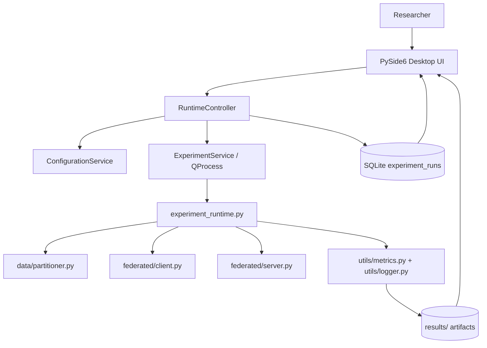
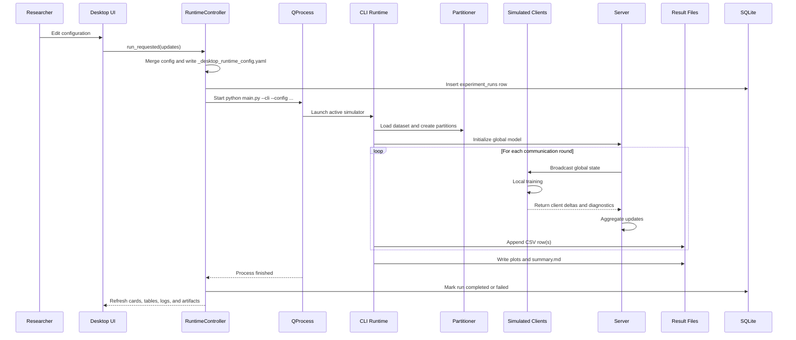
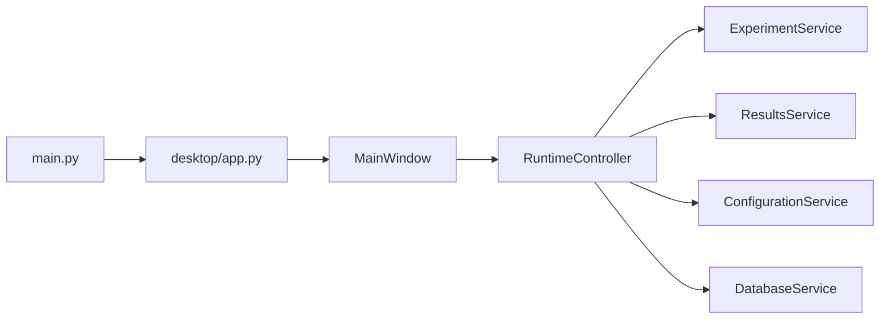
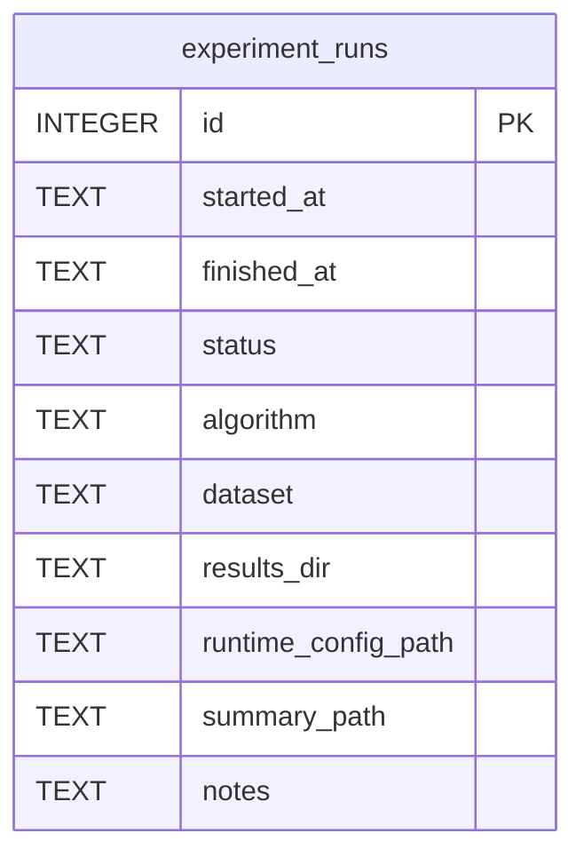

# Federated Learning on Non-IID Data with Differential Privacy

## 1. Project Title

Federated Learning on Non-IID Data with Differential Privacy: a research-oriented desktop experiment system with auxiliary privacy, personalization, and secure aggregation subsystems.

## 2. Abstract

This repository studies federated optimization under heterogeneous client data distributions, emphasizing the interaction between non-IID partitioning, local optimization, server-side aggregation, and privacy mechanisms. The active root workflow is a desktop-first research application launched through `python main.py`, where a PySide6 dashboard manages experiments, writes runtime configuration snapshots, launches the federated simulator as a local child process, and visualizes metrics from real output artifacts. The active simulator implements GroupNorm-based image classification on MNIST and CIFAR-10, Dirichlet and pathological non-IID partitioning, local client training, sample-count-weighted FedAvg, FedProx, SCAFFOLD, client-level update clipping with Gaussian noise, RDP-based privacy accounting, and artifact generation for reproducibility. The repository also contains additional subsystem implementations for FedSAM, Ditto, Per-FedAvg, C++ FedOpt variants, sample-level Opacus accounting, adaptive clipping, and secure aggregation primitives, but those components are not all exercised by the current root desktop runtime. The platform is research-oriented, not production-certified.

## 3. Research Motivation

Centralized machine learning is often unsuitable when raw data cannot leave local devices or institutional boundaries, when medical or financial records are legally constrained, when clients differ substantially in label distributions and sample counts, and when communication or compute resources are unevenly distributed. Federated learning addresses data locality, but under non-IID conditions it introduces slower convergence, client drift, unstable aggregation, and sensitivity to optimizer choice. Privacy mechanisms improve disclosure resistance, but clipping and Gaussian perturbation impose a measurable privacy-utility trade-off. This repository is organized around those tensions rather than around a generic software deployment story.

## 4. Research Problem

Assume \(K\) federated clients. Client \(k\) owns local data

\[
\mathcal{D}_k = \{(x_i, y_i)\}_{i=1}^{n_k}.
\]

The total number of local training examples is

\[
N = \sum_{k=1}^{K} n_k.
\]

The local objective at client \(k\) is

\[
F_k(w) = \frac{1}{n_k}\sum_{(x_i, y_i)\in \mathcal{D}_k}\ell(w; x_i, y_i).
\]

The global objective is

\[
F(w) = \sum_{k=1}^{K} p_k F_k(w), \qquad p_k = \frac{n_k}{N}.
\]

Variables:

- \(w\): global model parameters.
- \(F_k\): client-local empirical risk.
- \(F\): weighted federated objective.
- \(n_k\): client sample count.
- \(N\): total sample count.
- \(p_k\): sample-proportional aggregation weight.
- \(\ell\): batch loss, implemented as cross-entropy for classification.

In the active root simulator, this objective is approximated by repeated communication rounds in which the server samples a cohort, broadcasts the current model, each selected client performs local SGD-like optimization, produces a model delta, and the server aggregates those deltas through FedAvg, FedProx-compatible weighted averaging, or SCAFFOLD.

## 5. Research Objectives

- Study convergence under label-skewed and shard-based non-IID partitions.
- Compare FedAvg, FedProx, and SCAFFOLD in the active desktop runtime.
- Measure client disagreement through drift and weight-variance diagnostics.
- Quantify the effect of client-level clipping and Gaussian noise on performance.
- Preserve configuration snapshots and generated artifacts for reproducibility.
- Expose the implementation-to-equation boundary clearly enough for review and extension.

## 6. Key Research Questions

- How does stronger non-IID heterogeneity alter convergence and final accuracy?
- When does FedProx reduce instability relative to FedAvg?
- How does SCAFFOLD’s control-variate correction change drift behavior?
- What utility cost is induced by client-level update clipping and Gaussian noise?
- Which metrics in the current codebase are global-only versus client-heterogeneity diagnostics?
- Which algorithms and privacy mechanisms are active in the root desktop workflow, and which exist only in auxiliary subsystems?

## 7. Contributions

- A root federated simulator for MNIST/CIFAR-10 with real non-IID partitioning, real local optimization, and artifact generation.
- A modular PySide6 desktop shell that manages experiments locally through `QProcess`.
- Exact code paths for weighted FedAvg, FedProx, and SCAFFOLD.
- A client-level RDP moments accountant implemented in [federated/dp_accountant.py](/E:/Final%20Project/Federated%20Learning%20on%20Non-IID%20Data%20&%20Differential%20Privacy/federated_dp_research/federated/dp_accountant.py:1).
- Auxiliary implementations for FedSAM, Ditto, Per-FedAvg, Opacus-backed sample-level DP, adaptive clipping, fairness metrics, and secure aggregation primitives under `python/src/fl_platform/` and `cpp/`.

## 8. System Scope

The repository contains multiple layers. They are not all part of the same active runtime path.

### Active root workflow

- Entry point: [main.py](/E:/Final%20Project/Federated%20Learning%20on%20Non-IID%20Data%20&%20Differential%20Privacy/federated_dp_research/main.py:1)
- Core runtime: [experiment_runtime.py](/E:/Final%20Project/Federated%20Learning%20on%20Non-IID%20Data%20&%20Differential%20Privacy/federated_dp_research/experiment_runtime.py:1)
- Local training: [federated/client.py](/E:/Final%20Project/Federated%20Learning%20on%20Non-IID%20Data%20&%20Differential%20Privacy/federated_dp_research/federated/client.py:1)
- Aggregation: [federated/server.py](/E:/Final%20Project/Federated%20Learning%20on%20Non-IID%20Data%20&%20Differential%20Privacy/federated_dp_research/federated/server.py:1)
- Partitioning: [data/partitioner.py](/E:/Final%20Project/Federated%20Learning%20on%20Non-IID%20Data%20&%20Differential%20Privacy/federated_dp_research/data/partitioner.py:1)
- Metrics and plots: [utils/metrics.py](/E:/Final%20Project/Federated%20Learning%20on%20Non-IID%20Data%20&%20Differential%20Privacy/federated_dp_research/utils/metrics.py:1), [utils/logger.py](/E:/Final%20Project/Federated%20Learning%20on%20Non-IID%20Data%20&%20Differential%20Privacy/federated_dp_research/utils/logger.py:1)
- Desktop UI: [desktop/](/E:/Final%20Project/Federated%20Learning%20on%20Non-IID%20Data%20&%20Differential%20Privacy/federated_dp_research/desktop)

### Auxiliary subsystem scope

- Python worker/control-plane package: `python/src/fl_platform/`
- C++ aggregation and coordinator components: `cpp/`
- Go APIs and services: `go/`

Those auxiliary subsystems contain additional algorithms and privacy/security mechanisms, but they are not invoked by the current root desktop simulator unless explicitly run through their own test or service entry points.

## 9. Mathematical Notation

| Symbol | Meaning |
|---|---|
| \(K\) | Total number of clients |
| \(S_t\) | Selected cohort at communication round \(t\) |
| \(m\) | Selected client count in one round |
| \(n_k\) | Local sample count at client \(k\) |
| \(N\) | Total sample count \(\sum_k n_k\) |
| \(w_t\) | Global model at round \(t\) |
| \(w_{t,e}^{k}\) | Client \(k\)'s parameters after local step or epoch \(e\) at round \(t\) |
| \(F_k(w)\) | Local objective at client \(k\) |
| \(F(w)\) | Weighted global objective |
| \(\eta\) | Client learning rate |
| \(\eta_s\) | Server learning rate in FedOpt-style components |
| \(\mu\) | FedProx proximal coefficient |
| \(C\) | Root runtime clipping norm for gradients and final client updates |
| \(\sigma\) | Gaussian noise multiplier |
| \(\epsilon\) | Privacy loss parameter |
| \(\delta\) | Privacy failure probability |
| \(q\) | Configured sample rate |
| \(E\) | Number of local epochs |
| \(T\) | Number of communication rounds |
| \(c\) | SCAFFOLD global control variate |
| \(c_k\) | SCAFFOLD client control variate |
| \(\Delta_k\) | Client model delta \(w_{t,E}^{k} - w_t\) |
| \(m_t\) | FedOpt first-moment state in the C++ core |
| \(v_t\) | FedOpt second-moment state in the C++ core |
| \(\rho\) | FedSAM perturbation radius |
| \(\lambda\) | Ditto personalized regularization coefficient |

## 10. Federated Learning Formulation

At round \(t\), the server model is \(w_t\). A cohort \(S_t \subseteq \{1,\dots,K\}\) is selected, the model is broadcast, and each selected client computes a local update

\[
\Delta_k = w_{t,E}^{k} - w_t.
\]

The active root runtime uses:

- sample-count-weighted averaging for `fedavg`,
- the same server aggregation for `fedprox`,
- uniform cohort averaging plus control-variate updates for `scaffold`.

The server-side global update is implemented in [federated/server.py](/E:/Final%20Project/Federated%20Learning%20on%20Non-IID%20Data%20&%20Differential%20Privacy/federated_dp_research/federated/server.py:1) by `Server.aggregate`, `Server._aggregate_weighted`, and `Server._aggregate_scaffold`.

## 11. Non-IID Data Modeling

### Implemented partition strategies in the active root runtime

1. Dirichlet label skew via `partition_dirichlet`.
2. Pathological shard-based label restriction via `partition_pathological`.

### Not implemented in the active root runtime

- A separate IID partition function is not present.
- A dedicated quantity-skew sampler is not present, although Dirichlet draws naturally create unequal \(n_k\).

## 12. Local Client Optimization

Each selected client starts from

\[
w_{t,0}^{k} = w_t.
\]

Ignoring optional FedProx and SCAFFOLD corrections, the local update is standard SGD:

\[
w_{t,e+1}^{k} = w_{t,e}^{k} - \eta \nabla \ell(w_{t,e}^{k}; B_e).
\]

In the active root simulator this loop is implemented in `Client.train` in [federated/client.py](/E:/Final%20Project/Federated%20Learning%20on%20Non-IID%20Data%20&%20Differential%20Privacy/federated_dp_research/federated/client.py:1). Local clients are simulated sequentially inside one Python process, not concurrently across devices.

## 13. Federated Aggregation Algorithms

### FedAvg in the active root runtime

The server computes a sample-count-weighted average over client deltas:

\[
\Delta_t = \sum_{k\in S_t} \frac{n_k}{\sum_{j\in S_t} n_j}\Delta_k,
\qquad
w_{t+1} = w_t + \eta_s \Delta_t.
\]

This is the exact implemented form in `Server._aggregate_weighted`.

### FedProx in the active root runtime

FedProx uses the same server aggregation as FedAvg; the difference is entirely local.

### SCAFFOLD in the active root runtime

The model delta is averaged uniformly over the cohort:

\[
\Delta_t = \frac{1}{|S_t|}\sum_{k\in S_t}\Delta_k,
\qquad
w_{t+1} = w_t + \eta_s \Delta_t.
\]

The control update is also averaged uniformly and then scaled by \(|S_t|/K\):

\[
c^{t+1} = c^t + \frac{|S_t|}{K}\left(\frac{1}{|S_t|}\sum_{k\in S_t}\Delta c_k\right).
\]

This is implemented in `Server._aggregate_scaffold`.

### Auxiliary FedOpt implementations in the repository

The C++ aggregation core includes FedAdagrad, FedAdam, and FedYogi in [cpp/core/src/aggregation.cpp](/E:/Final%20Project/Federated%20Learning%20on%20Non-IID%20Data%20&%20Differential%20Privacy/federated_dp_research/cpp/core/src/aggregation.cpp:1), but those server optimizers are not exercised by the current root desktop runtime.

## 14. Differential Privacy Mathematics

For neighboring datasets \(D\) and \(D'\), a randomized mechanism \(\mathcal{M}\) satisfies \((\epsilon,\delta)\)-differential privacy if

\[
\Pr[\mathcal{M}(D)\in S] \le e^\epsilon \Pr[\mathcal{M}(D')\in S] + \delta
\]

for all measurable output events \(S\).

Interpretation:

- \(\epsilon\) is a privacy loss bound, not a probability.
- \(\delta\) is the probability mass allowed outside the pure multiplicative bound.
- Smaller \(\epsilon\) typically requires more clipping and/or more noise.

## 15. Privacy Accounting

### Active root runtime

The active root runtime uses a client-level RDP moments accountant in [federated/dp_accountant.py](/E:/Final%20Project/Federated%20Learning%20on%20Non-IID%20Data%20&%20Differential%20Privacy/federated_dp_research/federated/dp_accountant.py:1). One communication round is treated as one step of a subsampled Gaussian mechanism at client level. The accountant uses:

\[
\epsilon(\delta) = \min_{\alpha} \left[T \cdot \epsilon_{\mathrm{RDP}}(\alpha) + \frac{\log(1/\delta)}{\alpha-1}\right].
\]

The code precomputes per-order RDP values and composes them additively across rounds through `MomentsAccountant.step()` and `MomentsAccountant.get_epsilon()`.

Important implementation detail: the accountant uses the configured `sample_rate=q`, while the actual selected cohort size is

\[
m = \max(1,\mathrm{round}(qK)).
\]

Those are equal only up to rounding.

### Auxiliary privacy subsystem

The auxiliary `fl_platform` package contains:

- `SampleLevelAccountant` in [python/src/fl_platform/privacy/accounting.py](/E:/Final%20Project/Federated%20Learning%20on%20Non-IID%20Data%20&%20Differential%20Privacy/federated_dp_research/python/src/fl_platform/privacy/accounting.py:1), which wraps Opacus for per-sample accounting.
- `UserLevelAccountant`, which reuses the root moments accountant for client-level privacy.
- `AdaptiveClippingAccountant` for privatized clipping-statistic accounting.

## 16. Secure Aggregation Mathematics

Secure aggregation is **not part of the active root desktop runtime**. The repository does contain experimental secure aggregation primitives in `python/src/fl_platform/secure_aggregation/` and related C++ components.

The inspected pairwise-masking rule in [python/src/fl_platform/secure_aggregation/pairwise_mask.py](/E:/Final%20Project/Federated%20Learning%20on%20Non-IID%20Data%20&%20Differential%20Privacy/federated_dp_research/python/src/fl_platform/secure_aggregation/pairwise_mask.py:1) is ring-based additive masking:

\[
\widetilde{x}_k = x_k + \sum_{j>k} r_{k,j} - \sum_{j<k} r_{j,k} \pmod{2^{64}}.
\]

Summing across a complete cohort yields cancellation of pairwise masks:

\[
\sum_k \widetilde{x}_k = \sum_k x_k \pmod{2^{64}}.
\]

What can be stated truthfully from the inspected code:

- Pairwise masking exists.
- Fixed-point encoding and masking of weighted deltas exist.
- The active desktop runtime does not use this path.
- The inspected Python secure aggregation path is experimental and no-dropout-oriented.
- The current README does **not** claim production-complete dropout recovery or a production-complete adversarial threat model for this path.

## 17. Personalization Mathematics

Personalization is **not part of the active root desktop runtime**, but auxiliary algorithms and fairness metrics exist in `python/src/fl_platform/`.

### Ditto

The personalized objective implemented in [python/src/fl_platform/algorithms/ditto.py](/E:/Final%20Project/Federated%20Learning%20on%20Non-IID%20Data%20&%20Differential%20Privacy/federated_dp_research/python/src/fl_platform/algorithms/ditto.py:1) is

\[
\min_{v_k} F_k(v_k) + \frac{\lambda}{2}\|v_k - w\|_2^2.
\]

The global-training model still submits a FedAvg-shaped delta; the personalized model remains local.

### Per-FedAvg

The first-order Per-FedAvg implementation in [python/src/fl_platform/algorithms/per_fedavg.py](/E:/Final%20Project/Federated%20Learning%20on%20Non-IID%20Data%20&%20Differential%20Privacy/federated_dp_research/python/src/fl_platform/algorithms/per_fedavg.py:1) performs support-set adaptation followed by query-loss meta-updates:

\[
w' = w - \alpha \nabla F_k^{\text{support}}(w),
\qquad
w \leftarrow w - \beta \nabla F_k^{\text{query}}(w').
\]

It explicitly uses the first-order approximation and does not differentiate through the inner loop.

## 18. Evaluation Metrics

### Global test accuracy

\[
\mathrm{Acc} = \frac{1}{N_{\mathrm{test}}}\sum_{i=1}^{N_{\mathrm{test}}}\mathbf{1}[\hat{y}_i = y_i].
\]

### Global test loss

The implementation uses summed cross-entropy accumulated over the test set and divided by the total number of samples in `evaluate_global`.

### Additional active root metrics

- `avg_client_loss`
- `epsilon`
- `weight_variance`
- `client_drift`

These are written per round to `run_<algorithm>.csv` via `CSVLogger.log`.

## 19. Fairness and Client Heterogeneity Metrics

### Active root runtime

The active root runtime exposes heterogeneity diagnostics but not a full fairness dashboard:

- client drift,
- mean parameter variance across client local states.

### Auxiliary fairness metrics

The personalization subsystem in [python/src/fl_platform/personalization/metrics.py](/E:/Final%20Project/Federated%20Learning%20on%20Non-IID%20Data%20&%20Differential%20Privacy/federated_dp_research/python/src/fl_platform/personalization/metrics.py:1) implements:

- worst-client accuracy,
- best-client accuracy,
- fairness gap,
- mean/median/p10/p25/p75/p90 personalized accuracy,
- fraction of improved clients,
- coefficient of variation,
- Jain's fairness index.

These are real auxiliary formulas, but they are not produced by the current root desktop runner.

## 20. Communication and Computational Complexity

If the model has \(P\) scalar parameters and each scalar occupies \(b\) bytes, one full model transmission costs approximately

\[
Pb.
\]

For \(m\) participating clients across \(T\) rounds, bidirectional communication is approximately

\[
C_{\text{total}} \approx 2TmPb,
\]

excluding metadata, encryption overhead, retransmission, and any protocol framing.

The root desktop simulator executes clients sequentially, so one round costs approximately

\[
O\left(\sum_{k\in S_t} E\frac{n_k}{B}C_{\text{model}}\right),
\]

where \(C_{\text{model}}\) is the cost of one forward/backward batch for the selected model.

## 21. System Architecture



Auxiliary subsystems under `python/src/fl_platform/`, `cpp/`, and `go/` extend this repository but are not part of this exact root execution graph.

## 22. Component Connectivity

| Source | Destination | Mechanism | Data |
|---|---|---|---|
| Desktop UI | `RuntimeController` | Qt signals and direct method calls | Edited configuration, start/stop actions |
| `RuntimeController` | `ConfigurationService` | Python method calls | YAML load/merge/write |
| `RuntimeController` | `ExperimentService` | Python method calls | Child-process launch request |
| `ExperimentService` | `main.py --cli` | `QProcess` | CLI command and runtime config path |
| CLI runtime | `data/partitioner.py` | Direct function calls | Dataset loading and partition indices |
| CLI runtime | `Client.train` | Direct function calls | Local model state and training config |
| CLI runtime | `Server.aggregate` | Direct function calls | Client deltas and aggregation state |
| CLI runtime | `CSVLogger` and plot helpers | Direct function calls | Round metrics and plot generation |
| `ResultsService` | Desktop UI | Filesystem polling every 2 seconds | Summary text, CSV-derived metrics, artifact list |
| `DatabaseService` | SQLite | `sqlite3` | `experiment_runs` history |

## 23. End-to-End Workflow



## 24. Desktop Application Architecture

The desktop architecture is intentionally thin:

- [main.py](/E:/Final%20Project/Federated%20Learning%20on%20Non-IID%20Data%20&%20Differential%20Privacy/federated_dp_research/main.py:1): lazy-selects GUI or CLI.
- [desktop/app.py](/E:/Final%20Project/Federated%20Learning%20on%20Non-IID%20Data%20&%20Differential%20Privacy/federated_dp_research/desktop/app.py:1): builds paths, applies theme, creates `QApplication`, controller, and main window.
- [desktop/main_window.py](/E:/Final%20Project/Federated%20Learning%20on%20Non-IID%20Data%20&%20Differential%20Privacy/federated_dp_research/desktop/main_window.py:1): left navigation, `QStackedWidget`, periodic refresh.
- [desktop/controllers/runtime_controller.py](/E:/Final%20Project/Federated%20Learning%20on%20Non-IID%20Data%20&%20Differential%20Privacy/federated_dp_research/desktop/controllers/runtime_controller.py:1): orchestration across config, results, DB, and subprocess control.
- [desktop/services/experiment_service.py](/E:/Final%20Project/Federated%20Learning%20on%20Non-IID%20Data%20&%20Differential%20Privacy/federated_dp_research/desktop/services/experiment_service.py:1): `QProcess` wrapper.
- [desktop/services/results_service.py](/E:/Final%20Project/Federated%20Learning%20on%20Non-IID%20Data%20&%20Differential%20Privacy/federated_dp_research/desktop/services/results_service.py:1): filesystem-backed metric/artifact loading.
- [desktop/services/database_service.py](/E:/Final%20Project/Federated%20Learning%20on%20Non-IID%20Data%20&%20Differential%20Privacy/federated_dp_research/desktop/services/database_service.py:1): SQLite run-history persistence.



## 25. Dynamic Metrics Pipeline

The desktop UI does not display static placeholder values. The current pipeline is file- and process-driven:

```text
CLI Runtime stdout / result files
    -> ExperimentService output_received
    -> RuntimeController
    -> ResultsService + DatabaseService
    -> Qt signals
    -> cards, tables, summary view, log panes, and charts
```

What exists:

- live merged stdout capture from the child process,
- 2-second refresh polling via `QTimer`,
- CSV-derived metric snapshots,
- artifact discovery from the results directory,
- SQLite-backed run history.

What does not exist in the active desktop path:

- JSON event schema,
- JSONL runtime journal,
- batched database writes for round metrics,
- PostgreSQL primary mode,
- automatic backend failover,
- explicit chart-throttling beyond the 2-second polling interval.

## 26. Database Architecture

The current desktop app persists run history only in SQLite.

### Implemented database

- Path builder: `desktop/app.py`
- Schema: [desktop/database/schema.py](/E:/Final%20Project/Federated%20Learning%20on%20Non-IID%20Data%20&%20Differential%20Privacy/federated_dp_research/desktop/database/schema.py:1)
- Access layer: `DatabaseService`



### Not implemented

- PostgreSQL primary mode,
- SQLite fallback from PostgreSQL,
- multi-table experiment/round/client/privacy schemas,
- backend stickiness enforcement across active runs.

Those behaviors were requested in the outline but are not present in the current code, so they are not documented as capabilities.

## 27. Experiment Lifecycle

The exact active desktop status model is the `ExperimentState.status` field plus UI labels:

- `Idle`
- `Running`
- `Stopping`
- `Completed`
- `Failed`

The requested richer lifecycle (`CREATED`, `VALIDATING`, `INITIALIZING`, `CHECKPOINTING`, and so on) is **not** implemented in the current desktop state model.

## 28. Project Directory Structure

```text
main.py
experiment_runtime.py
config.yaml

desktop/
  app.py
  main_window.py
  controllers/
  services/
  pages/
  widgets/
  database/

data/
federated/
models/
utils/

python/src/fl_platform/     # auxiliary worker/privacy/personalization stack
cpp/                        # auxiliary C++ aggregation/coordinator stack
go/                         # auxiliary Go API/service stack
tests/
python/tests/
results/
docs/
```

## 29. Configuration Reference

Defaults are read from [config.yaml](/E:/Final%20Project/Federated%20Learning%20on%20Non-IID%20Data%20&%20Differential%20Privacy/federated_dp_research/config.yaml:1).

| Configuration | Type | Default | Valid Range | Mathematical Role |
|---|---|---:|---|---|
| `system.seed` | int | `42` | \(>0\) in practice | Random initialization and partition seed |
| `system.device` | str | `"auto"` | `auto`,`cpu`,`cuda` | Device selection |
| `system.results_dir` | str | `"results"` | path | Artifact output root |
| `data.dataset` | str | `"CIFAR10"` | `CIFAR10`,`MNIST` | Dataset choice |
| `data.partition` | str | `"dirichlet"` | `dirichlet`,`pathological` | Non-IID partition regime |
| `data.alpha` | float | `0.1` | \(>0\) | Dirichlet concentration |
| `data.classes_per_client` | int | `2` | \(>0\) | Pathological shard count per client |
| `data.min_partition_size` | int | `10` | \(>0\) | Dirichlet retry threshold |
| `federated.num_clients` | int | `20` | \(>0\) | Total \(K\) |
| `federated.sample_rate` | float | `0.2` | \(0<q\le 1\) | Configured participation rate |
| `federated.rounds` | int | `50` | \(>0\) | Communication rounds \(T\) |
| `federated.local_epochs` | int | `2` | \(>0\) | Local epochs \(E\) |
| `federated.batch_size` | int | `64` | \(>0\) | Local batch size |
| `federated.server_lr` | float | `1.0` | \(>0\) | Server update scale |
| `optimizer.lr` | float | `0.01` | \(>0\) | Client learning rate \(\eta\) |
| `optimizer.momentum` | float | `0.9` | \([0,1]\) | SGD momentum; forced to `0.0` for SCAFFOLD in the active root runtime |
| `optimizer.weight_decay` | float | `0.0005` | \(\ge 0\) | L2-style optimizer penalty |
| `algorithm.name` | str | `"fedprox"` | `fedavg`,`fedprox`,`scaffold`,`all` | Aggregation/local algorithm selection |
| `algorithm.mu` | float | `0.01` | \(\ge 0\) | FedProx coefficient \(\mu\) |
| `dp.enabled` | bool | `true` | boolean | Root runtime privacy switch |
| `dp.max_grad_norm` | float | `1.5` | \(>0\) | Clipping bound \(C\) |
| `dp.noise_multiplier` | float | `0.8` | \(\ge 0\) | Gaussian noise multiplier \(\sigma\) |
| `dp.target_delta` | float | `1e-5` | \(0<\delta<1\) | Privacy failure probability |
| `model.name` | str | `"cnn"` | `cnn` | Model family |
| `model.group_norm_groups` | int | `2` | \(>0\) | GroupNorm groups |
| `evaluation.eval_batch_size` | int | `256` | \(>0\) | Test-set batch size |

## 30. Running the System

Research explanation comes first in this README by design. Minimal execution instructions follow.

### Install

```bash
pip install -r requirements.txt
```

### Launch the desktop application

```bash
python main.py
```

### Run the CLI simulator directly

```bash
python main.py --cli
python main.py --cli --algo fedavg --rounds 10
python main.py --cli --dataset MNIST --dp off
```

If `PySide6` is missing, `python main.py` exits with an explicit dependency message; the CLI path can still run if the non-GUI dependencies are installed.

## 31. Reproducibility

The active root runtime includes the following reproducibility controls:

- `set_seed` in [experiment_runtime.py](/E:/Final%20Project/Federated%20Learning%20on%20Non-IID%20Data%20&%20Differential%20Privacy/federated_dp_research/experiment_runtime.py:1) seeds `random`, `numpy`, `torch`, and CUDA generators.
- `torch.backends.cudnn.deterministic = True`
- `torch.backends.cudnn.benchmark = False`
- the same seed is reused for partition generation and algorithm comparisons,
- a per-run YAML snapshot `_desktop_runtime_config.yaml` is written by the desktop app,
- CSV and Markdown artifacts are written to the selected results directory.

Remaining reproducibility caveats:

- exact GPU runs can still vary across hardware, kernels, and low-level library versions,
- the active root runtime does not record package-lock hashes or environment manifests automatically,
- checkpoint hashing is not part of the root desktop path.

## 32. Output Artifacts

### Active root runtime artifacts

| Artifact | Purpose |
|---|---|
| `run_<algorithm>.csv` | Per-round metrics (`round`, `test_acc`, `test_loss`, `epsilon`, `weight_variance`, `client_drift`, `avg_client_loss`) |
| `distribution.png` | Non-IID class-distribution visualization |
| `client_distribution.csv` | Per-client sample counts and class counts |
| `accuracy_vs_rounds.png` | Accuracy curve |
| `privacy_loss_tradeoff.png` | Accuracy-versus-\(\epsilon\) visualization |
| `weight_variance.png` | Weight variance and client drift figure |
| `summary.md` | Human-readable summary table |
| `_desktop_runtime_config.yaml` | Desktop-generated runtime snapshot |
| `artifacts/desktop_history.sqlite3` | Desktop run-history database |

### Not currently generated by the active root runtime

- `events.jsonl`
- `round_metrics.csv`
- `client_metrics.csv`
- `privacy_metrics.csv`
- model checkpoints for the root simulator

## 33. Testing and Validation

Validation below reflects commands actually executed on **July 29, 2026** in this workspace.

### Executed commands

```bash
python -m compileall main.py experiment_runtime.py desktop federated data models utils python/src
python main.py --help
python main.py --cli --help
python -m pytest tests python/tests -q
python main.py --cli --config .tmp/readme_smoke_config.yaml
```

### Validation matrix

| Validation | Status | Evidence |
|---|---|---|
| Python compilation | PASS | `python -m compileall ...` succeeded |
| CLI help | PASS | `python main.py --help` succeeded |
| CLI direct help | PASS | `python main.py --cli --help` succeeded |
| Unit/integration test suite | PARTIAL | `536 passed, 19 failed, 1 skipped` |
| Desktop tests | NOT PRESENT | `tests/desktop` does not exist in this repository |
| Desktop launch | BLOCKED IN CURRENT ENVIRONMENT | `PySide6` was not installed when `python main.py` was checked earlier |
| Minimal CLI smoke run | PASS | `python main.py --cli --config .tmp/readme_smoke_config.yaml` completed and wrote artifacts under `results/readme_smoke/` |
| PostgreSQL mode | NOT IMPLEMENTED IN ROOT DESKTOP PATH | no PostgreSQL backend exists in the current desktop app |
| SQLite run history | PASS | `desktop/database/schema.py` and `DatabaseService` implement SQLite persistence |

### Observed failures during `pytest`

Two failure classes were directly observed:

1. Protobuf runtime mismatch in generated coordinator bindings.
   The failing tests report `gencode 7.35.1 runtime 6.33.6` incompatibility.
2. Legacy launcher expectations no longer match the new root entry behavior.
   `python/tests/test_platform_launcher_cli.py` still expects the older root bootstrap path.

These failures are documented here because the README must match the tested system exactly.

## 34. Security and Privacy Boundaries

### Active root desktop runtime

- Single-machine simulation, not cross-device deployment.
- Privacy mechanism: client-update clipping plus additive Gaussian noise.
- Accountant: client-level RDP moments accountant.
- No transport security layer is part of the root simulator.
- No secure aggregation is active in the root simulator.

### Auxiliary subsystem boundary

The repository also contains:

- signed-message and worker-security machinery,
- Opacus-backed sample-level DP,
- adaptive clipping,
- experimental secure aggregation support,
- personalization metrics and auxiliary algorithms.

Those should be treated as subsystem implementations, not as automatic guarantees of the root desktop application.

## 35. Known Limitations

- The active root runtime is a simulation, not a real distributed deployment.
- Clients are simulated sequentially in one process.
- The active desktop runner supports only `fedavg`, `fedprox`, and `scaffold`.
- The active root model family is a single GroupNorm CNN.
- Only MNIST and CIFAR-10 are supported in the root simulator.
- The root privacy mechanism is client-level update privatization, not Opacus DP-SGD.
- The root desktop app uses SQLite only; PostgreSQL mode and backend failover are not implemented.
- The desktop metric pipeline is filesystem polling, not a structured event stream.
- The root simulator does not currently emit per-client fairness dashboards.
- The repository-wide test suite currently has 19 failures in this environment, including protobuf runtime mismatch failures.
- Experimental secure aggregation components exist, but the active root desktop path does not claim a complete secure aggregation deployment.
- Real Byzantine robustness, malicious-client defense, and production hardening are not claimed.

## 36. Future Research Directions

- asynchronous federated optimization,
- richer client selection policies,
- robust and Byzantine-resilient aggregation,
- model poisoning defenses,
- membership inference and reconstruction evaluation,
- communication compression and quantization,
- real multi-device validation,
- integration of the auxiliary secure aggregation stack into the desktop workflow,
- fairness-aware aggregation in the root desktop path,
- unification of desktop metrics with structured event storage,
- broader model and dataset support,
- reconciliation of the root runtime and the auxiliary `fl_platform` stack under one validated execution contract.

## 37. Function and Equation Traceability

| Mathematical Concept | Equation / Definition | Source File | Function / Class | Responsibility |
|---|---|---|---|---|
| Global objective | \(F(w)=\sum_k p_k F_k(w)\) | [experiment_runtime.py](/E:/Final%20Project/Federated%20Learning%20on%20Non-IID%20Data%20&%20Differential%20Privacy/federated_dp_research/experiment_runtime.py:1) | `run_experiment` | Orchestrates the weighted federated experiment loop |
| Client local training | \(w_{t,e+1}^k = w_{t,e}^k - \eta \nabla \ell\) | [federated/client.py](/E:/Final%20Project/Federated%20Learning%20on%20Non-IID%20Data%20&%20Differential%20Privacy/federated_dp_research/federated/client.py:1) | `Client.train` | Local SGD and algorithm-specific corrections |
| FedAvg server step | \(\sum_k \frac{n_k}{\sum_j n_j}\Delta_k\) | [federated/server.py](/E:/Final%20Project/Federated%20Learning%20on%20Non-IID%20Data%20&%20Differential%20Privacy/federated_dp_research/federated/server.py:1) | `Server._aggregate_weighted` | Sample-count-weighted delta averaging |
| FedProx proximal loss | \(F_k(w)+\frac{\mu}{2}\|w-w_t\|_2^2\) | [federated/client.py](/E:/Final%20Project/Federated%20Learning%20on%20Non-IID%20Data%20&%20Differential%20Privacy/federated_dp_research/federated/client.py:1) | `Client.train` | Adds proximal penalty locally |
| SCAFFOLD correction | \(g \leftarrow g + c - c_k\) | [federated/client.py](/E:/Final%20Project/Federated%20Learning%20on%20Non-IID%20Data%20&%20Differential%20Privacy/federated_dp_research/federated/client.py:1) | `Client.train` | Applies control-variate correction before optimizer step |
| SCAFFOLD control update | \(c_k^+ = c_k - c - \Delta_k/(K\eta)\) | [federated/client.py](/E:/Final%20Project/Federated%20Learning%20on%20Non-IID%20Data%20&%20Differential%20Privacy/federated_dp_research/federated/client.py:1) | `Client.train` | Updates per-client control state |
| Dirichlet non-IID partition | \(\pi_c \sim \mathrm{Dirichlet}(\alpha \mathbf{1})\) | [data/partitioner.py](/E:/Final%20Project/Federated%20Learning%20on%20Non-IID%20Data%20&%20Differential%20Privacy/federated_dp_research/data/partitioner.py:1) | `partition_dirichlet` | Generates label-skew client splits |
| Pathological partition | shard-based restricted-class split | [data/partitioner.py](/E:/Final%20Project/Federated%20Learning%20on%20Non-IID%20Data%20&%20Differential%20Privacy/federated_dp_research/data/partitioner.py:1) | `partition_pathological` | Generates few-classes-per-client splits |
| Update clipping and Gaussian noise | \(\bar{\Delta}_k = \Delta_k \min(1,C/\|\Delta_k\|_2)\), then add \( \mathcal{N}(0,\sigma^2 C^2 I)\) | [federated/client.py](/E:/Final%20Project/Federated%20Learning%20on%20Non-IID%20Data%20&%20Differential%20Privacy/federated_dp_research/federated/client.py:1) | `Client.train` | Bounds and privatizes transmitted client delta |
| Client-level accountant | \(\epsilon=\mathcal{A}(q,\sigma,T,\delta)\) | [federated/dp_accountant.py](/E:/Final%20Project/Federated%20Learning%20on%20Non-IID%20Data%20&%20Differential%20Privacy/federated_dp_research/federated/dp_accountant.py:1) | `MomentsAccountant` | Tracks cumulative client-level privacy |
| Global loss / accuracy | cross-entropy and top-1 accuracy | [utils/metrics.py](/E:/Final%20Project/Federated%20Learning%20on%20Non-IID%20Data%20&%20Differential%20Privacy/federated_dp_research/utils/metrics.py:1) | `evaluate_global` | Global held-out evaluation |
| Client drift | \(\frac{1}{m}\sum_i \|\Delta_i-\bar{\Delta}\|_2\) | [utils/metrics.py](/E:/Final%20Project/Federated%20Learning%20on%20Non-IID%20Data%20&%20Differential%20Privacy/federated_dp_research/utils/metrics.py:1) | `compute_client_drift` | Update-divergence diagnostic |
| Weight variance | mean coordinate-wise variance across local states | [utils/metrics.py](/E:/Final%20Project/Federated%20Learning%20on%20Non-IID%20Data%20&%20Differential%20Privacy/federated_dp_research/utils/metrics.py:1) | `compute_weight_variance` | Local-state disagreement diagnostic |
| FedSAM perturbation | \(\epsilon(w)=\rho g/(\|g\|_2+\xi)\) | [python/src/fl_platform/algorithms/fedsam.py](/E:/Final%20Project/Federated%20Learning%20on%20Non-IID%20Data%20&%20Differential%20Privacy/federated_dp_research/python/src/fl_platform/algorithms/fedsam.py:1) | `FedSamAlgorithm.train` | Auxiliary sharpness-aware local training |
| Ditto personalized objective | \(F_k(v_k)+\frac{\lambda}{2}\|v_k-w\|_2^2\) | [python/src/fl_platform/algorithms/ditto.py](/E:/Final%20Project/Federated%20Learning%20on%20Non-IID%20Data%20&%20Differential%20Privacy/federated_dp_research/python/src/fl_platform/algorithms/ditto.py:1) | `DittoAlgorithm.train` | Auxiliary personalized local training |
| Per-FedAvg first-order meta-step | support/query adaptation and outer step | [python/src/fl_platform/algorithms/per_fedavg.py](/E:/Final%20Project/Federated%20Learning%20on%20Non-IID%20Data%20&%20Differential%20Privacy/federated_dp_research/python/src/fl_platform/algorithms/per_fedavg.py:1) | `PerFedAvgAlgorithm.train` | Auxiliary first-order meta-learning |
| FedAdam / FedAdagrad / FedYogi | moment-based server updates | [cpp/core/src/aggregation.cpp](/E:/Final%20Project/Federated%20Learning%20on%20Non-IID%20Data%20&%20Differential%20Privacy/federated_dp_research/cpp/core/src/aggregation.cpp:1) | `FedAdamOptimizer`, `FedAdagradOptimizer`, `FedYogiOptimizer` | Auxiliary C++ server optimizers |
| Pairwise mask cancellation | additive mask cancellation in \(2^{64}\) ring | [python/src/fl_platform/secure_aggregation/pairwise_mask.py](/E:/Final%20Project/Federated%20Learning%20on%20Non-IID%20Data%20&%20Differential%20Privacy/federated_dp_research/python/src/fl_platform/secure_aggregation/pairwise_mask.py:1) | `resolve_pairwise_mask_sign`, `mask_encoded_value` | Auxiliary secure aggregation primitive |

## 38. Citation

This repository does not provide a DOI or archival paper in the source tree. For academic use, cite the repository URL and the exact commit hash used in the experiment.

Example BibTeX template:

```bibtex
@software{federated_dp_research,
  title = {Federated Learning on Non-IID Data with Differential Privacy},
  author = {{Repository Maintainers}},
  year = {2026},
  url = {https://github.com/smshagor-dev/Federated-Learning-on-Non-IID-Data-Differential-Privacy},
  note = {Accessed with an explicit commit hash for reproducibility}
}
```

## 39. License

This repository is licensed under the Apache License 2.0. See [LICENSE](/E:/Final%20Project/Federated%20Learning%20on%20Non-IID%20Data%20&%20Differential%20Privacy/federated_dp_research/LICENSE:1).
