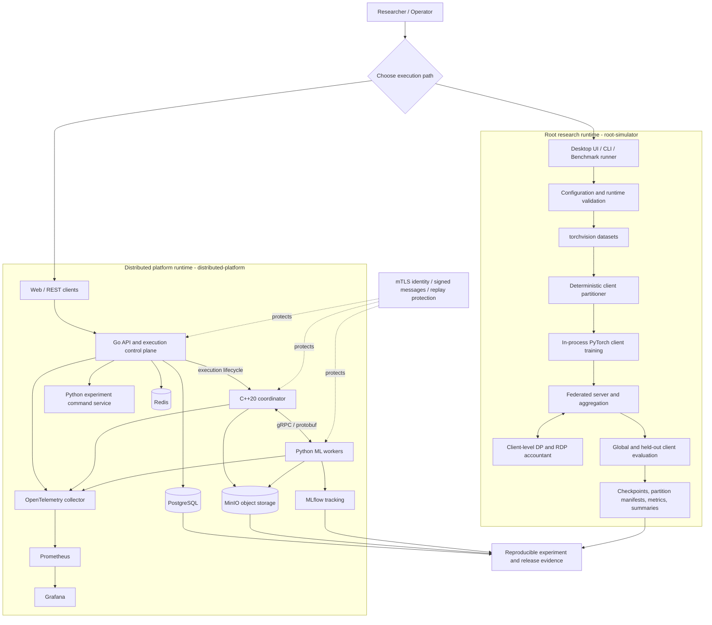
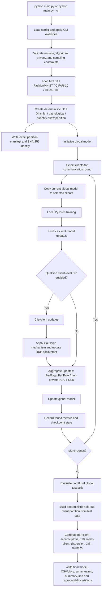
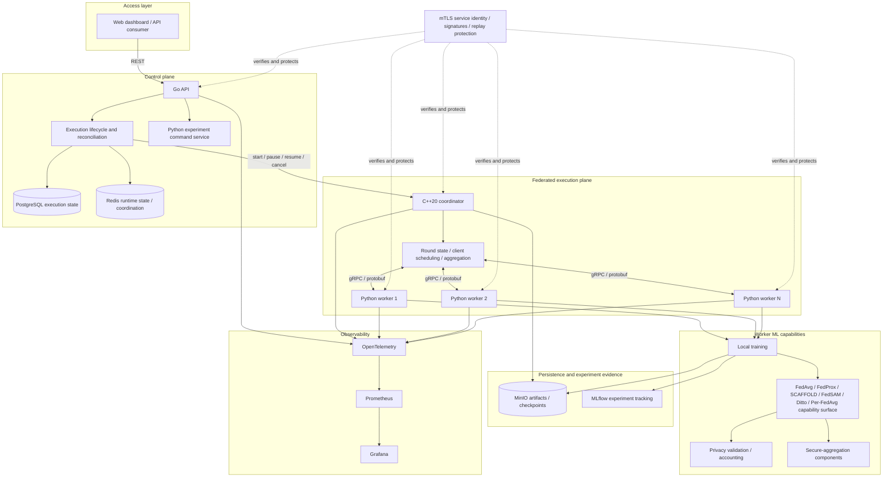
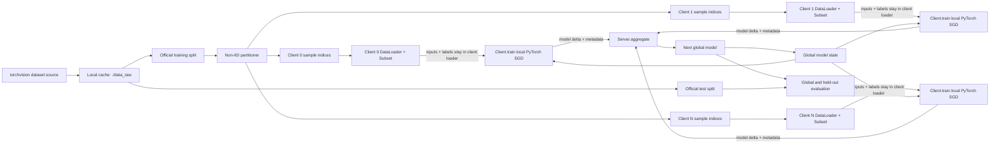
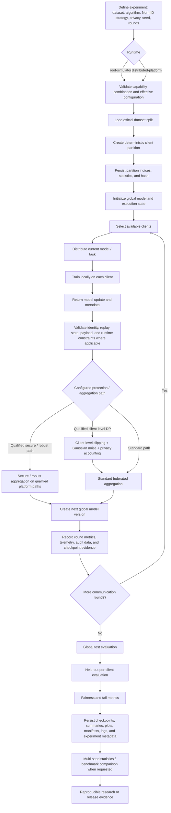
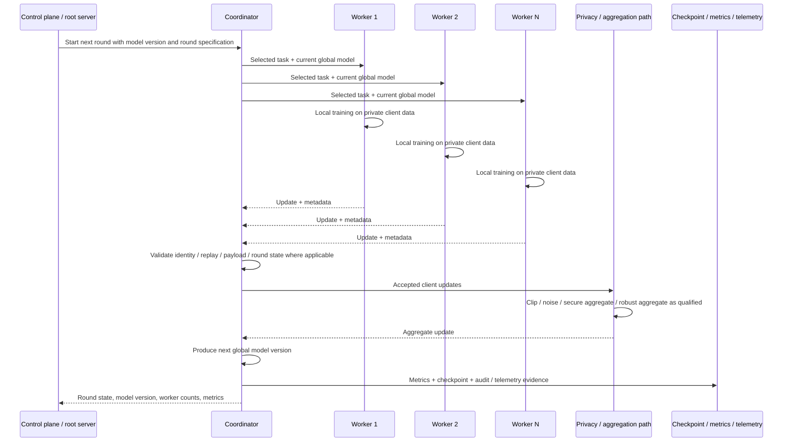
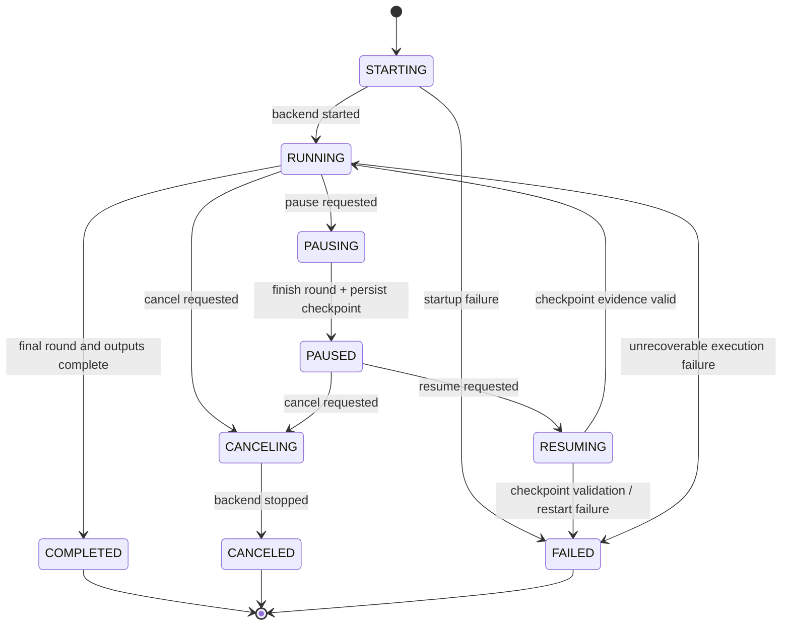

# Federated Learning on Non-IID Data with Differential Privacy

A reproducible federated-learning platform for studying **data heterogeneity, differential privacy, robust aggregation, secure aggregation, fairness, distributed execution, failure behavior, and release-grade experiment evidence**.

This repository contains two explicit runtime identities:

1. a practical **root research runtime** for controlled PyTorch experiments; and
2. a separate **distributed platform runtime** built around Python, C++20, Go, gRPC, Docker, persistence, service security, observability, and release qualification.

A capability is described as supported only when an executable implementation and corresponding validation evidence exist.

[](https://github.com/smshagor-dev/Federated-Learning-on-Non-IID-Data-Differential-Privacy/actions/workflows/ci.yml)


**Source version:** `3.0.0`  
**Primary themes:** Federated Learning · Non-IID Data · Differential Privacy · Personalized FL · Robust Aggregation · Secure Aggregation · Fairness · Reproducible Benchmarking · Distributed ML Systems

> **Mathematics:** display equations use GitHub fenced `math` blocks and a conservative MathJax-compatible macro subset. This keeps fractions, summations, norms, Greek symbols, subscripts, superscripts, and worked calculations readable directly on GitHub.

---

## Contents

- [1. Project overview](#1-project-overview)
- [2. Runtime model](#2-runtime-model)
- [3. Capability map](#3-capability-map)
- [4. Mathematical formulation](#4-mathematical-formulation)
- [5. Federated algorithms](#5-federated-algorithms)
- [6. Non-IID data modeling](#6-non-iid-data-modeling)
- [7. Differential privacy](#7-differential-privacy)
- [8. Secure and robust aggregation](#8-secure-and-robust-aggregation)
- [9. Client-level evaluation and fairness](#9-client-level-evaluation-and-fairness)
- [10. Benchmark statistics](#10-benchmark-statistics)
- [11. System architecture](#11-system-architecture)
- [System workflow](#system-workflow)
- [Live simulator](#live-simulator)
- [12. Installation](#12-installation)
- [13. Running experiments](#13-running-experiments)
- [14. Configuration](#14-configuration)
- [15. Artifacts and reproducibility](#15-artifacts-and-reproducibility)
- [16. Distributed platform](#16-distributed-platform)
- [17. Developer workflow](#17-developer-workflow)
- [18. Validation and CI](#18-validation-and-ci)
- [19. v3.0.0 release qualification](#19-v300-release-qualification)
- [20. Security and threat-model boundaries](#20-security-and-threat-model-boundaries)
- [21. Known limitations](#21-known-limitations)
- [22. Repository layout](#22-repository-layout)
- [23. Academic reporting and citation](#23-academic-reporting-and-citation)
- [24. Author and maintainer](#24-author-and-maintainer)
- [25. Contributing and license](#25-contributing-and-license)

---

## 1. Project overview

Federated learning is often summarized as **train locally, aggregate globally**. In practice, a useful federated-learning system has to deal with much more than distributed SGD. Clients may have different class distributions, different dataset sizes, different local compute budgets, different availability, and different privacy or trust assumptions.

This repository is built to make those differences explicit, measurable, and reproducible.

The project is useful for four classes of questions:

1. **Utility** — how well does a shared or personalized model learn under heterogeneous client data?
2. **Privacy** — what utility is lost when client updates are clipped and randomized under a defined client-level privacy mechanism?
3. **Reliability and security** — how does the system behave when workers are delayed, duplicated, unavailable, replayed, dropped, restarted, or adversarial?
4. **Reproducibility** — can every result be tied to an exact configuration, seed, partition, source commit, privacy budget, and artifact set?

The repository intentionally contains two runtime identities with different scopes rather than pretending that one execution path implements every feature.

---

## 2. Runtime model

### 2.1 Root research runtime

The root runtime is the shortest path from an experiment idea to a reproducible result:

```bash
python main.py --cli
```

It performs real PyTorch training on torchvision datasets and provides:

- deterministic client partitioning;
- FedAvg, FedProx, and non-private SCAFFOLD;
- qualified client-level central differential privacy;
- held-out per-client evaluation;
- fairness metrics;
- checkpoints and partition manifests;
- plots and machine-readable summaries;
- multi-seed benchmark execution.

Primary areas:

```text
main.py
experiment_runtime.py
config.yaml
data/
federated/
models/
utils/
desktop/
```

### 2.2 Distributed platform runtime

Start the development topology with:

```bash
docker compose -f infra/compose/docker-compose.dev.yml up --build
```

The distributed runtime combines:

- Go API/control plane;
- C++20 coordinator;
- Python workers;
- protobuf/gRPC contracts;
- PostgreSQL and Redis persistence;
- MinIO and MLflow support;
- service identity and signed messages;
- replay protection;
- observability;
- deterministic heterogeneity/fault injection;
- release qualification infrastructure.

Primary areas:

```text
cpp/
go/
python/
proto/
infra/
scripts/
release/
```

> A capability implemented in one runtime must not be assumed to exist in the other. [`RUNTIME.md`](RUNTIME.md) is the runtime source of truth.

---

## 3. Capability map

### 3.1 Root runtime

| Area | Capability | Status |
|---|---|---|
| Dataset | MNIST | Supported |
| Dataset | FashionMNIST | Supported |
| Dataset | CIFAR-10 | Supported |
| Dataset | CIFAR-100 | Supported |
| Partitioning | IID | Supported |
| Partitioning | Dirichlet label skew | Supported |
| Partitioning | Pathological class skew | Supported |
| Partitioning | Quantity skew | Supported |
| Algorithm | FedAvg | Supported |
| Algorithm | FedProx | Supported |
| Algorithm | SCAFFOLD | Supported without root client-level DP |
| Privacy | Client-level central DP | Supported for qualified FedAvg/FedProx paths |
| Privacy | Target-epsilon calibration | Supported |
| Privacy | RDP accounting | Supported |
| Sampling | Poisson client sampling | Supported |
| Sampling | Fixed-size client sampling | Supported when DP is disabled |
| Evaluation | Global test evaluation | Supported |
| Evaluation | Held-out per-client evaluation | Supported |
| Fairness | p10 / worst-client / Jain metrics | Supported |
| Reproducibility | Exact partition manifests | Supported |
| Reproducibility | Final model checkpoints | Supported |
| Reproducibility | Machine-readable summaries | Supported |
| Benchmarking | Multi-seed matrix | Supported |
| Statistics | Bootstrap confidence intervals | Supported |
| Statistics | Matched-seed comparisons | Supported |
| UI | PySide6 desktop interface | Supported |

### 3.2 v3 distributed/worker capability surface

The v3 platform includes release-qualified or explicitly bounded support for:

- FedAvg
- FedProx
- SCAFFOLD
- FedSAM
- Ditto
- Per-FedAvg
- median robust aggregation
- trimmed-mean robust aggregation
- deterministic compute/network/availability/payload heterogeneity
- mTLS service identity
- signed-message verification
- replay protection
- privacy/accounting validation
- distributed metrics and observability primitives
- ARM64 worker-image build/self-test compatibility
- immutable image locks
- SBOM generation
- artifact hashing and provenance attestations

Advanced code outside the stable release contract is listed under [Known limitations](#21-known-limitations).

---

## 4. Mathematical formulation

### 4.1 Client datasets

Assume there are `K` clients. Client `k` owns a local dataset `D_k` containing `n_k` examples.

```math
\mathcal{D}_k = \{(x_i,y_i)\}_{i=1}^{n_k},
\qquad
n_k = |\mathcal{D}_k|.
```

For model parameters `w`, the local empirical objective is

```math
F_k(w)
=
\frac{1}{n_k}
\sum_{(x,y)\in\mathcal{D}_k}
\ell(w;x,y).
```

Here `ℓ` is the task loss.

### 4.2 Global federated objective

A standard federated objective is

```math
\min_{w} F(w),
\qquad
F(w)=\sum_{k=1}^{K}p_kF_k(w),
```

with

```math
p_k\ge 0,
\qquad
\sum_{k=1}^{K}p_k=1.
```

For sample-count weighting,

```math
p_k
=
\frac{n_k}{\sum_{j=1}^{K}n_j}.
```

For uniform client weighting,

```math
p_k=\frac{1}{K}.
```

Weighting is not only an optimization choice. It also changes the sensitivity assumptions of a private release.

### 4.3 One communication round

At communication round `t`:

1. the server holds global parameters `w_t`;
2. a client subset `S_t` is selected;
3. every selected client starts from `w_t`;
4. client `k` performs local optimization and returns `Δ_{k,t}`;
5. the server validates and optionally clips/transforms the updates;
6. an aggregate `A_t` is produced;
7. the next model is generated.

A generic server update is

```math
w_{t+1}=w_t+\eta_sA_t,
```

where `η_s` is the server learning rate.

---

## 5. Federated algorithms

### 5.1 FedAvg

For client `k`, one local SGD step is

```math
w_{k,t}^{(e+1)}
=
w_{k,t}^{(e)}
-
\eta_k\nabla\ell_k\left(w_{k,t}^{(e)};B_{k,e}\right).
```

After local training,

```math
\Delta_{k,t}=w_{k,t}^{\mathrm{local}}-w_t.
```

For normalized aggregation weights,

```math
\sum_{k\in S_t}\alpha_{k,t}=1.
```

The aggregated update is

```math
A_t
=
\sum_{k\in S_t}
\alpha_{k,t}\Delta_{k,t},
```

and

```math
w_{t+1}=w_t+\eta_sA_t.
```

#### Worked FedAvg calculation

Suppose three clients contain `100`, `200`, and `300` examples and return scalar update components `0.20`, `-0.10`, and `0.05`.

Sample-count weights are

```math
p_1=\frac{100}{600}=\frac{1}{6},
\qquad
p_2=\frac{200}{600}=\frac{1}{3},
\qquad
p_3=\frac{300}{600}=\frac{1}{2}.
```

The weighted aggregate is

```math
A
=
\frac{1}{6}(0.20)
+
\frac{1}{3}(-0.10)
+
\frac{1}{2}(0.05)
=
0.025.
```

If `η_s = 1`, the server applies `0.025` to that model component.

### 5.2 FedProx

FedProx adds a proximal penalty to limit excessive local drift from the current global model.

```math
\min_w
\left[
F_k(w)
+
\frac{\mu}{2}\|w-w_t\|_2^2
\right].
```

The corresponding gradient contribution is

```math
\nabla F_k(w)+\mu(w-w_t).
```

When `μ = 0`, the proximal term disappears and the local objective reduces to the ordinary FedAvg-style objective.

Example configuration:

```yaml
algorithm:
  name: fedprox
  mu: 0.01
```

### 5.3 SCAFFOLD

SCAFFOLD introduces a server control variate `c` and a client control variate `c_k` to correct client drift under heterogeneous objectives.

```math
w
\leftarrow
w
-
\eta
\left[
\nabla F_k(w)-c_k+c
\right].
```

In the root runtime, SCAFFOLD is supported only when client-level DP is disabled. The additional control-variate state is outside the current root client-level privacy guarantee, so DP-enabled SCAFFOLD fails closed.

### 5.4 FedSAM

FedSAM combines federated optimization with sharpness-aware local training. Let

```math
g=\nabla F_k(w).
```

A SAM-style perturbation is

```math
\epsilon
=
\rho\frac{g}{\|g\|_2+\tau},
```

where `ρ` is the perturbation radius and `τ > 0` prevents division by zero.

The gradient is then evaluated around `w + ε`. FedSAM belongs to the platform-worker capability surface rather than the root CLI algorithm set.

### 5.5 Ditto

Ditto maintains a personalized model `v_k` for each client while retaining a shared model `w`.

```math
\min_{v_k}
\left[
F_k(v_k)
+
\frac{\lambda}{2}\|v_k-w\|_2^2
\right].
```

The coefficient `λ` controls how strongly the personalized model is pulled toward the shared model.

### 5.6 Per-FedAvg

Per-FedAvg optimizes a shared initialization that can adapt quickly to a particular client.

For one local adaptation step,

```math
w'_k
=
w-\alpha\nabla F_k(w).
```

The outer objective evaluates the adapted model `w'_k`. Per-FedAvg belongs to the platform-worker capability surface rather than the root CLI algorithm set.

---

## 6. Non-IID data modeling

Federated client data are non-IID when at least two clients have different joint distributions:

```math
P_k(X,Y)\neq P_j(X,Y),
\qquad k\neq j.
```

### 6.1 IID partitioning

The training indices are shuffled under the configured seed and distributed without intentionally conditioning on class label.

For approximately equal allocation,

```math
n_k\approx\frac{N}{K}.
```

### 6.2 Dirichlet label skew

For each class `c`, client proportions are sampled from a symmetric Dirichlet distribution:

```math
(\pi_{1c},\ldots,\pi_{Kc})
\sim
\mathrm{Dirichlet}(\alpha,\ldots,\alpha).
```

Interpretation:

- larger `α` generally produces more balanced class proportions;
- smaller `α` generally produces stronger class concentration.

Example:

```yaml
data:
  partition: dirichlet
  alpha: 0.1
```

A configured `α` alone is not enough to reproduce an experiment. The exact partition artifact and partition hash should also be retained.

### 6.3 Pathological class skew

Samples are grouped by label, divided into shards, and assigned so each client receives a restricted class subset.

If client `k` receives at most `r` represented classes,

```math
|\mathcal{C}_k|\le r.
```

### 6.4 Quantity skew

Quantity skew changes how many examples each client owns while sample assignment remains label-agnostic.

A log-normal weighting model can be represented as

```math
z_k\sim\mathrm{LogNormal}(0,\sigma_q^2),
```

followed by

```math
q_k=\frac{z_k}{\sum_{j=1}^{K}z_j},
\qquad
n_k\approx Nq_k.
```

Larger `σ_q` increases imbalance in client sample counts.

### 6.5 Realized heterogeneity evidence

The partition manifest records:

- per-client sample counts;
- per-client label histograms;
- partition SHA-256;
- quantity coefficient of variation;
- normalized label entropy;
- Jensen-Shannon divergence;
- class coverage;
- effective label count.

Two experiments can use the same nominal `α` or `σ_q` and still realize different concrete partitions if the seed or implementation changes.

---

## 7. Differential privacy

The root private path uses trusted-server **client-level central differential privacy** for qualified FedAvg/FedProx configurations.

### 7.1 Neighboring relation

The privacy unit is one entire client. Two neighboring datasets differ by the presence or absence of one client's complete contribution under the qualified sampling and weighting assumptions.

This is **client-level DP**, not sample-level DP.

### 7.2 Client-update clipping

For client update `Δ_k` and clipping threshold `C`,

```math
\widetilde{\Delta}_k
=
\Delta_k
\cdot
\min\left(1,\frac{C}{\|\Delta_k\|_2}\right).
```

Therefore,

```math
\|\widetilde{\Delta}_k\|_2\le C.
```

#### Worked clipping calculation

If the original update norm is `5` and the clipping threshold is `2`, then

```math
\min\left(1,\frac{2}{5}\right)=0.4.
```

So

```math
\widetilde{\Delta}_k=0.4\Delta_k,
\qquad
\|\widetilde{\Delta}_k\|_2=2.
```

### 7.3 Gaussian mechanism

The clipped aggregate is randomized with Gaussian noise. Conceptually,

```math
Z\sim\mathcal{N}(0,\sigma^2S^2I),
```

where `S` is the mechanism sensitivity and `σ` is the noise multiplier.

The released update is

```math
\widehat{A}=A_{\mathrm{clipped}}+Z.
```

The exact sensitivity and scaling depend on the qualified runtime's sampling and weighting semantics.

### 7.4 Poisson client sampling

For client `k` at round `t`,

```math
I_{k,t}\sim\mathrm{Bernoulli}(q),
```

where `q` is the configured client sample rate.

The release-qualified root DP path uses Poisson client sampling and uniform client weighting.

### 7.5 RDP composition

At Rényi order `r`, privacy costs compose additively across releases:

```math
\mathrm{RDP}_{\mathrm{total}}(r)
=
\sum_{t=1}^{T}\mathrm{RDP}_t(r).
```

A common conversion to an `(ε, δ)` guarantee is

```math
\varepsilon(\delta)
=
\min_{r>1}
\left[
\mathrm{RDP}_{\mathrm{total}}(r)
+
\frac{\log(1/\delta)}{r-1}
\right].
```

The runtime accountant implementation is authoritative for reported privacy values.

### 7.6 Target-epsilon calibration

If a target privacy budget is requested, the runtime solves for a noise multiplier that satisfies the target under the effective sample rate, release count, clipping assumptions, and `δ`.

```yaml
dp:
  enabled: true
  update_clip_norm: 1.5
  target_epsilon: 4.0
  target_delta: 1.0e-5
```

Standalone calibration:

```bash
python scripts/calibrate_client_level_dp.py \
  --target-epsilon 4 \
  --sample-rate 0.2 \
  --rounds 50 \
  --delta 1e-5
```

When `--noise` is supplied manually, the effective configuration clears `target_epsilon` so the result does not falsely imply that a target budget was enforced.

---

## 8. Secure and robust aggregation

Privacy, confidentiality, and Byzantine robustness are different properties. The platform keeps those boundaries explicit.

### 8.1 Pairwise-mask secure aggregation intuition

For a pairwise-mask construction, worker `i` sends

```math
y_i
=
x_i
+
\sum_{j=i+1}^{K}r_{ij}
-
\sum_{j=1}^{i-1}r_{ji}.
```

Across all workers, the pairwise masks cancel:

```math
\sum_{i=1}^{K}y_i
=
\sum_{i=1}^{K}x_i.
```

The coordinator can recover the aggregate without requiring each individual plaintext update to be directly stored by the aggregation layer under the protocol assumptions.

### 8.2 Threshold recovery

The recovery subsystem uses Shamir secret sharing for recovery material.

A secret `s` is the constant term of a random polynomial of degree `t-1`:

```math
f(z)
=
s
+
a_1z
+
a_2z^2
+
\cdots
+
a_{t-1}z^{t-1}.
```

Share `i` is `(i, f(i))`.

For a valid threshold set `T`, Lagrange interpolation reconstructs the secret:

```math
s=f(0)
=
\sum_{i\in T}
f(i)
\prod_{j\in T,\,j\neq i}
\frac{-j}{i-j}.
```

The platform's threshold dropout recovery remains an explicitly bounded/experimental surface rather than a production-grade stable capability.

### 8.3 Coordinate-wise median

For coordinate `j`,

```math
\widehat{x}_j
=
\mathrm{median}(x_{1j},x_{2j},\ldots,x_{mj}).
```

This reduces the influence of extreme coordinate outliers.

### 8.4 Trimmed mean

Sort coordinate `j` across `m` client updates:

```math
x_{(1)j}\le x_{(2)j}\le\cdots\le x_{(m)j}.
```

After removing the `b` smallest and `b` largest values,

```math
\widehat{x}_j
=
\frac{1}{m-2b}
\sum_{i=b+1}^{m-b}x_{(i)j}.
```

#### Worked trimmed-mean calculation

Suppose one coordinate contains:

```text
0.10, 0.12, 0.11, 2.50, -1.80
```

With `b = 1`, sort the values and remove one value from each tail:

```text
-1.80, 0.10, 0.11, 0.12, 2.50
```

The retained values are `0.10`, `0.11`, and `0.12`, so

```math
\widehat{x}
=
\frac{0.10+0.11+0.12}{3}
=
0.11.
```

The stable v3 contract qualifies median and trimmed mean only for supported non-private synchronous execution. Robust aggregation combined with DP or secure aggregation is not generally release-qualified.

---

## 9. Client-level evaluation and fairness

Global test accuracy can hide large differences between clients. The root runtime therefore constructs a held-out client view using only the official test split.

### 9.1 Held-out partition construction

After training:

1. the official test split is loaded;
2. realized per-class training allocation is measured;
3. every test class is distributed across clients according to those realized proportions;
4. integer allocation is deterministic;
5. every test example is assigned exactly once;
6. test examples are not duplicated;
7. minimal deterministic redistribution prevents empty evaluation clients when necessary.

No training sample is reused for held-out evaluation.

### 9.2 Client metrics

Let `c_k` be the number of correct predictions for client `k`, and let `n_k^test` be the number of held-out examples for that client.

```math
a_k
=
\frac{c_k}{n_k^{\mathrm{test}}}.
```

Mean client accuracy is

```math
\bar{a}
=
\frac{1}{K}\sum_{k=1}^{K}a_k.
```

Held-out sample-weighted accuracy is

```math
a_{\mathrm{weighted}}
=
\frac{\sum_{k=1}^{K}n_k^{\mathrm{test}}a_k}
{\sum_{k=1}^{K}n_k^{\mathrm{test}}}.
```

Because the held-out partitions form an exact non-overlapping cover of the official test set, the runtime validates consistency between weighted client accuracy and global test accuracy.

### 9.3 Jain fairness index

For non-negative client accuracies,

```math
J
=
\frac{\left(\sum_{k=1}^{K}a_k\right)^2}
{K\sum_{k=1}^{K}a_k^2}.
```

#### Worked Jain-index calculation

For client accuracies `0.80`, `0.70`, and `0.60`,

```math
J
=
\frac{(0.80+0.70+0.60)^2}
{3(0.80^2+0.70^2+0.60^2)}
=
\frac{4.41}{4.47}
\approx
0.9866.
```

A high Jain index does not mean the absolute accuracy is high; it indicates that client accuracies are comparatively even.

The runtime also reports median, p10, worst-client, best-client, standard deviation, range, and client-level loss statistics.

---

## 10. Benchmark statistics

The benchmark runner executes each cell in a fresh process and preserves exact per-cell evidence.

Dry run:

```bash
python scripts/run_benchmark_matrix.py --dry-run
```

Example:

```bash
python scripts/run_benchmark_matrix.py \
  --benchmark-id multi-dataset-baseline \
  --datasets MNIST,FASHIONMNIST,CIFAR10,CIFAR100 \
  --algorithms fedavg,fedprox \
  --partitions iid,dirichlet:0.1,quantity_skew:1.0 \
  --epsilons none,2,4,8 \
  --seeds 11,23,37,53,71 \
  --rounds 50 \
  --resume
```

### 10.1 Mean

For observations `x_1, ..., x_n`,

```math
\bar{x}
=
\frac{1}{n}\sum_{i=1}^{n}x_i.
```

### 10.2 Sample standard deviation

```math
s
=
\sqrt{
\frac{1}{n-1}
\sum_{i=1}^{n}(x_i-\bar{x})^2
}.
```

#### Worked mean and standard-deviation calculation

For five accuracies

```text
0.82, 0.84, 0.80, 0.83, 0.81
```

the mean is

```math
\bar{x}
=
\frac{0.82+0.84+0.80+0.83+0.81}{5}
=
0.82.
```

The sample standard deviation is

```math
s
=
\sqrt{
\frac{
(0.82-0.82)^2+
(0.84-0.82)^2+
(0.80-0.82)^2+
(0.83-0.82)^2+
(0.81-0.82)^2
}{4}
}
\approx
0.0158.
```

### 10.3 Matched-seed differences

When algorithms `A` and `B` use the same seeds and concrete partitions,

```math
d_i=x_i^{(A)}-x_i^{(B)},
```

and

```math
\bar{d}
=
\frac{1}{n}\sum_{i=1}^{n}d_i.
```

The paired standardized effect size is

```math
d_z
=
\frac{\bar{d}}{s_d},
```

where `s_d` is the sample standard deviation of the paired differences.

### 10.4 Bootstrap confidence intervals

The benchmark layer resamples seed-level observations with replacement using a deterministic bootstrap seed and records percentile-bootstrap confidence intervals.

The independent observation unit is the experiment seed/cell result, not an individual communication round.

### 10.5 Paired sign-flip test

Under the paired null model,

```math
d_i^*=s_id_i,
\qquad
s_i\in\{-1,+1\}.
```

The observed paired statistic is compared with the sign-flipped null distribution.

### 10.6 Holm-Bonferroni control

For ordered p-values,

```math
p_{(1)}\le p_{(2)}\le\cdots\le p_{(m)},
```

hypothesis `i` is compared with the sequential threshold

```math
\frac{\alpha}{m-i+1}.
```

The benchmark output records adjusted values rather than presenting a large family of uncorrected significance claims.

### 10.7 Reproducibility identity

A publishable benchmark result should retain at least:

- runtime identity (`root-simulator` or `distributed-platform`);
- exact source commit SHA;
- effective configuration;
- dataset and official split identity;
- partition method and parameters;
- random seed;
- exact partition hash;
- algorithm and parameters;
- rounds, local epochs, and batch size;
- client sampling strategy and rate;
- aggregation weighting;
- privacy inputs and accountant output;
- final checkpoint;
- result summary.

Configuration alone is not sufficient evidence.

---

## 11. System architecture

The repository has two explicit execution identities: the single-machine **root research runtime** and the multi-service **distributed platform runtime**. They share federated-learning concepts, algorithms, privacy semantics, and experiment metadata, but they are separate execution paths. The diagrams below show where control, model updates, privacy/security checks, persistence, evaluation, and observability live.

### 11.1 Platform architecture at a glance



### 11.2 Root research runtime

The root runtime executes a complete federated experiment inside one machine. Network boundaries are absent, but the logical FL stages are still explicit and independently auditable.



> Root client-level DP is release-qualified for the supported FedAvg/FedProx path under its documented sampling and weighting assumptions. DP-enabled SCAFFOLD fails closed.

### 11.3 Distributed platform architecture

The distributed runtime separates API/control responsibilities from coordination and ML execution. Durable state, artifacts, experiment tracking, security controls, and telemetry are independent services rather than in-process helpers.



### 11.4 Where data comes from and where ML training happens

The two runtime identities use different data-loading paths. The most important boundary is that the **training samples are consumed by the client/worker training code, while the aggregation layer receives model updates rather than raw training examples**.

| Runtime | Data source | Where the samples live | Where ML training runs | What is returned for aggregation |
|---|---|---|---|---|
| `root-simulator` | `torchvision.datasets` for MNIST, FashionMNIST, CIFAR-10, and CIFAR-100 | Downloaded/cached under `./data_raw` by default; the official train split is partitioned by sample indices | `federated/client.py::Client.train()` in the root Python process, on the configured CPU/CUDA device, using a `DataLoader(Subset(train_set, client_indices))` | Model delta, sample count, local loss and update/clipping metadata; raw images/labels are not passed to `Server.aggregate()` |
| `distributed-platform` | The current stable worker integration path uses a deterministic, download-free synthetic shard reconstructed from the coordinator-accepted `fl-partition-v1://synthetic?...` reference | Reconstructed inside each Python worker from the signed/verified partition parameters, client id and seed | `python/src/fl_platform/worker/task_runner.py`; non-private training reuses `federated.client.Client`, while qualified sample-level private training uses the Opacus path | Training outcome/model delta and task metadata go back toward the coordinator; the raw reconstructed samples do not traverse the coordinator |

#### Root runtime data and training path



`data/partitioner.py::get_dataset()` calls the relevant torchvision dataset loader with `download=True`, so the first run can download the official dataset and later runs reuse the local cache. Partitioning does **not** send copies of the complete dataset to a central server. It produces deterministic index arrays. Each root `Client` builds a `Subset` over the shared training dataset using only its assigned indices.

During a selected communication round, `Server.broadcast()` exposes the current global state. `Client.train()` loads that state into the local model, moves each local batch to the configured device, performs the local optimizer steps, and returns a model update. For DP-enabled qualified paths the client update is clipped before transmission to the aggregation step; central Gaussian noise is applied in the server aggregation path.

Because `root-simulator` is intentionally a **single-machine research runtime**, these client-local boundaries are logical isolation inside one Python process rather than physical device/network isolation. It should not be described as if raw samples are physically stored on separate phones or edge nodes.

#### Distributed worker data and training path

```mermaid
flowchart LR
    SPEC[Execution / partition specification]
    REF[Signed dataset_reference]
    VERIFY[Worker task acceptance + reference verification]
    REBUILD[Worker reconstructs deterministic local shard]
    LOCALDATA[Worker-local synthetic samples]
    TASK[task_runner local training]
    GLOBAL[Coordinator-provided global model state]
    RESULT[Model delta + sample_count + avg_loss + optional privacy facts]
    COORD[C++ coordinator / aggregation path]
    MODEL[Next global model version]

    SPEC --> REF --> VERIFY --> REBUILD --> LOCALDATA --> TASK
    GLOBAL --> TASK
    TASK --> RESULT --> COORD --> MODEL
    MODEL --> GLOBAL
```



The current distributed worker dataset loader explicitly uses a synthetic integration dataset. A verified task carries the partition semantics rather than raw examples. The Python worker reconstructs its shard locally from the accepted reference, seed and client identity. This means the coordinator can select **which deterministic shard semantics** a worker should use without transporting that worker's raw samples through the coordinator.

For non-private tasks, `worker/task_runner.py` deliberately reuses the root `federated.client.Client` local-training implementation. For qualified sample-level private tasks, the worker uses Opacus so the model, optimizer and `DataLoader` are wrapped by the privacy engine before optimizer steps are executed.

### 11.5 Runtime boundary

The two runtimes must not be treated as interchangeable. A feature implemented or validated in `root-simulator` is not automatically a distributed-platform capability, and the reverse is also true. Every benchmark and research result should retain the runtime identity together with the exact commit, effective configuration, partition identity, seed, privacy parameters, and resulting artifacts. [`RUNTIME.md`](RUNTIME.md) remains the runtime source of truth.

---

## Live simulator

A lightweight live simulator is available at [`scripts/live_fl_simulator.py`](scripts/live_fl_simulator.py). It is intended to make the data and model-update path visible without requiring a dataset download or the full Docker/gRPC platform.

The simulator is not a fake progress animation: it performs **real local PyTorch optimization** through the repository's existing `Client.train()` implementation and **real aggregation** through `Server.aggregate()`. Its dataset is intentionally synthetic and generated locally, and all simulated clients run inside one Python process, so it is a diagnostic/teaching view of the root runtime rather than a claim of physical cross-device deployment.

Run the default live simulation:

```bash
python scripts/live_fl_simulator.py
```

Try stronger Non-IID label skew with FedProx:

```bash
python scripts/live_fl_simulator.py \
  --clients 8 \
  --rounds 10 \
  --algorithm fedprox \
  --partition dirichlet \
  --alpha 0.1
```

Show the qualified root-style client clipping + central Gaussian-noise path:

```bash
python scripts/live_fl_simulator.py \
  --rounds 5 \
  --dp \
  --noise-multiplier 0.8 \
  --clip-norm 1.0
```

Fast smoke validation:

```bash
python scripts/live_fl_simulator.py --smoke
```

The live output shows, round by round:

- each client's sample count and realized label distribution;
- which clients were selected;
- exactly when a client reads its local samples and trains;
- local loss and update norm;
- clipping information when the simulator DP path is enabled;
- the point where only the model delta reaches aggregation;
- the next global-model version; and
- held-out synthetic evaluation accuracy after aggregation.

---

## System workflow

The following views trace an experiment from configuration to final evidence and then zoom into one communication round and the durable execution lifecycle.

### End-to-end experiment workflow



### One federated communication round



In the root runtime, these are logical in-process stages. In the distributed runtime, the control plane, coordinator, and workers are separate services connected through the documented API and gRPC boundaries.

### Pause, resume, reconciliation, and completion



The Go control plane keeps durable execution records and reconciles stable runtime state periodically. Active transitional states such as `STARTING`, `PAUSING`, `RESUMING`, and `CANCELING` are intentionally protected from normal periodic reconciliation races. For the local backend, pause occurs at a communication-round boundary; resume verifies checkpoint SHA-256 evidence before restoring the recorded round state. SHA-256 is used as an integrity check, not as keyed authentication.

---

## 12. Installation

### Root runtime requirements

- Python 3.11+
- Git
- CPU or CUDA-capable PyTorch environment

### Full platform development requirements

- Docker Engine / Docker Desktop with Compose
- CMake
- C++20 compiler
- Go toolchain
- Protocol Buffers/gRPC development dependencies when building native RPC components directly

Clone:

```bash
git clone https://github.com/smshagor-dev/Federated-Learning-on-Non-IID-Data-Differential-Privacy.git
cd Federated-Learning-on-Non-IID-Data-Differential-Privacy
```

Root dependencies:

```bash
python -m pip install --upgrade pip
pip install -r requirements.txt
```

Platform development package:

```bash
python -m pip install -e './python[dev,security]'
```

Stable package runtime only:

```bash
python -m pip install -e './python[security]'
```

---

## 13. Running experiments

Desktop UI:

```bash
python main.py
```

CLI default:

```bash
python main.py --cli
```

MNIST + FedAvg + IID:

```bash
python main.py --cli \
  --dataset MNIST \
  --algo fedavg \
  --partition iid \
  --dp off
```

FashionMNIST + FedProx + Dirichlet skew:

```bash
python main.py --cli \
  --dataset FASHIONMNIST \
  --algo fedprox \
  --partition dirichlet \
  --alpha 0.1 \
  --dp off
```

CIFAR-100 + quantity skew:

```bash
python main.py --cli \
  --dataset CIFAR100 \
  --algo fedavg \
  --partition quantity_skew \
  --quantity-skew-sigma 1.5 \
  --dp off
```

CIFAR-10 + FedProx + client-level DP:

```bash
python main.py --cli \
  --dataset CIFAR10 \
  --algo fedprox \
  --partition dirichlet \
  --alpha 0.1 \
  --dp on \
  --rounds 50
```

### Dataset reference

| Dataset | Train | Test | Classes | Channels |
|---|---:|---:|---:|---:|
| MNIST | 60,000 | 10,000 | 10 | 1 |
| FashionMNIST | 60,000 | 10,000 | 10 | 1 |
| CIFAR-10 | 50,000 | 10,000 | 10 | 3 |
| CIFAR-100 | 50,000 | 10,000 | 100 | 3 |

MNIST and FashionMNIST are resized to `32x32` so the root runtime can use the same GroupNorm CNN family while selecting the appropriate classifier output dimension.

---

## 14. Configuration

Primary configuration file: [`config.yaml`](config.yaml)

Representative configuration:

```yaml
system:
  seed: 42
  device: auto
  results_dir: results

data:
  dataset: CIFAR10
  partition: dirichlet
  alpha: 0.1
  classes_per_client: 2
  quantity_skew_sigma: 1.0
  min_partition_size: 10

federated:
  num_clients: 20
  sample_rate: 0.2
  sampling_strategy: poisson
  aggregation_weighting: uniform
  rounds: 50
  local_epochs: 2
  batch_size: 64
  server_lr: 1.0

algorithm:
  name: fedprox
  mu: 0.01

dp:
  enabled: true
  update_clip_norm: 1.5
  target_epsilon: 4.0
  target_delta: 1.0e-5

evaluation:
  eval_batch_size: 256
```

Every root execution writes the final effective configuration after overrides to:

```text
results/_effective_runtime_config.yaml
```

For academic reporting, the effective runtime configuration is more important than the original YAML because it records the parameters actually executed.

---

## 15. Artifacts and reproducibility

A normal root run produces an auditable result directory:

```text
results/
├── _effective_runtime_config.yaml
├── partition/
│   ├── partition_indices.npz
│   └── partition_manifest.json
├── evaluation_partition/
│   ├── partition_indices.npz
│   └── partition_manifest.json
├── checkpoints/
│   └── global_model_<algorithm>.pt
├── client_distribution.csv
├── client_evaluation_<algorithm>.csv
├── distribution.png
├── run_<algorithm>.csv
├── summary.md
├── summary.json
└── generated plots
```

`summary.json` is the machine-readable result interface consumed by benchmark tooling.

Benchmark directory:

```text
benchmarks/runs/<benchmark-id>/
├── plan.json
├── status.json
├── observations.json
├── summary.json
├── summary.csv
├── comparisons.json
├── comparisons.csv
└── cells/
    └── <cell-id>/
        ├── cell.json
        ├── config.yaml
        ├── run.log
        └── results/
```

---

## 16. Distributed platform

Start the development topology with:

```bash
docker compose -f infra/compose/docker-compose.dev.yml up --build
```

The development stack includes:

- C++ gRPC coordinator
- Go API/control plane
- Python worker
- Python command service
- PostgreSQL
- Redis
- MinIO
- MLflow
- Prometheus
- Grafana
- OpenTelemetry Collector

The distributed runtime includes execution persistence/reconciliation, worker identity, signed-message validation, replay protection, secure-aggregation components, deterministic fault/heterogeneity simulation, distributed metrics, and release-validation infrastructure.

A distributed-platform result and a root-simulator result are different runtime identities even when they use the same algorithm name.

---

## 17. Developer workflow

Before changing a component, answer three questions:

1. Which runtime owns the behavior?
2. What invariant must remain true?
3. Which executable test or evidence demonstrates that invariant?

Python tests:

```bash
python -m pytest tests python/tests
```

Ruff:

```bash
python -m ruff check .
python -m ruff format --check .
```

Repository/runtime documentation validation:

```bash
python scripts/validate_repository_docs.py
```

Baseline unittest:

```bash
make test-baseline
```

Protocol contracts:

```bash
make proto-check
```

PKI validation:

```bash
make pki-verify
```

Go:

```bash
cd go
go test ./...
go vet ./...
go build ./...
```

C++ Debug:

```bash
cmake -S cpp -B build/cpp-debug -DCMAKE_BUILD_TYPE=Debug
cmake --build build/cpp-debug
ctest --test-dir build/cpp-debug --output-on-failure
```

C++ Release:

```bash
cmake -S cpp -B build/cpp-release -DCMAKE_BUILD_TYPE=Release
cmake --build build/cpp-release
ctest --test-dir build/cpp-release --output-on-failure
```

Sanitizers:

```bash
make cpp-asan
make cpp-ubsan
```

Static analysis / formatting:

```bash
make cpp-format-check
make cpp-tidy
```

Native aggregation benchmark:

```bash
make cpp-benchmark
```

If a change affects an algorithm, privacy mechanism, secure protocol, runtime state transition, dataset contract, or benchmark schema, update its executable validation together with the implementation.

---

## 18. Validation and CI

Repository CI covers substantially more than unit tests. Depending on path scope, validation includes:

- Python tests
- Ruff lint
- Ruff format check
- mypy
- Go tests, race tests, vet, and build
- C++ Debug and Release builds
- CTest
- clang-format
- clang-tidy
- AddressSanitizer
- UndefinedBehaviorSanitizer
- C++ gRPC build/tests
- protobuf compatibility checks
- PKI verification
- secret scanning
- security-runtime validation
- Docker Compose validation
- infrastructure validation
- distributed runtime validation
- benchmark evidence checks
- ARM64 image validation
- supply-chain validation
- release-candidate validation
- final release qualification

A green individual job is not equivalent to a green release. Final release qualification is bound to the exact commit SHA.

---

## 19. v3.0.0 release qualification

The Python package reports:

```text
fl-platform == 3.0.0
```

The final `v3.0.0` tag is publishable only when the same tagged commit has successful runs for:

1. `ci.yml`
2. `v3-release-candidate.yml`
3. `v3-distributed-runtime.yml`
4. `v3-final-qualification.yml`

The release-artifact workflow then:

- verifies same-SHA qualification;
- downloads exact qualification evidence;
- checks package/tag parity;
- builds API and Python-worker images;
- resolves immutable image digests;
- generates the release image lock;
- renders digest-pinned deployment artifacts;
- builds wheel and source distribution artifacts;
- creates a source archive;
- generates CycloneDX SBOM data;
- writes artifact SHA-256 metadata;
- creates provenance attestations;
- publishes the GitHub Release.

### Empirical release baseline

The stable v3 qualification includes a real five-seed root-runtime baseline:

- runtime: `root-simulator`
- dataset: MNIST
- algorithm: FedAvg
- partition: IID
- privacy: disabled
- seeds: `11, 23, 37, 53, 71`
- qualification rounds: 1 per seed

This qualifies the defined stable baseline. It does not imply that every possible algorithm × dataset × privacy × attack × heterogeneity combination has been exhaustively executed.

See [`RELEASE_NOTES_v3.0.0.md`](RELEASE_NOTES_v3.0.0.md) for stable support and explicit experimental boundaries.

---

## 20. Security and threat-model boundaries

This section is intentionally conservative.

### Differential privacy is not secure aggregation

Differential privacy limits information leakage from a randomized release under a stated neighboring relation. It does not automatically hide network messages before the mechanism is applied.

### Secure aggregation is not differential privacy

Secure aggregation hides individual contributions from an aggregator under protocol assumptions. An exact aggregate can still reveal information, especially over repeated rounds or small cohorts.

### Secure aggregation is not poisoning defense

A cryptographically authenticated malicious client can still submit a harmful update. Robust aggregation, anomaly detection, admission control, and trust management address different risks.

### mTLS is not application authorization by itself

mTLS authenticates the transport endpoint. The platform additionally binds application messages to identity/signing/replay state where required.

### Hashes are not keyed authentication

SHA-256 detects changed bytes when the expected digest is trusted. It does not protect against an actor able to replace both content and expected digest metadata.

### Current non-claims

The project does not claim:

- formal cryptographic certification
- regulatory compliance
- Internet-scale production validation
- immunity to Byzantine clients
- Sybil resistance from secure aggregation alone
- root client-level-DP SCAFFOLD
- production-grade threshold secure-aggregation dropout recovery
- crash-resumable in-flight secure rounds
- verified physical edge-device energy/thermal performance

---

## 21. Known limitations

Stable support is narrower than the total amount of code in the repository.

Important boundaries:

- the root runtime is single-machine orchestration, not a physical cross-device deployment;
- root client-level DP supports FedAvg/FedProx, not SCAFFOLD;
- feature/covariate-shift partitioning is not a root partition strategy;
- FedSAM, Ditto, and Per-FedAvg are platform-worker capabilities rather than root CLI algorithms;
- true distributed asynchronous training remains experimental;
- threshold secure-aggregation dropout recovery is not promoted as a production capability;
- an in-flight secure round is not resumed after coordinator process loss;
- FEMNIST, Shakespeare, and Sent140 loaders remain outside the stable v3 scope;
- robust aggregation + DP and robust aggregation + secure aggregation are not generally release-qualified;
- physical multi-host throughput/latency guarantees are not claimed;
- physical ARM64 energy/thermal/throughput guarantees are not claimed;
- the complete attack × privacy × heterogeneity benchmark cross-product has not been empirically exhausted.

Unsupported combinations are expected to fail closed instead of being silently reported as stable.

---

## 22. Repository layout

```text
.
├── main.py                         # root entry point
├── experiment_runtime.py           # root experiment orchestration
├── config.yaml                     # root configuration
├── data/                           # root datasets/partitioning
├── federated/                      # root client/server/DP logic
├── models/                         # root neural networks
├── utils/                          # metrics/evaluation/artifacts
├── desktop/                        # PySide6 desktop UI
│
├── python/                         # platform Python package/workers
│   └── src/fl_platform/
├── cpp/                            # C++20 coordinator/aggregation/runtime
├── go/                             # Go API and execution control plane
├── proto/                          # protobuf/gRPC contracts
├── infra/                          # Docker/Kubernetes/observability
├── scripts/                        # validation/release/benchmark utilities
├── tests/                          # root tests
├── docs/                           # architecture/privacy/runtime docs
├── release/                        # release evidence/contracts
│
├── RUNTIME.md                      # executable runtime source of truth
├── RELEASE_PLAN_v3.0.0.md          # release gates
├── RELEASE_NOTES_v3.0.0.md         # v3 support contract
├── CONTRIBUTING.md
├── SECURITY.md
└── LICENSE
```

Documentation precedence:

1. executable source and enforced tests;
2. `RUNTIME.md`;
3. current release qualification documents;
4. older status/audit reports.

---

## 23. Academic reporting and citation

This repository is designed for controlled experiments where implementation, partition, privacy configuration, seed, and artifact identity are reported together.

A strong academic result should state at minimum:

- repository version or exact commit SHA
- runtime identity
- dataset and official split
- number of clients
- partition method and realized partition hash
- model architecture
- algorithm and optimizer parameters
- communication rounds
- local epochs and batch size
- client sampling strategy/rate
- aggregation weighting
- privacy unit and neighboring relation when DP is enabled
- clipping norm
- noise multiplier
- target/final `(epsilon, delta)` values when applicable
- random seeds
- number of independent runs
- mean/dispersion/confidence interval
- tail and fairness metrics when heterogeneity is central to the claim

### Suggested repository citation

```bibtex
@software{shagor2026federated,
  author  = {Md Shahanur Islam Shagor},
  title   = {Federated Learning on Non-IID Data with Differential Privacy},
  year    = {2026},
  version = {3.0.0},
  url     = {https://github.com/smshagor-dev/Federated-Learning-on-Non-IID-Data-Differential-Privacy}
}
```

### Reproducibility note

Do not report only a configured Dirichlet `alpha` value. Report the exact partition artifact/hash as well. Likewise, do not report only “DP enabled”; report the accountant inputs, effective runtime parameters, and achieved privacy budget.

---

## 24. Author and maintainer

**Md Shahanur Islam Shagor**  
Project Architect and Lead Developer  
Independent Software & AI Engineer / Researcher  
Affiliation: Voronezh State University of Forestry and Technologies

**Research and engineering interests**

- federated and privacy-preserving machine learning
- Non-IID optimization and personalized federated learning
- differential privacy and privacy accounting
- distributed AI/ML systems
- secure and robust aggregation
- reproducible experimentation and benchmarking
- autonomous systems and applied AI engineering

**GitHub:** [@smshagor-dev](https://github.com/smshagor-dev)  
**Email:** `smshagor.ru@gmail.com`

This repository is maintained as both an engineering codebase and an academic experiment platform. Design choices are documented with an emphasis on runtime boundaries, reproducibility, measurable evidence, and avoiding claims that exceed the validated implementation.

---

## 25. Contributing and license

Contributions are welcome when they preserve runtime correctness and include validation appropriate to the change.

Before opening a pull request, read:

- [`CONTRIBUTING.md`](CONTRIBUTING.md)
- [`SECURITY.md`](SECURITY.md)
- [`RUNTIME.md`](RUNTIME.md)

Security issues should follow `SECURITY.md` instead of being disclosed through a public issue when the report contains exploitable details.

### License

Copyright © 2026 **Md Shahanur Islam Shagor**.

Licensed under the **Apache License 2.0**. See [`LICENSE`](LICENSE) for the full license text.
