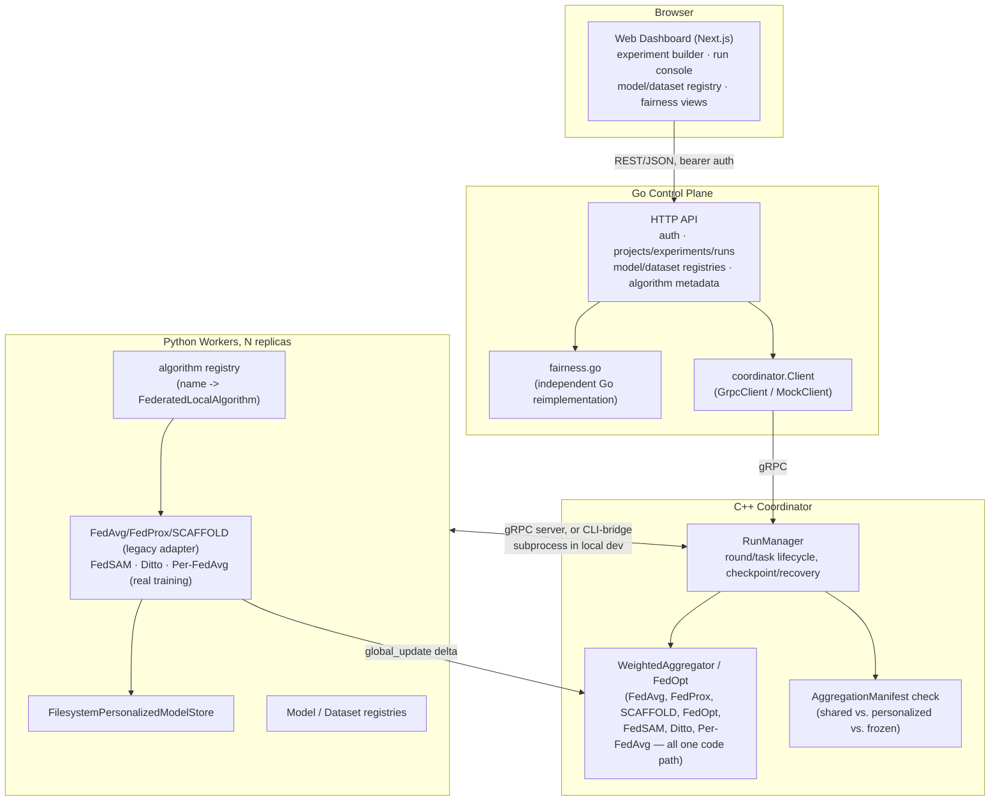
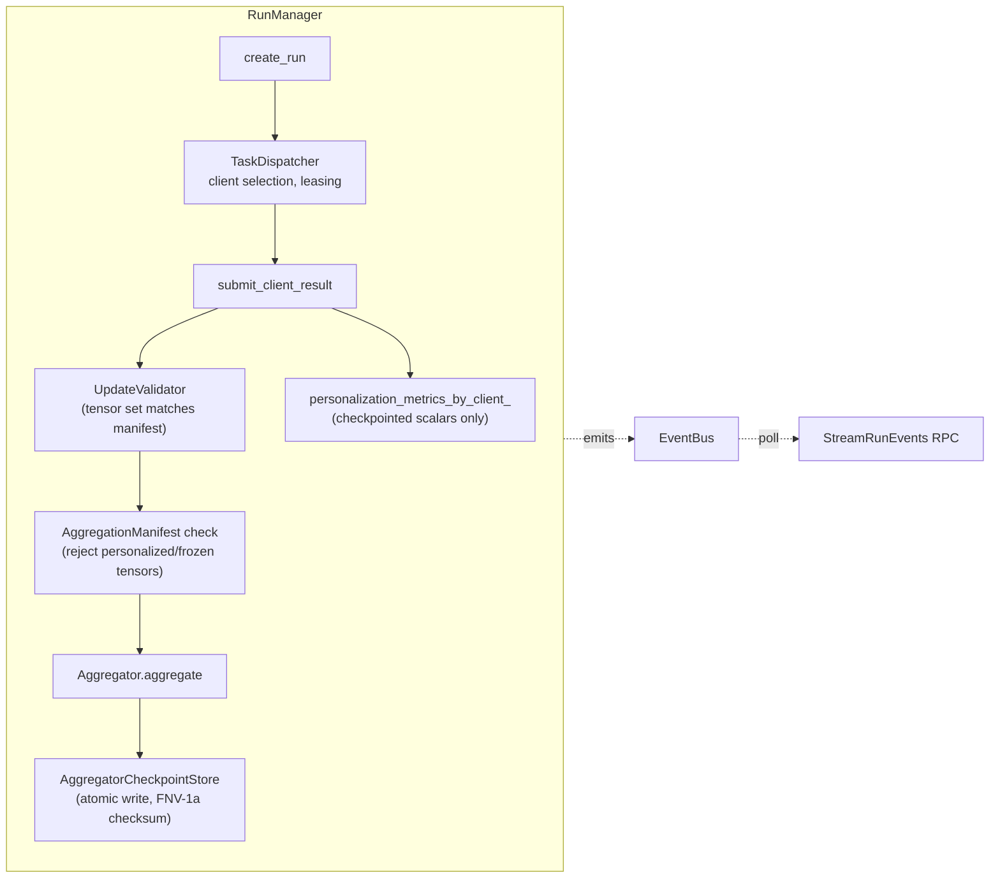
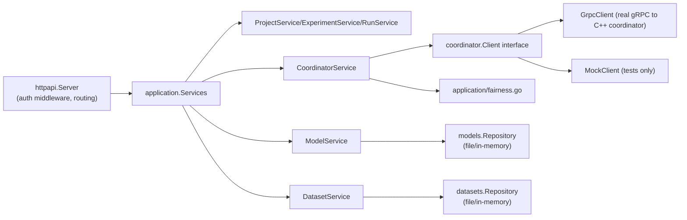
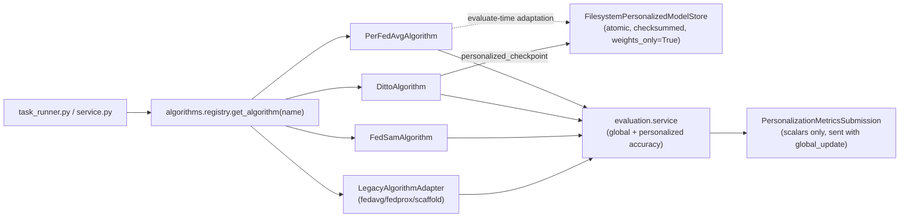
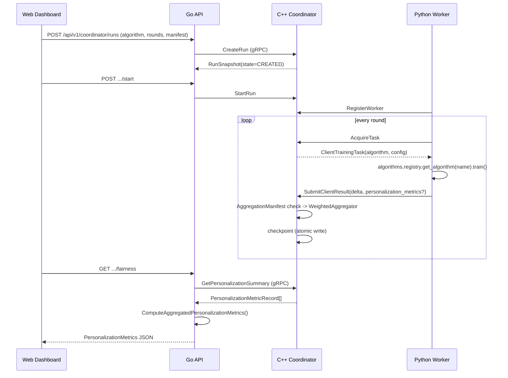
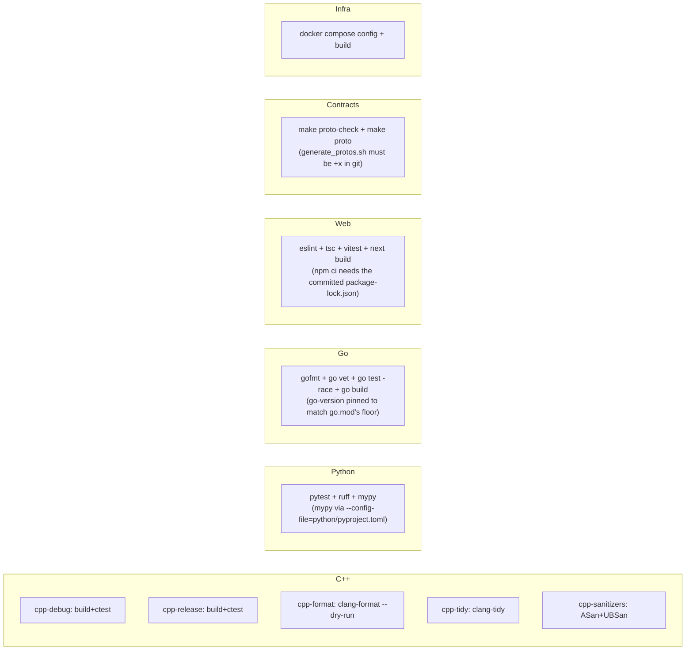
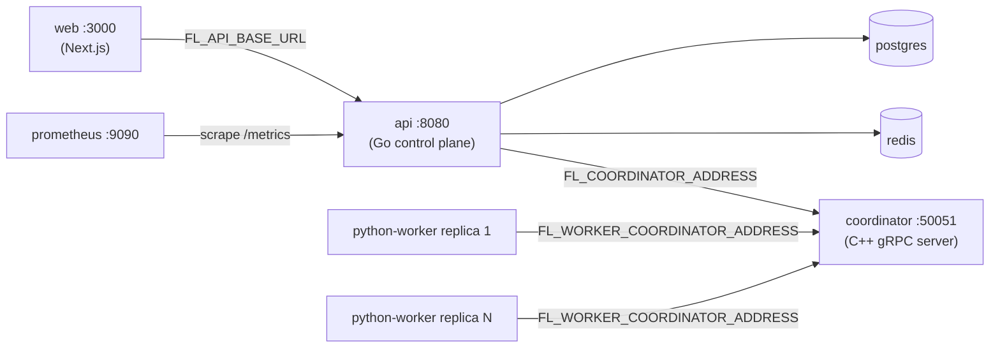

# Federated Learning Super System

This repository now begins a staged migration from a single-process Python research prototype into a production-oriented federated learning platform.

## Current Status

Root-level Python prototype remains available for compatibility; a
legacy-preserved copy exists at `legacy/python-research-studio/`.

### Release-Gate Hardening

Go control plane (project/experiment/run bookkeeping, auth, audit log),
a web dashboard, Docker/Kubernetes scaffolding, baseline deterministic
tests.

### C++ Aggregation Core

FedAvg/FedProx/FedOpt/SCAFFOLD aggregation math, checkpoint store,
cross-language golden parity tests.

### Coordinator Runtime

A real C++ coordinator (gRPC server + local-dev CLI bridge) driving
run/round/task lifecycle, checkpoint/crash recovery, per-client SCAFFOLD
state persistence, real-time event streaming; a PyTorch worker;
Go↔coordinator gRPC integration; Docker Compose services for both;
cross-language integration tests. See
[docs/coordinator-runtime-report.md](docs/coordinator-runtime-report.md)
for the full writeup and
[docs/known-limitations.md](docs/known-limitations.md) for what's still
deferred.

### Personalization & Algorithm Expansion

Real FedSAM/Ditto/Per-FedAvg local training, a shared-backbone/
personalized-head model architecture, a persistent per-client
personalized model store, filesystem-backed model and dataset
registries (Python and Go), personalized evaluation and fairness/
worst-client metrics (independent Python and Go implementations), new Go
APIs and web dashboard views for all of the above. See
[docs/algorithm-expansion-report.md](docs/algorithm-expansion-report.md)
for the full writeup,
[docs/algorithm-expansion-architecture.md](docs/algorithm-expansion-architecture.md)
for the design, and
[docs/known-limitations.md](docs/known-limitations.md) for what's still
deferred.

### Privacy Engineering

Three independent, real differential-privacy mechanisms — sample-level
DP (Opacus, in the Python worker), user-level DP (central clip+noise, in
the C++ coordinator), and adaptive clipping (a privatized quantile
controller) — plus hybrid mode (the first two, composed), a strict
per-mechanism epsilon-separation rule enforced throughout the stack,
worker capability advertisement with compatible-worker-only task
assignment, per-mechanism privacy budget policies, a three-ledger
audit trail, Prometheus metrics (Python/Go; see
[docs/known-limitations.md](docs/known-limitations.md) for the C++
scoping decision), a web Privacy Center UI, and a dedicated
security/trust-boundary audit. Live-validated through Docker Compose
(sample-level and user-level DP; see
[docs/docker-runtime.md](docs/docker-runtime.md)). See
[docs/privacy-engineering-report.md](docs/privacy-engineering-report.md)
for the full writeup,
[docs/privacy-mathematics.md](docs/privacy-mathematics.md) for the
Critical Privacy Rule and accounting math, and
[docs/known-limitations.md](docs/known-limitations.md) for what's still
deferred.

### Secure Aggregation and Cryptographic Protocols (in progress)

The full secure-aggregation protocol (pairwise masking, secret sharing,
dropout recovery) is not implemented — see
[docs/secure-aggregation-threat-model.md](docs/secure-aggregation-threat-model.md)
and [docs/known-limitations.md](docs/known-limitations.md) for the
explicit, real blocker (no adequately vetted threshold secret-sharing
library selected). What is implemented, live-Docker-validated, and
tested so far: mutual TLS for Go/Python/C++-to-coordinator gRPC; a
development PKI toolchain (`scripts/pki/`); Ed25519 worker signing
identities with signed capability statements, signed heartbeats, and
signed client results (real per-tensor SHA-256 checksums, a canonical
cross-language-proven payload hash, and persistent replay/sequence
protection); worker lifecycle administration (suspend/activate/revoke
RPCs with cross-run active-lease cancellation); independently signed
sample-level privacy records with accountant-step/epsilon monotonicity
and budget-decision-consistency enforcement; a full signing-key
lifecycle (a persistent, multi-key-per-worker registry, signed
rotation, grace periods with real elapsed-time expiry, immediate
revocation with automatic worker suspension, and legacy migration from
the earlier single-key model); a cryptographically secure random
provider wired into the live coordinator noise path; and now signed
coordinator tasks (a persistent coordinator Ed25519 signing identity
separate from its TLS credential, a `SignedCoordinatorTask` contract
covering five configuration hashes plus a task payload hash, full
Python-side verification with 16 structured rejection reasons, a
worker-side replay store, and an accepted-task journal with real crash
recovery and duplicate-execution rejection — live-validated end to end
including a real lease-expiry reissue and a real coordinator-process
restart simulation); and now a live, admin-authenticated coordinator
signing-key rotation and revocation flow (idempotent gRPC RPCs, a
grace-period-aware trusted-key bundle with schema/version/checksum
fields and a worker-side reload path that rejects rollbacks and
corruption, and a standalone recovery CLI for lost/corrupted/expired/
revoked coordinator keys) — live-validated end to end including a real
key rotation, a real elapsed-time grace-period expiry, a real
revocation that stops task issuance, and independent cross-language
checksum verification of every bundle version written. See
[docs/mtls.md](docs/mtls.md),
[docs/development-pki.md](docs/development-pki.md),
[docs/signed-client-results.md](docs/signed-client-results.md),
[docs/signed-privacy-records.md](docs/signed-privacy-records.md),
[docs/signing-key-management.md](docs/signing-key-management.md),
[docs/signed-coordinator-tasks.md](docs/signed-coordinator-tasks.md),
[docs/coordinator-signing-key-rotation.md](docs/coordinator-signing-key-rotation.md),
[docs/coordinator-signing-key-revocation.md](docs/coordinator-signing-key-revocation.md),
[docs/trusted-coordinator-key-bundle.md](docs/trusted-coordinator-key-bundle.md),
[docs/coordinator-key-recovery.md](docs/coordinator-key-recovery.md),
[docs/security-administration-report.md](docs/security-administration-report.md),
and
[docs/message-authenticity-report.md](docs/message-authenticity-report.md)
for that slice's full, itemized status. The following slice added a
real Go control-plane security surface: a typed Go `SecurityClient`
(mTLS, per-RPC error mapping), a `security.*` permission model
(ADMIN/RESEARCHER/VIEWER/SERVICE, with SERVICE deliberately granted
nothing by default), 13 HTTP endpoints under `/api/v1/security/...`
with role-aware response redaction and `Idempotency-Key`-based
mutation safety, real audit logging into the existing Go audit
repository, and — for the first time in this project — a Docker
Compose override that mounts real dev-PKI certificates and runs actual
mTLS between the Go API and C++ coordinator containers. Live-validated
over 80 checks combined across both slices, including a real
Ed25519-signed worker registration exercised entirely through the new
HTTP surface. See [docs/security-api.md](docs/security-api.md),
[docs/security-permission-model.md](docs/security-permission-model.md),
[docs/security-capability-inventory.md](docs/security-capability-inventory.md),
and [docs/security-operations-report.md](docs/security-operations-report.md)
for the full, itemized status — including what remains deferred (the
Web Security Center, a formal security-event schema, Prometheus
metrics for this surface, a durable security-specific audit journal,
and security-focused CI gates).

## System Architecture

Four languages, one federated learning platform, each with a narrow,
explicit responsibility — no language ever does another's job (the C++
coordinator never touches PyTorch; Go never aggregates a tensor; the web
dashboard never talks to the coordinator directly).



### Component responsibilities

| Layer | Owns | Never does |
|---|---|---|
| **C++ coordinator** | Run/round/task lifecycle, checkpoint & crash recovery, tensor aggregation math, `AggregationManifest` enforcement, event bus | PyTorch, training, any ML-specific decision |
| **Python workers** | All model training (FedAvg…Per-FedAvg), personalization, evaluation, dataset partitioning math | Aggregating another client's tensors, coordinator state |
| **Go control plane** | HTTP API, auth/RBAC/audit, project/experiment/run bookkeeping, model/dataset registry metadata, fairness *projections* of coordinator data | Training, tensor aggregation, touching raw dataset samples |
| **Web dashboard** | Operator UI, calls the Go API only | Talking to the coordinator or a worker directly |

### C++ coordinator internals



### Go control plane internals



### Python worker internals



## Algorithms & Math

Every formula below is implemented and unit-tested; see the linked doc
for the exact source file and test.

### Aggregation (C++ core — `cpp/core/src/aggregation.cpp`)

| Algorithm | Update rule |
|---|---|
| FedAvg (uniform) | $w_{t+1} = w_t + \frac{1}{K}\sum_{k=1}^{K} \Delta_k$ |
| FedAvg (sample-weighted) | $w_{t+1} = w_t + \frac{\sum_k n_k \Delta_k}{\sum_k n_k}$ |
| FedProx | Same aggregation as FedAvg; the proximal term $\frac{\mu}{2}\lVert \theta - w_t \rVert^2$ is applied client-side during local training only |
| FedAdagrad/FedAdam/FedYogi | $w_{t+1} = w_t + \eta \dfrac{\Delta_t}{\sqrt{v_t} + \tau}$, with $v_t$ updated per each FedOpt variant's moment rule — see [docs/fedopt.md](docs/fedopt.md) |
| SCAFFOLD | FedAvg aggregation of $\Delta_k$ plus a per-client control-variate correction $c_i^+ - c_i$ — see [docs/scaffold-state.md](docs/scaffold-state.md) |
| FedSAM / Ditto / Per-FedAvg | Same `WeightedAggregator` as FedAvg — see [docs/aggregation-manifests.md](docs/aggregation-manifests.md) for why zero new aggregation math was needed |

### FedSAM perturbation (`python/src/fl_platform/algorithms/fedsam.py`)

$$w_{adv} = w + \rho \cdot \frac{g}{\lVert g \rVert_2 + \epsilon} \quad\text{(adaptive SAM: additionally scaled by } |w| \text{ per-element)}$$

Two forward/backward passes per batch: gradient computed at $w$, perturbation applied, second gradient computed at $w_{adv}$, weights restored, optimizer steps using the **second** pass's gradient. See [docs/fedsam.md](docs/fedsam.md).

### Ditto personalized objective (`algorithms/ditto.py`)

$$\mathcal{L}_{personalized} = \mathcal{L}_{task}(\theta) + \frac{\lambda}{2} \lVert \theta - w_{global\_reference} \rVert_2^2$$

Two full models trained per round: a plain global-training model (its delta is aggregated) and this regularized personalized model (never aggregated, persisted locally). See [docs/ditto.md](docs/ditto.md).

### Per-FedAvg first-order meta-gradient (`algorithms/per_fedavg.py`)

1. Support/query split (seeded, deterministic).
2. Inner adaptation on a **copy**: $\theta' = \theta - \alpha \nabla \mathcal{L}_{support}(\theta)$, repeated `inner_steps` times.
3. Meta-gradient computed directly on the adapted copy, evaluated on the query set: $g_{meta} = \nabla_{\theta'} \mathcal{L}_{query}(\theta')$ — **not** differentiated back through step 2 (that would be true second-order MAML).
4. Applied to the **original** weights: $\theta \leftarrow \theta - \beta \cdot g_{meta}$.

See [docs/per-fedavg.md](docs/per-fedavg.md).

### Fairness / personalization metrics (independent Python + Go implementations)

| Metric | Formula |
|---|---|
| Fairness gap | $\max_i(acc_i) - \min_i(acc_i)$ |
| Mean improvement over global | $\frac{1}{n}\sum_i (acc_i^{personalized} - acc^{global})$ |
| Percentile ($p10/p25/p75/p90$) | Linear interpolation: $pos=(n-1)q,\ result = sorted[\lfloor pos \rfloor](1-f) + sorted[\lceil pos \rceil]f$ |
| Coefficient of variation | $\sigma / \mu$ (undefined/`null` if $\mu = 0$) |
| Jain's fairness index | $\dfrac{\left(\sum_i x_i\right)^2}{n\sum_i x_i^2}$, range $(0, 1]$ |

See [docs/fairness-metrics.md](docs/fairness-metrics.md) for exclusion-handling rules (missing personalized model, zero-sample clients, non-finite values) and the worked examples both languages are tested against.

### Differential privacy

Three independent DP mechanisms are implemented across the platform,
each protecting a different neighboring relation — their epsilon values
are never combined (the Critical Privacy Rule; see
[docs/privacy-mathematics.md](docs/privacy-mathematics.md)):

| Mechanism | Protects | Computed by |
|---|---|---|
| Sample-level DP | One training example within a client's local dataset | Python worker, via Opacus — see `fl_platform/privacy/accounting.py` and `fl_platform/worker/service.py` |
| User-level DP | One client's complete round contribution | C++ coordinator, centrally (clip → aggregate → noise) — see [docs/user-level-dp.md](docs/user-level-dp.md) |
| Adaptive clipping | The clip-bound statistic (a privatized over-threshold count) | C++ coordinator, centrally — see [docs/adaptive-clipping.md](docs/adaptive-clipping.md) |

`PrivacyMode::kHybridDp` runs sample-level and user-level DP
simultaneously on the same run without ever combining their epsilon
values — see [docs/hybrid-dp.md](docs/hybrid-dp.md). RDP accounting
(Mironov 2017/2019, subsampled-Gaussian mechanism) is golden-parity
tested against Opacus's own accountant to float precision.

The **root-level legacy prototype** (`federated/`, predating the phases
below) separately implements its own client-level DP (per-batch gradient
clipping, post-training update clipping, Gaussian noise, a subsampled-
Gaussian RDP accountant) — this is a distinct, older implementation, not
part of the C++/Go/Python platform described above, and not to be
confused with user-level DP's central clip+noise despite superficial
similarity. See [docs/privacy-audit.md](docs/privacy-audit.md) for the
legacy prototype's own audit.

## Workflows

### End-to-end federated round (cross-language)



### CI pipeline (`.github/workflows/ci.yml`)



### Docker Compose deployment



See [docs/docker-runtime.md](docs/docker-runtime.md) for the full validation log, including a real end-to-end run of every Algorithm Expansion phase API endpoint against this exact stack.

## Legacy Compatibility

The legacy prototype still runs from the repository root:

```bash
python main.py
python main.py --cli
python main.py --cli --dataset MNIST --rounds 1 --algo fedavg --dp off
```

The preserved copy is also available under:

```text
legacy/python-research-studio/
```

## Repository Layout

```text
cpp/
python/
go/
web/
proto/
infra/
docs/
legacy/
scripts/
tests/
```

## Key Docs

### Release-Gate Hardening

`docs/current-system-audit.md`, `docs/current-architecture.md`, `docs/privacy-audit.md`, `docs/migration-strategy.md`, `docs/risk-register.md`, `docs/deployment-foundation.md`

### C++ Aggregation Core

`docs/aggregation-core-architecture.md`, `docs/scaffold-state.md`, `docs/fedopt.md`, `docs/checkpoint-format.md`, `docs/aggregation-core-report.md`

### Coordinator Runtime

`docs/coordinator-runtime-architecture.md`, `docs/coordinator-runtime.md`, `docs/python-worker.md`, `docs/go-coordinator-integration.md`, `docs/grpc-contracts.md`, `docs/task-leasing.md`, `docs/worker-lifecycle.md`, `docs/scaffold-client-state.md`, `docs/coordinator-recovery.md`, `docs/event-streaming.md`, `docs/docker-runtime.md`, `docs/coordinator-runtime-validation.md`, `docs/coordinator-runtime-report.md`

### Personalization & Algorithm Expansion

`docs/algorithm-expansion-architecture.md`, `docs/fedsam.md`, `docs/ditto.md`, `docs/per-fedavg.md`, `docs/shared-backbone-local-head.md`, `docs/personalization-models.md`, `docs/personalized-model-store.md`, `docs/model-registry.md`, `docs/dataset-registry.md`, `docs/personalized-evaluation.md`, `docs/fairness-metrics.md`, `docs/aggregation-manifests.md`, `docs/algorithm-expansion-security-audit.md`, `docs/algorithm-expansion-validation.md`, `docs/algorithm-expansion-report.md`

### Privacy Engineering

`docs/privacy-mathematics.md`, `docs/user-level-dp.md`, `docs/adaptive-clipping.md`, `docs/hybrid-dp.md`, `docs/privacy-ledger.md`, `docs/privacy-compatibility-matrix.md`, `docs/worker-privacy-capabilities.md`, `docs/privacy-budget-policies.md`, `docs/privacy-engineering-security-audit.md`, `docs/privacy-engineering-report.md`

### Secure Aggregation and Cryptographic Protocols

`docs/secure-aggregation-architecture.md`, `docs/secure-aggregation-threat-model.md`, `docs/cryptographic-primitives.md`, `docs/secure-aggregation-report.md`, `docs/mtls.md`, `docs/development-pki.md`, `docs/worker-identity.md`, `docs/signed-capabilities.md`, `docs/canonical-security-serialization.md`, `docs/secure-random-runtime.md`, `docs/key-management.md`, `docs/signed-worker-envelopes.md`, `docs/replay-protection.md`, `docs/transport-identity-report.md`, `docs/signed-client-results.md`, `docs/worker-suspension.md`, `docs/worker-activation.md`, `docs/worker-revocation.md`, `docs/certificate-revocation.md`, `docs/signed-privacy-records.md`, `docs/privacy-accountant-monotonicity.md`, `docs/signing-key-management.md`, `docs/signing-key-migration.md`, `docs/key-rotation.md`, `docs/signing-key-grace-period.md`, `docs/signing-key-revocation.md`, `docs/signed-coordinator-tasks.md`, `docs/coordinator-signing-identity.md`, `docs/coordinator-signing-key-management.md`, `docs/task-configuration-hashes.md`, `docs/coordinator-task-replay-protection.md`, `docs/accepted-task-journal.md`, `docs/task-reissue-semantics.md`, `docs/coordinator-signing-key-rotation.md`, `docs/coordinator-signing-key-revocation.md`, `docs/trusted-coordinator-key-bundle.md`, `docs/coordinator-key-recovery.md`, `docs/security-administration-report.md`, `docs/security-capability-inventory.md`, `docs/security-api.md`, `docs/security-permission-model.md`, `docs/security-operations-report.md`, `docs/message-authenticity-report.md`

### Cross-Cutting

`docs/known-limitations.md` — consolidated across all phases

## Validation

```bash
# Python
python -m pytest -q
ruff check . && ruff format --check .
mypy --config-file=python/pyproject.toml python/src

# C++
cmake -S cpp -B build/cpp-debug -DCMAKE_BUILD_TYPE=Debug
cmake --build build/cpp-debug --config Debug
ctest --test-dir build/cpp-debug -C Debug --output-on-failure

# Go
cd go && gofmt -l . && go vet ./... && go build ./... && go test ./...

# Web
cd web && npm run typecheck && npm run lint && npm run test && npm run build

# Protobuf contracts (no protoc required)
python scripts/verify_proto_contracts.py
```

See [docs/coordinator-runtime-validation.md](docs/coordinator-runtime-validation.md) for
the full command-by-command results, including what's CI-only (`go test
-race`, C++ AddressSanitizer/ThreadSanitizer — no cgo/Clang locally).

## Deployment / Docker Compose

```bash
docker compose config
docker compose build            # coordinator, api, web, python-worker, mlflow
docker compose up -d
docker compose ps
docker compose down -v
```

`coordinator` (the real C++ gRPC server) and `python-worker` (the
PyTorch worker) were added in the Coordinator Runtime phase — see
[docs/docker-runtime.md](docs/docker-runtime.md). See
`docs/deployment-foundation.md` for the original Foundation-phase scope
and Kubernetes baseline.
