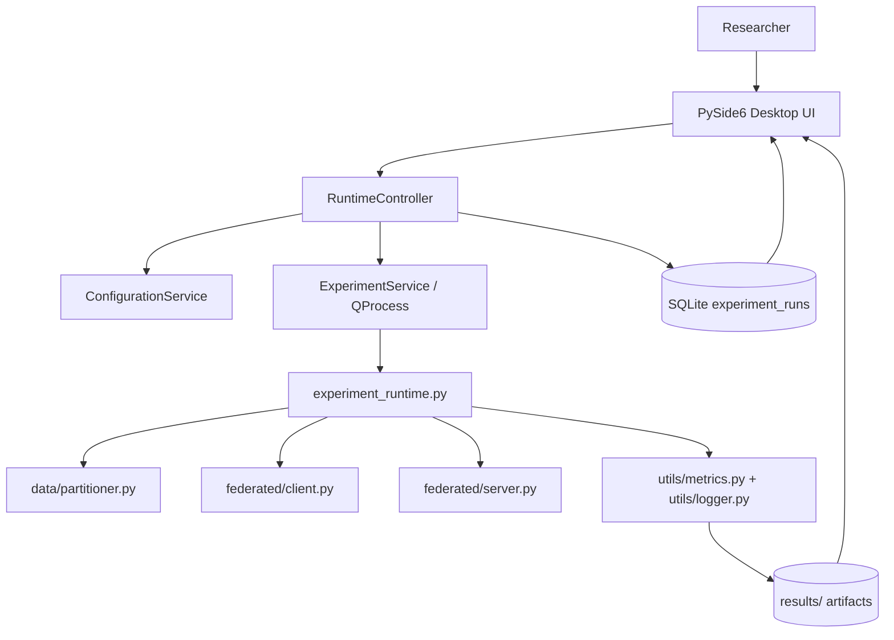
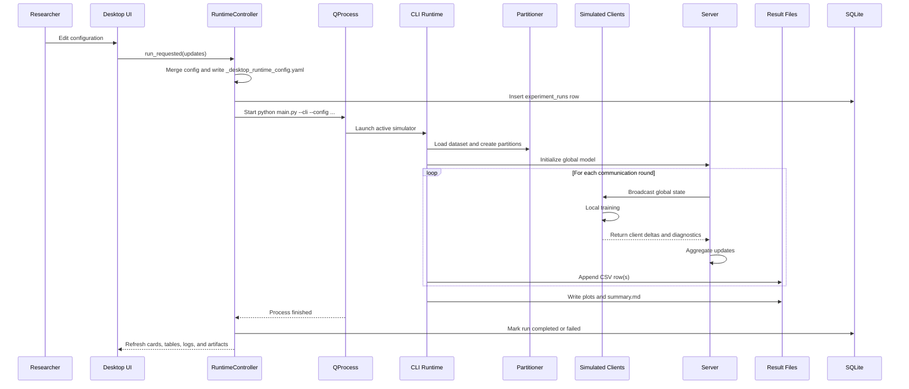
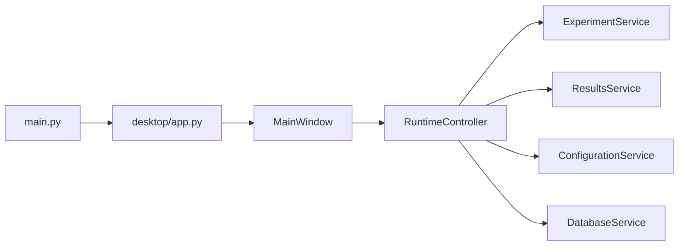
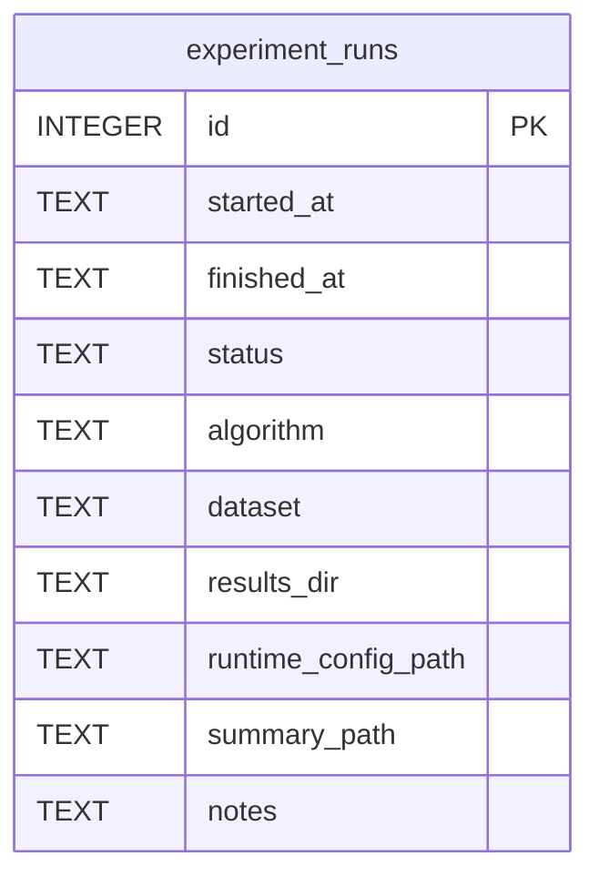

# Federated Learning on Non-IID Data with Differential Privacy

Desktop-first federated learning studio for studying non-IID optimization, client drift, and central differential privacy under a trusted-server simulation.

This repository studies federated optimization under heterogeneous client data distributions, emphasizing the interaction between non-IID partitioning, local optimization, server-side aggregation, and privacy mechanisms. The active root workflow is a desktop-first research application launched through `python main.py`, where a PySide6 dashboard manages experiments, writes runtime configuration snapshots, launches the federated simulator as a local child process, and visualizes metrics from real output artifacts. The active simulator implements GroupNorm-based image classification on MNIST and CIFAR-10, Dirichlet and pathological non-IID partitioning, local client training, FedAvg, FedProx, SCAFFOLD, validated uniform or sample-count aggregation, client-level update clipping with Gaussian noise, RDP-based privacy accounting, and artifact generation for reproducibility. The repository also contains additional subsystem implementations for FedSAM, Ditto, Per-FedAvg, C++ FedOpt variants, sample-level Opacus accounting, adaptive clipping, and secure aggregation primitives, but those components are not all exercised by the current root desktop runtime. The platform is research-oriented, not production-certified.

> **Scope note:** Unless explicitly marked as auxiliary, all runtime claims in this document refer to the active root desktop and CLI workflow launched through `python main.py`.

## Contents

- [Overview](#overview)
- [Research Objectives and Questions](#objectives)
- [Mathematical Formulation](#mathematical-notation)
- [Federated Algorithms and Aggregation](#runtime-mathematics)
- [Differential Privacy and Accounting](#differential-privacy-in-the-root-runtime)
- [Metrics and Data Partitioning](#evaluation-metrics)
- [System and Desktop Architecture](#system-architecture)
- [Configuration and Execution](#configuration-reference)
- [Validation and Reproducibility](#validation-and-reproducibility)
- [Limitations and Future Work](#known-limitations)
- [Traceability](#function-and-equation-traceability)
- [Citation and License](#citation)

## Overview

Centralized machine learning is often unsuitable when raw data cannot leave local devices or institutional boundaries, when medical or financial records are legally constrained, when clients differ substantially in label distributions and sample counts, and when communication or compute resources are unevenly distributed. Federated learning addresses data locality, but under non-IID conditions it introduces slower convergence, client drift, unstable aggregation, and sensitivity to optimizer choice. Privacy mechanisms improve disclosure resistance, but clipping and Gaussian perturbation impose a measurable privacy-utility trade-off. This repository is organized around those tensions rather than around a generic software deployment story.

The active root workflow is launched with `python main.py`. It opens a PySide6 desktop application or runs the simulator directly in CLI mode, depending on flags. The root runtime covers:

- MNIST and CIFAR-10 classification.
- Dirichlet and pathological non-IID partitioning.
- FedAvg, FedProx, and SCAFFOLD in the active simulator.
- Poisson or fixed-without-replacement client sampling.
- Central client-level differential privacy for the trusted-server path.
- CSV, plots, distribution artifacts, and Markdown summaries.

## Objectives

- Study convergence under label-skewed and shard-based non-IID partitions.
- Compare FedAvg, FedProx, and SCAFFOLD in the active desktop runtime.
- Measure client disagreement through drift and weight-variance diagnostics.
- Quantify the effect of client-level clipping and Gaussian noise on performance.
- Preserve configuration snapshots and generated artifacts for reproducibility.
- Expose the implementation-to-equation boundary clearly enough for review and extension.

## Research Questions

- How does stronger non-IID heterogeneity alter convergence and final accuracy?
- When does FedProx reduce instability relative to FedAvg?
- How does SCAFFOLD's control-variate correction change drift behavior?
- What utility cost is induced by client-level update clipping and Gaussian noise?
- Which metrics in the current codebase are global-only versus client-heterogeneity diagnostics?
- Which algorithms and privacy mechanisms are active in the root desktop workflow, and which exist only in auxiliary subsystems?

## Repository Contributions

- A root federated simulator for MNIST/CIFAR-10 with real non-IID partitioning, real local optimization, and artifact generation.
- A modular PySide6 desktop shell that manages experiments locally through `QProcess`.
- Exact code paths for FedAvg, FedProx, and SCAFFOLD with validated aggregation-weighting constraints.
- A client-level RDP moments accountant implemented in [federated/dp_accountant.py](federated/dp_accountant.py).
- Auxiliary implementations for FedSAM, Ditto, Per-FedAvg, Opacus-backed sample-level DP, adaptive clipping, fairness metrics, and secure aggregation primitives under `python/src/fl_platform/` and `cpp/`.

The repository also contains auxiliary Python, C++, and Go subsystems under [python/src/fl_platform](python/src/fl_platform), [cpp](cpp), and [go](go). Those subsystems are useful for broader experimentation, but they are not the default code path executed by the root desktop runtime.

## Entry Points

- Desktop or auto mode: `python main.py`
- Explicit CLI mode: `python main.py --cli --config config.yaml`
- Optional GUI flag: `python main.py --gui`

Core files:

- [main.py](main.py)
- [experiment_runtime.py](experiment_runtime.py)
- [federated/client.py](federated/client.py)
- [federated/server.py](federated/server.py)
- [federated/dp_accountant.py](federated/dp_accountant.py)
- [data/partitioner.py](data/partitioner.py)
- [utils/metrics.py](utils/metrics.py)
- [utils/logger.py](utils/logger.py)
- [desktop](desktop)

## Mathematical Notation

| Symbol | Meaning |
|---|---|
| $K$ | Total number of clients |
| $S_t$ | Selected cohort at communication round $t$ |
| $m$ | Selected client count in one round |
| $n_k$ | Local sample count at client $k$ |
| $N$ | Total sample count, $\sum_k n_k$ |
| $w_t$ | Global model at round $t$ |
| $w_{t,e}^{k}$ | Client $k$'s parameters after local step or epoch $e$ at round $t$ |
| $F_k(w)$ | Local objective at client $k$ |
| $F(w)$ | Weighted global objective |
| $\eta$ | Client learning rate |
| $\eta_s$ | Server update scaling factor |
| $\mu$ | FedProx proximal coefficient |
| $C$ | Client-update clipping norm used by the root differential privacy mechanism |
| $\sigma$ | Gaussian noise multiplier |
| $\epsilon$ | Privacy loss parameter |
| $\delta$ | Privacy failure probability |
| $q$ | Configured sample rate |
| $E$ | Number of local epochs |
| $T$ | Number of communication rounds |
| $c$ | SCAFFOLD global control variate |
| $c_k$ | SCAFFOLD client control variate |
| $\Delta_k$ | Client model delta, $w_{t,E}^{k} - w_t$ |
| $m_t$ | FedOpt first-moment state in the C++ core |
| $v_t$ | FedOpt second-moment state in the C++ core |
| $\rho$ | FedSAM perturbation radius |
| $\lambda$ | Ditto personalized regularization coefficient |

## Problem Formulation

Assume $K$ federated clients. Client $k$ owns dataset

$$
\mathcal{D}_k = \{(x_i, y_i)\}_{i=1}^{n_k}.
$$

The total sample count is

$$
N = \sum_{k=1}^{K} n_k.
$$

The client-local empirical risk is

$$
F_k(w) = \frac{1}{n_k}\sum_{(x_i, y_i)\in \mathcal{D}_k}\ell(w; x_i, y_i).
$$

The global objective is

$$
F(w) = \sum_{k=1}^{K} p_k F_k(w),
\qquad
p_k = \frac{n_k}{N}.
$$

Where:

- $w$ is the global model parameter vector.
- $F_k$ is client-local empirical risk.
- $F$ is the weighted federated objective.
- $n_k$ is the number of samples on client $k$.
- $N$ is the total number of samples.
- $p_k$ is the sample-proportional aggregation weight.
- $\ell$ is the classification loss, implemented as cross-entropy in the root simulator.

## Runtime Mathematics

At communication round $t$, the server holds $w_t$. For each selected client $k \in S_t$:

$$
w_{t,0}^{k} = w_t.
$$

Local optimization follows

$$
w_{t,e+1}^{k} = w_{t,e}^{k} - \eta \nabla \ell(w_{t,e}^{k}; B_e).
$$

After local training, the transmitted client update is

$$
\Delta_k = w_{t,E}^{k} - w_t.
$$

FedProx adds the local proximal penalty

$$
\ell_{\text{prox}} = \ell + \frac{\mu}{2}\lVert w - w_t \rVert_2^2.
$$

SCAFFOLD keeps global and local control variates $c$ and $c_k$, and updates the client control state using the executed local step count $\tau_k$:

$$
c_k^{+} = c_k - c - \frac{\Delta_k}{\tau_k \eta}.
$$

The root implementation uses `tau_k = local_steps` from the actual client loop.

## Aggregation Semantics in the Root Runtime

The active runtime supports two aggregation weightings, with validation rules enforced in [experiment_runtime.py](experiment_runtime.py).

### Uniform weighting

For `federated.aggregation_weighting: uniform`, the aggregate update is

$$
\bar{\Delta}_t = \frac{1}{|S_t|}\sum_{k \in S_t}\Delta_k.
$$

This is the only weighting allowed when root differential privacy is enabled, and it is also the only weighting allowed for SCAFFOLD.

### Sample-count weighting

For `federated.aggregation_weighting: sample_count`, the aggregate update is

$$
\bar{\Delta}_t = \sum_{k \in S_t}\frac{n_k}{\sum_{j \in S_t} n_j}\Delta_k.
$$

This weighting is available for FedAvg and FedProx when differential privacy is disabled.

### Server update

The server applies

$$
w_{t+1} = w_t + \eta_s \bar{\Delta}_t.
$$

In code, that update is performed by `Server.aggregate()` and `Server._apply_delta()` in [federated/server.py](federated/server.py).

## Differential Privacy in the Root Runtime

The root runtime implements central client-level DP under a trusted-server assumption. The privacy mechanism is:

1. Each selected client computes its raw model delta.
2. The client delta is clipped to norm $C$ (configured by `dp.update_clip_norm`) when DP is enabled.
3. The server sums the clipped deltas.
4. The server adds one Gaussian noise draw to that aggregate sum.
5. The server divides by the cohort size to form the released average update.

With uniform weighting, the privatized sum is

$$
\widetilde{\Delta}_t=\sum_{k\in S_t}\mathrm{clip}\left(\Delta_k,C\right)+\mathcal{N}\left(0,\sigma^2C^2I\right),
$$

and the released update is

$$
\bar{\Delta}_t = \frac{1}{|S_t|}\widetilde{\Delta}_t.
$$

Important scope notes:

- This is not local DP. Noise is not added independently on each client in the root runtime.
- This is not secure aggregation in the active root code path.
- `optimizer.grad_clip_norm` and `dp.update_clip_norm` are separate controls.
- `optimizer.grad_clip_norm` clips optimization gradients before the optimizer step.
- `dp.update_clip_norm` clips the final transmitted client update before server aggregation.

## Privacy Accounting

The root runtime uses the RDP moments accountant in [federated/dp_accountant.py](federated/dp_accountant.py). For sampling rate $q$, noise multiplier $\sigma$, and target $\delta$, the reported privacy value is obtained by composing per-round RDP and converting back to $(\epsilon, \delta)$.

At the documentation level, the conversion is

$$
\epsilon(\delta) = \min_{\alpha > 1}\left(\epsilon_{\mathrm{RDP}}(\alpha) + \frac{\log(1/\delta)}{\alpha - 1}\right).
$$

Across multiple rounds, the RDP curves add. When `algorithm: all` is used, the root summary composes the final RDP curves from each released run and reports a combined epsilon for all released outputs.

Current validation rules:

- DP requires `federated.sampling_strategy: poisson`.
- DP requires `federated.aggregation_weighting: uniform`.
- SCAFFOLD requires `federated.aggregation_weighting: uniform`.
- Deterministic noise mode is test-only and requires `dp.test_noise_seed`.

## Secure Aggregation Mathematics

Secure aggregation is **not part of the active root desktop runtime**. The repository does contain experimental secure aggregation primitives in `python/src/fl_platform/secure_aggregation/` and related C++ components.

The inspected pairwise-masking rule in `python/src/fl_platform/secure_aggregation/pairwise_mask.py` is ring-based additive masking:

$$\widetilde{x}_k=x_k+\sum_{j>k}r_{k,j}-\sum_{j<k}r_{j,k}\pmod{2^{64}}.$$

Summing across a complete cohort yields cancellation of pairwise masks:

$$\sum_k\widetilde{x}_k=\sum_kx_k\pmod{2^{64}}.$$

What can be stated truthfully from the inspected code:

- Pairwise masking exists.
- Fixed-point encoding and masking of weighted deltas exist.
- The active desktop runtime does not use this path.
- The inspected Python secure aggregation path is experimental and no-dropout-oriented.
- The current README does not claim production-complete dropout recovery or a production-complete adversarial threat model for this path.

## Personalization Mathematics

Personalization is **not part of the active root desktop runtime**, but auxiliary algorithms and fairness metrics exist in `python/src/fl_platform/`.

### Ditto

The personalized objective implemented in `python/src/fl_platform/algorithms/ditto.py` is

$$
\min_{v_k}
F_k(v_k)
+
\frac{\lambda}{2}
\left\|v_k-w\right\|_2^2.
$$

The global-training model still submits a FedAvg-shaped delta; the personalized model remains local.

### Per-FedAvg

The first-order Per-FedAvg implementation in `python/src/fl_platform/algorithms/per_fedavg.py` performs support-set adaptation followed by query-loss meta-updates:

$$
w'
=
w
-
\alpha
\nabla F_k^{\mathrm{support}}(w),
\qquad
w
\leftarrow
w
-
\beta
\nabla F_k^{\mathrm{query}}(w').
$$

It explicitly uses the first-order approximation and does not differentiate through the inner loop.

## Evaluation Metrics

### Global Test Accuracy

$$
\mathrm{Acc}
=
\frac{1}{N_{\mathrm{test}}}
\sum_{i=1}^{N_{\mathrm{test}}}
\mathbf{1}
\left[
\hat{y}_i=y_i
\right].
$$

### Global Test Loss

The implementation uses summed cross-entropy accumulated over the test set and divided by the total number of samples in `evaluate_global`.

## Sampling Semantics

The runtime supports:

- `poisson`: each client is independently included with probability $q$.
- `fixed_without_replacement`: a rounded cohort size is sampled without replacement.

When DP is enabled, only Poisson sampling is accepted by config validation.

## Metrics Logged by the Root Runtime

Per-round CSV output includes:

- `test_acc`
- `test_loss`
- `epsilon`
- `weight_variance`
- `raw_client_drift`
- `clipped_client_drift`
- `mean_unclipped_update_norm`
- `mean_clipping_factor`
- `fraction_clients_clipped`
- `aggregate_noise_norm`
- `avg_client_loss`
- `cohort_size`
- `participation_rate`

Interpretation:

- `raw_client_drift` measures disagreement before DP clipping.
- `clipped_client_drift` measures disagreement after DP clipping.
- `aggregate_noise_norm` is the norm of the single Gaussian noise draw added at server level.

## Non-IID Data Partitioning

The active root simulator provides:

- Dirichlet label skew through `partition_dirichlet`.
- Pathological shard-style partitioning through `partition_pathological`.

These are implemented in [data/partitioner.py](data/partitioner.py).

## Desktop Workflow

The desktop app under [desktop](desktop) writes validated configuration snapshots, launches the simulator as a subprocess, and renders experiment outputs from generated result artifacts. The root UI is intended to stay operational even when experiment settings change, so the configuration service normalizes and validates YAML before runtime launch.

## Auxiliary Components

The repository also contains:

- Additional privacy and orchestration code in [python/src/fl_platform](python/src/fl_platform)
- C++ aggregation and coordinator code in [cpp](cpp)
- Go service and transport code in [go](go)

Those components may expose extra algorithms or security primitives, but they should not be assumed to match the exact semantics of the root desktop runtime unless they are being invoked directly in their own execution path.

## Communication and Computational Complexity

If the model has $P$ scalar parameters and each scalar occupies $b$ bytes, one full model transmission costs approximately

$$
Pb.
$$

For $m$ participating clients across $T$ rounds, bidirectional communication is approximately

$$
C_{\text{total}} \approx 2TmPb,
$$

excluding metadata, encryption overhead, retransmission, and any protocol framing.

The root desktop simulator executes clients sequentially, so one round costs approximately

$$
O\left(
\sum_{k\in S_t}
E\frac{n_k}{B}C_{\text{model}}
\right),
$$

where $C_{\text{model}}$ is the cost of one forward/backward batch for the selected model.

## System Architecture



## Component Connectivity

| Source | Destination | Mechanism | Data |
|---|---|---|---|
| Desktop UI | `RuntimeController` | Qt signals and direct method calls | Edited configuration, start/stop actions |
| `RuntimeController` | `ConfigurationService` | Python method calls | YAML load/merge/write |
| `RuntimeController` | `ExperimentService` | Python method calls | Child-process launch request |
| `ExperimentService` | `main.py --cli` | `QProcess` | CLI command and runtime configuration path |
| CLI runtime | `data/partitioner.py` | Direct function calls | Dataset loading and partition indices |
| CLI runtime | `Client.train` | Direct function calls | Local model state and training configuration |
| CLI runtime | `Server.aggregate` | Direct function calls | Client deltas and aggregation state |
| CLI runtime | `CSVLogger` and plot helpers | Direct function calls | Round metrics and plot generation |
| `ResultsService` | Desktop UI | Filesystem polling every 2 seconds | Summary text, CSV-derived metrics, and artifact list |
| `DatabaseService` | SQLite | `sqlite3` | `experiment_runs` history |

## End-to-End Workflow



## Desktop Application Architecture

The desktop architecture is intentionally thin:

- [main.py](main.py): lazy-selects GUI or CLI.
- [desktop/app.py](desktop/app.py): builds paths, applies theme, creates `QApplication`, controller, and main window.
- [desktop/main_window.py](desktop/main_window.py): left navigation, `QStackedWidget`, periodic refresh.
- [desktop/controllers/runtime_controller.py](desktop/controllers/runtime_controller.py): orchestration across config, results, DB, and subprocess control.
- [desktop/services/experiment_service.py](desktop/services/experiment_service.py): `QProcess` wrapper.
- [desktop/services/results_service.py](desktop/services/results_service.py): filesystem-backed metric/artifact loading.
- [desktop/services/database_service.py](desktop/services/database_service.py): SQLite run-history persistence.



## Dynamic Metrics Pipeline

The desktop UI does not display static placeholder values. The current pipeline is file- and process-driven:

```text
CLI Runtime stdout / result files
    -> ExperimentService output_received
    -> RuntimeController
    -> ResultsService + DatabaseService
    -> Qt signals
    -> cards, tables, summary view, log panes, and charts
```

What exists:

- live merged stdout capture from the child process,
- 2-second refresh polling via `QTimer`,
- CSV-derived metric snapshots,
- artifact discovery from the results directory,
- SQLite-backed run history.

What does not exist in the active desktop path:

- JSON event schema,
- JSONL runtime journal,
- batched database writes for round metrics,
- PostgreSQL primary mode,
- automatic backend failover,
- explicit chart-throttling beyond the 2-second polling interval.

## Database Architecture

The current desktop app persists run history only in SQLite.

### Implemented database

- Path builder: `desktop/app.py`
- Schema: [desktop/database/schema.py](desktop/database/schema.py)
- Access layer: `DatabaseService`



## Experiment Lifecycle

The exact active desktop status model is the `ExperimentState.status` field plus UI labels:

- `Idle`
- `Running`
- `Stopping`
- `Completed`
- `Failed`

The requested richer lifecycle (`CREATED`, `VALIDATING`, `INITIALIZING`, `CHECKPOINTING`, and so on) is **not** implemented in the current desktop state model.

## Project Directory Structure

```text
main.py
experiment_runtime.py
config.yaml

desktop/
  app.py
  main_window.py
  controllers/
  services/
  pages/
  widgets/
  database/

data/
federated/
models/
utils/

python/src/fl_platform/     # auxiliary worker/privacy/personalization stack
cpp/                        # auxiliary C++ aggregation/coordinator stack
go/                         # auxiliary Go API/service stack
tests/
python/tests/
results/
docs/
```

## Configuration Reference

Defaults are read from [config.yaml](config.yaml).

| Configuration | Type | Default | Valid Range | Mathematical Role |
|---|---|---:|---|---|
| `system.seed` | int | `42` | \(>0\) in practice | Random initialization and partition seed |
| `system.device` | str | `"auto"` | `auto`,`cpu`,`cuda` | Device selection |
| `system.results_dir` | str | `"results"` | path | Artifact output root |
| `data.dataset` | str | `"CIFAR10"` | `CIFAR10`,`MNIST` | Dataset choice |
| `data.partition` | str | `"dirichlet"` | `dirichlet`,`pathological` | Non-IID partition regime |
| `data.alpha` | float | `0.1` | \(>0\) | Dirichlet concentration |
| `data.classes_per_client` | int | `2` | \(>0\) | Pathological shard count per client |
| `data.min_partition_size` | int | `10` | \(>0\) | Dirichlet retry threshold |
| `federated.num_clients` | int | `20` | \(>0\) | Total \(K\) |
| `federated.sample_rate` | float | `0.2` | \(0<q\le 1\) | Configured participation rate |
| `federated.rounds` | int | `50` | \(>0\) | Communication rounds \(T\) |
| `federated.local_epochs` | int | `2` | \(>0\) | Local epochs \(E\) |
| `federated.batch_size` | int | `64` | \(>0\) | Local batch size |
| `federated.server_lr` | float | `1.0` | \(>0\) | Server update scale |
| `optimizer.lr` | float | `0.01` | \(>0\) | Client learning rate \(\eta\) |
| `optimizer.momentum` | float | `0.9` | \([0,1]\) | SGD momentum; forced to `0.0` for SCAFFOLD in the active root runtime |
| `optimizer.weight_decay` | float | `0.0005` | \(\ge 0\) | L2-style optimizer penalty |
| `algorithm.name` | str | `"fedprox"` | `fedavg`,`fedprox`,`scaffold`,`all` | Aggregation/local algorithm selection |
| `algorithm.mu` | float | `0.01` | \(\ge 0\) | FedProx coefficient \(\mu\) |
| `dp.enabled` | bool | `true` | boolean | Root runtime privacy switch |
| `dp.update_clip_norm` | float | `1.5` | \(>0\) | Client-update clipping bound \(C\) |
| `dp.noise_multiplier` | float | `0.8` | \(\ge 0\) | Gaussian noise multiplier \(\sigma\) |
| `dp.target_delta` | float | `1e-5` | \(0<\delta<1\) | Privacy failure probability |
| `model.name` | str | `"cnn"` | `cnn` | Model family |
| `model.group_norm_groups` | int | `2` | \(>0\) | GroupNorm groups |
| `evaluation.eval_batch_size` | int | `256` | \(>0\) | Test-set batch size |

## Running the System

Research explanation comes first in this README by design. Minimal execution instructions follow.

### Install

```bash
pip install -r requirements.txt
```

### Launch the desktop application

```bash
python main.py
```

### Run the CLI simulator directly

```bash
python main.py --cli
python main.py --cli --algo fedavg --rounds 10
python main.py --cli --dataset MNIST --dp off
```

## Validation and Reproducibility

Useful commands:

```bash
python main.py --help
python main.py --cli --config config.yaml
python -m pytest tests python/tests -q
python scripts/validate_repository_docs.py
```

### Active root runtime artifacts

The desktop app under [desktop](desktop) writes validated configuration snapshots, launches the simulator as a subprocess, and renders experiment outputs from generated result artifacts. The root UI is intended to stay operational even when experiment settings change, so the configuration service normalizes and validates YAML before runtime launch.

| Artifact | Purpose |
|---|---|
| `run_<algorithm>.csv` | Per-round metrics, including accuracy, loss, privacy, drift, clipping, noise, cohort, and participation diagnostics |
| `distribution.png` | Non-IID class-distribution visualization |
| `client_distribution.csv` | Per-client sample counts and class counts |
| `accuracy_vs_rounds.png` | Accuracy curve |
| `privacy_loss_tradeoff.png` | Accuracy-versus-\(\epsilon\) visualization |
| `weight_variance.png` | Weight variance and client drift figure |
| `summary.md` | Human-readable summary table |
| `_desktop_runtime_config.yaml` | Desktop-generated runtime snapshot |
| `artifacts/desktop_history.sqlite3` | Desktop run-history database |

### Validation matrix

| Validation | Status | Evidence |
|---|---|---|
| Python compilation | PASS | `python -m compileall ...` succeeded |
| CLI help | PASS | `python main.py --help` succeeded |
| CLI direct help | PASS | `python main.py --cli --help` succeeded |
| Unit/integration test suite | PARTIAL | `536 passed, 19 failed, 1 skipped` |
| Desktop tests | NOT PRESENT | `tests/desktop` does not exist in this repository |
| Desktop launch | BLOCKED IN CURRENT ENVIRONMENT | `PySide6` was not installed when `python main.py` was checked earlier |
| Minimal CLI smoke run | PASS | `python main.py --cli --config .tmp/readme_smoke_config.yaml` completed and wrote artifacts under `results/readme_smoke/` |
| PostgreSQL mode | NOT IMPLEMENTED IN ROOT DESKTOP PATH | no PostgreSQL backend exists in the current desktop app |
| SQLite run history | PASS | `desktop/database/schema.py` and `DatabaseService` implement SQLite persistence |

### Observed failures during `pytest`

Two failure classes were directly observed:

1. Protobuf runtime mismatch in generated coordinator bindings.
   The failing tests report `gencode 7.35.1 runtime 6.33.6` incompatibility.
2. Legacy launcher expectations no longer match the new root entry behavior.
   `python/tests/test_platform_launcher_cli.py` still expects the older root bootstrap path.

These failures are documented here because the README must match the tested system exactly.

### Active root desktop runtime

- Single-machine simulation, not cross-device deployment.
- Privacy mechanism: client-update clipping plus additive Gaussian noise.
- Accountant: client-level RDP moments accountant.
- No transport security layer is part of the root simulator.
- No secure aggregation is active in the root simulator.

### Auxiliary subsystem boundary

The repository also contains:

- signed-message and worker-security machinery,
- Opacus-backed sample-level DP,
- adaptive clipping,
- experimental secure aggregation support,
- personalization metrics and auxiliary algorithms.

Those should be treated as subsystem implementations, not as automatic guarantees of the root desktop application.

## Known Limitations

- The active root runtime is a simulation, not a real distributed deployment.
- Clients are simulated sequentially in one process.
- The active desktop runner supports only `fedavg`, `fedprox`, and `scaffold`.
- The active root model family is a single GroupNorm CNN.
- Only MNIST and CIFAR-10 are supported in the root simulator.
- The root privacy mechanism is client-level update privatization, not Opacus DP-SGD.
- The root desktop app uses SQLite only; PostgreSQL mode and backend failover are not implemented.
- The desktop metric pipeline is filesystem polling, not a structured event stream.
- The root simulator does not currently emit per-client fairness dashboards.
- The repository-wide test suite currently has 19 failures in this environment, including protobuf runtime mismatch failures.
- Experimental secure aggregation components exist, but the active root desktop path does not claim a complete secure aggregation deployment.
- Real Byzantine robustness, malicious-client defense, and production hardening are not claimed.

## Future Research Directions

- Asynchronous federated optimization.
- Richer client-selection policies.
- Robust and Byzantine-resilient aggregation.
- Model-poisoning defenses.
- Membership-inference and reconstruction evaluation.
- Communication compression and quantization.
- Real multi-device validation.
- Integration of the auxiliary secure-aggregation stack into the desktop workflow.
- Fairness-aware aggregation in the root desktop path.
- Unification of desktop metrics with structured event storage.
- Broader model and dataset support.
- Reconciliation of the root runtime and the auxiliary `fl_platform` stack under one validated execution contract.

## Function and Equation Traceability

| Mathematical Concept | Equation / Definition | Source File | Function / Class | Responsibility |
|---|---|---|---|---|
| Global objective | \(F(w)=\sum_k p_k F_k(w)\) | [experiment_runtime.py](experiment_runtime.py) | `run_experiment` | Orchestrates the weighted federated experiment loop |
| Client local training | \(w_{t,e+1}^k = w_{t,e}^k - \eta \nabla \ell\) | [federated/client.py](federated/client.py) | `Client.train` | Local SGD and algorithm-specific corrections |
| FedAvg server step | \(\sum_k \frac{n_k}{\sum_j n_j}\Delta_k\) | [federated/server.py](federated/server.py) | `Server._aggregate_weighted` | Sample-count-weighted delta averaging |
| FedProx proximal loss | \(F_k(w)+\frac{\mu}{2}\|w-w_t\|_2^2\) | [federated/client.py](federated/client.py) | `Client.train` | Adds proximal penalty locally |
| SCAFFOLD correction | \(g \leftarrow g + c - c_k\) | [federated/client.py](federated/client.py) | `Client.train` | Applies control-variate correction before optimizer step |
| SCAFFOLD control update | \(c_k^+ = c_k - c - \Delta_k/(\tau_k\eta)\) | [federated/client.py](federated/client.py) | `Client.train` | Updates per-client control state |
| Dirichlet non-IID partition | \(\pi_c \sim \mathrm{Dirichlet}(\alpha \mathbf{1})\) | [data/partitioner.py](data/partitioner.py) | `partition_dirichlet` | Generates label-skew client splits |
| Pathological partition | shard-based restricted-class split | [data/partitioner.py](data/partitioner.py) | `partition_pathological` | Generates few-classes-per-client splits |
| Update clipping and Gaussian noise | \(\Delta_k^{\mathrm{clip}} = \Delta_k \min(1,C/\|\Delta_k\|_2)\), then add \(\mathcal{N}(0,\sigma^2 C^2 I)\) to the aggregate sum | [federated/client.py](federated/client.py), [federated/server.py](federated/server.py) | `Client.train`, `Server.aggregate` | Clips client updates and applies one server-level Gaussian noise draw |
| Client-level accountant | \(\epsilon=\mathcal{A}(q,\sigma,T,\delta)\) | [federated/dp_accountant.py](federated/dp_accountant.py) | `MomentsAccountant` | Tracks cumulative client-level privacy |
| Global loss / accuracy | cross-entropy and top-1 accuracy | [utils/metrics.py](utils/metrics.py) | `evaluate_global` | Global held-out evaluation |
| Client drift | \(\frac{1}{m}\sum_i \|\Delta_i-\bar{\Delta}\|_2\) | [utils/metrics.py](utils/metrics.py) | `compute_client_drift` | Update-divergence diagnostic |
| Weight variance | mean coordinate-wise variance across local states | [utils/metrics.py](utils/metrics.py) | `compute_weight_variance` | Local-state disagreement diagnostic |
| FedSAM perturbation | \(\epsilon(w)=\rho g/(\|g\|_2+\xi)\) | [python/src/fl_platform/algorithms/fedsam.py](python/src/fl_platform/algorithms/fedsam.py) | `FedSamAlgorithm.train` | Auxiliary sharpness-aware local training |
| Ditto personalized objective | \(F_k(v_k)+\frac{\lambda}{2}\|v_k-w\|_2^2\) | [python/src/fl_platform/algorithms/ditto.py](python/src/fl_platform/algorithms/ditto.py) | `DittoAlgorithm.train` | Auxiliary personalized local training |
| Per-FedAvg first-order meta-step | support/query adaptation and outer step | [python/src/fl_platform/algorithms/per_fedavg.py](python/src/fl_platform/algorithms/per_fedavg.py) | `PerFedAvgAlgorithm.train` | Auxiliary first-order meta-learning |
| FedAdam / FedAdagrad / FedYogi | moment-based server updates | [cpp/core/src/aggregation.cpp](cpp/core/src/aggregation.cpp) | `FedAdamOptimizer`, `FedAdagradOptimizer`, `FedYogiOptimizer` | Auxiliary C++ server optimizers |
| Pairwise mask cancellation | additive mask cancellation in \(2^{64}\) ring | [python/src/fl_platform/secure_aggregation/pairwise_mask.py](python/src/fl_platform/secure_aggregation/pairwise_mask.py) | `resolve_pairwise_mask_sign`, `mask_encoded_value` | Auxiliary secure aggregation primitive |

## Citation

This repository does not provide a DOI or archival paper in the source tree. For academic use, cite the repository URL and the exact commit hash used in the experiment.

Example BibTeX template:

```bibtex
@software{federated_dp_research,
  title = {Federated Learning on Non-IID Data with Differential Privacy},
  author = {{Repository Maintainers}},
  year = {2026},
  url = {https://github.com/smshagor-dev/Federated-Learning-on-Non-IID-Data-Differential-Privacy},
  note = {Accessed with an explicit commit hash for reproducibility}
}
```

## License

This repository is licensed under the Apache License 2.0. See [LICENSE](LICENSE).

Generated root artifacts include CSV logs, plots, distribution summaries, and `summary.md` files describing the completed run.
