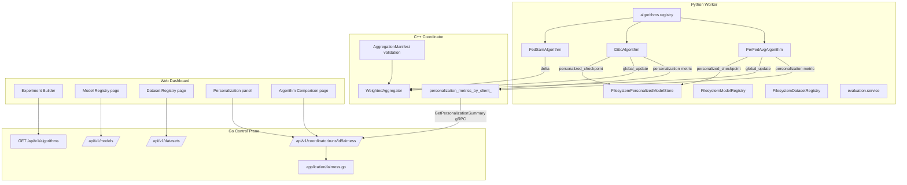
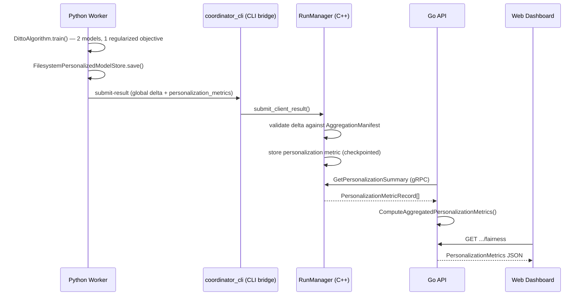

# Algorithm Expansion Phase Architecture

Builds on the Foundation, Aggregation Core, and Coordinator Runtime phases (project/experiment/run bookkeeping, the C++
aggregation core, the gRPC coordinator runtime) without changing any of
that proven code. the Algorithm Expansion phase adds: three new local-training algorithms
(FedSAM, Ditto, Per-FedAvg), a shared-backbone/personalized-head model
architecture, persistent per-client personalized models, model/dataset
registries, personalized evaluation, fairness metrics, and the Go/web
surface for all of the above.

## Language boundaries (unchanged, extended)

* **C++ coordinator**: no PyTorch, no training. the Algorithm Expansion phase adds three
  enum labels to `AggregationAlgorithm` (`kFedSam`/`kDitto`/`kPerFedAvg`),
  all reusing the existing `WeightedAggregator` — see
  [aggregation-manifests.md](aggregation-manifests.md) for how it
  enforces which tensors are aggregatable without knowing anything about
  ML. It also stores (never interprets) personalization metric scalars.
* **Python**: owns all training/personalization logic — FedSAM/Ditto/
  Per-FedAvg, the model/dataset registries' actual partitioning math,
  personalized model persistence, evaluation.
* **Go**: metadata APIs only. Model/dataset registry CRUD, algorithm
  metadata + config validation, and personalization/fairness
  *projections* of data the coordinator already holds — never a tensor,
  never training logic. See [model-registry.md](model-registry.md),
  [dataset-registry.md](dataset-registry.md),
  [fairness-metrics.md](fairness-metrics.md).
* **Web**: dashboard views only, calling the Go API.

## Component diagram

## Algorithms at a glance

| Algorithm | Personalization | Training shape | Doc |
|---|---|---|---|
| FedAvg / FedProx / SCAFFOLD | No | Single forward/backward (the Foundation, Aggregation Core, and Coordinator Runtime phases, via `LegacyAlgorithmAdapter`) | — |
| FedSAM | No | Two forward/backward passes per batch (perturb, restore) | [fedsam.md](fedsam.md) |
| Ditto | Yes | Two full models (global-training + personalized), regularized | [ditto.md](ditto.md) |
| Per-FedAvg | Yes | Support/query split, inner adaptation, first-order meta-gradient | [per-fedavg.md](per-fedavg.md) |

## Cross-language data flow for one Ditto round

## Status legend used throughout this doc set

* **Implemented & tested** — real code, covered by a real, passing test.
* **Validated** — additionally exercised against a live process (C++
  unit test with a fresh process/object, Docker container, or both).
* **Scaffolded** — a type/interface exists but no real logic behind it.
* **Deferred** — explicitly out of scope this phase (see
  [known-limitations.md](known-limitations.md)).

Every the Algorithm Expansion phase component listed in the table above is **implemented &
tested**; FedSAM/Ditto/Per-FedAvg's coordinator-side wiring and the Go
API's `GetPersonalizationSummary` path are additionally **validated**
against a live Docker stack (see
[algorithm-expansion-validation.md](algorithm-expansion-validation.md)). Nothing in this
phase is scaffolded-only.
