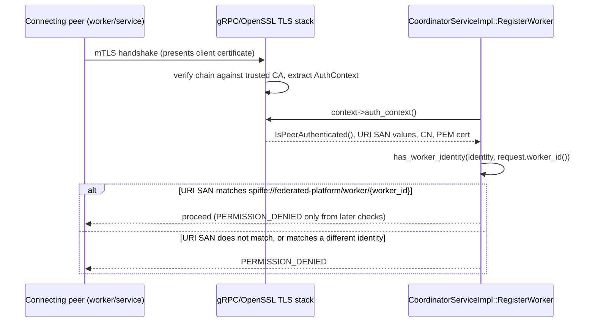

# Certificate Identity Binding

**Status: Implemented and Validated live**, against a real containerized
C++ coordinator over genuine mTLS with real dev-PKI certificates — not
a unit-test double. See `cpp/coordinator/include/fl_coordinator/peer_identity.hpp`
and `cpp/coordinator/src/peer_identity.cpp`.

## What this is

Certificate identity binding answers one narrow question: **does the
`worker_id` a `RegisterWorker` request claims actually match the
identity gRPC's TLS stack already verified for the certificate that
authenticated this connection?** It is deliberately not a broader
authorization system — it reads what gRPC's `AuthContext` already
computed during the TLS handshake (`peer_identity.cpp` never re-parses
or re-verifies the certificate itself) and compares it against one
claimed field.



## The URI SAN convention

Every certificate issued by `scripts/pki/` carries exactly one URI SAN
of the form:

```text
spiffe://federated-platform/service/coordinator
spiffe://federated-platform/service/go-api
spiffe://federated-platform/worker/{worker-id}
```

This is a SPIFFE-*style* naming convention only — see
[development-pki.md](development-pki.md) — not a claim that SPIFFE/SPIRE
infrastructure exists. The **URI SAN**, not the certificate's subject
common name (CN), is the authoritative identity field:
`PeerIdentity::subject_common_name` is exposed for logging/diagnostics
only and is never consulted by `has_worker_identity`/`has_service_identity`.
CN is attacker-influenceable in ways a CA-issued SAN extension is not
expected to be in this PKI's issuance flow, so it is deliberately not
trusted for a security decision.

## When enforcement applies — and when it deliberately does not

`extract_peer_identity` returns `PeerIdentity::authenticated == false`
whenever the connection did not actually present and have verified a
client certificate — which is exactly the case under
`TransportMode::kInsecureDevelopment` and `TransportMode::kTls` (server
auth only, no client certificate requested; see
[mtls.md](mtls.md)/[coordinator-mtls.md](coordinator-mtls.md)). The
binding check in `RegisterWorker` only rejects when
`peer_identity.authenticated == true` **and** the URI SAN doesn't match
— under any non-mTLS transport mode, this is a deliberate no-op, not a
bypass: there is no peer identity to bind to in the first place. This
is also what keeps `coordinator_service_test.cpp`'s ~5 pre-existing
`service.RegisterWorker(nullptr, ...)` calls (which bypass real gRPC
dispatch entirely, calling the handler directly with a null
`grpc::ServerContext*`) working completely unchanged — `context != nullptr`
guards the entire check, and `context` is never null when this method
is actually invoked as a real gRPC handler.

## Live validation (this is the part that is actually tested, not just written)

Built via `infra/docker/cpp-coordinator.Dockerfile` (the only
environment where the gRPC-gated C++ targets compile — see
[known-limitations.md](known-limitations.md)), then run as a live
container with real `certs/dev/` material mounted, exercising three
distinct real RPC calls over genuine mTLS:

1. **Matching identity**: a client presenting `worker-1`'s real
   certificate, claiming `worker_id: "worker-1"` — succeeds.
2. **Mismatched worker_id**: a client presenting `worker-1`'s real,
   valid, CA-trusted certificate, but claiming `worker_id: "worker-2"`
   in the request body — rejected `PERMISSION_DENIED`.
3. **Wrong identity class**: a client presenting the `go-api`
   *service* certificate, attempting to register as a worker (any
   `worker_id`) — rejected `PERMISSION_DENIED`, since
   `spiffe://federated-platform/service/go-api` never matches
   `spiffe://federated-platform/worker/{anything}`.

A full `ctest` run (all 8, later 10, targets, including the two
gRPC-gated suites) confirmed zero regressions from this change,
including the pre-existing `coordinator_service_test.cpp` suite's
nullptr-context call pattern.

## Unit coverage

`fl_peer_identity_tests` covers the pure string-matching half
(`has_service_identity`/`has_worker_identity`) directly: exact-match
acceptance, non-matching rejection, no accidental substring matching
(a `worker_id` that is a prefix or superstring of the real one does not
match), an unauthenticated/empty identity never matches anything, and a
certificate with multiple URI SANs is scanned in full, not just its
first entry. The `AuthContext`-reading half (`extract_peer_identity`
itself) is intentionally validated live instead of with a fake
`AuthContext` double — constructing one with the right internal state
would test the double, not the real gRPC/OpenSSL integration this
module exists to read the result of.

## What this does not do

* Does not itself perform certificate revocation checking — see
  [worker-identity-registry.md](worker-identity-registry.md) and
  [known-limitations.md](known-limitations.md) for the application-level
  (not full-PKI-stack) revocation model.
* Does not bind service identities (`coordinator`, `go-api`) to
  anything yet — only `RegisterWorker`'s worker-identity binding is
  wired. No RPC currently calls `has_service_identity`.
* Does not extract or expose the certificate's serial number — only a
  SHA-256 fingerprint over the AuthContext's PEM text (see
  `PeerIdentity::certificate_fingerprint_sha256`), used by
  `WorkerIdentityRegistry` for uniqueness, not claimed to match
  `openssl x509 -fingerprint -sha256`'s DER-based fingerprint.
