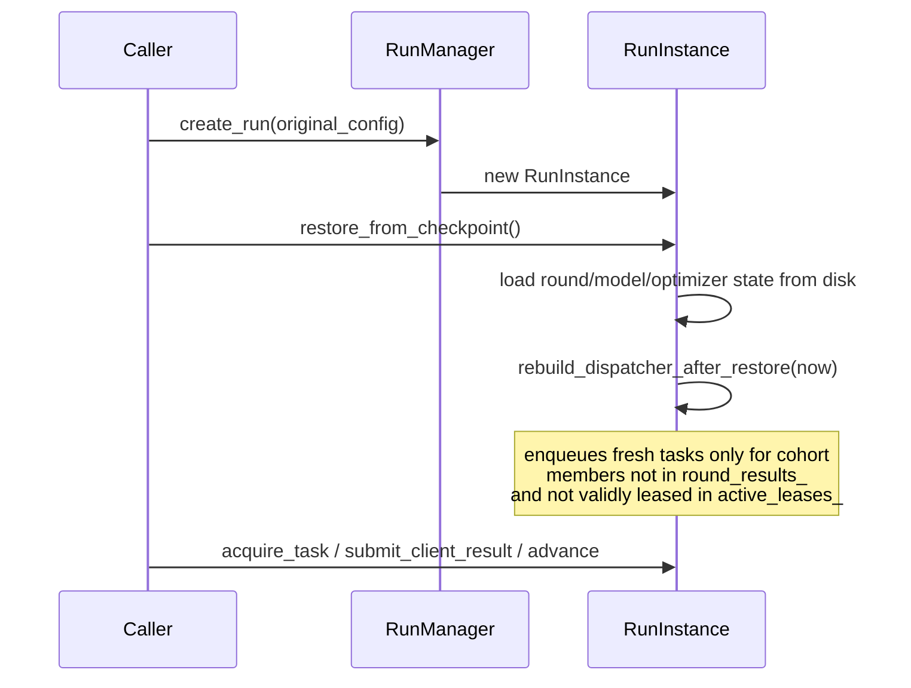

# Coordinator Checkpoint and Recovery

## When checkpoints are written

`RunInstance::save_checkpoint()` is called automatically from inside
`transition()` itself — the single choke point for every lifecycle state
change (start/pause/resume/cancel, and every internal state transition
during round advancement). This was a deliberate fix during development:
originally only `finalize_round()` saved a checkpoint, so lifecycle
actions (pause, resume, cancel) taken between rounds did not survive a
CLI-bridge process boundary. The checkpoint save happens *after* the
final transition into a stable state (`kRunning`/`kPaused`/`kCompleted`/
`kCanceled`), not while `state_` is a transient value like
`kCheckpointing` that `advance()` doesn't act on.

## What's checkpointed

* Round/model state: `current_round_id_`, `model_version_`,
  `global_model_`, `optimizer_state_`, `scaffold_global_control_`.
* `round_results_` — accepted client results this round, keyed by
  `client_id`.
* `active_leases_` — outstanding task leases, keyed by `client_id` (see
  [task-leasing.md](task-leasing.md) for why this, not the dispatcher's
  own state, is authoritative).
* `failed_clients_` — clients whose retries were exhausted this round.

`dispatcher_` itself (in-flight `TaskDispatcher` state) is **not**
checkpointed — it is rebuilt fresh on restore.

## Recovery sequence

A checkpoint file alone does not carry the original `RunConfig` (client
pool, hyperparameters, manifest) — in a full system that would come from
wherever `CreateRun`'s request was persisted (the Go control plane's own
run record, out of this milestone's scope). Recovery is therefore always
two steps: `create_run()` with the original config to get a fresh
`RunInstance`, then `restore_from_checkpoint()` to overwrite its state
from disk before serving any requests.

`rebuild_dispatcher_after_restore()` is careful about who gets a fresh
task: a cohort member already in `round_results_` (completed) or still
validly leased in `active_leases_` (unexpired) is *not* re-enqueued; a
client whose lease has since expired is enqueued fresh for retry.

## The critical recovery test

`cpp/coordinator/tests/recovery_test.cpp` and the
`test_coordinator_restart_and_resume` cross-language integration test
both verify the scenario that actually matters: simulate a coordinator
process crash mid-round (some clients submitted, some still leased,
some never dispatched), restart via the two-step sequence above, finish
the round, and assert the final aggregated model is bit-identical to an
uninterrupted control run with the same seed.
