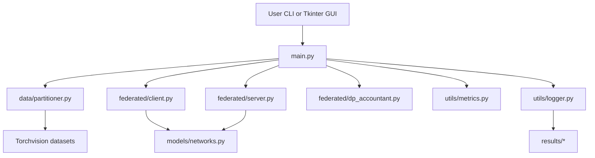
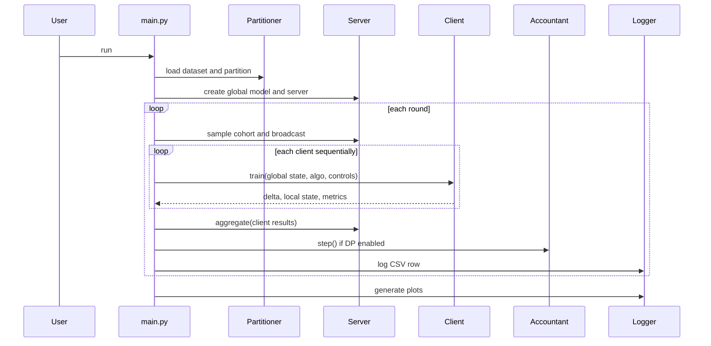

# Current Architecture

## System Type

The existing system is a local Python/PyTorch research simulator with an optional Tkinter dashboard.

## Runtime Topology

## Primary Modules

### `main.py`

- CLI parsing
- GUI launch
- Config loading
- Experiment orchestration
- Dataset loading
- Partition selection
- Algorithm loop
- Metrics aggregation
- Plot and summary generation

### `federated/client.py`

- Local SGD
- FedProx proximal term
- SCAFFOLD correction
- Client-side update clipping
- Gaussian noise addition

### `federated/server.py`

- Global model ownership
- FedAvg weighted aggregation
- FedProx server-side aggregation behavior
- SCAFFOLD control variate tracking

### `federated/dp_accountant.py`

- Integer-order RDP tracking
- Additive composition across rounds
- Epsilon computation for fixed delta

### `data/partitioner.py`

- Torchvision dataset loading
- Dirichlet partitioning
- Pathological partitioning
- Distribution plotting

### `utils/logger.py`

- CSV write path
- CSV readback
- Plot generation

### `utils/metrics.py`

- Test set evaluation
- Client drift
- Weight variance

## Control Flow Details

### Single Algorithm

## Legacy GUI Architecture

- Tkinter process embedded in `main.py`
- GUI creates runtime YAML
- GUI runs `main.py --cli --config <runtime>` in a subprocess
- GUI reads local results artifacts to show logs, markdown, and charts

## Non-Goals of the Current System

- Production deployment
- Multi-user access
- Service isolation
- Edge worker management
- Hardened security boundaries
- Horizontal scalability
