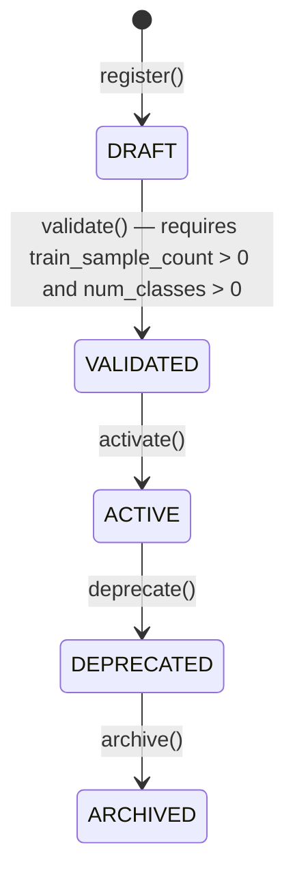

# Dataset Registry

**Status: implemented & tested, both languages** (with one deliberate
scope boundary — see below). Python source:
`python/src/fl_platform/datasets/dataset_registry.py`,
`python/src/fl_platform/datasets/partitioning.py`. Go source:
`go/internal/datasets` (domain), `go/internal/application/dataset_service.go`,
`go/internal/transport/httpapi/dataset_handlers.go`. Tests:
`DatasetRegistryTests` (Python), `internal/datasets`'s repository tests
and `dataset_service_test.go` (Go, 8 tests), `TestDatasets*` in
`registry_handlers_test.go` (Go HTTP layer). Additionally validated live
against a Docker stack — see [algorithm-expansion-validation.md](algorithm-expansion-validation.md).

## Scope boundary: Go records manifests, Python computes them

**This is the one place where the two languages' registries are not
behaviorally symmetric**, and it's deliberate: actual partitioning
(assigning sample indices and label histograms to clients) requires the
real labeled dataset, which never crosses into Go (see
[algorithm-expansion-architecture.md](algorithm-expansion-architecture.md)'s language
boundaries — Go must not touch training data). So:

* **Python's `create_partition`** actually computes a partition (calls
  `create_iid_partition`/`create_dirichlet_partition`/
  `create_pathological_partition` from `partitioning.py`, each of which
  needs `sample_count`/`num_classes` and produces real per-client sample
  index lists and label-distribution histograms).
* **Go's `CreatePartition`** records a partition *manifest* — strategy
  name, seed, per-client sample *counts* — supplied by whoever computed
  it (an operator via the dashboard, or a future Python-to-Go sync). It
  performs the same *structural* validation Python does before
  delegating to a strategy builder (known strategy name, dirichlet
  requires `alpha`, pathological requires `classes_per_client`, positive
  client count) but does not — and cannot — verify the supplied counts
  against real data.

## Partition strategies (Python, real math)

| Strategy | Method | Source |
|---|---|---|
| `iid` | Seeded shuffle + even split | Hsu et al. convention (uniform baseline) |
| `dirichlet` | Per-class `Dirichlet(alpha)` proportion split | Hsu et al. 2019 |
| `pathological` | Fixed classes-per-client | McMahan et al. 2017 |

All three are deterministic given the same seed — verified by
`DatasetRegistryTests.test_partition_strategies_are_reproducible_and_respect_constraints`,
which creates the same dirichlet partition twice and asserts identical
`client_sample_counts` and `manifest_checksum`.

## Status machine (identical in both languages)

## Fields (`DatasetRegistryEntry` / Go's `Dataset`)

| Field | Meaning |
|---|---|
| `dataset_id` | Registry key |
| `name`, `version`, `task_type` | Descriptive metadata |
| `num_classes`, `input_shape` | Shape info |
| `train_sample_count`, `eval_sample_count` | Sample counts — gate `validate()` |
| `storage_reference` | Opaque string pointing at where the actual data lives — never dereferenced by the registry |

## `PartitionManifestRecord` (Python) / `Partition` (Go)

Python's version carries real per-client `client_indices` (sample index
lists) and `label_distribution_summary` (per-client label histograms) in
addition to `client_sample_counts`. Go's `Partition` (see
`go/internal/datasets/dataset.go`) carries only `client_sample_counts` —
by design, per the scope boundary above.

## Go HTTP API

`GET/POST /api/v1/datasets`, `GET /api/v1/datasets/{id}`,
`POST /api/v1/datasets/{id}/{validate,activate,deprecate}`,
`GET/POST /api/v1/datasets/{id}/partitions`,
`GET /api/v1/datasets/{id}/partitions/{partitionId}`. Same RBAC tiers as
the model registry.
