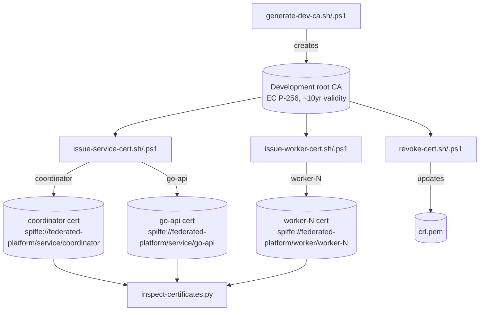

# Development PKI

**Status: Implemented and Validated.** All scripts below were executed
end-to-end for real (both the bash and PowerShell variants) — CA
generation, service/worker certificate issuance, revocation with CRL
regeneration, and certificate inspection — and their output was
verified against real, parsed X.509 certificates. `verify-pki.sh` /
`.ps1` automate that same end-to-end lifecycle as a single repeatable,
CI-runnable check (`make pki-verify`) against a throwaway CA — both
variants were run for real and pass all 21 checks each. This is not
production PKI tooling; see the trust-boundary notes below.

## What this is

`scripts/pki/` generates a self-contained certificate authority and
leaf certificates for local development and CI, using OpenSSL's
`ca`/`req`/`x509` commands (bash) or the same OpenSSL binary invoked
from PowerShell. No production credentials are ever produced by these
scripts, and nothing they generate is committed — `certs/dev/` (and any
other `certs/dev*` path) is Git-ignored.



## Identity convention

Every issued certificate carries a URI SAN identity:

```text
spiffe://federated-platform/service/coordinator
spiffe://federated-platform/service/go-api
spiffe://federated-platform/worker/{worker-id}
```

This is a SPIFFE-*style* naming convention, chosen for its clarity and
industry familiarity — it is **not** a claim that SPIFFE/SPIRE
infrastructure (a workload API, an actual SPIFFE trust domain, SVID
rotation via SPIRE agents) is implemented. Certificates also carry
conventional DNS SANs (`localhost`, the service/worker name) and an IP
SAN (`127.0.0.1`) for straightforward local testing without needing
DNS-based hostname verification against the URI.

## Scripts

| Script | Purpose |
|---|---|
| `generate-dev-ca.sh` / `.ps1` | Creates a development root CA (EC P-256 key, ~10 year validity by default) with a real OpenSSL CA database (`index.txt`/`serial.txt`/`crlnumber.txt`) for later issuance/revocation. Refuses to overwrite an existing CA. |
| `issue-service-cert.sh` / `.ps1` | Issues a leaf certificate for a named service (`coordinator`, `go-api`) or, via the `worker/<id>` name form, a worker. EC P-256 key, `serverAuth`+`clientAuth` extended key usage, 90-day default lifetime (short enough that rotation is exercised routinely, not left untested by a decade-long cert). |
| `issue-worker-cert.sh` / `.ps1` | Thin wrapper over `issue-service-cert` for worker identities. |
| `revoke-cert.sh` / `.ps1` | Revokes a leaf certificate (`openssl ca -revoke`) and regenerates the CA's CRL. Only updates the CA's own revocation bookkeeping — does not itself notify a running coordinator; the coordinator's worker identity registry (deferred this pass — see [worker-identity.md](worker-identity.md)) would be the live, RPC-time revocation check in a fuller implementation. |
| `inspect-certificates.py` | Prints safe certificate metadata (subject CN, URI SAN identity, serial, SHA-256 fingerprint, validity window, expiry status) for one or more certificates or a whole directory — never opens or prints private keys. This is deliberately the same field set the Go security API and web Transport Security panel are meant to expose (see [transport-identity-report.md](transport-identity-report.md)). |
| `verify-pki.sh` / `.ps1` | End-to-end automated check of the whole lifecycle above, against its own throwaway CA (never `certs/dev/`): generates a CA, issues coordinator/go-api/worker-1/worker-2 certificates, inspects their URI SANs, validates each chain against the CA, revokes worker-2, regenerates the CRL, confirms `openssl verify -crl_check` now rejects worker-2 but still accepts worker-1, confirms no `certs/dev*`/`*.key.pem` paths are Git-tracked, then deletes all private key material it created (via an exit trap / `finally` block, so cleanup runs even on failure). Runnable via `make pki-verify` (bash) or directly as `.ps1`; safe to run repeatedly and in CI. |

## Real, non-obvious issues found and fixed while building these scripts

* **A broken system-default `openssl.cnf`** on this development machine
  (pointing at a stale PostgreSQL ODBC install path) broke any OpenSSL
  invocation that didn't pass `-config` explicitly. Fixed by setting
  `OPENSSL_CONF=/dev/null` (bash) / `NUL` (PowerShell) so the system
  default is never consulted — every real setting these scripts need is
  supplied via an explicit, generated config file.
* **Git Bash for Windows (MSYS) silently corrupts `-subj "/CN=..."`** —
  MSYS auto-translates argv entries that look like POSIX absolute paths
  into Windows paths, turning `/CN=coordinator` into
  `C:/Program Files/Git/CN=coordinator`. Fixed by routing the subject
  through a generated OpenSSL config file (`[req_distinguished_name]`)
  instead of `-subj`, sidestepping the platform quirk entirely rather
  than fighting MSYS's heuristics.
* **A relative `dir = .` in the CA's OpenSSL config** broke
  `openssl ca` when invoked from any working directory other than the
  CA directory itself. Fixed by embedding an absolute path at
  generation time — converted via `cygpath -m` under Git Bash for
  Windows specifically, since a path embedded in a config *file's
  contents* (unlike a CLI argument) is never auto-translated by MSYS.
* **`openssl` is not on PowerShell's default `PATH`** even when Git for
  Windows (which bundles it) is installed — only Git Bash's own shell
  init adds it. The `.ps1` scripts fall back to the well-known
  Git-for-Windows install location (`C:\Program Files\Git\usr\bin\openssl.exe`)
  when `openssl` isn't already resolvable, so they work out of the box
  on a bare Windows machine that already has Git installed.
* **Windows PowerShell 5.1 reads `.ps1` files using the system codepage**
  unless the file carries a UTF-8 BOM — the em-dashes used elsewhere in
  this project's comments were silently mangled into multi-byte garbage
  that broke string/quote parsing. Fixed by keeping every `.ps1` file in
  this directory plain-ASCII.

## Trust boundary

* Private keys are written to disk in plaintext (standard for a
  development CA) — never committed, never logged by any script.
* The CA's own private key, once generated, signs every certificate
  issued from it; compromise of `certs/dev/ca/ca.key.pem` compromises
  the whole local PKI. This is expected and acceptable for local
  development/CI, not for any shared or production environment.
* `inspect-certificates.py` never reads or displays private key
  material — verified by construction (it only calls
  `x509.load_pem_x509_certificate`, never touches a `.key.pem` file).
