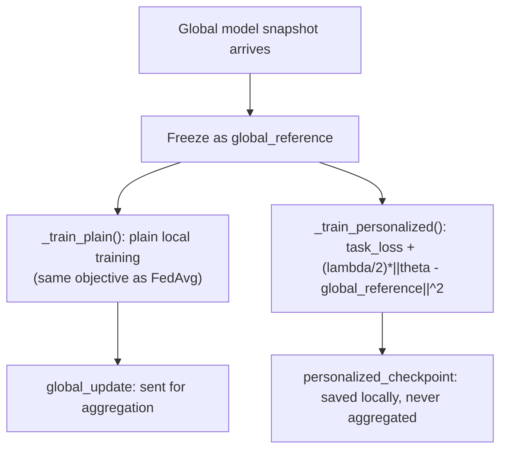

# Ditto

**Status: implemented & tested.** Source:
`python/src/fl_platform/algorithms/ditto.py`. Tests:
`python/tests/test_algorithm_expansion_foundations.py`'s `DittoTests` (trains both
models and produces a personalized checkpoint distinct from a copy of the
global model; warm-start reuses a previous personalized checkpoint;
rejects non-positive regularization). Also exercised end-to-end
(personalized checkpoint persistence across a simulated worker restart,
via the CLI-bridge) by
`tests/baseline/test_algorithm_expansion_integration.py`.

## What it is

Li et al. (2021)'s personalized federated learning algorithm: each client
trains **two** models per round —

1. A **global-training model**, trained plainly (same as FedAvg) — its
   update is what gets sent to the coordinator for aggregation into the
   next global model.
2. A **personalized model**, trained against a regularized objective that
   pulls it toward a frozen snapshot of the *current* global model (the
   "global reference"), via an L2 penalty:
   `loss = task_loss(personalized_model) + (lambda / 2) * ||personalized_model - global_reference||^2`

The personalized model is never aggregated — it lives entirely on the
client (persisted via `FilesystemPersonalizedModelStore`, see
[personalized-model-store.md](personalized-model-store.md)) and is what
that client actually uses for inference.

## Training flow

## Warm vs. cold start

`warm_start_policy` controls what the personalized model starts each
round from:

* `"warm"` (default): continue from the previous round's personalized
  checkpoint (`context.personalized_model`, loaded by the caller from the
  store) — the personalized model accumulates client-specific adaptation
  across rounds.
* `"cold"`: start fresh from the incoming global model every round —
  useful for measuring "how much does one round of personalization buy
  you," or when a client's previous personalized state is judged stale.

## Config (`DittoConfig`)

| Field | Meaning | Validated by `validate_task` |
|---|---|---|
| `regularization_coefficient` | L2 pull toward `global_reference` | must be > 0 |
| `personalized_local_epochs` / `global_local_epochs` | Epochs for each model | both must be > 0 |
| `personalized_optimizer` / `global_optimizer` | Optimizer name per model | — |
| `warm_start_policy` | `"warm"` \| `"cold"` | — |

Go mirrors the `regularization_coefficient > 0` and epoch checks in
`go/internal/algorithms`.

## Aggregation mapping

Only `global_update` crosses into aggregation; `AggregationAlgorithm::kDitto`
maps to the same `WeightedAggregator` as FedAvg. The personalized
checkpoint is a Python-and-Go-application-layer concept only — the C++
coordinator's aggregation manifest (see
[aggregation-manifests.md](aggregation-manifests.md)) is what lets the
coordinator reject a client that mistakenly tries to submit personalized/
frozen parameters as if they were aggregatable.

## Performance

Measured at ~2× FedAvg's median per-round latency on `GroupNormCNN`
(200.0ms vs. 93.5ms) — expected, since it trains two full models per
round. See [benchmarking.md](benchmarking.md).
