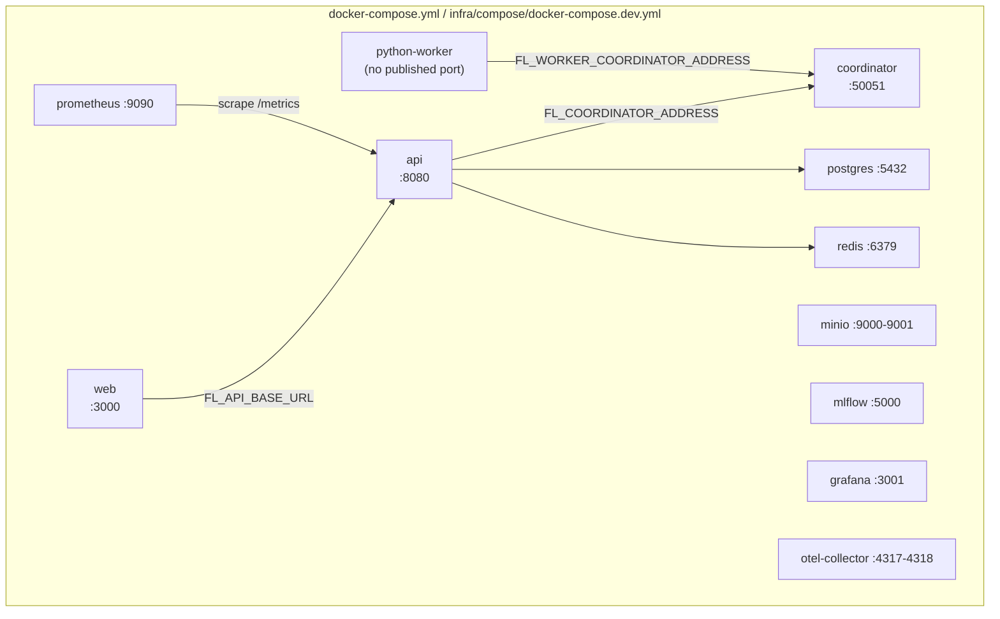

# Docker Runtime

## Topology

## New this milestone: `coordinator` and `python-worker`

* **`coordinator`** (`infra/docker/cpp-coordinator.Dockerfile`) — builds
  `fl_coordinator_grpc_server` for real, from source, on every image
  build: installs `protobuf-compiler protobuf-compiler-grpc
  libprotobuf-dev libgrpc++-dev` via apt (available on the Ubuntu base
  image; not available via MSVC on the host this repo is developed on),
  regenerates the C++ proto/gRPC bindings via
  `scripts/generate_protos.sh` (the same script used everywhere else —
  this container never diverges from how bindings are produced
  elsewhere), then `cmake --build --target fl_coordinator_grpc_server`.
  Health check: a raw TCP connect to `127.0.0.1:50051` (not a full gRPC
  health probe — `grpc_health_probe` isn't installed — but sufficient to
  confirm the process is listening). Host port configurable via
  `FL_COORDINATOR_HOST_PORT` (default 50051).
* **`python-worker`** (`infra/docker/python-worker.Dockerfile`) —
  installs CPU-only torch (`--index-url
  https://download.pytorch.org/whl/cpu`), the `fl_platform` package, and
  `grpcio`/`grpcio-tools`; regenerates Python proto bindings the same
  way. `CMD ["python", "-m", "fl_platform.worker"]` — see
  [python-worker.md](python-worker.md) for what that entrypoint actually
  does (a real, repeated `Health()` poll, not full training).

## Real bugs found by actually running this

Both discovered only once the containers were built and run together —
neither was visible from unit tests or from building each language in
isolation:

1. **A proto field-name collision that only breaks C++ codegen** — see
   [grpc-contracts.md](grpc-contracts.md)'s "A real bug this caught."
   `docker compose build coordinator` was the first time
   `fl_coordinator_grpc_server` had ever actually been compiled.
2. **The Go event-streaming poll bug** — see
   [event-streaming.md](event-streaming.md). Found by running `api` and
   `coordinator` together and watching `GET .../events` return nothing.

Both are fixed; see [milestone-3-validation.md](milestone-3-validation.md)
for the verification evidence.

## Other fixes required to get containers building/running

* `go-api.Dockerfile` needed `golang:1.25` (was `golang:1.22`) — `go mod
  tidy` (required to add the new grpc/otel dependencies to `go.sum`,
  which had never been committed before this milestone) bumped the
  `go.mod` floor to `go 1.25.0`.
* `go-api.Dockerfile` needed `COPY go/go.sum` and `COPY go/generated` —
  previously absent since the Go module had no external dependencies
  worth a `go.sum` and no generated code was ever imported at build time.
* `python-worker.Dockerfile` needed CPU-only torch installed —
  `coordinator_client.py` imports `torch` at module level (shared tensor
  type hints with `task_runner.py`), so even the health-check-only
  entrypoint requires it, and the `fl-platform` package itself declares
  no runtime dependencies in `pyproject.toml` (torch/numpy are only in
  the repo-root `requirements.txt`, used directly in local dev, never
  installed via the package).

## Validation performed

See [milestone-3-validation.md](milestone-3-validation.md) for the full
command-by-command log: `docker compose config`, `build` (each new
service individually, then the full stack), `up -d` (all 10 services;
9/10 healthy — `grafana` blocked by an unrelated host port-3001
conflict, not a regression), a full coordinator lifecycle exercised
through the real HTTP→Go→gRPC→C++ chain (create/start/pause/resume/
cancel/idempotent-cancel), a live SSE event stream verified with real
events, sustained python-worker health-check logs over 24+ minutes/145
attempts, Prometheus's `go-api` scrape target confirmed `up` (previously
a silently-broken target — `/metrics` didn't exist on the API before
this milestone), and `docker compose down -v` for a clean shutdown.
