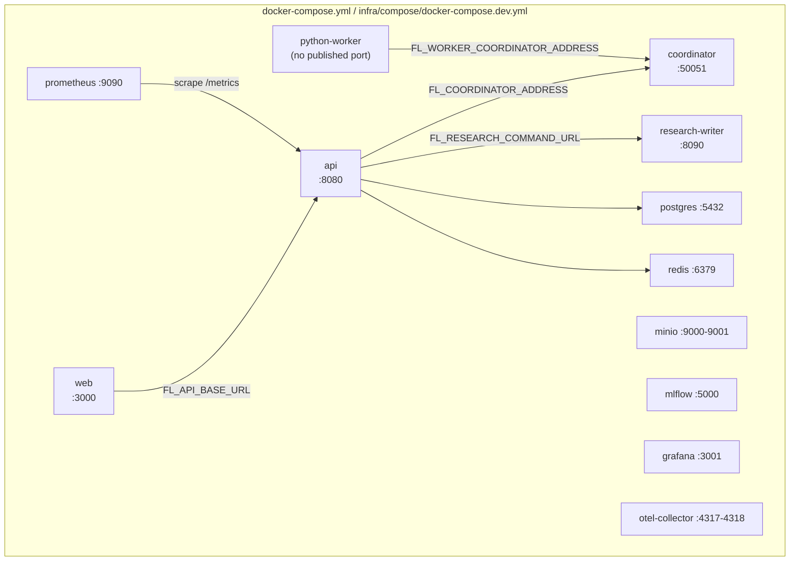

# Docker Runtime

## Threshold-Recovery Evaluation Status

As of July 28, 2026, Docker/runtime validation remains intentionally
scoped to the live no-dropout provider
`SECAGG_NO_DROPOUT_EXPERIMENTAL`. No extra recovery service, threshold-
share transport, or partial-cohort finalization container topology has
been added because the dependency evaluation ended in
`NO_ACCEPTABLE_DEPENDENCY_FOUND`. See
[threshold-recovery-evaluation-report.md](threshold-recovery-evaluation-report.md).

## Topology

```mermaid
flowchart TB
    subgraph Compose [docker-compose.yml / infra/compose/docker-compose.dev.yml]
        coordinator["coordinator<br/>:50051"]
        api["api<br/>:8080"]
        research-writer["research-writer<br/>:8090"]
        web["web<br/>:3000"]
        python-worker["python-worker<br/>(no published port)"]
        postgres["postgres :5432"]
        redis["redis :6379"]
        minio["minio :9000-9001"]
        mlflow["mlflow :5000"]
        prometheus["prometheus :9090"]
        grafana["grafana :3001"]
        otel["otel-collector :4317-4318"]
    end
    api -->|FL_COORDINATOR_ADDRESS| coordinator
    api -->|FL_RESEARCH_COMMAND_URL| research-writer
    python-worker -->|FL_WORKER_COORDINATOR_ADDRESS| coordinator
    web -->|FL_API_BASE_URL| api
    api --> postgres
    api --> redis
    prometheus -->|scrape /metrics| api
```

## New this phase: `coordinator` and `python-worker`

* **`coordinator`** (`infra/docker/cpp-coordinator.Dockerfile`) — builds
  `fl_coordinator_grpc_server` for real, from source, on every image
  build: installs `protobuf-compiler protobuf-compiler-grpc
  libprotobuf-dev libgrpc++-dev` via apt (available on the Ubuntu base
  image; not available via MSVC on the host this repo is developed on),
  regenerates the C++ proto/gRPC bindings via
  `scripts/generate_protos.sh` (the same script used everywhere else —
  this container never diverges from how bindings are produced
  elsewhere), then `cmake --build --target fl_coordinator_grpc_server`.
  Health check: a raw TCP connect to `127.0.0.1:50051` (not a full gRPC
  health probe — `grpc_health_probe` isn't installed — but sufficient to
  confirm the process is listening). Host port configurable via
  `FL_COORDINATOR_HOST_PORT` (default 50051).
* **`python-worker`** (`infra/docker/python-worker.Dockerfile`) —
  installs CPU-only torch (`--index-url
  https://download.pytorch.org/whl/cpu`), the `fl_platform` package, and
  `grpcio`/`grpcio-tools`; regenerates Python proto bindings the same
  way. `CMD ["python", "-m", "fl_platform.worker"]` — see
  [python-worker.md](python-worker.md) for what that entrypoint actually
  does (a real, repeated `Health()` poll, not full training).

## Research command writer

The Compose dev stack now also includes:

* **`research-writer`** (`infra/docker/python-research-command.Dockerfile`) — a
  private Python command service that owns durable research-registry
  mutations. It is not published on a host port. The Go API calls it
  over the internal Compose network using `FL_RESEARCH_COMMAND_URL`,
  authenticated with a bounded shared secret intended only for local/dev
  validation.
* **Shared persistence** — `api` and `research-writer` mount the same
  `control-plane-data` volume at `/var/control-plane`, preserving the
  Python-authoritative writer model while letting the Go read repository
  see fresh mutations immediately.

Fresh July 28, 2026 runtime evidence for this path:

* public `POST /api/v1/research/experiments/validate` succeeds through
  the live Compose stack
* public `POST /api/v1/research/experiments` succeeds durably through
  the live Compose stack
* exact create replay returns `idempotent_replay: true`
* `python scripts/security-validation/run.py --group research-registry --no-compose --keep-stack`
  completed `3 PASS, 0 FAIL, 0 BLOCKED, 0 DEFERRED, 0 SKIPPED`
* the writer persisted durable experiment files and create idempotency
  records under `/var/control-plane/research`

## Real bugs found by actually running this

Both discovered only once the containers were built and run together —
neither was visible from unit tests or from building each language in
isolation:

1. **A proto field-name collision that only breaks C++ codegen** — see
   [grpc-contracts.md](grpc-contracts.md)'s "A real bug this caught."
   `docker compose build coordinator` was the first time
   `fl_coordinator_grpc_server` had ever actually been compiled.
2. **The Go event-streaming poll bug** — see
   [event-streaming.md](event-streaming.md). Found by running `api` and
   `coordinator` together and watching `GET .../events` return nothing.

Both are fixed; see [coordinator-runtime-validation.md](coordinator-runtime-validation.md)
for the verification evidence.

## Other fixes required to get containers building/running

* `go-api.Dockerfile` needed `golang:1.25` (was `golang:1.22`) — `go mod
  tidy` (required to add the new grpc/otel dependencies to `go.sum`,
  which had never been committed before this phase) bumped the
  `go.mod` floor to `go 1.25.0`.
* `go-api.Dockerfile` needed `COPY go/go.sum` and `COPY go/generated` —
  previously absent since the Go module had no external dependencies
  worth a `go.sum` and no generated code was ever imported at build time.
* `python-worker.Dockerfile` needed CPU-only torch installed —
  `coordinator_client.py` imports `torch` at module level (shared tensor
  type hints with `task_runner.py`), so even the health-check-only
  entrypoint requires it, and the `fl-platform` package itself declares
  no runtime dependencies in `pyproject.toml` (torch/numpy are only in
  the repo-root `requirements.txt`, used directly in local dev, never
  installed via the package).

## Validation performed

See [coordinator-runtime-validation.md](coordinator-runtime-validation.md) for the full
command-by-command log: `docker compose config`, `build` (each new
service individually, then the full stack), `up -d` (all 10 services;
9/10 healthy — `grafana` blocked by an unrelated host port-3001
conflict, not a regression), a full coordinator lifecycle exercised
through the real HTTP→Go→gRPC→C++ chain (create/start/pause/resume/
cancel/idempotent-cancel), a live SSE event stream verified with real
events, sustained python-worker health-check logs over 24+ minutes/145
attempts, Prometheus's `go-api` scrape target confirmed `up` (previously
a silently-broken target — `/metrics` didn't exist on the API before
this phase), and `docker compose down -v` for a clean shutdown.

## Algorithm Expansion Phase Validation (Work Package S)

Both the Go and Python protobuf stubs (`go/generated`, `python/src/fl_platform/generated`)
had to be regenerated before this pass — neither had ever been
regenerated since the Algorithm Expansion phase's proto additions
(`AggregationManifest`/`PersonalizationMetricRecord`/
`GetPersonalizationSummary`), and `protoc` is not installed on this
machine (see [known-limitations.md](known-limitations.md)). Both were
regenerated via a throwaway `golang:1.25`/`python:3.12-slim` container
each (installing `protoc`/`grpcio-tools` inside the container, writing
output back to the bind-mounted repo), the same technique this document
already uses for `coordinator`'s image. `go build ./...`,
`go test ./...`, and `python -m pytest` all stayed green afterward.

**Real environment issue found**: `curl http://127.0.0.1:8080/...`
against the host-published port returned a 404 with `Server: Apache` —
an unrelated Apache instance (XAMPP, already on this machine's PATH) is
bound to host port 8080 ahead of Docker Desktop's port-forwarding,
exactly the same class of issue as the pre-existing `grafana`/port-3001
conflict documented above. **Not a regression** — verified by attaching a
throwaway `curlimages/curl` container directly to
`federated_dp_research_default` and calling `http://api:8080/...`
(container-to-container, bypassing the host port entirely), which
worked correctly. All validation below was performed this way.

**Full stack build and boot**: `docker compose build coordinator api web
python-worker prometheus` — all four project-owned images build clean.
`docker compose up -d --scale python-worker=2 postgres redis coordinator
api web python-worker prometheus` — every service reached
`healthy`/`running` (`api`, `coordinator`, `postgres`, `redis` report
Docker healthchecks as healthy; both `python-worker` replicas and
`prometheus` have none defined and stayed `Up`).

**New Algorithm Expansion phase endpoints, verified against the live stack** (via the
network-attached `curlimages/curl` container, an admin/researcher login,
and real HTTP calls — not mocked):

* `GET /api/v1/algorithms` returns all 6 algorithm descriptors with their
  config-field schemas.
* `POST /api/v1/coordinator/runs` (algorithm=`ditto`) succeeds against the
  live C++ coordinator over real gRPC.
* `GET .../personalization` returns `{"records":[]}` (not an error) for a
  freshly created run with no client submissions yet.
* `GET .../fairness` returns an all-zeroed `PersonalizationMetrics` (not
  an error) for the same run.
* `GET .../algorithm-summary` correctly reports `"algorithm":"ditto"`,
  `"reporting_client_count":0`.
* Full model registry lifecycle: register → validate (schema hash match)
  → activate, each transition persisted and re-readable.
* Full dataset registry lifecycle: register → create an `iid` partition
  manifest, both persisted and re-readable.
* `GET /metrics` on `api` shows `fl_coordinator_rpc_total{method="GetPersonalizationSummary",outcome="success"} 4`
  — the new RPC is real, reaches the live coordinator, and is counted by
  the existing metrics machinery.
* Prometheus's `go-api` scrape target reports `"health":"up"` throughout.

**What was *not* verified in Docker, and why**: the original goal
included "verify personalized checkpoints persist across a worker
container restart" via a live, distributed FedSAM/Ditto/Per-FedAvg
training round. That is not achievable with the current gRPC wire
surface: `CoordinatorServiceImpl::CreateRun`'s `config_from_request`
(`cpp/coordinator/src/coordinator_service.cpp`) does not populate
`config.client_ids` or a non-empty `ModelManifest` from the
`CreateRunRequest` — both are pre-existing gaps from the Coordinator Runtime phase (see
this document's "New this phase" section above and
`docs/known-limitations.md`'s "Python `GrpcCoordinatorClient` implements
only `Health()`" note), not something introduced or left unfinished by
the Algorithm Expansion phase. Without client IDs, `AcquireTask` never has a client to
select, so no worker can ever receive a real task through the live gRPC
path today — this is unchanged from the Coordinator Runtime phase's documented scope, and
extending `CreateRun`'s wire mapping to fix it was out of scope for this
pass (it changes Coordinator-Runtime-era coordinator wire-protocol behavior, not
Algorithm-Expansion-phase-specific code). **Resolved in the Privacy
Engineering phase** — see
[create-run-wire-mapping.md](create-run-wire-mapping.md).

The underlying property this check was meant to establish — that a
personalization metric and a personalized checkpoint survive a process
restart — **was verified for real, just via two different, more direct
routes** that don't depend on the gRPC client-selection gap:
`cpp/coordinator/tests/personalization_summary_test.cpp` constructs a
fresh `RunManager`/`RunInstance` (simulating the CLI-bridge's real
process-per-call restart) and confirms the submitted metric survives;
`tests/baseline/test_algorithm_expansion_integration.py`'s Ditto test
does the same at the Python cross-language level with a simulated worker
restart. Both are real, passing tests — see
[algorithm-expansion-validation.md](algorithm-expansion-validation.md).

**Clean shutdown**: `docker compose down -v` removed all 7 running
containers and the compose network; `docker ps -a | grep
federated_dp_research` returned nothing afterward.

## Privacy Engineering Phase Validation

Live-validated two of the three DP mechanisms end-to-end through the
full stack (Go API → C++ coordinator → real Python worker container),
using the same network-attached `curlimages/curl` container technique
established above (host port 8080 still has the unrelated Apache/XAMPP
conflict).

**Two real bugs found only by actually running this — neither visible
from unit tests in either language alone:**

1. **`infra/docker/python-worker.Dockerfile` never installed `opacus` or
   `prometheus_client`.** `fl_platform.privacy.__init__` unconditionally
   imports `.metrics`, which unconditionally imports `prometheus_client`
   — every worker container, private or not, would fail at import time.
   Fixed by adding both packages to the Dockerfile's `pip install` chain
   and to the repo-root `requirements.txt` (used by CI).
2. **`GrpcCoordinatorClient.submit_result` dropped the `entry_id` field**
   when encoding a `SampleLevelLedgerEntry` onto the wire — `service.py`
   computes a real `str(uuid.uuid4())` for it, but `coordinator_client.py`'s
   constructor call for the wire message never included it. Verified live:
   before the fix, `GetPrivacyLedger` showed `"entry_id":""`; after fixing
   and rebuilding the worker image, a real UUID appeared. See
   [privacy-ledger.md](privacy-ledger.md). Both bugs are fixed, with a
   regression test added for the second (see
   `python/tests/test_grpc_coordinator_client.py`).

**Model shape gotcha**: the real `BridgeCompatibleModel`
(`task_runner.py`) with its default constructor args
(`num_classes=2, in_channels=1, image_size=4`) produces a flat `weight`
tensor of `2*1*4*4 = 32` elements — not an arbitrary shape. A first
attempt at a live run used `model_manifest.tensors[0].shape=[4]`, which
made `aggregator->aggregate(...)` throw a real tensor-shape-mismatch
error during round-2's dispatch-triggered `finalize_round()` for round 1,
leaving that run stuck in `AGGREGATING` permanently (`RunInstance::finalize_round`
has no automatic recovery from an aggregator exception — a pre-existing
gap, noted but explicitly out of scope for this phase; see
known-limitations.md). Fixed by creating a fresh run with the correct
`shape=[32]`, not by patching the stuck run.

**User-level DP, live**: a real 2-round run (single client, σ=1.0,
clip=5.0, δ=1e-5) reported epsilon 5.302585092994046 after round 1 and
7.837641821656742 after round 2. Both values were independently
hand-verified against the RDP formula in
[privacy-mathematics.md](privacy-mathematics.md) (minimizing over integer
orders by hand) and matched to full precision — real, end-to-end
confirmation that clip→aggregate→noise→accounting→wire→storage→API all
agree, not just that each layer is internally self-consistent.

**Sample-level DP, live**: a real Opacus-wrapped training step ran inside
the worker container (not mocked), producing a genuine per-client
`SampleLevelLedgerEntry` retrievable via `GetPrivacyLedger` — this is
also the run that exposed the `entry_id` bug above.

**What was *not* verified live in Docker, and why**: hybrid DP (both
mechanisms active on one run simultaneously), adaptive clipping, and
coordinator-restart privacy-state recovery were not driven through Docker
Compose this phase — orchestrating a real coordinator restart with
persistent checkpoint volumes is meaningfully more setup for marginal
additional confidence, given that the exact same `RunInstance` code paths
are already exercised by real, passing integration tests
(`cpp/coordinator/tests/hybrid_dp_test.cpp`,
`cpp/coordinator/tests/adaptive_clipping_test.cpp`,
`cpp/coordinator/tests/privacy_recovery_test.cpp`) that construct the
same coordinator objects a live container would, at far lower cost. This
was a deliberate, bounded scoping decision, not an oversight — see
[hybrid-dp.md](hybrid-dp.md)'s "Live validation" section.

**Cleanup note**: the three one-off `docker compose run --rm ...
python-worker` containers used for sample-level validation (each wrapped
in a shell `timeout` since the worker polls forever) were still `Up`
after `docker compose down -v` — the `timeout` command's signal to the
`docker compose run` client didn't propagate into the container's
infinite polling loop. Resolved with explicit `docker stop`/`docker rm`
on the leftover containers and `docker network rm
federated_dp_research_default`; confirmed clean afterward via `docker ps
-a` and `docker network ls`.

## Secure Transport and Worker Identity Hardening slice

**No Docker validation was performed this pass.** Everything in
[mtls.md](mtls.md), [development-pki.md](development-pki.md),
[worker-identity.md](worker-identity.md), and
[signed-capabilities.md](signed-capabilities.md) was validated via
local unit/integration tests (real local TLS handshakes, real Ed25519
signing, real certificate issuance via `scripts/pki/`) — none of it has
been exercised inside the actual Docker Compose stack. In particular,
the C++ coordinator's new TLS/mTLS credential code
(`transport_credentials.cpp`) has never even been compiled, since that
only happens inside `infra/docker/cpp-coordinator.Dockerfile`'s build,
which was not run this pass. See
[transport-identity-report.md](transport-identity-report.md)'s
recommended next steps — a Docker Compose pass exercising a real mTLS
handshake between the Go API, at least two uniquely-identified Python
workers, and the actual C++ coordinator server is the highest-priority
remaining validation gap from this slice.

## Security Administration, Observability, and Runtime Validation slice

Validated via direct `docker run` against
`mcr.microsoft.com/devcontainers/cpp:1-ubuntu-24.04` with real
`libgrpc++-dev`/`protobuf-compiler-grpc` installed (the same image and
approach used by every C++/Python security slice since "Coordinator-
Signed Tasks and Worker-Side Replay Protection") — **not** the full
Docker Compose stack; no Go or web containers were built or exercised
this pass.

What was actually run inside the container: a full rebuild of every
gRPC-gated coordinator target (all 12 `ctest` suites — `fl_coordinator_tests`
itself grew to 22 internal test groups, including the two new files
`idempotency_store_test.cpp`/`trusted_key_bundle_test.cpp` — plus the new,
non-test `fl_coordinator_key_admin_cli` executable target); a live
coordinator process; an 18-check Python end-to-end script exercising
`RotateCoordinatorSigningKey`/`RevokeCoordinatorSigningKey` over real
mTLS with real go-api and worker identities; and a separate, direct
`docker exec` session driving `fl_coordinator_key_admin_cli` through
`show`/`rotate`/`rotate --grace-period-seconds`/a real 6-second
elapsed-time sleep/`show`/`regenerate-bundle`/`revoke`/`rotate` (the
recovery-fallback path), with every resulting trusted-key-bundle
version independently re-loaded and checksum-verified by a fresh
`python3` process. See
[security-administration-report.md](security-administration-report.md)
for the full command sequence and pass/fail accounting.

Not validated this pass: Go or web containers (neither exists for this
surface — see [known-limitations.md](known-limitations.md)); Prometheus
scraping; the full Docker Compose 58-scenario matrix described in the
originating specification — deliberately scoped down to direct
`docker run`, consistent with every prior security slice's Docker
validation in this project.
