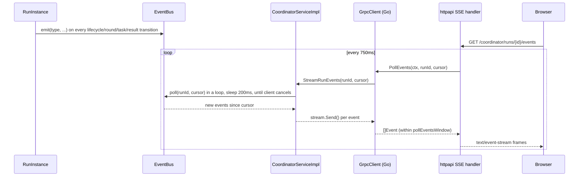

# Event Streaming

## Event flow

`CoordinatorEventType` (22 values: `kRunCreated`, `kRunStarted`,
`kRoundStarted`, `kTaskAssigned`, `kClientResultAccepted`,
`kAggregationCompleted`, `kModelVersionUpdated`, `kCheckpointCompleted`,
`kRunCompleted`, etc.) is emitted from `RunInstance::emit()`
(`run_manager.cpp`) at every one of those transitions — one call site
covers the whole lifecycle. `EventBus::publish`/`poll` (bounded,
per-run, in-order — oldest events dropped once a run's history exceeds
`capacity_per_run`, default 1000) is the domain-layer implementation;
`CoordinatorServiceImpl::StreamRunEvents` is a thin adapter that polls it
in a loop until the gRPC client cancels.

## The Go client bug this milestone found and fixed

`StreamRunEvents` is a genuinely long-lived server stream — it loops
until the client disconnects, never returning on its own. The Go client
(`grpc_client.go`'s `PollEvents`) is used from a poll-and-forward SSE
handler that expects a single call to return promptly with "whatever's
new right now." Without an internal deadline, the first version of
`PollEvents` blocked on `stream.Recv()` indefinitely — discovered only
by actually running the `api` and `coordinator` containers together in
docker-compose and watching `GET .../events` return zero bytes for
minutes.

**Fix 1**: wrap the call in `context.WithTimeout(ctx, pollEventsWindow)`.

**Fix 2, the subtler one**: classifying "my own window elapsed" (normal,
return events collected so far) vs. "a real transport error" (surface
it) cannot reliably use `pollCtx.Err()` or a specific grpc status code —
both were observed to be racy/inconsistent here. A local deadline expiry
surfaced, across otherwise-identical calls, as both
`codes.Unavailable`/"context deadline exceeded" and
`codes.DeadlineExceeded`/"Deadline Exceeded". The robust fix compares
elapsed wall-clock time against `pollEventsWindow` directly
(`time.Since(started) >= pollEventsWindow-50*time.Millisecond`), applied
at both the initial `stub.StreamRunEvents()` call and the `Recv()` loop
— the initial call itself, not just `Recv()`, was where the deadline was
observed to fire when connecting over the docker-compose bridge network.

## Why `pollEventsWindow` is 8 seconds

Empirically determined: a fresh gRPC stream from the Go client to
`coordinator:50051` over the docker-compose bridge network was observed
to take longer than 5s but well under 12s to yield its first message,
consistently, across repeated fresh-process test runs. The same call
against the coordinator's *host-published* port (`127.0.0.1:50051` from
outside Docker) and the equivalent call from the Python worker
container's gRPC client (over the identical bridge network and
hostname) did not show this delay — ruling out both "coordinator not
actually ready" and "generic docker-bridge-network gRPC problem." IPv6/
DNS happy-eyeballs was checked and ruled out (`getent hosts coordinator`
returns exactly one A record, no AAAA). Root cause not fully pinned down
within this milestone's time budget; 8s was chosen with margin over the
observed failure/success boundary and confirmed reliable across repeated
runs through the actual `api` container (not just the debug harness) —
see [known-limitations.md](known-limitations.md).

Practical consequence: the SSE stream's first event(s) for a given
connection can take up to ~8s to appear if the underlying gRPC channel
is cold. Once warm (the `api` process's channel is long-lived, dialed
once at startup), subsequent polls return promptly.

## Client-side (web)

`web/lib/coordinator-events.ts` uses `fetch()` + `ReadableStream`, not
the native `EventSource` API — `EventSource` cannot set an
`Authorization` header, and every coordinator route requires a bearer
token like the rest of the API. `subscribeToCoordinatorEvents()`
reconnects on stream end/error with backoff, resuming from the last-seen
`event_id`; `web/features/runs/coordinator-status-panel.tsx` caps
in-memory event history at `MAX_EVENT_HISTORY = 25`.
