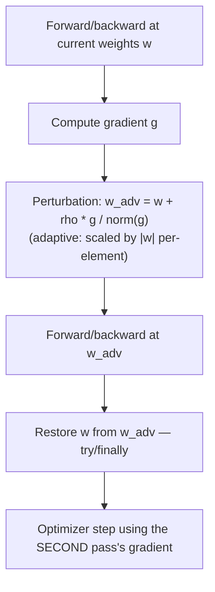

# FedSAM

**Status: implemented & tested.** Source: `python/src/fl_platform/algorithms/fedsam.py`.
Tests: `python/tests/test_algorithm_expansion_foundations.py`'s `FedSamTests`
(three tests: finite update + rho-matching perturbation norm, rejects
non-positive rho, parameters restored after training even with a no-op
optimizer step). Also exercised end-to-end (submission → coordinator →
aggregation) by `tests/baseline/test_algorithm_expansion_integration.py`.

## What it is

Sharpness-Aware Minimization (Foret et al., 2021) applied per-batch
during federated local training. The idea: instead of minimizing the
loss at the current weights, minimize the loss at the *worst point in a
small neighborhood* around the current weights — this tends to find
flatter minima, which are believed to generalize better.

## Per-batch algorithm

The restoration in step E runs inside a `finally` block: if the second
forward/backward raises (non-finite loss, cancellation), the model is
still restored to its pre-perturbation weights before the exception
propagates. This was specifically tested
(`test_parameters_are_restored_after_second_pass`), because a bug here
would silently leave every subsequent batch training from a perturbed
starting point.

## Config (`FedSamConfig`)

| Field | Meaning | Validated by `validate_task` |
|---|---|---|
| `rho` | Perturbation radius | must be > 0 |
| `adaptive` | Scale perturbation by `\|w\|` per-element (ASAM) | — |
| `local_epochs` | Epochs per round | must be > 0 |
| `max_perturbation_norm` | Optional cap on perturbation size | — |
| `fail_on_non_finite` | Whether a non-finite gradient aborts the batch or the whole task | — |

Go mirrors the `rho > 0` / `local_epochs > 0` checks in
`go/internal/algorithms`'s `ValidateConfig`, so a misconfigured
experiment is rejected at creation time, not at round 1 — see
[algorithm-expansion-architecture.md](algorithm-expansion-architecture.md).

## Aggregation mapping

FedSAM submits a FedAvg-shaped delta (the base optimizer's parameter
update after the second pass) — no new C++ aggregation math was needed;
`AggregationAlgorithm::kFedSam` maps to the same `WeightedAggregator` as
`kFedAvg`/`kFedProx` (see `cpp/core/src/aggregation.cpp`).

## Performance

FedSAM's two passes make it strictly more expensive per batch than
FedAvg — measured at ~1.86× FedAvg's median per-round latency on
`GroupNormCNN` (see [benchmarking.md](benchmarking.md)'s the Algorithm Expansion phase
section). **No claim is made that FedSAM converges faster, better, or to
a more accurate model than FedAvg** — this phase measures training
compute cost only, not convergence quality.
