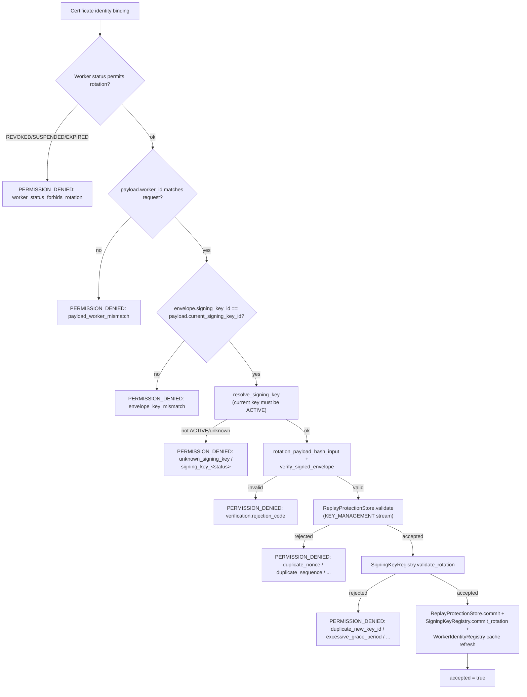

# Signed Worker Key Rotation

**Status: Implemented and Validated end-to-end, live, over real
mTLS**, using the actual production `GrpcCoordinatorClient.rotate_signing_key()`
method. See `cpp/coordinator/src/coordinator_service.cpp`'s
`RotateWorkerSigningKey`, `python/src/fl_platform/security/signing_key_rotation.py`,
and `python/src/fl_platform/worker/coordinator_client.py`'s
`rotate_signing_key`.

## The contract

`fl.worker.v1.WorkerKeyRotationPayload` (new message, 7 domain fields:
`schema_version`, `worker_id`, `current_signing_key_id`,
`new_signing_key_id`, `new_public_key_hex`, `new_key_expires_at_unix_s`,
`requested_grace_period_seconds`) is wrapped in the existing
`SignedWorkerEnvelope` with `message_type = MESSAGE_TYPE_KEY_ROTATION_REQUEST`
and `message_stream = MESSAGE_STREAM_KEY_MANAGEMENT` -- both enum
values were already reserved, unused, since the prior slice's own
forward-provisioned enum. Deliberately does **not** carry
nonce/sequence_number/signing_key_id/payload_hash/signature directly on
the payload message itself -- the same envelope-reuse simplification
already made twice (client results, privacy records) rather than a
third, independent signature mechanism. New RPC:
`RotateWorkerSigningKey(RotateWorkerSigningKeyRequest) returns (RotateWorkerSigningKeyResponse)`.

## Why the CURRENT key must sign

The envelope's `signing_key_id` must equal `payload.current_signing_key_id`
-- enforced explicitly before any other check. Only an already-trusted,
currently-`ACTIVE` key may authorize its own successor; an unknown or
not-yet-registered key can never bootstrap trust for itself. This is
the entire security property a rotation protocol needs to provide.

## Verification pipeline (`RotateWorkerSigningKey`)

## Python worker-side flow

`GrpcCoordinatorClient.rotate_signing_key(worker_id, new_identity, ...)`:

1. Caller generates a fresh keypair
   (`signing_key_rotation.generate_rotated_signing_identity`) and
   persists its private key **before** calling this method
   (`signing_key_rotation.save_keyed_signing_identity`, keyed by
   `(worker_id, key_id)` so multiple keys can coexist on disk during a
   grace period -- deliberately a *new* module, not a modification of
   `signing_identity.py`'s existing single-file-per-worker
   `save_signing_identity`, per the standing "do not rewrite working
   signed capabilities/envelopes without a proven defect" instruction).
2. Builds and signs a real rotation request with the **current**
   identity.
3. Submits it. Only if `response.accepted` does the client mark
   `new_identity` as its `_signing_identity` going forward -- a
   rejected rotation leaves the worker still signing with its old,
   still-valid key, never left in a broken, keyless state.

## Live validation

See [signing-key-management.md](signing-key-management.md)'s "Live
validation" section for the full 16-scenario account. Specific to
rotation: a real signed rotation request was accepted; the new key
became `ACTIVE` immediately; the previous key entered `GRACE_PERIOD`;
messages signed with either key were accepted during the grace window;
after the grace period genuinely elapsed (a real 5-second wait, not a
simulated clock), a message signed with the now-expired old key was
rejected with a message naming its exact expired status.

## What is deferred

* No automatic/background rotation trigger -- a worker (or an
  operator) must explicitly call `rotate_signing_key()`; nothing
  proactively rotates a key approaching its own `expires_at_unix_s`.
* No local `WorkerKeyRotationState` file is actually wired into
  `GrpcCoordinatorClient`'s own rotation flow yet -- the
  `signing_key_rotation.WorkerKeyRotationState`/`load_rotation_state`/
  `save_rotation_state` helpers exist and are unit-tested, but
  `rotate_signing_key()` currently tracks "which key is preferred"
  only in the in-memory `_signing_identity` attribute for the lifetime
  of the client object, not yet persisted to that state file across a
  worker process restart. A real, disclosed gap: a worker process that
  crashes and restarts mid-grace-period would need to be told again
  which key sequence-state file/identity to prefer, rather than
  recovering it automatically from disk.
* Old private-key cleanup after grace-period expiry is not automated
  -- `save_keyed_signing_identity`'s files are never deleted by this
  pass; an operator or a future pass would need to remove them
  according to whatever retention policy is chosen.
