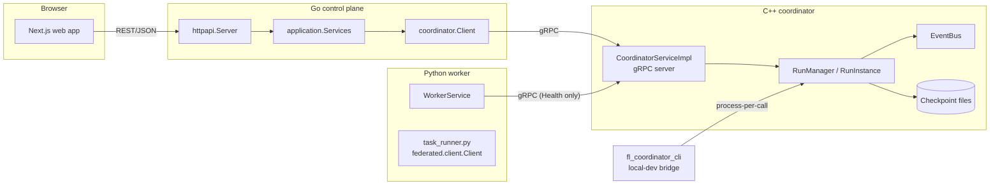

# Milestone 3 Architecture

Milestone 3 adds a production-shaped coordinator runtime and real
cross-language communication on top of Milestone 2's C++ aggregation
core. This document is the map; see the linked docs for each subsystem's
detail.

## Component map

Two coordinator front ends exist for the same `RunManager`/`RunInstance`
domain layer: the real gRPC server (`cpp/coordinator/main.cpp`,
CI/Docker-only — see [docker-runtime.md](docker-runtime.md)) and the
local-development CLI bridge (`cpp/coordinator/tools/coordinator_cli.cpp`,
what actually runs on this Windows/MSVC machine — see
[coordinator-runtime.md](coordinator-runtime.md)). Neither is a stub:
both drive the identical domain objects through identical method calls.

## What's real vs. deferred

| Deliverable | Status |
|---|---|
| C++ coordinator domain layer (run lifecycle, round lifecycle, task leasing, SCAFFOLD state, checkpoint/recovery, event bus) | Real, unit-tested (5/5 CTest suites) |
| gRPC contracts (`proto/coordinator`, `proto/worker`, `proto/events`) | Real, compiled for real in `infra/docker/cpp-coordinator.Dockerfile` |
| C++ gRPC server (`fl_coordinator_grpc_server`) | Real; built and run in Docker this milestone (previously CI-only, unverified — see [docker-runtime.md](docker-runtime.md)) |
| Go gRPC client (`go/internal/coordinator`) | Real; exercised end-to-end against the live coordinator container |
| Go HTTP↔coordinator wiring (`/api/v1/coordinator/...`, `/api/v1/system/coordinator-health`) | Real |
| Python worker gRPC client | `Health()` only — see [python-worker.md](python-worker.md) |
| Cross-language integration tests (`tests/baseline/test_coordinator_worker_integration.py`) | Real, 9/9 passing, via the CLI bridge (checkpoint-continuity substitute for a locally-buildable gRPC server — see [coordinator-runtime.md](coordinator-runtime.md)) |
| Web coordinator status panel | Real, polling + SSE, bounded event history |
| Docker Compose coordinator + worker services | Real, built and run end-to-end this milestone |
| Prometheus `/metrics` on the Go API | Real, added this milestone (previously a broken scrape target) |

## Cross-cutting flows

See [event-streaming.md](event-streaming.md) for the event flow diagram,
[coordinator-recovery.md](coordinator-recovery.md) for the recovery
sequence, and [task-leasing.md](task-leasing.md) for the task
acquire/submit flow.
