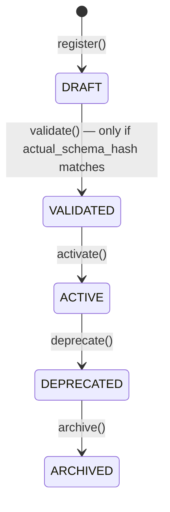

# Model Registry

**Status: implemented & tested, both languages.** Python source:
`python/src/fl_platform/models/model_registry.py`. Go source:
`go/internal/models` (domain), `go/internal/application/model_service.go`
(service layer + audit logging), `go/internal/transport/httpapi/model_handlers.go`
(HTTP). Tests: `ModelRegistryTests` (Python), `internal/models`'s
repository tests and `internal/application`'s `model_service_test.go`
(Go, 7 tests), `TestModels*` in
`internal/transport/httpapi/registry_handlers_test.go` (Go HTTP layer).
Additionally validated live against a Docker stack — see
[algorithm-expansion-validation.md](algorithm-expansion-validation.md).

## Why two independent implementations

Python's registry is the one actually consulted during training
(`resolve_for_task`, called by a worker choosing which registered model
version to load). Go's is the one the web dashboard and any external
tooling talks to. They are **not** the same process and do not share
storage — per this project's language boundaries (see
[algorithm-expansion-architecture.md](algorithm-expansion-architecture.md)), Go never
runs Python code, so Go re-implements the same domain rules (status
machine, schema-hash validation) rather than calling into Python's
registry over some new RPC. Both are unit-tested against the same
behavioral contract; see the audit note in
[known-limitations.md](known-limitations.md) about the two persisting to
different on-disk layouts (Python: one file per name+version; Go: one
combined JSON file, mirroring the pre-existing `projects`/`experiments`
pattern).

## Status machine (identical in both languages)

Strictly linear, one step at a time — no skipping (DRAFT can't go
directly to ACTIVE) and no going back. Both implementations reject an
illegal transition with a specific error
(`ModelRegistryError`/`ErrInvalidModelTransition`) rather than silently
no-oping.

## Schema-hash validation

`validate()` transitions DRAFT → VALIDATED only if a caller-supplied
*actual* schema hash (computed from a real constructed model instance —
see [shared-backbone-local-head.md](shared-backbone-local-head.md)'s
`compute_schema_hash`) matches the hash recorded at registration time. A
mismatch means the registered metadata does not describe a model that
can actually be built as claimed, and is rejected — not silently marked
valid.

## `resolve_for_task` (Python only)

Finds the ACTIVE version of a named model that declares support for a
given algorithm — raises rather than silently falling back to a DRAFT/
DEPRECATED version, or one that never declared support for that
algorithm. If more than one ACTIVE version somehow supports it (a
registry might deliberately run two active model variants side by side
for a comparison), the highest version string wins. Go's `ModelService`
mirrors this exact selection rule
(`ResolveForTask` in `model_service.go`), though nothing in the Go
control plane calls it yet — it exists for API/future-tooling parity
with Python's actual usage.

## Fields (`ModelRegistryEntry` / Go's `Model`)

| Field | Meaning |
|---|---|
| `name`, `version` | Registry key |
| `architecture_name` | e.g. `"groupnorm_cnn"`, `"personalizable_bridge"` |
| `input_channels`, `num_classes`, `normalization` | Architecture parameters |
| `parameter_count` | Total parameter count |
| `state_dict_schema_hash` | See above |
| `aggregatable_parameter_names` / `personalizable_parameter_names` | See [shared-backbone-local-head.md](shared-backbone-local-head.md) |
| `supported_datasets`, `supported_algorithms` | Declared compatibility |
| `checkpoint_reference` | Opaque string pointing at where actual weights live (e.g. a `PersonalizedModelStore` artifact path) — never dereferenced by the registry itself; **no tensor values are ever stored in the registry** |
| `checksum` | Caller-supplied integrity reference for whatever `checkpoint_reference` points at |

## Go HTTP API

`GET/POST /api/v1/models`, `GET /api/v1/models/{name}/{version}`,
`POST /api/v1/models/{name}/{version}/{validate,activate,deprecate,archive}`.
Write routes require Researcher/Admin (same RBAC tier as
projects/experiments); read routes allow any authenticated role. Every
mutation is audit-logged (`model.register`, `model.transition`).
