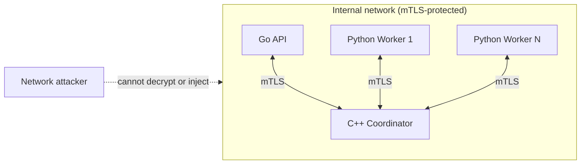
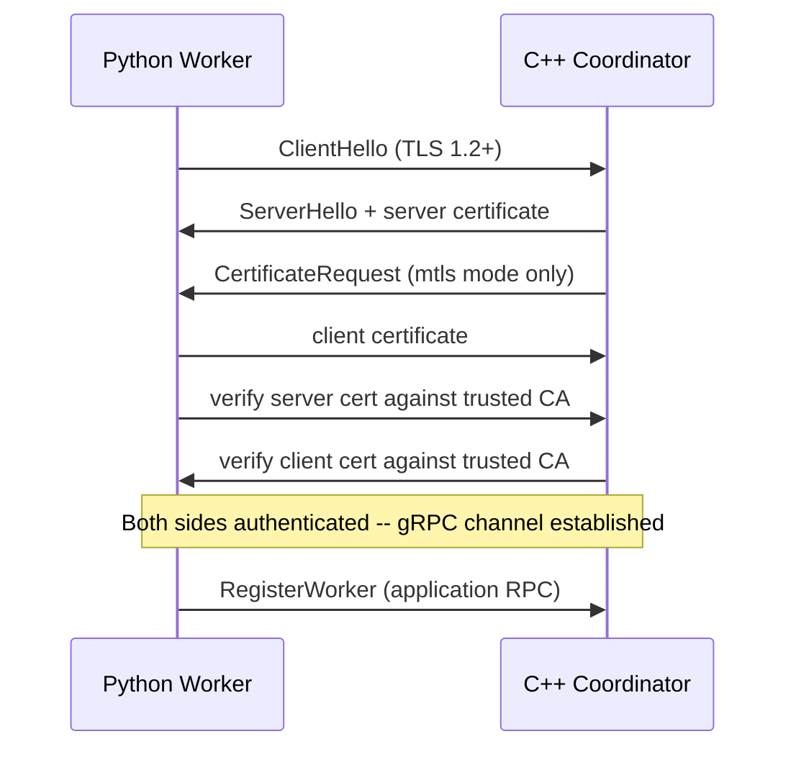

# mTLS

**Status: mixed — see the per-language table below.** Go-to-coordinator
and Python-worker-to-coordinator credential construction are
Implemented and Validated (real local handshake tests). C++
coordinator-side credential construction is Implemented but Not
Locally Verified (no gRPC C++ toolchain on this development machine —
see [known-limitations.md](known-limitations.md)). No live three-way
mTLS session (Go + Python worker + real C++ coordinator, all
simultaneously) has been run — that requires Docker and is deferred to
the next pass.

## Trust boundary



Every internal gRPC connection is client *and* server authenticated
once mTLS mode is selected — no service silently trusts the network
itself. Insecure (plaintext) transport remains available, strictly as
an explicit, named opt-in for local development.

## Transport modes

| Mode | Meaning |
|---|---|
| `insecure_development` | Plaintext gRPC — this project's pre-existing default. Requires an explicit opt-in in every language (see below); never silently selected for `Insecure: false`/`insecure=False`/unset `FL_TRANSPORT_MODE` combined with a missing config. |
| `tls` | Server-authenticated TLS — the client verifies the server's certificate against a trusted CA, but presents no client certificate of its own. |
| `mtls` | Mutual TLS — both sides present and verify certificates. The intended production mode. |

## Environment variables (consistent across all three languages)

```text
FL_TRANSPORT_MODE=insecure_development|tls|mtls
FL_ALLOW_INSECURE_DEVELOPMENT_TRANSPORT=true   # required for insecure_development
FL_COORDINATOR_CA=/path/to/ca.cert.pem          # required for tls/mtls
FL_COORDINATOR_CLIENT_CERT=/path/to/cert.pem    # required for mtls
FL_COORDINATOR_CLIENT_KEY=/path/to/key.pem      # required for mtls
FL_COORDINATOR_SERVER_NAME=spiffe://federated-platform/service/coordinator
```

The C++ coordinator (server side) uses the mirrored set:

```text
FL_TRANSPORT_MODE=insecure_development|tls|mtls
FL_ALLOW_INSECURE_DEVELOPMENT_TRANSPORT=true
FL_COORDINATOR_SERVER_CERT=/path/to/coordinator.cert.pem
FL_COORDINATOR_SERVER_KEY=/path/to/coordinator.key.pem
FL_COORDINATOR_CLIENT_CA=/path/to/ca.cert.pem   # required for mtls only — verifies Go/worker client certs
```

Every one of the three implementations refuses to start/construct a
client in `insecure_development` mode without the explicit opt-in
variable, and refuses `tls`/`mtls` mode without a fully populated
certificate configuration — there is no code path that falls back to
insecure credentials on a missing or misconfigured secure setting.

## Per-language status

### Go (`go/internal/coordinator/transport.go`, `grpc_client.go`)

Implemented and Validated. `buildTLSConfig`/`buildTransportCredentials`
load certificates via `tls.LoadX509KeyPair` and a `x509.CertPool`,
build a real `*tls.Config` (`MinVersion: tls.VersionTLS12` by default),
and wrap it via `credentials.NewTLS`. `NewGrpcClient` fails closed:
`Insecure: false` with a `nil` `TLS` config is a construction error, not
a silent insecure fallback. `cmd/api/main.go`'s `coordinatorConfigFromEnv`
wires the environment-variable contract above, refusing insecure
startup without the explicit opt-in.

**Validated via a real local mTLS handshake** (`transport_test.go`):
certificates generated fresh via Go's own `crypto/x509` for every test
run (not depending on `scripts/pki`'s gitignored output existing), a
real `tls.Listen` server, and a real `tls.Dial` client — 11 tests
covering successful mTLS, untrusted-CA rejection, missing-client-cert
rejection under `RequireAndVerifyClientCert`, mismatched cert/key
rejection, and `TransportMode` reporting (`mtls` vs `tls` based on
whether a client certificate is configured).

### Python worker (`fl_platform/security/transport.py`, `coordinator_client.py`)

Implemented and Validated. `build_channel_credentials`/
`build_secure_channel` load certificates via `grpc.ssl_channel_credentials`
(root CA, optional client cert+key). `GrpcCoordinatorClient.__init__`'s
`insecure=False` path now builds a real secure channel via this module
instead of raising `NotImplementedError`; still requires `tls_config`
to be explicitly supplied.

**Validated via a real local mTLS RPC round trip**
(`test_worker_transport.py`): certificates generated fresh via the
`cryptography` package, a real Python gRPC server (implementing a
minimal `CoordinatorServiceServicer.Health`) secured with
`grpc.ssl_server_credentials(..., require_client_auth=True)`, and a
real client built via `build_secure_channel` — the `Health` RPC
genuinely round-trips over the secured channel. A second test proves an
untrusted CA is rejected. 8 tests total.

### C++ coordinator (`cpp/coordinator/src/transport_credentials.cpp`, `main.cpp`)

**Implemented, Not Locally Verified.** `transport_config_from_environment`/
`build_server_credentials` follow the documented, stable gRPC C++ SSL
credentials API (`grpc::SslServerCredentialsOptions`,
`grpc::SslServerCredentials`, `GRPC_SSL_REQUEST_AND_REQUIRE_CLIENT_CERTIFICATE_AND_VERIFY`
for the `mtls` mode) — carefully written and reviewed, but this
development machine has no local gRPC C++ toolchain (the same
pre-existing constraint documented for `fl_coordinator_grpc_server`
itself in [coordinator-runtime.md](coordinator-runtime.md)), so this
specific file has not been compiled, let alone run, in this
environment. It is gated into the build only alongside
`fl_coordinator_grpc_server` (built in CI/Docker via
`infra/docker/cpp-coordinator.Dockerfile`, which installs
`libgrpc++-dev` via apt) — the same place the rest of that target is
verified. **Do not treat this as validated until a CI/Docker build
confirms it compiles and a live mTLS handshake against it succeeds.**

## mTLS handshake sequence (once all three sides are live)



## Deferred

* A live three-way Docker Compose validation (Go + 2+ Python workers +
  real C++ coordinator, all under `mtls` mode) — see
  [transport-identity-report.md](transport-identity-report.md)'s
  recommended next steps.
* Certificate hot-reload / rotation-without-restart.
* Hostname/URI-SAN-based verification beyond the DNS-name-based
  `ssl_target_name_override`/`ServerName` mechanisms used in this
  pass's tests — full SPIFFE-URI identity matching would need a custom
  certificate verification callback in each language, not yet built.
