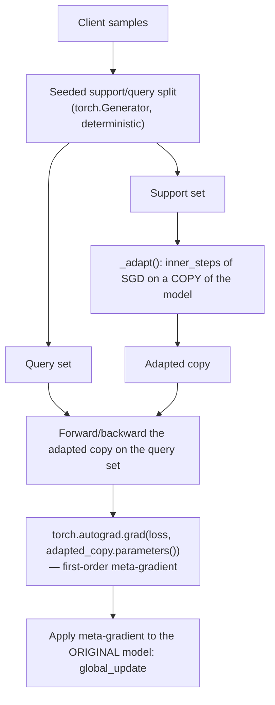

# Per-FedAvg (first-order)

**Status: implemented & tested.** Source:
`python/src/fl_platform/algorithms/per_fedavg.py`. Tests:
`python/tests/test_algorithm_expansion_foundations.py`'s `PerFedAvgTests`
(deterministic support/query split, finite meta-update, small-client
fallback skips rather than crashing, post-adaptation evaluation runs).
Also exercised end-to-end by
`tests/baseline/test_algorithm_expansion_integration.py`.

## What it is

The first-order variant of Fallah et al. (2020)'s Per-FedAvg — a
Model-Agnostic Meta-Learning (MAML)-style personalization algorithm.
Instead of training toward one shared minimum, it trains toward a model
that is *easy to personalize*: one gradient step of adaptation on a
client's own data should already improve performance substantially. The
"first-order" simplification (this phase's only supported mode —
`validate_task` rejects `first_order_mode=False`) approximates the true
MAML meta-gradient (which requires second derivatives through the inner
loop) by computing the meta-gradient directly on an *adapted copy* of
the model, without differentiating through the adaptation steps
themselves — much cheaper, at the cost of an approximation.

## Training flow

The critical implementation detail: the meta-gradient is computed via
`torch.autograd.grad` on the **adapted copy's** parameters, evaluated on
the **query set** — never by differentiating through the inner
adaptation loop itself (that would be true second-order MAML). This is
what "first-order" means operationally, not just a config flag.

## Small-client fallback

`minimum_samples_required` (must be ≥ 2: at least one support, one query
sample) guards against a client with too few samples to split
meaningfully. `fallback_behavior` controls what happens when a client
falls short:

* `"skip"` (default): the client contributes nothing this round
  (`sample_count=0`, `skipped_client=1.0` in `algorithm_metrics`) —
  tested explicitly (`test_small_client_fallback_skips_rather_than_crashing`).
* `"support_only"`: falls back to training on the support set alone.

## Config (`PerFedAvgConfig`)

| Field | Meaning | Validated by `validate_task` |
|---|---|---|
| `support_query_split_ratio` | Fraction of samples used as support | must be in (0, 1) |
| `minimum_samples_required` | Minimum client samples | must be ≥ 2 |
| `inner_steps` / `meta_steps` | Inner adaptation / outer meta-update steps | — |
| `first_order_mode` | Must be `True` this phase | must be `True` |

Go mirrors the split-ratio range and minimum-sample checks in
`go/internal/algorithms`.

## Evaluation

`evaluate()` runs `adaptation_steps_eval` steps of the same inner
adaptation on the evaluation partition before measuring accuracy —
`personalized_model_local_accuracy` reflects the *adapted* model, not the
raw global model, since that is the actual point of the algorithm (see
`test_post_adaptation_evaluation_runs`).

## Aggregation mapping

Only the meta-gradient-derived `global_update` crosses into aggregation;
`AggregationAlgorithm::kPerFedAvg` maps to the same `WeightedAggregator`
as FedAvg.

## Performance

Measured between FedAvg and Ditto on `GroupNormCNN` (129.0ms vs. FedAvg's
93.5ms and Ditto's 200.0ms) — one model trained, but with an extra inner
adaptation pass plus a first-order meta-gradient computation on top of a
single forward/backward. See [benchmarking.md](benchmarking.md).
