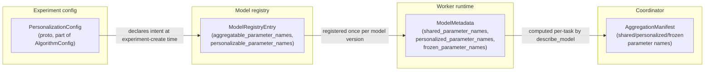

# Personalization Config and Model Metadata

**Status: implemented & tested** (proto message defined and consumed;
the underlying Python metadata it describes is implemented and tested —
see below). Source: `proto/experiment/experiment.proto`'s
`PersonalizationConfig` message,
`python/src/fl_platform/models/personalization.py`'s `ModelMetadata`.

This doc exists to tie together three things that are each documented in
depth elsewhere, since a run's experiment config, a model's registry
entry, and the in-memory `ModelMetadata` a worker computes all describe
the *same* shared/personalized/frozen parameter split from three
different angles:

## `PersonalizationConfig` (proto)

Part of `AlgorithmConfig` (`proto/experiment/experiment.proto`), set only
when the run's algorithm actually personalizes (Ditto, Per-FedAvg — see
[ditto.md](ditto.md), [per-fedavg.md](per-fedavg.md)):

| Field | Meaning |
|---|---|
| `mode` | `"none"` \| `"shared_backbone_local_head"` \| `"full_personalized_model"` |
| `backbone_parameter_prefixes` | Which parameter-name prefixes are shared/aggregated |
| `personalization_head_parameter_prefixes` | Which prefixes stay local |
| `frozen_parameter_prefixes` | Which prefixes never change at all (neither aggregated nor personalized-trained) |
| `checkpoint_retention_policy` | How many personalized checkpoint versions to keep (see [personalized-model-store.md](personalized-model-store.md)'s `max_retained_versions`) |
| `local_model_initialization_policy` | Corresponds to Ditto's `warm_start_policy` (see [ditto.md](ditto.md)) |
| `global_to_local_sync_policy` | Reserved for a future policy on how much of the global model's update propagates into the personalized model between rounds — not read by any the Algorithm Expansion phase algorithm today |

`mode` documents intent for the web experiment builder and any future
config-driven dispatch; the actual enforcement of "which parameters may
be aggregated" happens at the coordinator via the `AggregationManifest`
(see [aggregation-manifests.md](aggregation-manifests.md)), not by
parsing this proto message at runtime — the C++ coordinator never parses
`PersonalizationConfig` at all, consistent with "coordinator has no ML
knowledge."

## `ModelMetadata` (Python, computed per model instance)

See [shared-backbone-local-head.md](shared-backbone-local-head.md) for
the full utility set (`describe_model`, `compute_schema_hash`,
`parameter_names_with_prefix`, etc.) that produces this. The key point
this doc adds: `ModelMetadata.shared_parameter_names`/
`personalized_parameter_names`/`frozen_parameter_names` are **computed
from an actual constructed model instance** (via `state_dict()` prefix
matching), not copied from `PersonalizationConfig`'s prefix *strings* —
so a typo'd prefix in the experiment config produces an empty name list
at model-construction time rather than silently matching nothing and
looking correct. `ModelRegistryEntry.aggregatable_parameter_names`/
`personalizable_parameter_names` (see
[model-registry.md](model-registry.md)) store this same computed list
for reuse without reconstructing the model.
