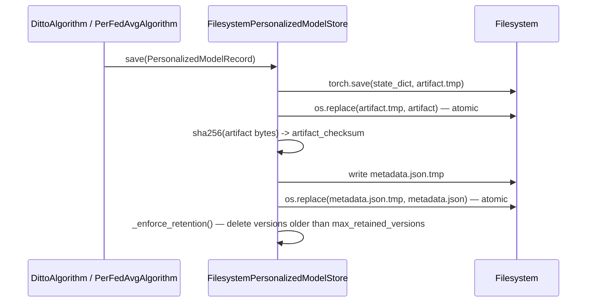

# Personalized Model Store

**Status: implemented & tested.** Source:
`python/src/fl_platform/personalization/store.py`. Tests exercise save/
load round-trips, ownership rejection, schema mismatch rejection, and
checksum corruption detection (see `python/tests` and the security audit
below). Persistence-across-restart is validated at the C++ checkpoint
layer (`personalization_summary_test.cpp`) and the Python cross-language
level (`test_algorithm_expansion_integration.py`).

## Why a separate store from the global model checkpoint

The C++ coordinator's existing checkpoint mechanism
(`AggregatorCheckpointStore`, the Aggregation Core phase) persists the *global* model
and aggregator state — a single object every client's update
contributes to. A personalized model (Ditto's/Per-FedAvg's per-client
adapted state) is fundamentally different: **N clients × M algorithm
versions**, never aggregated, and never touched by the coordinator at
all (personalization is a worker-and-Go-application-layer concept — see
[algorithm-expansion-architecture.md](algorithm-expansion-architecture.md)'s language
boundaries). It needed its own store.

## Filesystem layout

```text
{root}/{run_id}/{client_id}/{algorithm}.json     -- metadata
{root}/{run_id}/{client_id}/{algorithm}.v{N}.pt  -- tensor artifact, N = version
```

## Write path (atomic, checksummed)



The same "write to a temp sibling file, then atomically `os.replace`"
pattern as the Aggregation Core phase's `AggregatorCheckpointStore` (C++) and Phase
3's `FilesystemClientAlgorithmStateStore` — a crash mid-write never
leaves a partially-written artifact where a real path is expected.

## Read path (ownership, schema, checksum all checked before deserializing)

```mermaid
flowchart TD
    A[load(run_id, client_id, algorithm)] --> B{metadata.json exists?}
    B -->|no| C[return None]
    B -->|yes| D{stored run_id/client_id == requested?}
    D -->|no| E[raise PersonalizedModelOwnershipError]
    D -->|yes| F{expected_architecture / expected_schema_hash match?}
    F -->|no| G[raise PersonalizedModelSchemaError]
    F -->|yes| H[read artifact bytes, sha256]
    H --> I{checksum matches metadata?}
    I -->|no| J[raise PersonalizedModelCorruptionError]
    I -->|yes| K["torch.load(weights_only=True)"]
    K --> L[return PersonalizedModelRecord]
```

Every failure mode returns a specific, distinct exception type — a
caller can tell "no personalized model yet" (`None`, not an error) apart
from "this metadata doesn't belong to the client that asked for it"
(ownership) from "this checkpoint is for the wrong model shape" (schema)
from "this artifact is truncated/tampered" (corruption).

## Security (Work Package P)

See [algorithm-expansion-security-audit.md](algorithm-expansion-security-audit.md) for
the full audit. Summary specific to this store:

* **Path traversal**: every path segment (`run_id`, `client_id`,
  `algorithm`) is validated against `^[A-Za-z0-9_.-]+$` before touching
  the filesystem (`_validate_id`).
* **Unsafe deserialization**: `torch.load(..., weights_only=True)`
  restricts unpickling to tensor data — no arbitrary object graph or
  code execution, even if an artifact file were replaced by an attacker
  with filesystem access.
* **Tamper/corruption**: SHA-256 checksum computed at save time,
  re-verified at load time *before* `torch.load` runs.
* **No encryption at rest, no per-client access control beyond the
  filesystem itself.** A personalized model may memorize client-specific
  patterns more than a purely aggregated global model — this is called
  out explicitly in [known-limitations.md](known-limitations.md) as a
  real, unaddressed risk for any deployment where the storage filesystem
  isn't already a trust boundary.

## `PersonalizedModelCache`

A bounded (`max_entries`, default 8), worker-local LRU cache in front of
the store — avoids re-reading/re-loading a client's checkpoint on every
task when the same worker serves that client repeatedly across rounds.
Tracks `hits`/`misses` for the observability metrics named in
[known-limitations.md](known-limitations.md)'s Work Package O notes.
