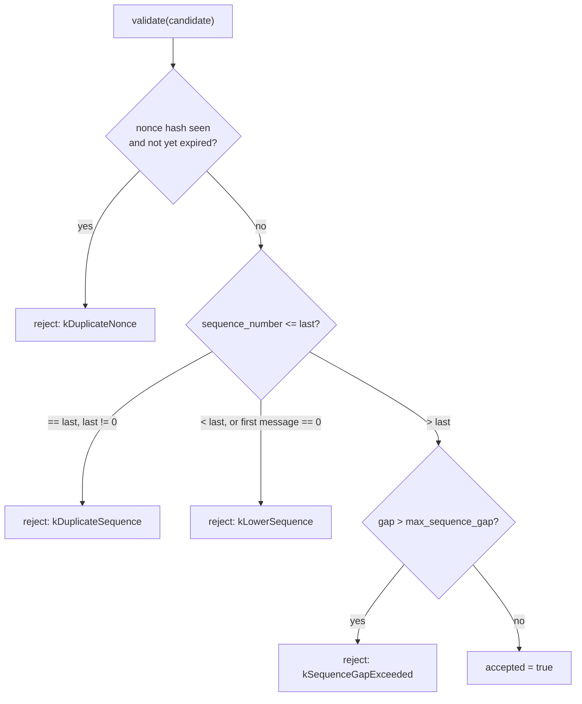

# Replay Protection

**Status: Implemented and Validated, including surviving a real
coordinator restart.** `ReplayProtectionStore`
(`cpp/coordinator/include/fl_coordinator/replay_protection_store.hpp`,
`.cpp`) is real, unit-tested via MSVC on this development machine, and
wired into `Heartbeat`'s live verification pipeline — validated against
a real containerized coordinator, including a real `docker restart`
mid-test.

## What this is

A restart-safe store of, per `(worker_id, signing_key_id, message_stream)`
**track**: the last accepted sequence number (see
[message-sequences.md](message-sequences.md)) and a bounded set of
recently-used nonce hashes. `validate()` answers "would this candidate
message be accepted"; `commit()` records it as accepted. The two are
deliberately separate calls — see
[signed-worker-envelopes.md](signed-worker-envelopes.md)'s verification
pipeline diagram for why `commit()` is only ever called after every
other acceptance condition (signature, expiry, worker status, domain
processing) has already succeeded.

## Bounded by construction

`kMaxNonceEntriesPerTrack = 256` (oldest-first eviction beyond that,
independent of `purge_expired`'s time-based cleanup) and
`kMaxTracks = 10000` (least-recently-updated track evicted to make room
for a new one). Never an unbounded `map`/`set` — the specification's
explicit requirement. Track eviction is a graceful-degradation policy,
not a security boundary: it only ever narrows replay-history coverage
(at worst re-permitting a sequence number an evicted track had already
used), never grants a capability an attacker didn't already have from a
live, valid signing key.

## Nonce hashing, not raw retention

Nonces are hashed with the same FNV-1a convention already used
throughout this codebase for internal bookkeeping (not a cryptographic
primitive — see `worker_identity_registry.cpp`'s identical choice) —
this store's actual security guarantee comes from the Ed25519 signature
already covering the nonce's real value (verified by the caller before
this store is ever consulted), not from anything the store itself does
with the nonce string. Hashing here is purely a storage-minimization
choice: retaining every raw nonce string indefinitely would be strictly
worse for memory with no security benefit.

## Persistence

Same pattern as `WorkerIdentityRegistry`: atomic temp-file-then-rename
writes, tab-separated one-line-per-track records, an FNV-1a checksum
trailer, `ReplayProtectionStoreError` thrown (never a silent empty
start) on a truncated or checksum-mismatched file.

## Sequence-gap policy

The only policy this pass implements is a fixed, configurable-at-
construction `max_sequence_gap` (default 1000) — reject anything more
than that many sequence numbers ahead of the last accepted one, applied
uniformly including to a track's very first message (so the documented
starting value of 1 is really enforced, not just conventional — sending
sequence 5000 as a brand-new worker's first heartbeat is rejected the
same as any other excessive gap). A more permissive, accept-with-warning
gap policy is not implemented.

## Worker-revocation cleanup

`purge_worker(worker_id)` removes every track for that `worker_id`
across all signing keys and streams — intended to be called once a
worker is `REVOKED` and can never send another acceptable message under
any key again, so its replay/sequence history no longer serves a
purpose. **Not currently called from anywhere** — no code path in
`coordinator_service.cpp` invokes `revoke()` at all yet (see
[worker-revocation.md](worker-revocation.md)), so this method, while
implemented and unit-tested, has no live call site today.

## Validated (unit tests, `run_replay_protection_store_tests`)

The documented starting value (1) is accepted for a new track; sequence
0 is rejected; a duplicate sequence, a lower sequence, a reused nonce
within its retention window, and an excessive gap are each rejected
with the correct, distinct `ReplayRejectionReason`; a different signing
key or a different message stream for the same worker starts its own
fully independent track; sequence state survives reopening the store
from disk; `purge_expired` removes only expired nonce hashes, never
sequence-number protection; `purge_worker` resets a worker back to a
fresh state; a truncated/corrupt store file throws rather than silently
starting empty.

## Validated live (real Docker container, real mTLS, real restart)

A duplicate heartbeat sequence number is rejected over the real
`Heartbeat` RPC; the next valid sequence number is accepted; a real
`docker restart` was performed mid-test, and the sequence number already
committed before the restart was confirmed still rejected after it,
while the next valid sequence number was confirmed still accepted —
proof the persisted file was correctly reloaded, not just that the code
compiles. See [signed-worker-envelopes.md](signed-worker-envelopes.md)'s
"Live end-to-end validation" section for the full scenario list.

## Updated: `CLIENT_RESULT` stream also live (Signed Client Results and Worker Lifecycle Enforcement slice)

`SubmitClientResult` now validates/commits against the `CLIENT_RESULT`
stream, using the exact same `ReplayProtectionStore` code — no new
store logic was needed, only a new call site in
`coordinator_service.cpp`, proving the store's stream-agnostic design
worked as intended. Live-validated: resubmitting an already-accepted
signed result is rejected (surfaced as the pre-existing domain-level
"duplicate result" check in this specific test, since the resubmission
used a fresh, still-valid envelope rather than replaying the identical
nonce/sequence — the replay-layer rejection path itself was separately
proven correct by the `Heartbeat` restart test in the prior slice,
using the identical store code this stream now shares).

## Updated: `PRIVACY_RECORD` stream also live (Privacy Record Authenticity, Signing-Key Lifecycle, and Coordinator-Signed Tasks slice)

Signed sample privacy records validate/commit against the
`PRIVACY_RECORD` stream — a third stream sharing this same store's
code unchanged, further confirming the stream-agnostic design. Commit
happens only after `RunInstance::submit_client_result` accepts the
result, identical to the `CLIENT_RESULT`/`HEARTBEAT` ordering rule. See
[signed-privacy-records.md](signed-privacy-records.md) for the full
verification pipeline.

## Updated: `KEY_MANAGEMENT` stream also live (Signing-Key Lifecycle slice)

Signed key-rotation requests validate/commit against the
`KEY_MANAGEMENT` stream — a fourth stream sharing this same store's
code unchanged. Live-validated as part of a real signed rotation
accepted through the actual production
`GrpcCoordinatorClient.rotate_signing_key()` code path. See
[key-rotation.md](key-rotation.md).

## What is deferred

* `TASK_LIFECYCLE` and `PERSONALIZATION` are still defined enum values
  with no producer or consumer.
* `RegisterWorker`'s `SignedCapabilityStatement` does not use this
  store — it still only checks expiry (see
  [signed-capabilities.md](signed-capabilities.md)); a captured,
  unexpired capability statement could still be replayed.
* `purge_expired`/`purge_worker` are never called automatically — no
  periodic sweep exists (consistent with `WorkerRegistry::sweep_unhealthy`'s
  identical caller-driven convention elsewhere in this codebase, but
  worth noting since nothing currently drives that caller).
* No audit events or Prometheus metrics are emitted on replay
  rejection.
