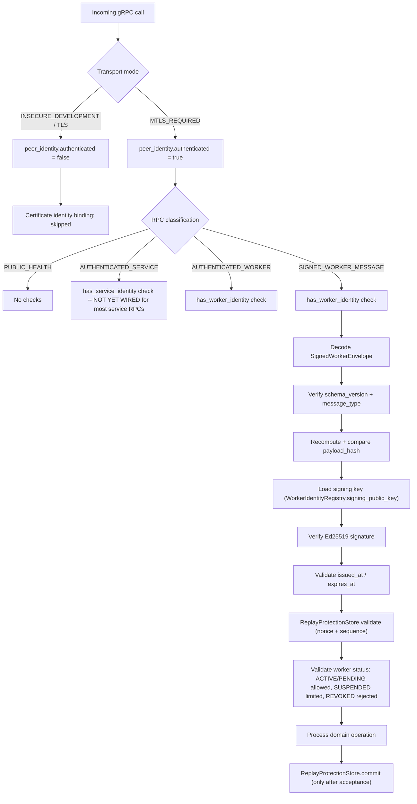

# RPC Security Policy

**Status: Implemented (classification + policy) for every RPC that
actually exists in this codebase, updated through the Coordinator-Signed
Tasks slice.** Originally written for the Message Authenticity
Enforcement and Identity Lifecycle slice; the Signed Client Results and
Worker Lifecycle Enforcement slice resolved
`GetRound`/`GetModelManifest`/`ReportTaskProgress` (all three
previously declared with no C++ handler), added certificate identity
binding to `AcquireTask`/`SubmitClientResult`, added worker-status
enforcement to `AcquireTask`/`Heartbeat`, and added five real
`ADMIN_CONTROL` RPCs (`GetWorkerIdentity`, `ListWorkerIdentities`,
`SuspendWorker`, `ActivateWorker`, `RevokeWorker`). The Privacy Record
Authenticity slice added independent signing/verification for the
sample-level privacy record carried alongside `SubmitClientResult` with
no new RPCs. The Signing-Key Lifecycle slice added three:
`RotateWorkerSigningKey` (`SIGNED_WORKER_MESSAGE`) and
`GetWorkerSigningKeys`/`RevokeWorkerSigningKey` (`ADMIN_CONTROL`) — see
[signing-key-management.md](signing-key-management.md).
**Coordinator-signed tasks are now implemented**, exactly the way this
document previously predicted: no new RPC method — `AcquireTask`'s
existing response now carries an additive `signed_task` field (see
[signed-coordinator-tasks.md](signed-coordinator-tasks.md)) — plus one
new `ADMIN_CONTROL` RPC, `GetCoordinatorSigningKeys`, for operational
visibility only. The Security Administration slice added
`RotateCoordinatorSigningKey`/`RevokeCoordinatorSigningKey`, and the
Security Operations and Administration slice added two more,
`GetTransportSecurityStatus`/`GetSecurityTrustModel`, plus — for the
first time — a real Go HTTP layer
([security-api.md](security-api.md)) enforcing its own
ADMIN/RESEARCHER/VIEWER/SERVICE permission matrix
([security-permission-model.md](security-permission-model.md)) on top
of these RPCs' gRPC-layer identity check. It classifies every RPC
declared in
`proto/coordinator/coordinator.proto`'s `CoordinatorService`, states
the enforcement each one requires, and — just as importantly — states
plainly which RPCs the parent specification assumed exist but do not,
so the rest of this slice is built against reality rather than an
assumed surface.

## A note on RPCs the specification names that do not exist here

The specification's worker-originated RPC list includes `AcceptTask`,
`ReportTaskFailure`, `SubmitSamplePrivacyRecord`,
`SubmitPersonalizationMetrics`, `DrainWorker`, and `WorkerShutdown`.
Verified directly against `proto/coordinator/coordinator.proto` (the
single source of truth for the RPC surface): **none of these six RPCs
are declared anywhere in this codebase.** Their concerns map onto the
RPCs that do exist as follows:

| Specification RPC | Actual mapping in this codebase |
|---|---|
| `AcceptTask` | Does not exist. `AcquireTask` both selects and hands out a task in one call — there is no separate acceptance step. |
| `ReportTaskFailure` | Does not exist. A failed task currently has no dedicated report path; a worker that fails simply does not call `SubmitClientResult` before its lease expires (see [worker-revocation.md](worker-revocation.md) and `task_dispatcher.hpp`'s lease-expiry handling). |
| `SubmitSamplePrivacyRecord` | Does not exist as a separate RPC. Sample-level privacy accounting is the embedded `SubmitClientResultRequest.sample_level_privacy` field (`fl.privacy.v1.SampleLevelLedgerEntry`), submitted together with the training result — but the accompanying `privacy_record_payload`/`privacy_record_envelope` fields (Privacy Record Authenticity slice) do give it an independent signature and verification pipeline distinct from the outer client-result envelope; see [signed-privacy-records.md](signed-privacy-records.md). |
| `SubmitPersonalizationMetrics` | Does not exist as a separate RPC. Personalization metrics are the embedded `SubmitClientResultRequest.personalization_metrics` field. |
| `DrainWorker` | Does not exist. No graceful-drain RPC exists yet in either direction. |
| `WorkerShutdown` | Does not exist. A worker disconnecting simply stops calling `Heartbeat`; the coordinator's `WorkerRegistry::sweep_unhealthy` eventually marks it `UNHEALTHY` on missed heartbeats (`cpp/coordinator/include/fl_coordinator/worker_registry.hpp`). There is no explicit "I am shutting down cleanly" signal. |

Adding real RPCs for these six is out of scope for this pass (it would
mean new C++ handlers, new Go/Python client wiring, and new tests for
capability this codebase has never had, on top of an already large
slice) — flagged here as a genuine gap, not silently worked around.
Everything below classifies the **23 RPCs that actually exist** (the
original 18 plus the 5 new `ADMIN_CONTROL` RPCs this slice added).

## Classification legend

```text
PUBLIC_HEALTH          — no authentication required
AUTHENTICATED_SERVICE  — requires a service-identity certificate (coordinator/go-api) when mTLS is active
AUTHENTICATED_WORKER   — requires a worker-identity certificate bound to the claimed worker_id
ADMIN_CONTROL          — requires an authorized administrative actor; proposed, not yet implemented at the gRPC level (see below)
SIGNED_WORKER_MESSAGE  — AUTHENTICATED_WORKER, plus a verified Ed25519-signed envelope over the message
```

## Worker-originated RPCs

| RPC | Classification | Transport mode | Certificate identity | Application identity | Signed envelope | Replay policy | Sequence stream | Status this slice |
|---|---|---|---|---|---|---|---|---|
| `RegisterWorker` | `SIGNED_WORKER_MESSAGE` | `MTLS_REQUIRED` (production) | `spiffe://federated-platform/worker/{worker_id}` | `worker_id` matches cert + `WorkerIdentityRegistry` (non-`REVOKED`) | `SignedCapabilityStatement` (already implemented — see [signed-capabilities.md](signed-capabilities.md)) | Expiry-only this pass (no persistent nonce store consulted yet — see below) | none yet | **Implemented and validated** (prior slice) |
| `Heartbeat` | `SIGNED_WORKER_MESSAGE` | `MTLS_REQUIRED` | `spiffe://federated-platform/worker/{worker_id}` | `worker_id` matches cert + registry `ACTIVE`/`PENDING`/`SUSPENDED` (see [worker-suspension.md](worker-suspension.md) for the suspended-heartbeat carve-out) | `SignedWorkerEnvelope` (`WORKER_HEARTBEAT`) | Persistent (`ReplayProtectionStore`) | `HEARTBEAT` | **Implemented and validated this slice** |
| `AcquireTask` | `AUTHENTICATED_WORKER` | `MTLS_REQUIRED` | `spiffe://federated-platform/worker/{worker_id}` | `worker_id` matches cert + registry status not `SUSPENDED`/`REVOKED` + no valid signing key blocked | Coordinator-signed since the Coordinator-Signed Tasks slice (`signed_task`, additive field) | N/A | `TASK_LIFECYCLE` (reserved for the worker→coordinator direction; the coordinator→worker `signed_task` uses its own `CoordinatorTaskSequenceStore`, not this stream) | **Updated**: certificate identity binding, `WorkerIdentityRegistry`/signing-key status checks, and now real Ed25519-signed responses (five configuration hashes + a task payload hash under one signature) — all live-validated. |
| `ReportTaskProgress` | `AUTHENTICATED_WORKER` | `MTLS_REQUIRED` | `spiffe://federated-platform/worker/{worker_id}` | `worker_id` matches cert; `lease_id` matches an active lease (searched across every run this process knows about) | Not implemented (deliberately — not required by the current live worker flow, see [message-authenticity-report.md](message-authenticity-report.md)) | N/A | `TASK_LIFECYCLE` (reserved) | **Updated this slice**: real handler added (delegates to the pre-existing `RunInstance::report_task_progress`), with certificate identity binding, compiled and unit-tested. Previously had no C++ handler at all (fell through to generic `UNIMPLEMENTED`). |
| `SubmitClientResult` | `AUTHENTICATED_WORKER` upgraded to `SIGNED_WORKER_MESSAGE` when `envelope` is present | `MTLS_REQUIRED` | `spiffe://federated-platform/worker/{worker_id}` | `worker_id` matches cert; registry status not `REVOKED`; `lease_id` matches an active lease | **`SignedWorkerEnvelope` (`CLIENT_RESULT`) — implemented and live-validated**, including real per-tensor checksum verification — see [signed-client-results.md](signed-client-results.md). **When `sample_level_privacy` is present, an independently signed `SignedSamplePrivacyRecord` (`SAMPLE_PRIVACY_RECORD`) is additionally required, verified, bound to the plaintext ledger entry, and checked for accountant-step/epsilon monotonicity and budget-decision consistency — implemented and live-validated** — see [signed-privacy-records.md](signed-privacy-records.md). | Persistent (`ReplayProtectionStore`, `CLIENT_RESULT` and `PRIVACY_RECORD` streams) | `CLIENT_RESULT`, `PRIVACY_RECORD` | **Fully implemented.** Certificate identity binding added (previously none). Both signed envelopes required by default; `FL_ALLOW_UNSIGNED_CLIENT_RESULTS=true`/`FL_ALLOW_UNSIGNED_PRIVACY_RECORDS=true` opt-ins preserve the respective legacy unsigned paths with a per-request WARNING log. Personalization metadata remains embedded (not independently signed) — see [payload-hashing.md](payload-hashing.md). |
| `ListWorkers` | `AUTHENTICATED_SERVICE` | `MTLS_REQUIRED` | `spiffe://federated-platform/service/go-api` (read-only, but not currently restricted to it) | none beyond transport | N/A (read-only) | N/A | N/A | Certificate identity binding not yet enforced (no `has_service_identity` check wired in) — unchanged this slice. |

## Service-originated RPCs

| RPC | Classification | Transport mode | Certificate identity | Notes |
|---|---|---|---|---|
| `CreateRun` | `AUTHENTICATED_SERVICE` | `MTLS_REQUIRED` | `spiffe://federated-platform/service/go-api` | No `has_service_identity` check wired in yet (same gap as `ListWorkers`) |
| `StartRun` / `PauseRun` / `ResumeRun` / `CancelRun` | `AUTHENTICATED_SERVICE` | `MTLS_REQUIRED` | `spiffe://federated-platform/service/go-api` | Same |
| `GetRun` | `AUTHENTICATED_SERVICE` | `MTLS_REQUIRED` | `spiffe://federated-platform/service/go-api` | Read-only |
| `GetRound` / `GetModelManifest` | `AUTHENTICATED_SERVICE` | `MTLS_REQUIRED` | `spiffe://federated-platform/service/go-api` | **Updated this slice**: both now return an explicit, documented `grpc::StatusCode::UNIMPLEMENTED` with a clear reason (no per-round history accessor exists for `GetRound`; no live caller needs `GetModelManifest`) — resolved per Work Package N's "do not leave an ambiguous empty success response" requirement, rather than silently falling through to gRPC's generic default. |
| `GetPersonalizationSummary` / `GetPrivacyMetrics` / `GetPrivacyLedger` / `GetPrivacyProjection` | `AUTHENTICATED_SERVICE` | `MTLS_REQUIRED` | `spiffe://federated-platform/service/go-api` | Read-only; never expose raw client updates/noise (unchanged from [privacy-engineering-security-audit.md](privacy-engineering-security-audit.md)) |
| `StreamRunEvents` | `AUTHENTICATED_SERVICE` | `MTLS_REQUIRED` | `spiffe://federated-platform/service/go-api` | Streaming; no per-event re-authentication (single handshake covers the stream) |
| `Health` | `PUBLIC_HEALTH` | Any (including `INSECURE_DEVELOPMENT`) | None required | Deliberately unauthenticated — liveness/readiness probes must work before any certificate material is provisioned |

## Worker lifecycle administration RPCs (`ADMIN_CONTROL`) — implemented this slice

| RPC | Classification | Certificate identity | Notes |
|---|---|---|---|
| `GetWorkerIdentity` | `ADMIN_CONTROL` | `spiffe://federated-platform/service/go-api` (strictly required — an unauthenticated or non-go-api connection is rejected, not a no-op) | Read-only; safe metadata only (`WorkerIdentitySummary` — no `signing_public_key` bytes exposed) |
| `ListWorkerIdentities` | `ADMIN_CONTROL` | Same | Read-only; returns every record in `WorkerIdentityRegistry` |
| `SuspendWorker` | `ADMIN_CONTROL` | Same | `WorkerIdentityRegistry::suspend`; idempotent; `event=WORKER_SUSPENDED` logged — see [worker-suspension.md](worker-suspension.md) |
| `ActivateWorker` | `ADMIN_CONTROL` | Same | `WorkerIdentityRegistry::activate`; rejects `REVOKED`; idempotent — see [worker-activation.md](worker-activation.md) |
| `RevokeWorker` | `ADMIN_CONTROL` | Same | `WorkerIdentityRegistry::revoke` + cross-run active-lease cancellation (`RunManager::cancel_leases_for_worker`) + `ReplayProtectionStore::purge_worker`; idempotent — see [worker-revocation.md](worker-revocation.md) |
| `GetWorkerSigningKeys` | `ADMIN_CONTROL` | Same | Read-only; returns every `SigningKeyRecord` for a worker — see [signing-key-management.md](signing-key-management.md) |
| `RevokeWorkerSigningKey` | `ADMIN_CONTROL` | Same | `SigningKeyRegistry::revoke_key`; idempotent; auto-suspends the worker identity if no valid key remains — see [signing-key-revocation.md](signing-key-revocation.md) |
| `GetCoordinatorSigningKeys` | `ADMIN_CONTROL` | Same | Read-only; returns every `CoordinatorSigningKeyRecord` (operational visibility only — **not** how a worker bootstraps trust in a coordinator key; that is the out-of-band trusted-key bundle file) — see [coordinator-signing-key-management.md](coordinator-signing-key-management.md). Live-validated: accepted for a real go-api identity, rejected (`PERMISSION_DENIED`) for a real worker identity. |
| `RotateCoordinatorSigningKey` | `ADMIN_CONTROL` | Same | Real Ed25519 keygen + `CoordinatorSigningKeyRegistry::commit_rotation` + atomic trusted-bundle regeneration + a thread-safe active-identity swap; idempotent via a persisted `IdempotencyStore`. Live-validated over real mTLS, including a rejected worker-identity call — see [coordinator-signing-key-rotation.md](coordinator-signing-key-rotation.md). |
| `RevokeCoordinatorSigningKey` | `ADMIN_CONTROL` | Same | `CoordinatorSigningKeyRegistry::revoke_key`; idempotent; reports `production_task_issuance_stopped` when the revoked key was the sole ACTIVE one. Live-validated, including the resulting `AcquireTask` fail-closed behavior — see [coordinator-signing-key-revocation.md](coordinator-signing-key-revocation.md). |
| `GetTransportSecurityStatus` | `ADMIN_CONTROL` | Same | Read-only; reports the coordinator's own already-resolved `TransportMode` and whether mTLS is enforced. Live-validated over real mTLS via `GET /api/v1/security/transport` — see [security-api.md](security-api.md). |
| `GetSecurityTrustModel` | `ADMIN_CONTROL` | Same | Read-only; aggregate counts only (active coordinator key id, trusted-key count, bundle version, worker/key counts) — never a full listing. Live-validated over real mTLS via `GET /api/v1/security/trust-model` — see [security-api.md](security-api.md). |

**Authorization model, stated honestly**: `reject_if_not_go_api_service_identity`
checks the mTLS peer's certificate URI SAN — this is real, tested
cryptographic identity verification, not merely a config flag. What it
is **not**: any form of per-operator or per-role authorization within
the go-api identity itself. Anything that can complete an mTLS
handshake presenting the `go-api` service certificate can call *any*
of these ten RPCs — there is no finer-grained gRPC-level authorization
(e.g. "this specific mTLS connection may suspend but not revoke"); that
gap is now closed **one layer up**, not at the gRPC layer: the Go HTTP
layer's `/api/v1/security/...` API (see [security-api.md](security-api.md),
[security-permission-model.md](security-permission-model.md)) enforces
a real ADMIN/RESEARCHER/VIEWER/SERVICE permission matrix before it ever
issues one of these RPCs, live-validated (RESEARCHER/VIEWER correctly
rejected with `403` attempting a mutation their role doesn't grant).
The gRPC-layer identity check and the HTTP-layer permission check are
independent, complementary boundaries — confirmed live that both still
hold: a worker identity is rejected at the gRPC layer regardless of any
HTTP-layer role, and an under-privileged human role is rejected at the
HTTP layer before the RPC is ever called.

## Signed worker key-rotation RPC (`SIGNED_WORKER_MESSAGE`) — implemented this slice

| RPC | Classification | Certificate identity | Notes |
|---|---|---|---|
| `RotateWorkerSigningKey` | `SIGNED_WORKER_MESSAGE` | `spiffe://federated-platform/worker/{worker_id}` | `worker_id` matches cert + `SignedWorkerEnvelope` (`KEY_ROTATION_REQUEST`) signed by the **current, `ACTIVE`** key only — see [key-rotation.md](key-rotation.md) |

## RPC security pipeline (current, this slice)



`Heartbeat` (prior slice) and `SubmitClientResult` (this slice) both
now implement the full `J`→`T` path — see
[signed-worker-envelopes.md](signed-worker-envelopes.md) and
[signed-client-results.md](signed-client-results.md) for the concrete
verification order actually coded in `coordinator_service.cpp` for
each. `AcquireTask` implements steps `D`/`I` (certificate binding +
worker-status check) but never reaches `SIGNED_WORKER_MESSAGE` status
— no envelope is required or verified for it.
`ReportTaskProgress` implements only `D`/`I` (certificate binding) —
deliberately, since it is not required by the current live worker flow
(see [message-authenticity-report.md](message-authenticity-report.md)).

## Audit requirement

Every `SIGNED_WORKER_MESSAGE` and `ADMIN_CONTROL` RPC must produce an
audit record on both acceptance and rejection paths (see
[known-limitations.md](known-limitations.md) for what audit
infrastructure actually exists today — the pre-existing
`fl_platform.security.audit` scaffold remains disconnected from any
live code path; this slice's `SignedEnvelopeVerificationResult` is
structured so a future audit-record writer has everything it needs
without re-deriving it, but no such writer exists yet).

## Failure behavior

Every rejection path returns `grpc::StatusCode::PERMISSION_DENIED` with
a specific, stable reason string (never `INTERNAL` for an
authentication/authorization failure, reserving that for genuine
unexpected errors) — consistent with the convention already established
by certificate identity binding and signed capability verification in
the prior slice.
