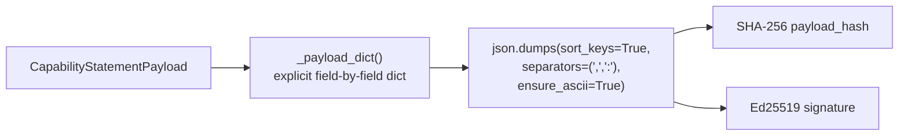
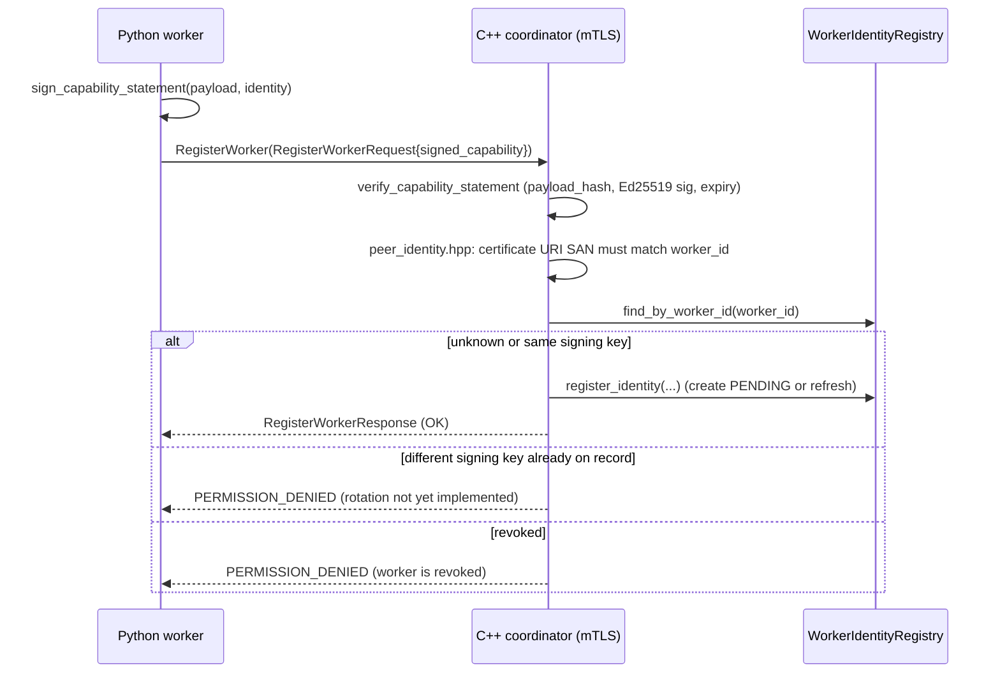

# Signed Capability Statements

**Status: Implemented and Validated end-to-end, including live
coordinator wiring.** Real Python signing (PyNaCl Ed25519) → real C++
verification (OpenSSL EVP, `capability_statement_verifier.cpp`) → real
`WorkerIdentityRegistry` population, all exercised over a genuine mTLS
`RegisterWorker` RPC against a containerized coordinator — not mocked.
The legacy, unsigned `WorkerPrivacyCapabilities` wire message (see
[worker-privacy-capabilities.md](worker-privacy-capabilities.md)) still
exists and still drives task-assignment compatibility unchanged;
`SignedCapabilityStatement` is an additive, optional field on
`RegisterWorkerRequest` (`signed_capability`, field 4) that layers
authenticity binding on top without touching that existing logic.

## Mandatory trust statement

**A signed capability statement authenticates the worker that made the
claim — it does not prove the claim is true.** A compromised or
misconfigured worker can sign a false statement (e.g. claiming
`secure_random_available: true` when it is not, or a software version
it is not actually running); the signature only proves *that specific
key holder* asserted it, at the time claimed. Hardware or software
attestation, which would narrow this gap, remains explicitly deferred
— see [secure-aggregation-threat-model.md](secure-aggregation-threat-model.md).

## Required fields (all implemented)

```text
schema_version, worker_id, software_version, build_id,
supported_algorithms, supported_privacy_modes, opacus_version,
secure_random_available, supported_accountants, supported_clipping_modes,
supported_models, supported_model_schema_hashes, maximum_task_bytes,
maximum_private_batch_size, cpu_count, gpu_available, gpu_count,
issued_at, expires_at, nonce, signing_key_id,
payload_hash, signature
```

`fl_platform.security.capability_statement.CapabilityStatementPayload`
carries exactly this field set; `SignedCapabilityStatement` adds
`payload_hash`/`signature`.

## Canonical serialization (the one rule this pass implements)



Every signed field goes through one function,
`_canonical_bytes` — explicit lexicographic key sorting (never relying
on Python dict insertion order, which is deterministic *within* one
process but not a cross-language guarantee), compact separators (no
incidental whitespace differences), `ensure_ascii=True` (non-ASCII
escaped identically everywhere). Verified by a test that signs the same
logical payload built via two different field-construction orders and
confirms byte-identical hashes.

**Cross-language parity is now a tested fact, not an assumption**:
`cpp/coordinator/src/capability_statement_verifier.cpp`'s
`canonical_capability_payload_json` reproduces this exact rule in C++
(field-order hardcoded to Python's `sort_keys=True` alphabetical
order, JSON string escaping matching `ensure_ascii=True`, float
formatting via `std::to_chars` with a `.0` fallback for whole-number
values to match Python's float-vs-int JSON distinction). This is
verified two ways: (1) `capability_statement_verifier_test.cpp` embeds
a real canonical-JSON string generated by actually running Python's
`json.dumps(...)` on a fixed payload and asserts the C++ encoder
produces that exact byte sequence; (2) the live end-to-end test below
proves it works for real Ed25519 signatures produced by PyNaCl and
verified by OpenSSL, not just for the hash comparison in isolation. Go
has no implementation of this rule yet — that remains deferred.

## Live coordinator wiring (`RegisterWorker`)



`coordinator_service.cpp`'s `RegisterWorker` applies these checks, in
order, only when `request.has_signed_capability()` (absent = fully
backward-compatible no-op): recompute `payload_hash` and reject on
mismatch; verify the Ed25519 signature via the statement's own
`signing_public_key`; reject if expired; reject if the payload's
`worker_id` doesn't match the request's `worker_id`; if an
`identity_registry` was supplied (`nullptr` by default, so
`coordinator_service_test.cpp`'s existing direct-call tests are
unaffected) and a record already exists for this `worker_id`, reject
if it is `REVOKED` or if its `signing_public_key` differs from this
statement's (signing-key rotation — Work Package K — is not yet
implemented, so a key change is treated as a rejection, never a silent
overwrite); finally, only when the connection is actually
mTLS-authenticated (so `certificate_fingerprint` — the registry's
uniqueness key — is a real value, not empty), register or refresh the
identity in `WorkerIdentityRegistry`.

Real, live-tested (Python signs → real mTLS RPC → C++ verifies →
`WorkerIdentityRegistry` persists, container restarted mid-test to
confirm persistence survives it):
* A validly signed, non-expired statement is accepted and the worker
  is recorded `PENDING` in the identity registry.
* Re-registering with the *same* signing key succeeds (idempotent
  refresh).
* Re-registering the *same* `worker_id` with a *different* signing key
  is rejected `PERMISSION_DENIED`.
* A statement tampered with after signing (any field mutated post-hoc)
  is rejected, specifically reported as a `payload_hash` mismatch.
* An expired statement is rejected, specifically reported as expired.
* A worker authenticated via *worker-2*'s certificate cannot register
  a signed statement claiming `worker_id: worker-1` — rejected by the
  pre-existing certificate identity binding check
  (`peer_identity.hpp`), before the signature is even inspected.
* worker-2 registering its own signed statement, over its own
  certificate, succeeds.
* The `WorkerIdentityRegistry` file on disk, inspected directly inside
  the running container, contains both workers' real bound certificate
  identities and signing keys — and the same content is still present,
  correctly, after `docker restart`.

## Signing and verification

`sign_capability_statement(payload, identity)`:
* Refuses to sign if `expires_at` is unset (0) or not strictly after
  `issued_at` — a statement with no real expiry defeats the entire
  point of the expiry requirement.
* Refuses to sign if `payload.signing_key_id` doesn't match the signing
  identity's own `key_id` — catches a caller accidentally attaching the
  wrong key's ID to a statement signed by a different key.
* Computes `payload_hash` (SHA-256 over the canonical bytes) and
  `signature` (Ed25519 over the same canonical bytes) via
  `fl_platform.security.signing_identity`.

`verify_capability_statement(statement, verify_key, now=...)` checks,
in order: payload_hash matches the payload (detects payload tampering
independent of signature checking — a corrupted hash is reported as
`"payload_hash does not match"`, not conflated with a bad signature),
Ed25519 signature validity, and expiry (`now >= expires_at` fails).
Returns a `VerificationResult(valid, reason)` with a stable, specific
reason string for every rejection path.

## What this explicitly does not do (still deferred)

* **Nonce replay protection.** Nothing currently tracks previously-seen
  nonces across statements — a captured, still-unexpired signed
  statement could be replayed. A persistent replay store (Work Package
  I) is not yet built.
* **Signing-key rotation.** A worker cannot yet transition to a new
  signing key without a coordinator operator manually clearing its
  registry record first; there is no grace-period rotation flow (Work
  Package K).
* **Suspension/revocation is not yet enforceable at RPC time beyond
  `RegisterWorker` itself.** `WorkerIdentityRegistry.suspend`/`revoke`
  exist and are tested, and a `REVOKED` worker is correctly blocked
  from *re-registering*, but no other RPC (`AcquireTask`,
  `SubmitClientResult`, heartbeat, etc.) yet checks the registry.
* Audit event emission, security metrics, and the Go/web-visible view
  of registered identities do not exist yet.
* Go has no capability-statement signing or verification
  implementation at all.

`verify_capability_statement`/`verify_capability_statement` (Python and
C++ respectively) can only ever answer "is this signature, payload, and
expiry valid, and does this connection's certificate match the claimed
worker_id" — not "has this worker been suspended since its last
heartbeat," which needs the RPC-wide enforcement pass above.

## Validation

* 18 tests in `python/tests/test_capability_statement.py` (signing
  side): signing rejects unset/invalid expiry and a mismatched
  `signing_key_id`; verification accepts a freshly-signed statement and
  rejects a tampered field, a wrong verification key, an expired
  statement (and accepts one signed just-in-time before its own
  expiry), and a corrupted `payload_hash` independent of signature
  validity; canonical serialization produces identical hashes
  regardless of Python dict-construction order and different hashes for
  different nonces.
* `fl_capability_statement_verifier_tests` (C++, gRPC-gated build):
  canonical JSON byte-matches a real Python-produced golden vector;
  full Ed25519 sign (OpenSSL) → verify round trip, including tamper,
  expiry, wrong-key, and unset-expiry rejection paths.
* Live, containerized, real-mTLS end-to-end test (Python signs → real
  `RegisterWorker` RPC → C++ verifies → `WorkerIdentityRegistry`
  persists, container restarted mid-test): all seven scenarios listed
  above under "Live coordinator wiring" passed for real.
