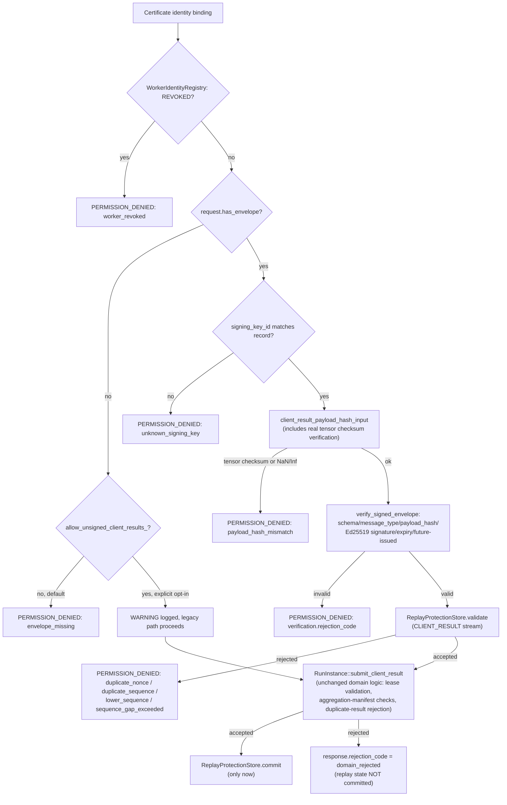

# Signed Client Results

**Status: Implemented and Validated end-to-end, including real
aggregation of signed results, via the actual production
`GrpcCoordinatorClient` code path against a live containerized
coordinator over genuine mTLS.** See
`cpp/coordinator/src/signed_envelope_verifier.cpp`'s
`client_result_payload_hash_input`, `coordinator_service.cpp`'s
`SubmitClientResult`, and
`python/src/fl_platform/security/signed_envelope.py` /
`python/src/fl_platform/worker/coordinator_client.py`.

## The contract

`SubmitClientResultRequest` gained one new, optional, additive field:
`envelope` (`fl.worker.v1.SignedWorkerEnvelope`, field 9), with
`message_type: MESSAGE_TYPE_CLIENT_RESULT` and
`message_stream: MESSAGE_STREAM_CLIENT_RESULT`. See
[signed-worker-envelopes.md](signed-worker-envelopes.md) for the
envelope contract itself and [payload-hashing.md](payload-hashing.md)
for exactly what `payload_hash` binds to (run/round/task/client/worker
identifiers, model version, algorithm, sample/step counts, update
norm, completion timestamp, nonce, a canonically-sorted tensor
manifest, training metrics, and nested personalization-metrics/
privacy-record objects).

## Real per-tensor checksums (a real gap this closed)

Before this slice, `TensorManifest.checksum`/`dtype`/`byte_length`
were declared on the wire but **never populated by the live Python
worker path** — confirmed by direct inspection of
`_tensor_manifests_from_dict`, which only ever set `name`/`shape`/`values`.
This meant no signature could ever have meaningfully covered a
tensor's actual values (a checksum field that's always empty
canonicalizes to the same thing regardless of tampering). Both sides
were fixed together:

* **Python** (`_tensor_manifests_from_dict`): now packs each tensor's
  flattened values as little-endian float64 (`struct.pack(f"<{n}d",
  *flat)` — matching what actually crosses the wire, since `.tolist()`
  on any tensor dtype yields Python `float`, transmitted as protobuf
  `double`) and computes a real SHA-256 checksum over those bytes.
  `dtype` is set to `"float64"` (the wire representation, not the
  source PyTorch tensor's own dtype) and `byte_length` to the packed
  length.
* **C++** (`tensor_checksum_matches`, `signed_envelope_verifier.cpp`):
  recomputes that same SHA-256 over the received `values` (memcpy'd
  doubles — correct on every platform this project targets, all
  little-endian x86-64) and **rejects outright** if it doesn't match
  the claimed `checksum` field, before the checksum value is even
  included in the payload hash. Without this, an attacker could tamper
  with `values` while leaving a stale `checksum` string untouched, and
  neither the hash nor the signature would have noticed (both would
  have only ever read the checksum field, never verified it). Verified
  by a dedicated unit test (`signed_envelope_verifier_test.cpp`): a
  request whose raw tensor values were tampered with, leaving the
  original checksum in place, is rejected.

## Verification pipeline (`SubmitClientResult`)

The pre-existing domain logic in `RunInstance::submit_client_result`
(lease validation, aggregation-manifest tensor-name checks, duplicate-
result rejection, checkpointing) was **not rewritten** — signature/
replay/status verification all happen strictly before it, exactly
matching Heartbeat's already-established pipeline shape and the
standing instruction not to rewrite validated code without a proven
defect.

## Backward compatibility: `allow_unsigned_client_results`

Unlike `Heartbeat` (which had zero pre-existing test coverage and so
could safely become a hard requirement), `SubmitClientResult` had
substantial existing coverage (`coordinator_service_test.cpp`) built
against the unsigned wire format. The constructor parameter
`allow_unsigned_client_results` therefore **defaults to `true`**
(preserving every existing test's behavior unchanged) but `main.cpp`
explicitly passes `false` for the live server unless
`FL_ALLOW_UNSIGNED_CLIENT_RESULTS=true` is set — the same fail-closed-
by-default, explicit-opt-in-for-development pattern already used by
`FL_ALLOW_INSECURE_DEVELOPMENT_TRANSPORT`. Every time the unsigned
path is actually exercised under this opt-in, a `level=WARNING`
structured line is written to stderr, naming the worker_id and stating
plainly that this mode is unsafe for private/production runs. This
satisfies the specification's development-compatibility-mode
requirements (explicitly enabled, logged, documented as unsafe) with
one exception: it is not additionally conditioned on "privacy mode is
NONE" at the per-request level — that would require threading the
target run's privacy configuration into `coordinator_service.cpp`'s
pre-domain-processing checks, which do not currently have access to
run-specific config before parsing `result.run_id()`; documented here
as a real, narrower gap rather than silently assumed satisfied.

## Live, real, end-to-end validation

A real Python script driving the **actual production
`GrpcCoordinatorClient` class** (not a hand-rolled test harness) against
a live containerized coordinator, real mTLS, two independently-
generated worker signing identities:

1. Two workers register with real signed capability statements (this
   also closed a pre-existing gap: `register_worker()` previously sent
   a completely unsigned `RegisterWorkerRequest` even though the
   coordinator has verified signed statements since the prior slice).
2. Both acquire real tasks for different clients.
3. Both submit real signed results (`update_norm`, tensor manifests
   with real checksums, canonical hash, Ed25519 signature) — both
   accepted.
4. The round actually aggregates: confirmed via a fresh `GetRun` call
   showing `current_round` advanced (not merely trusting
   `submit_result`'s own return value, which carries a pre-existing,
   always-empty placeholder snapshot).
5. Resubmitting the identical already-accepted result is rejected
   (`"duplicate result: client already has an accepted result for this
   round"`).
6. A result signed by an unregistered signing key (a fresh identity
   never registered for that worker_id) is rejected
   `unknown_signing_key`.
7. `SuspendWorker` (via the go-api service identity) → the suspended
   worker's `AcquireTask` is rejected.
8. `ActivateWorker` → the worker can acquire tasks again.
9. `RevokeWorker` while the worker holds an active lease → the lease is
   canceled (`leases_canceled=2`, since the worker held leases across
   two separate runs created during the test), a subsequent
   `RegisterWorker` is rejected, and submitting the (now-orphaned)
   task's result is rejected.

## What is deferred

* **Sample-level privacy records are not independently signed** as
  their own message type/stream — they are covered transitively (any
  tampering with an embedded `sample_level_privacy` sub-message as
  submitted *with* a client result is caught by the client result's own
  signature, since `privacy_record` is part of the payload hash), but
  there is no standalone `SAMPLE_PRIVACY_RECORD` envelope, no
  independent replay/sequence stream for it, and no accountant-step/
  epsilon monotonicity enforcement. See
  [payload-hashing.md](payload-hashing.md)'s "Sample Privacy Record
  Hash" section for why (new `SampleLevelLedgerEntry` proto fields
  would be required first).
* **`SUSPENDED` in-flight-result nuance is not separately implemented**
  for `SubmitClientResult` — a suspended worker is not blocked from
  submitting a result at all (only `REVOKED` is checked). In practice
  this already matches the documented policy ("existing task result
  accepted until lease expiry") as a *consequence* of not adding a
  new restriction, not because the nuance was deliberately coded.
* Development-compatibility mode is not additionally gated on the
  target run's privacy mode being `NONE` — see above.
