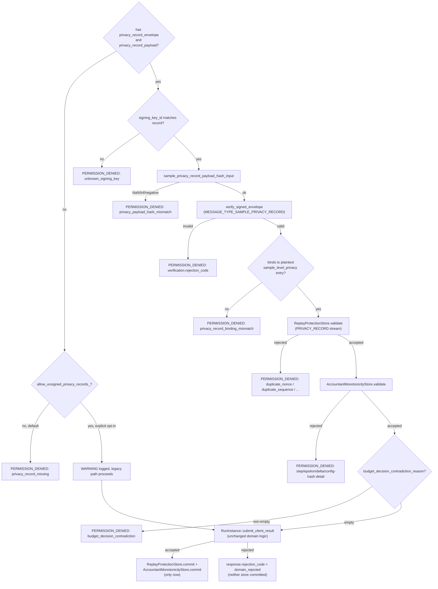

# Signed Sample Privacy Records

**Status: Implemented and Validated end-to-end (21/21 live checks),
including real per-round aggregation of a signed private result, via
the actual production `GrpcCoordinatorClient` code path against a live
containerized coordinator over genuine mTLS.** See
`cpp/coordinator/src/signed_envelope_verifier.cpp`'s
`sample_privacy_record_payload_hash_input`, `coordinator_service.cpp`'s
`SubmitClientResult`, and
`python/src/fl_platform/security/signed_envelope.py` /
`python/src/fl_platform/worker/coordinator_client.py`.

This closes the gap [signed-client-results.md](signed-client-results.md)
and [payload-hashing.md](payload-hashing.md) explicitly flagged: sample-
level privacy records were previously covered only transitively, as a
nested field inside the outer signed client-result payload — a worker
could tamper with a stale, never-independently-signed
`sample_level_privacy` entry as long as it also resigned the outer
client result, and there was no accountant-step/epsilon monotonicity
enforcement at all.

## The contract

Two new, additive fields on `SubmitClientResultRequest`:

* `privacy_record_payload` (`fl.privacy.v1.SignedSamplePrivacyRecord`,
  field 10) — the 27 domain fields (schema_version through
  secure_random_provider — see the proto for the full list and the
  "Deviations" section below for which of the parent specification's
  requested fields were narrowed or omitted, and why).
* `privacy_record_envelope` (`fl.worker.v1.SignedWorkerEnvelope`, field
  11) — the cryptographic metadata and signature, with
  `message_type = MESSAGE_TYPE_SAMPLE_PRIVACY_RECORD` and
  `message_stream = MESSAGE_STREAM_PRIVACY_RECORD` (both enum values
  were already reserved in `proto/worker/worker.proto` from the prior
  slice, unused until now).

**Deliberately reuses `SignedWorkerEnvelope` rather than inventing a
second, independent signature mechanism**: `SignedSamplePrivacyRecord`
itself carries no `nonce`/`sequence_number`/`signing_key_id`/
`payload_hash`/`signature` fields of its own — those are provided by
the wrapping envelope, exactly the same design decision already made
for `SubmitClientResultRequest.envelope`. This is a deliberate
simplification of the parent specification's literal field list (which
requested those cryptographic fields directly on the record): it lets
this slice reuse 100% of the already-proven `verify_signed_envelope`
function and `ReplayProtectionStore`, at the cost of the record and its
envelope being two separate wire fields rather than one self-contained
message.

## Two independent bindings

A signed privacy record is bound to its submission two ways, not one:

1. **Its own signature** (verified via `verify_signed_envelope` against
   `sample_privacy_record_payload_hash_input`'s canonical JSON) proves
   the record itself was not tampered with in transit.
2. **A binding check against the plaintext ledger entry**: the signed
   record's `run_id`/`round_id`/`client_id`/`worker_id`/`task_id`/
   `epsilon`/`delta`/`noise_multiplier`/`sample_rate`/`accountant_step`/
   `accountant_type` must exactly equal the corresponding fields on the
   plaintext `SubmitClientResultRequest.sample_level_privacy` entry that
   actually gets appended to the ledger — otherwise a worker could sign
   one epsilon value while submitting a *different* one in the field
   the coordinator actually persists and relays (see
   [privacy-ledger.md](privacy-ledger.md)). Rejected as
   `privacy_record_binding_mismatch`.
3. **The outer Client Result Hash additionally binds to the privacy
   record envelope's `payload_hash`** (a new `privacy_record_payload_hash`
   key in the hash's nested `privacy_record` object — see
   [payload-hashing.md](payload-hashing.md)) — so a tampered *or
   entirely missing* signed privacy record is also detectable from the
   outer client-result signature alone, as a second, independent layer.
   Purely additive: this key defaults to `""` and only appears at all
   when `sample_level_privacy` is present, so every pre-existing golden
   vector (none of which used a non-empty privacy record) is unaffected.

## Verification pipeline (inside `SubmitClientResult`)

Runs only when `request.has_sample_level_privacy()` — i.e. only for
submissions that carry sample-level privacy accounting at all:

Every check above runs strictly before `RunInstance::submit_client_result`
(the pre-existing, unmodified domain layer) — matching the standing
"verify before domain processing, commit only after domain acceptance"
rule already established for `Heartbeat` and the outer client-result
envelope.

## Backward compatibility: `allow_unsigned_privacy_records`

Mirrors `allow_unsigned_client_results` exactly:
`coordinator_service_test.cpp` has existing coverage submitting
`sample_level_privacy` with no signed record at all, so the constructor
parameter **defaults to `true`**, but `main.cpp` explicitly passes
`false` for the live server unless `FL_ALLOW_UNSIGNED_PRIVACY_RECORDS=true`
is set. Every exercise of this path logs a `level=WARNING` structured
stderr line.

## Budget-decision consistency

`budget_decision_contradiction_reason` (`coordinator_service.cpp`)
rejects a normal, accepted-shaped submission whose signed
`budget_decision` says the step should never have happened:

| `budget_decision` | Contradictory with a normal update? |
|---|---|
| `allowed`, `warned` | No |
| `stopped_after_task` | No — this is the one task the STOP_AFTER_CURRENT_TASK policy explicitly still allows to submit |
| `stopped_before_step`, `refused_before_training` | Yes — the step should have been refused before it was taken |
| `failed_task` | Yes — FAIL_TASK's hard failure must not accompany a normal successful update |
| anything else | Yes — an unrecognized value is treated as invalid, not silently accepted |

**Not implemented**: blocking *future* task assignment for a
`stopped_after_task` client/worker pair — `AcquireTask` does not
consult budget-decision history, so nothing currently prevents a
misbehaving worker from being assigned another task for that client
after a real `STOP_AFTER_CURRENT_TASK` exhaustion. A real, disclosed
gap, not silently covered.

## Deviations from the parent specification's field list

`SignedSamplePrivacyRecord` carries 27 of the specification's
requested fields, narrowed for what this codebase's actual Opacus
integration tracks:

* **Omitted, not fabricated**: `record_version` (redundant with
  `schema_version`, matching every other signed structure's single-
  version-field convention), `clipping_mode` (this codebase has no
  clipping mode distinct from `max_grad_norm`), `effective_batch_size`
  and `skipped_optimizer_steps` (neither is tracked anywhere in the
  current Opacus integration — would require new plumbing into
  `run_private_local_training`/Opacus's own internals, not attempted
  this pass), `optimizer_steps` (not duplicated separately from
  `accountant_step` — in this codebase's Opacus integration they are
  the same value).
* **`privacy_mode` is hardcoded to `PRIVACY_MODE_SAMPLE_LEVEL_DP`**
  (worker-side): a worker cannot currently distinguish hybrid DP
  (sample-level + coordinator-side user-level) from pure sample-level
  DP from its own vantage point — both look identical as
  `task.sample_level_dp_active=True`.
* **`secure_random_required` is hardcoded to `False`**: this
  codebase's `SampleLevelDPConfig` wire message carries no such field
  (unlike `UserLevelDPConfig.secure_random`) — see
  `proto/privacy/privacy.proto`.
* **`configuration_hash` is bound into monotonicity (reject-on-change),
  not independently recomputed against the coordinator's own assigned
  config.** The coordinator does not look up the run's actual
  `SampleLevelDPConfig` for the task's round and recompute
  `sample_privacy_configuration_hash` to compare — it only enforces
  that a track's own established `configuration_hash` never silently
  changes (real tamper/drift detection), not that the value is
  *correct* in the first place. A worker signing a self-consistent but
  wrong configuration would not be caught by this alone.

## What this does not prove

Same disclaimer as [payload-hashing.md](payload-hashing.md)'s existing
one: a correctly signed privacy record proves *the worker holding this
signing key asserted this exact accounting step*, not that the
worker's own Opacus accounting was computed correctly. Monotonicity and
binding checks catch tampering, replay, and rollback — never an
honestly-computed but wrong epsilon.

## Live, real, end-to-end validation

A real Python script driving the **actual production
`GrpcCoordinatorClient` class** (not a hand-rolled harness) against a
live containerized coordinator, real mTLS, a run created with
`privacy_config.mode = PRIVACY_MODE_SAMPLE_LEVEL_DP`. 21/21 checks
passed:

1. Worker registers with a real signed capability statement.
2. A real signed privacy record, submitted alongside a real signed
   client result with real (synthetic) tensor data, is accepted — the
   run is reachable afterward (real aggregation happened).
3. A higher `accountant_step` with non-decreasing epsilon is accepted
   (monotonicity allows legitimate progress).
4. A non-increasing `accountant_step` is rejected, with a message
   naming the exact step values compared.
5. A lower epsilon at a higher step is rejected, with a message naming
   the exact epsilon values compared.
6. A `budget_decision = "stopped_before_step"` alongside a normal
   completed update is rejected as a contradiction.
7. A `budget_decision = "stopped_after_task"` alongside a normal
   completed update is **accepted** (policy-compliant, not
   contradictory).
8. A signed privacy record whose signed epsilon (9.9) does not match
   the plaintext `sample_level_privacy` entry submitted alongside it
   (epsilon 1.5) is rejected as `privacy_record_binding_mismatch`.
9. A submission carrying `sample_level_privacy` but no
   `privacy_record_envelope`/`privacy_record_payload` at all is
   rejected fail-closed (`FL_ALLOW_UNSIGNED_PRIVACY_RECORDS` was not
   set).

Real gotcha discovered and handled correctly, not a bug: a rejection
from this pipeline happens *before* domain processing, so the
worker's task lease is never released by it (identical to an envelope-
signature rejection for a normal client result) — the live test reuses
the same task/lease across a rejected-then-retried submission, exactly
as a real worker would.

## What is deferred

* Sample-level privacy records still ride on a per-submission basis —
  no cross-run or cross-worker aggregate privacy-budget view exists
  beyond what `AccountantMonotonicityStore`/`PrivacyLedger` already
  track independently.
* `configuration_hash` is not independently recomputed against the
  coordinator's own assigned task config (see "Deviations" above).
* `AcquireTask` does not consult budget-decision history to block
  future task assignment after a `stopped_after_task` exhaustion (see
  "Budget-decision consistency" above).
* No signing-key rotation, no coordinator-signed tasks, no Go/web
  security surfaces, no Prometheus metrics, no formal audit-record
  persistence for this slice's events (structured stderr logs only) —
  see [privacy-accountant-monotonicity.md](privacy-accountant-monotonicity.md)
  and `docs/message-authenticity-report.md` for the complete accounting.
