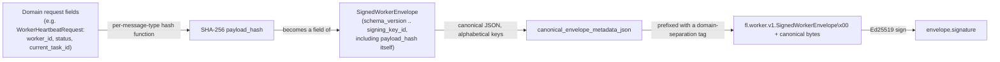
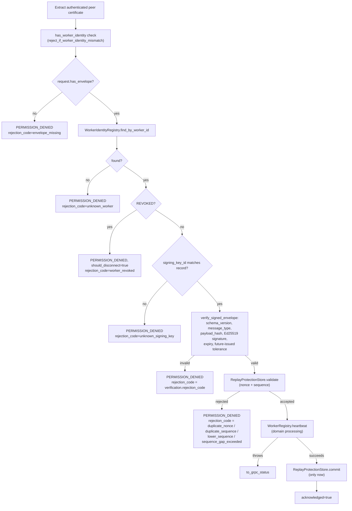

# Signed Worker Envelopes

**Status: Implemented and Validated for `WORKER_HEARTBEAT`, live-tested
end-to-end against a real containerized coordinator over genuine mTLS,
including surviving a real container restart. Contract defined for
every other message type; verification not yet built for any of
them.** See `proto/worker/worker.proto`'s `SignedWorkerEnvelope`,
`cpp/coordinator/include/fl_coordinator/signed_envelope_verifier.hpp`/`.cpp`,
and `coordinator_service.cpp`'s `Heartbeat` handler.

## The contract

One authoritative message, `fl.worker.v1.SignedWorkerEnvelope`, reused
(as a new, optional, additive field — never a replacement) by every
worker-originated security-sensitive RPC as each is migrated to it:

```text
schema_version, message_type, worker_id, run_id, round_id, task_id,
client_id, model_version, message_stream, sequence_number, issued_at,
expires_at, nonce, payload_hash, signing_key_id, signature
```

`message_type` (one value produced/verified today —
`MESSAGE_TYPE_WORKER_HEARTBEAT`; ten more reserved, not yet produced by
any code):

```text
MESSAGE_TYPE_WORKER_HEARTBEAT, MESSAGE_TYPE_TASK_ACQUISITION,
MESSAGE_TYPE_TASK_ACCEPTANCE, MESSAGE_TYPE_TASK_PROGRESS,
MESSAGE_TYPE_CLIENT_RESULT, MESSAGE_TYPE_TASK_FAILURE,
MESSAGE_TYPE_SAMPLE_PRIVACY_RECORD, MESSAGE_TYPE_PERSONALIZATION_METRICS,
MESSAGE_TYPE_WORKER_DRAIN, MESSAGE_TYPE_WORKER_SHUTDOWN,
MESSAGE_TYPE_KEY_ROTATION_REQUEST
```

`message_stream` (one value in real use today —
`MESSAGE_STREAM_HEARTBEAT`; see [message-sequences.md](message-sequences.md)):

```text
MESSAGE_STREAM_CONTROL, MESSAGE_STREAM_HEARTBEAT,
MESSAGE_STREAM_TASK_LIFECYCLE, MESSAGE_STREAM_CLIENT_RESULT,
MESSAGE_STREAM_PRIVACY_RECORD, MESSAGE_STREAM_PERSONALIZATION,
MESSAGE_STREAM_KEY_MANAGEMENT
```

**Canonical empty-value rule** (required by the closure gate):
`run_id`/`task_id`/`client_id`/`model_version` that don't apply to a
given `message_type` encode as `""`; `round_id` encodes as `0`. A
heartbeat envelope carries `run_id: ""`, `round_id: 0`, etc. — verified
directly in `signed_envelope_verifier_test.cpp`.

**Deliberately does not duplicate tensor payloads or other domain
content.** The envelope travels as a sibling field on the domain
request message itself (e.g. `WorkerHeartbeatRequest.envelope`);
`payload_hash` binds it to that message's own fields via a per-message-
type hash function — see [payload-hashing.md](payload-hashing.md).

## What actually gets signed (and why payload_hash is a field, not a parameter)



This means tampering with *either* the domain payload (breaks
`payload_hash`'s match) *or* the envelope's own metadata, including
`payload_hash` itself (breaks the signature, since the signed bytes
include `payload_hash` as a field) is independently detected and
independently reported — verified explicitly in
`signed_envelope_verifier_test.cpp` (a domain-payload tamper is reported
as `payload_hash_mismatch`; an envelope-metadata tamper as
`invalid_signature`, even though `payload_hash` itself is unchanged in
that case).

**Domain-separation prefix**: `"fl.worker.v1.SignedWorkerEnvelope\x00"`
prepended before hashing/signing — closes the gap
[canonical-security-serialization.md](canonical-security-serialization.md)
previously flagged ("no domain-separation prefix... should be closed
before it is reused for envelope signing"). A null byte can never occur
in this codebase's canonical JSON output, so the prefix can never be
confused with legitimate signed content, and this envelope's signed
bytes can never collide with `SignedCapabilityStatement`'s (which uses
no prefix at all) even though both are signed by the same worker Ed25519
key.

## Verification pipeline (implemented for `Heartbeat`)



This is a real, coded, tested ordering — not aspirational. The
"commit only after domain processing succeeds" step was empirically
exercised (not just asserted) during live restart testing: a heartbeat
that passed every signature/replay/sequence check but then failed
`WorkerRegistry.heartbeat` (a pre-existing, unrelated in-memory-registry
gap — see [known-limitations.md](known-limitations.md)) correctly did
**not** advance the replay store's sequence state, confirmed by a
follow-up call with the same sequence number still succeeding once the
underlying domain issue was resolved.

## Backward compatibility

`Heartbeat` **requires** a signed envelope unconditionally — there is
no legacy-unsigned fallback, and none was needed: `coordinator_service_test.cpp`
had zero existing `Heartbeat` test coverage before this slice, and the
reference Python worker's live loop (`fl_platform.worker.service.WorkerService.run`)
never calls `Heartbeat` at all (confirmed by direct inspection — the
reference worker's loop is `register → (acquire_task → train →
submit_result)*`, with no periodic heartbeat call). Requiring a signed
envelope from day one therefore broke no existing behavior. Every other
message type (`RegisterWorker`'s `signed_capability` field, from the
prior slice) remains *optional* for backward compatibility, since a
live, unsigned production call path did exist for it.

## Stable error codes

`WorkerHeartbeatResponse.rejection_code` (new field): empty on success;
one of `certificate_identity_mismatch`, `envelope_missing`,
`unknown_worker`, `worker_revoked`, `unknown_signing_key`,
`unsupported_schema_version`, `wrong_message_type`,
`payload_hash_mismatch`, `invalid_signature`, `expired`,
`future_issued`, `duplicate_nonce`, `duplicate_sequence`,
`lower_sequence`, `sequence_gap_exceeded`,
`identity_registry_unavailable` on rejection.

## Live end-to-end validation

A real Python script (PyNaCl signing, real gRPC stub, real mTLS
channel) against a real containerized coordinator
(`infra/docker/cpp-coordinator.Dockerfile`), not a mock:

* A validly signed, non-expired, sequence-1 heartbeat is accepted.
* A replayed (duplicate) sequence number is rejected.
* The next valid sequence number is accepted.
* A corrupted signature is rejected as `invalid_signature`.
* An expired envelope is rejected as `expired`.
* An unrecognized `signing_key_id` is rejected as `unknown_signing_key`.
* A signature from a *different* private key, spoofing the real
  `signing_key_id` string, is rejected as `invalid_signature` (proving
  the coordinator verifies against the actually-registered public key,
  never trusting a self-asserted one on the envelope).
* A worker authenticated via *worker-2*'s certificate cannot send a
  heartbeat claiming `worker_id: worker-1` — rejected by certificate
  identity binding before the envelope is even inspected.
* Replay/sequence state (`last_sequence_number`, recent nonce hashes)
  survives a real `docker restart`: a sequence number already committed
  before the restart is still rejected after it; the next valid
  sequence number is still accepted after it.

## What is deferred

* No other `message_type` has a coordinator-side verifier implemented
  yet (only `heartbeat_payload_hash_input` exists in
  `signed_envelope_verifier.cpp`) — see [payload-hashing.md](payload-hashing.md)
  for what a client-result/privacy-record hash would need to bind to.
* `AcquireTask`/`SubmitClientResult`/task-progress do not require or
  verify an envelope — only certificate identity binding was added to
  them this slice.
* `SUSPENDED` worker heartbeat semantics (the specified "accepted only
  to report suspended status" carve-out) are not implemented — only the
  `REVOKED` rejection is. A suspended worker's heartbeat today is
  treated identically to an active worker's.
* No signing-key rotation — `unknown_signing_key` is permanent
  default-deny, with no sanctioned recovery path.
* Python's worker client (`GrpcCoordinatorClient`) has no `heartbeat()`
  method and the reference worker's loop never calls `Heartbeat` at all
  — this slice's live validation used a standalone script constructing
  the RPC directly, not the production worker code path. Wiring a real
  periodic heartbeat into `WorkerService.run()`'s loop, with envelope
  signing, remains future work.
