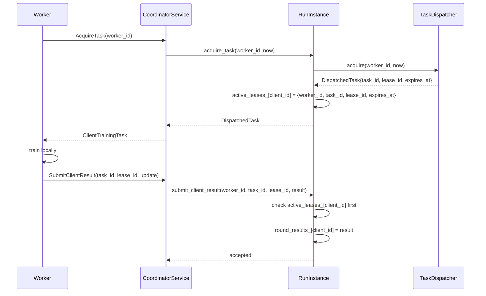

# Task Leasing

## Normal flow

`TaskDispatcher` (`cpp/coordinator/include/fl_coordinator/task_dispatcher.hpp`)
owns enqueue/acquire/report_progress/submit_result/sweep_expired_leases
for one round. `RunInstance` layers two checkpointed maps on top of it:
`round_results_` (accepted results, keyed by `client_id`) and
`active_leases_` (outstanding leases, keyed by `client_id`).

## Why the extra layer exists: cross-process task IDs collide

Each fresh `TaskDispatcher` instance (one per CLI-bridge process
invocation) resets its own `task_id`/`lease_id` sequence counters to 0.
Two different clients' tasks, acquired in two different process
invocations, can therefore get the *identical* `task_id`/`lease_id`
string. This is not inherently a bug — `active_leases_` is keyed by
`client_id`, not by `task_id` — but it caused real failures during
development when doing sequential acquire→submit→acquire→submit (as
opposed to batch acquire-both-then-submit-both): the freshly-rebuilt
dispatcher for a `submit` call could contain a *different* client's
pending task under the same `task_id` string, so
`TaskDispatcher::submit_result` would find the wrong task and return
"lease mismatch" instead of "unknown task_id" — and the fallback path
(which only triggered on "unknown task_id") never fired.

**Fix**: `RunInstance::submit_client_result` checks `active_leases_`
first (the checkpointed, cross-process source of truth, keyed by
`client_id`) before ever touching `dispatcher_`, falling back to
`dispatcher_->submit_result` only when the submitting client has no
checkpointed active lease at all.

## "Is this round settled?" is not `dispatcher_->all_tasks_settled()`

A freshly rebuilt dispatcher that skips every still-leased client (see
[coordinator-recovery.md](coordinator-recovery.md)) can end up with zero
tasks, making `all_tasks_settled()` vacuously true even though results
are still outstanding. Fixed with a checkpointed `failed_clients_` set;
"settled" is computed as
`(round_results_.size() + failed_clients_.size()) >= current_cohort_.size()`.

## Retry and expiry

Leases expire after `task_lease_seconds` (default 60s,
`RunConfig::task_lease_seconds`); `sweep_expired_leases()` runs on every
`advance()` call. A client whose retries are exhausted
(`max_task_retries`, default 3) is added to `failed_clients_` and does
not block round settlement.
