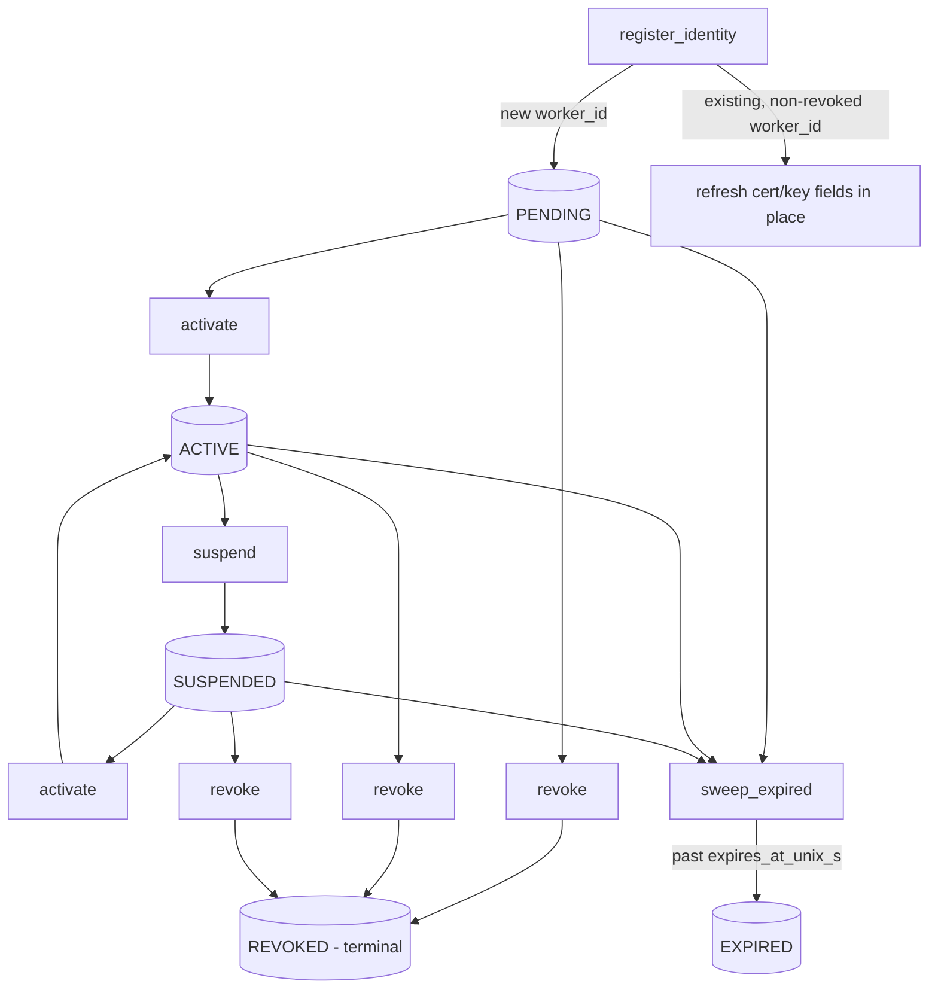

# Worker Identity Registry

**Status: Implemented and Validated, including live `RegisterWorker`
wiring.** `WorkerIdentityRegistry`
(`cpp/coordinator/include/fl_coordinator/worker_identity_registry.hpp`,
`cpp/coordinator/src/worker_identity_registry.cpp`) is compiled and its
full test suite (`worker_identity_registry_test.cpp`, part of
`fl_coordinator_tests`) passes for real via MSVC on this development
machine — persistence-across-restart, idempotent re-registration,
certificate-fingerprint uniqueness, the suspend/activate/revoke state
machine, expiry sweeping, and corruption detection were all exercised
against real files on disk, not mocked. It is now wired into the live
`RegisterWorker` gRPC handler (see [signed-capabilities.md](signed-capabilities.md)'s
"Live coordinator wiring" section): `coordinator/main.cpp` constructs a
real, file-backed instance (`FL_WORKER_IDENTITY_REGISTRY_PATH`, default
`worker_identity_registry.dat`) and passes it to
`CoordinatorServiceImpl`, which populates it from verified signed
capability statements over real mTLS. Validated end-to-end in a live
container, including a real restart to confirm persistence.

## What this is

The coordinator's durable record of every worker identity it has ever
registered: which certificate and Ed25519 signing key each `worker_id`
is bound to, and whether that worker is currently allowed to
participate (`PENDING` / `ACTIVE` / `SUSPENDED` / `REVOKED` /
`EXPIRED`). This is a different concern from — and a prerequisite for
— certificate identity binding
([certificate-identity-binding.md](certificate-identity-binding.md)):
identity binding asks "does this connection's authenticated
certificate match the `worker_id` it claims, right now, for this one
RPC"; the registry is the coordinator's own persisted opinion of
"does this `worker_id` exist, and is it currently trusted at all."

## Record fields

Exactly the field set specified for this slice: `schema_version`,
`worker_id`, `certificate_identity` (the SPIFFE-style URI SAN),
`certificate_serial`, `certificate_fingerprint`, `signing_public_key`,
`signing_key_id`, `registration_status`, `software_version`,
`build_id`, `created_at`, `updated_at`, `expires_at`, `suspended_at`,
`revoked_at`, `revocation_reason`.

## State machine rules (validated by test)

* A brand-new `worker_id` starts `PENDING`.
* Re-registering an existing, non-revoked `worker_id` is an idempotent
  refresh of its certificate/signing-key/version fields — `created_at`
  is preserved, `updated_at` moves, `registration_status` does not
  change. This mirrors `WorkerRegistry::register_worker`'s existing
  "a worker retrying registration after a network blip should not be
  punished" convention.
* `certificate_fingerprint` must be unique across all worker
  identities at once — registering a fingerprint already bound to a
  *different* `worker_id` is rejected. A fingerprint identifies exactly
  one worker identity.
* `suspend`/`activate` are idempotent (re-suspending an already
  suspended worker refreshes the reason/timestamp; re-activating an
  already active worker is a no-op that still succeeds).
* `revoke` is **terminal**: once `REVOKED`, a `worker_id` can never be
  `activate`d, `suspend`d, or re-registered under the same identity.
  Re-revoking an already-revoked worker is idempotent but does **not**
  overwrite the original `revoked_at`/`revocation_reason` — the first
  revocation is authoritative.
* `sweep_expired` only ever moves `PENDING`/`ACTIVE`/`SUSPENDED` →
  `EXPIRED`, and only for records with a positive `expires_at_unix_s`
  that has passed. It never touches `REVOKED` records — revocation is a
  strictly stronger, terminal statement than expiry.

## Persistence

Filesystem-backed, one file per registry instance. Every mutating call
(`register_identity`, `suspend`, `activate`, `revoke`, and any
`sweep_expired` call that actually transitions something) serializes
the **entire** registry state and writes it via a temp-file-then-rename
sequence — the same atomic-write pattern already used by
`AggregatorCheckpointStore` (`cpp/core/src/checkpoint.cpp`) and
`RunInstance`'s own checkpointing (`cpp/coordinator/src/run_manager.cpp`),
including the same fallback (remove-then-rename) for platforms where
`rename` does not overwrite an existing file. A full-file rewrite per
mutation was chosen over an append-only log because the expected record
count is one per worker (tens to low thousands), not one per event —
simplicity and straightforward corruption detection outweigh the cost
of a full rewrite at this scale.

Records are stored as tab-separated lines (`record=<schema_version>\t<worker_id>\t...`)
behind a `record_count=` header and a trailing FNV-1a `checksum=` line —
the same encode/decode-per-line convention `RunInstance` already uses
for its own privacy-ledger entries. Loading a file whose checksum does
not match, or whose actual record count does not match its declared
`record_count`, throws `WorkerIdentityRegistryError` rather than
silently starting from an empty registry — the risk being that a
silently-discarded corrupt file would resurrect trust in every
previously revoked worker.

## What is deferred

* **Only `RegisterWorker` consults this registry.** No other RPC
  (`AcquireTask`, `SubmitClientResult`, `Heartbeat`, etc.) checks
  whether a worker is `SUSPENDED`/`REVOKED` yet — a revoked worker is
  correctly blocked from *re-registering*, but if it was already mid-task
  when revoked, nothing currently stops it from continuing to submit
  results. Wiring suspension/revocation enforcement into every
  security-sensitive RPC (per the documented in-flight-task policy:
  suspension allows already-leased tasks to complete, revocation cancels
  them immediately) remains the next piece of work.
* **`certificate_serial` is not populated** by the live wiring — the
  registry record's `certificate_serial` field stays empty for
  identities registered via `RegisterWorker`, since extracting it from
  the peer certificate is not implemented (only `certificate_fingerprint`,
  computed over the AuthContext's PEM text, is). Not a security gap
  (fingerprint already provides uniqueness/tamper-evidence), but a real
  metadata gap worth closing when Go/web views need to display it.
* **Signing-key rotation with a grace period does not exist.** A
  `RegisterWorker` call presenting a signing key that differs from the
  one already on record for that `worker_id` is unconditionally
  rejected (see [signed-capabilities.md](signed-capabilities.md)) —
  correct as a default-deny, but there is no sanctioned way for a
  worker to legitimately rotate its key yet. Deferred to
  [signing-key-management.md](signing-key-management.md)'s slice.
* No Go security API or web view yet exposes this registry's contents.
* `sweep_expired` must be called explicitly by a caller (e.g. a
  periodic coordinator task) — there is no background timer inside
  `WorkerIdentityRegistry` itself, and nothing in `coordinator_service.cpp`
  currently calls it, consistent with `WorkerRegistry::sweep_unhealthy`'s
  identical caller-driven convention elsewhere in this codebase.
