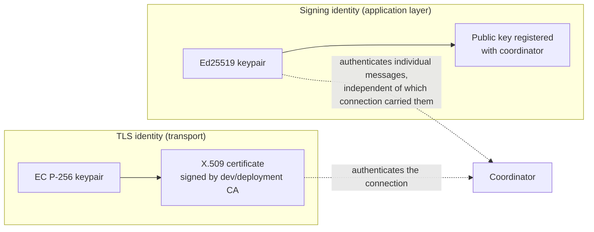

# Worker Identity

**Status: mixed.** Ed25519 signing-key generation, persistence, and
sign/verify are Implemented and Validated. The coordinator-managed
identity *registry* (Work Package G — persistent `WorkerIdentityRecord`
storage, status transitions, revocation checks at RPC time) is
Deferred — no coordinator-side code exists yet. This document describes
what actually exists today, not the full target design.

## Two separate keys, on purpose

A worker's TLS certificate (see [mtls.md](mtls.md),
[development-pki.md](development-pki.md)) authenticates the *transport
connection*. A separate Ed25519 keypair authenticates individual
*application-level messages* (today: capability statements — see
[signed-capabilities.md](signed-capabilities.md); a future pass extends
this to task-result envelopes). Keeping them separate means a
compromised TLS key doesn't automatically forge signed application
messages, and vice versa — and matches this category's explicit
requirement that they be distinct key material.

## What is implemented: `fl_platform.security.signing_identity`

* `generate_signing_identity(worker_id)` — a fresh Ed25519 keypair via
  PyNaCl (`nacl.signing.SigningKey.generate()` — never hand-rolled).
  Never reuses one key across distinct `worker_id`s (each call
  generates fresh key material).
* `key_id` — a stable, non-secret identifier derived from the first 8
  bytes of the *public* key, safe to log/register/include in audit
  events.
* `save_signing_identity(identity, directory)` — writes the private key
  to `{worker_id}.signing-key.pem` with `chmod 0600` on POSIX (advisory
  only on Windows — NTFS ACLs are a fundamentally different model than
  a single POSIX mode bit, documented honestly rather than claimed as a
  guarantee this call cannot provide there) and the public key
  separately, unrestricted, to `{worker_id}.signing-key.pub`.
* `load_signing_identity(worker_id, directory)` — raises
  `SigningIdentityError` on a missing or corrupted key file; never
  silently generates a replacement identity (which would silently
  change what the worker signs with, without anyone deciding that on
  purpose).
* `WorkerSigningIdentity.public_key_hex()` — the *only* representation
  of the identity meant to ever leave the process. The private key is
  never transmitted, logged, or included in any metrics/events —
  verified directly by a test asserting the private key's own hex
  representation never appears in the public-key file's contents.

## What is not implemented

* **Coordinator-side identity registry** (`WorkerIdentityRecord`:
  `worker_id`, `certificate_identity`, `certificate_serial`,
  `certificate_fingerprint`, `signing_public_key`, `signing_key_id`,
  `registration_status`, timestamps, revocation fields) — no
  persistent storage, no `PENDING`/`ACTIVE`/`SUSPENDED`/`REVOKED`/
  `EXPIRED` status machine, no duplicate-identity rejection.
* **Certificate-to-worker-ID binding enforcement** — nothing currently
  checks that a worker's presented TLS certificate identity matches its
  claimed `worker_id`.
* **Key rotation / revocation workflow** (the "active worker
  authenticates → submits signed rotation request → old key enters
  grace period" flow) — `scripts/pki/revoke-cert.sh` revokes a
  *certificate* at the PKI layer (see [development-pki.md](development-pki.md)),
  but nothing revokes a *signing key* at the coordinator layer, since
  there is no coordinator-side registry to revoke it in yet.
* **Development key-generation scripts** for the signing identity
  specifically (as distinct from the PKI scripts, which handle TLS
  certificates) — `generate_signing_identity`/`save_signing_identity`
  are library functions, not yet wrapped in a standalone CLI script.

## Validation

14 tests in `python/tests/test_worker_signing_identity.py`: real
keypair generation, uniqueness across workers, deterministic `key_id`
derivation, sign/verify round trips (including rejection of a wrong key
and a tampered payload — both via PyNaCl's own `BadSignatureError`, not
a custom check), save/load persistence round trips (proving the
*restored* key produces signatures verifiable against the *original*
public key, not just equal metadata), POSIX file-permission
verification (skipped on Windows, where the guarantee does not apply),
and negative cases (missing identity, corrupted key file).
