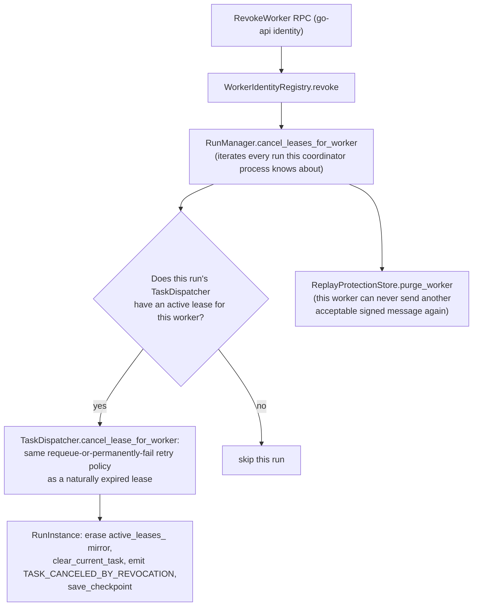

# Worker Revocation

**Status: Implemented and Validated live, including active-lease
cancellation across multiple runs.** `RevokeWorker` RPC over
`WorkerIdentityRegistry::revoke` (persistent, restart-safe, idempotent,
terminal — from the prior slice) plus new cross-run lease cancellation
(`TaskDispatcher::cancel_lease_for_worker`, `RunInstance::cancel_lease_for_worker`,
`RunManager::cancel_leases_for_worker` — all new this slice).

## Policy actually implemented

| Requirement | Status |
|---|---|
| `ACTIVE`/`SUSPENDED` → `REVOKED` | Implemented (`WorkerIdentityRegistry::revoke`, prior slice) |
| Idempotent repeated revocation | Implemented — re-revoking keeps the original `revoked_at`/`revocation_reason` |
| Active lease cancellation | **Implemented and live-tested this slice** — see below |
| Scheduler exclusion | Implemented: `AcquireTask` rejects `REVOKED` |
| Immediate RPC rejection | Implemented for `RegisterWorker` (prior slice), `Heartbeat` and `AcquireTask` (this slice) — **not** `SubmitClientResult`/`ReportTaskProgress` (see "What is deferred") |
| Signing-key status handling | Not separately modeled — one worker has exactly one signing key; revoking the worker makes that key unusable transitively (no independent per-key `REVOKED` status exists) |
| Certificate-fingerprint revocation state | Not a separate field — the registry's `registration_status` field already carries this; see [certificate-revocation.md](certificate-revocation.md) |
| Restart persistence | Inherited from `WorkerIdentityRegistry` |
| Security event | `event=WORKER_REVOKED` structured stderr line, plus `event=TASK_CANCELED_BY_REVOCATION` per canceled lease |
| Metric | Not implemented (see [known-limitations.md](known-limitations.md)) |

## Active lease cancellation (new this slice)



A worker may hold an active lease in more than one concurrently-running
run at once (`WorkerIdentityRegistry` is global; lease state is
per-run) — `RevokeWorker`'s handler iterates **every** run via
`RunManager::cancel_leases_for_worker` and cancels a lease in each one
found. The canceled task is requeued (if `attempt < max_retries`) or
permanently failed (if retries are exhausted) using the **exact same**
policy `sweep_expired_leases` already applies to a naturally expired
lease — this is a forced *early* expiry, not a new retry policy.
`TaskDispatcher`'s in-memory bookkeeping and `RunInstance`'s own
checkpointed `active_leases_` mirror are both updated together, kept in
sync the same way `submit_client_result`'s accepted path already does.

**A revoked worker cannot submit a previously-completed result after
revocation**: once its lease is canceled, the task's `worker_id`/
`lease_id` are cleared (if requeued) or the task moves to `kFailed`
(if retries exhausted) — either way, a subsequent `SubmitClientResult`
call with the old `task_id`/`lease_id` fails the pre-existing lease-
mismatch/unknown-task check in `TaskDispatcher::submit_result`, exactly
as it would for any other stale lease. Verified live: after revocation,
resubmitting the canceled task's result was rejected.

## `RevokeWorker` RPC

```text
RevokeWorkerRequest{ worker_id, reason, request_id, trace_id }
  -> WorkerLifecycleResponse{ identity, changed, leases_canceled }
```

`leases_canceled` reports exactly how many runs had an active lease
canceled by this call (0 is valid — a revoked worker with no active
task). Requires the go-api service identity. Idempotent: revoking an
already-revoked worker still runs the lease-cancellation/replay-purge
steps unconditionally (cheap, and closes a narrow window where a
worker could in principle have acquired a fresh lease between two
revocation calls), but `changed=false`.

## Live validation

See [signed-client-results.md](signed-client-results.md): a worker
holding active leases in two separately-created runs was revoked in
one call; `leases_canceled=2` was returned, confirming both were
found and canceled; the worker's subsequent `RegisterWorker` was
rejected `PERMISSION_DENIED`; submitting the now-orphaned task's
result was also rejected.

## Run-impact documentation (required by the parent specification)

**Not separately implemented or tested this slice**: what happens to a
run's minimum-valid-results threshold when revocation reduces the
available cohort below it. The pre-existing domain logic
(`RunInstance`'s round-finalization checks) is unchanged by this
slice — a round that ends up with fewer accepted results than
`minimum_valid_results` because a contributing worker was revoked
follows whatever pre-existing behavior that threshold check already
implements for "not enough results," which was not specifically
exercised against a revocation scenario in this pass's live testing.

## What is deferred

* **`SubmitClientResult` and `ReportTaskProgress` do not check
  `REVOKED` status at all** — only `RegisterWorker`/`Heartbeat`/
  `AcquireTask` do. A revoked worker that somehow still holds a valid,
  unexpired lease (e.g. if revocation happened for a *different* run
  than the one it's currently leased against, and
  `cancel_leases_for_worker`'s cross-run sweep for some reason missed
  it) could in principle still submit that one result. In practice this
  window is closed by the unconditional cross-run cancellation above,
  but the RPC-level check itself is not redundantly added to
  `SubmitClientResult` — documented as a real, narrow gap rather than
  silently assumed impossible.
* No `RevokeWorkerSigningKey` RPC (the optional, narrower one from the
  parent specification) — only whole-worker revocation exists.
* No new identity-registration re-enrollment workflow is implemented
  (a revoked `worker_id` genuinely cannot come back — `WorkerIdentityRegistry::register_identity`
  already throws for a `REVOKED` `worker_id`, from the prior slice; a
  fresh enrollment under a *new* `worker_id` would work but that is not
  a new capability this slice added).
