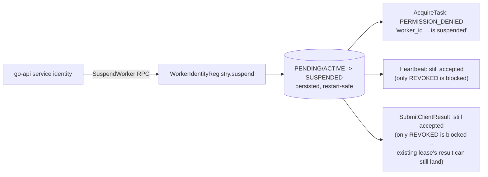

# Worker Suspension

**Status: Implemented and Validated live.** `WorkerIdentityRegistry::suspend`
(persistent, restart-safe, idempotent — from the prior slice) is now
reachable over the wire via the new `SuspendWorker` RPC, and its effect
is enforced at `AcquireTask` and `Heartbeat`.

## Policy actually implemented



* **No new tasks**: `AcquireTask` checks `WorkerIdentityRegistry` and
  rejects `SUSPENDED` with `PERMISSION_DENIED` — validated live (a
  suspended worker's `AcquireTask` call was rejected in the end-to-end
  test; see [signed-client-results.md](signed-client-results.md)).
* **Existing task result accepted until lease expiry**: implemented as
  a *consequence* of what was deliberately *not* added — `SubmitClientResult`
  only checks for `REVOKED`, not `SUSPENDED`, so a worker already
  holding a lease when suspended can still submit that result (subject
  to the pre-existing, unchanged lease-expiry check). This was a
  conscious scope decision, not an oversight: implementing the fuller
  "signed heartbeat may report suspended state" carve-out (a distinct
  heartbeat response shape) was judged lower priority than the
  higher-value suspend/activate/revoke/lease-cancellation core this
  slice delivers.
* **Signed heartbeat may report current suspended status**: not
  separately implemented — a suspended worker's heartbeat is accepted
  identically to an active worker's (only `REVOKED` blocks a
  heartbeat).
* **Admin may reactivate**: see [worker-activation.md](worker-activation.md).
* **Restart persistence**: inherited directly from `WorkerIdentityRegistry`'s
  existing, tested atomic-write persistence (prior slice) — suspension
  is a status transition on the same record, using the same file.
* **Identity/signing-key records are not erased**: `suspend()` only
  ever changes `registration_status`/`suspended_at_unix_s`/
  `revocation_reason`; every other field on the record (certificate
  identity, signing key, timestamps) is untouched.

## `SuspendWorker` RPC

```text
SuspendWorkerRequest{ worker_id, reason, request_id, trace_id }
  -> WorkerLifecycleResponse{ identity, changed, leases_canceled=0 }
```

Requires the authenticated `spiffe://federated-platform/service/go-api`
certificate identity (`reject_if_not_go_api_service_identity`) — a
worker certificate calling this is rejected `PERMISSION_DENIED`. A
structured `event=WORKER_SUSPENDED` line is written to stderr on every
call (worker_id, reason, request_id — never a raw signature/nonce/key).
Idempotent: suspending an already-suspended worker succeeds and returns
`changed=false`.

## Live validation

See [signed-client-results.md](signed-client-results.md)'s end-to-end
scenario list: `SuspendWorker` called via the go-api service identity
against a real containerized coordinator → `changed=true`,
`registration_status="suspended"` → a subsequent `AcquireTask` call
from that worker is rejected `PERMISSION_DENIED`.

## What is deferred

* No Prometheus metric for "suspended worker count" (§P of the parent
  specification) — the count is derivable from `ListWorkerIdentities`
  but not separately exported as a gauge.
* No formal audit-record persistence beyond the structured stderr log
  line — see [known-limitations.md](known-limitations.md).
